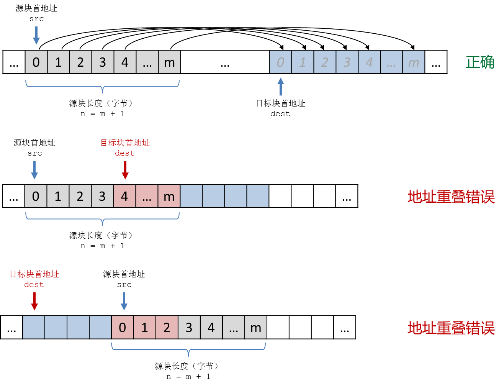

内存块操作
----------

**什么叫内存的块操作**

事实上无论是诸如 ``int`` 这样的基础数据类型也好，还是数组、结构这样的派生数据类型也罢，都是计算机内存中的一块连续的存储空间，大小不一而已。例如现在通常的64位计算机系统里，一个C++的 ``int`` 型变量占用的是连续4个字节。C++基础数据类型的单个变量占用空间都是固定的，最小的是 ``char`` 和 ``bool`` 类型，单个变量占用一个最小单位内存，即一个字节，而 ``long long int`` 和 ``double`` 则需要8个字节，在某些系统下一个 ``long double`` 会占用16个连续字节。派生数据类型只是把组成它的基础类型变量连续存放起来而已。例如一个含有100个 ``int`` 元素的数组在内存中就是连续的400个字节。结构体占用的内存空间也是连续的，例如下面这个结构：

.. code-block:: c++
   
   struct List {
           double a[100];
           int len;
   };

每一个这样的 ``List`` 类型结构变量在内存中占用804个连续字节，其中800个字节是100个元素的 ``double a[100]`` 数组，另外4个字节用来存放表示长度的 ``int len`` 变量。如果创建一个 ``List`` 型数组：

.. code-block:: c++

   List lists[16];

这个数组总共占用804×16=12,864字节的连续内存。这样的连续内存空间称为\ :strong:`内存块`\ ，对内存块的操作称为\ :strong:`块操作`\ 。

我们常会遇到这样的批量操作场景：对数组中的所有元素赋相同的值、清空结构变量中所有成员变量的值、把一段连续的元素值从一个数组复制到另一个数组中去等等。这些操作当然可以用循环和赋值语句完成，但当数据量很大时则更适合使用内存块操作。块操作属于硬件层级的操作，相对于C++语句，它的优势就是快！

**两个常用的块操作函数**

``cstring`` 标准库中有两个常用的块操作函数，实现两种最基本的块操作。\ ``memset()`` 函数用来给一个内存块里的所有字节一次性统一设值，\ ``memcpy()`` 函数用来将一个内存块的内容整块复制到另一个内存块中。另外还有几个别的块操作函数，但是这两个是用得最多的。作为算法程序的辅助手段，掌握这两个函数的用法就足够了。几乎每一种计算机系统都会在硬件层级实现一些基本的内存块操作硬指令，块操作库函数会利用这些硬件指令来完成操作，它们的运行速度就是所谓的“硬件级速度”，比C++语句的速度要快上不知道多少倍。

``memset()`` 函数的功能是给一块指定起点、指定长度（以字节为单位）的内存块里的每一个字节都同时设置为一个指定的值。

.. code-block:: c++

   void* memset(void* s, int c, size_t n);

它的返回值其实就是这个内存块的起点地址，返回类型是一个“无类型指针” ``void*``\ ，这是个什么东西先不用去管，大多数情况下可能一辈子都用不上这个返回值。它接收三个参数：

1. ``void* s``\ ：这个参数用来指定要操作的内存块首地址。对于数组，数组名，比如 ``a``\ ，就是数组第一个元素的地址，也就是整个数组的首地址，它等价于 ``&a[0]``\ ；如果要操作的是从元素 ``a[n]`` 开始的部分，那么 ``a+n`` 就是数组第n号元素的首地址，它等价于 ``&a[n]``\ ；结构型变量可以用C++的取地址运算符 ``&`` 来获得首地址，就像在 ``scanf()`` 函数里所做的一样。
2. ``int c``\ ：这是要给每个字节设置的值。要注意，虽然这个参数的数据类型是 ``int`` ，但实际上块操作是针对字节的，最终被设置的值是这个参数值最后一个字节的内容，即 ``c % 256`` 的值，因此这个参数值通常应该取在-128到127的范围以内。
3. ``size_t n``\ ：以字节为单位的内存块长度，\ ``size_t`` 其实是无符号长整型，实际使用的时候可以接受任意类型的整数。千万记得长度是以字节为单位的！例如 ``int a[100]`` 这个数组，数组长度是100，但它占用的内存块的长度是400！初学者最容易在这里掉坑！所以我们推荐使用 ``sizeof(a)`` 来获取数组 ``a`` 占用的内存块长度，不要自己心算手写。

``memcpy()`` 函数的功能是将一块指定起点指定长度（以字节为单位）的内存块里的内容复制到另一块指定了起点的内存块中去。

.. code-block:: c++

   void* memcpy(void* dest, const void* src, size_t n);

它的返回值也是一个很可能一辈子都用不上的 ``void*`` 指针，其实就是目标内存块的首地址。它同样接收三个参数：

1. ``void* dest``\ ：这是要复制到的目标内存块的首地址。
2. ``const void* src``\ ：这是要被复制的源内存块的首地址，\ ``const`` 修饰符规定函数不能改变源内存块里的内容。
3. ``size_t n``\ ：要复制的内存块长度，也就是字节数。

要注意内存块复制的时候，目标块和源块不能有重叠，也就是说目标块内的地址不能有包含在要被复制的源内存块里面的。

**memset和memcpy的典型用例**

下面所举的是在算法编程中内存块操作最为常见的典型用例，学会这些就差不多足够应付算法编程所需的块操作了。

1、批量清空数组中的全部或部分连续元素

所谓清空，就是把每一个字节都设置为0。对于 ``char, short, int, long, long long, float, double, long double`` 这些数值型变量，每一个字节都设为0后它们的值就变成了0；对于用作字符的 ``char`` 变量，设置为0就成了空字符 ``'\0'``\ ；对于C-string字符串 ``char[]``\ ，设置为0就变成了空字符串 ``""``\ ；对于 ``bool`` 型变量，设为0就是设为 ``false``\ ；如果是指针，那么设置为0就成了空指针 ``NULL``\ 。而派生数据类型归根到底都是由基础数据类型组合而成的，所以用 ``memset()`` 可以方便地清空数组中的元素，至于部分还是全部，完全由首地址和长度两个参数决定。

以整型数组为例：

.. code-block:: c++
   
   const int MAXN = 1e6;
   int a[MAXN];
   
   memset(a, 0, MAXN * sizeof(int));       // 清空整个数组
   memset(a, 0, 100 * sizeof(int));        // 清空前100个元素
   memset(a+100, 0, 50 * sizeof(int));     // 清空a[100]到a[149]这50个元素

同样的方法可以用来清空结构体变量中的所有成员值。但是尽量不要去尝试对结构体中的部分成员变量进行块操作，因为不同的计算机系统对于结构体中成员变量的存放位置规则可能有所不同。

.. code-block:: c++
   
   struct S {
           // 成员变量...
   };
   
   S a, b[100];
   
   memset(&a, 0, sizeof(S));       // 清空结构体a
   memset(b, 0, 100 * sizeof(S));  // 清空结构S数组b中的所有结构体

.. _ref_130_memset:

2、批量给数组中的全部或部分连续元素赋值

有一些特殊的值可以用块操作来批量赋值，例如0。但并不是每一个值都是可以这样批量赋值的。例如对于 ``int`` 型数组，就不能用 ``memset(a, 1, n * sizeof(int))`` 来把其中所有元素都赋值为1。这是因为一个 ``int`` 变量在内存中占据4个字节，而块操作是按字节来设置值的，执行上面这条语句使每个 ``int`` 元素的所有4个字节都被设置为1，其值变成十六进制数0x01010101，转为十进制等于16,843,009。所以对于 ``int`` 型变量来说，1这个数值是不能用块操作来批量赋值的。

事实上每一种基础数据类型都有一些可以用块操作批量赋值的数值，有时候可以带来一些对编程有帮助的小技巧。常会用到的有两种，请务必记住。

.. code-block:: c++
   
   int a[100];
   bool b[100];
   
   memset(a, -1, 100 * sizeof(int));       // 把数组a中的所有元素赋值为-1
   memset(b, 1, 100 * sizeof(bool));       // 把数组b中的所有元素赋值为true

至于 ``char`` 这种本身就只占用一个字节的数据类型，从-128到127都是可以批量赋值的，而 ``float, double, long double`` 这三种浮点数类型则除了0没有别的特殊值。

.. warning::

   千万不要轻易尝试对结构体的成员变量批量赋值，除了0以外哪怕是特殊值也不要轻易尝试。所以如果是一个结构体类型的数组，尽量不要用 ``memset()`` 去批量赋不是0的值。

3、批量复制数组内容

块复制可以用来把一个数组的全部或部分元素复制到另一个数组里去，一般来说要复制到目标数组应该和源数组有相同的数据类型，并且要保证长度足够。

.. code-block:: c++
   
   int a[100], b[100];
   
   memcpy(b, a, 100 * sizeof(int));        // 复制整个a数组中的内容到b数组
   memcpy(b+50, a, 50 * sizeof(int));      // 复制a[0]到a[49]到b[50]到b[99]
   memcpy(a+20, b+20, 80 * sizeof(int));   // 复制b数组的后80个元素到a数组对应位置

当然了，只要源块和目标块不相互重叠，完全可以在同一个数组里实现在不同区块之间复制内容。

.. code-block:: c++
   
   double a[1000];
   
   memcpy(a, a+100, 100 * sizeof(double)); // 复制a[100]开始的100个元素到a[0]开始的位置去

.. warning::

   用块复制来批量复制数组元素时，一定要当心目标块数组超限的问题！

另外，由于C-string本质上是一个字符型数组，所以 ``memcpy()`` 也可以用来复制C-string字符串，只是别忘了串尾必须有一个空字符 ``'\0'``\ 。\ ``memcpy()`` 函数同样可以用来复制结构变量，但是一般并没有这个必要，因为结构变量本身支持使用 ``=`` 相互赋值。

块复制只是单纯地按字节来复制内存中的内容，它本身根本不关心复制的是什么数据类型，这也是硬件系统的一个特点。利用这个特点还可以实现一些奇特的技巧。

例如在一些比较古老的计算机语言里，变量名实际上只有前8位字符起作用，如果两个变量的变量名前8位字符相同就会被认为是重名的，比如 ``abcdefg_1`` 和 ``abcdefg_2``\ 。这些语言的编译器在编译源程序的时候，会把每一个变量名前8位字符的ASCII码从后往前串起来构成一个64位整数。这个整数叫做变量名的哈希值，是和前8位字符一一对应的，两个变量是否重名只需要对比二者的哈希值就可以了。

如果我们用普通方法逐个字节从后向前去串起来构成一个64位整数，需要用到一个循环，共计算8次整数乘法、8次整数加法。

.. code-block:: c++
   
   char var_name[] = "variable_name_xxx";
   unsigned long long hash = 0;
   
   for (int i = 7; i >= 0; i--)
           hash = hash * 256 + var_name[i];

如果用上内存块复制的话，这样就搞定了：

.. code-block:: c++

   #include <cstring>

   char var_name[] = "variable_name_xxx";
   unsigned long long hash;
   memcpy(&hash, var_name, 8);

代码简单速度快，堪称奇技淫巧的典范。

老程序员往往有很多这样的小技巧，但是实际上这类技巧不容易把控，需要对计算机原理有比较深的掌握，而且在算法编程中能用的场景并不多，所以我们并不推荐在算法编程中使用这类技巧。对于内存块操作，掌握批量清零、特殊值批量赋值和数组区块复制即可。

