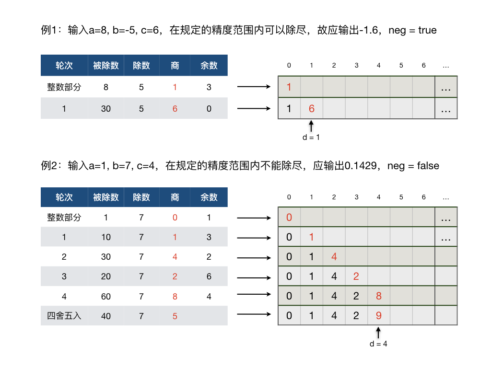

.. index:: 高精度有理小数

有理小数的精确表示
++++++++++++++++++++++

C++的浮点数精度有限，最低的 ``float`` 型单精度浮点数只有最多6位有效数字的精度，最常用的双精度浮点数 ``double`` 为15到16位，哪怕是高精度浮点数 ``long double`` 也只有19位精度。

.. caution::

   必须知道，描述C++浮点数精度时常说的多少多少位，是指有效数字的位数，从整数部分的最高位开始算，而不是小数点后面多少位！比如单精度浮点数 ``float f = 12345.67``，由于 ``float`` 类型最多只保证6位有效数字的精度，所以这个数的百分位上的7就已经不能保证准确了。

.. hint::

   C++浮点数和其他编程语言的浮点数都是采用的IEEE标准的单精度、双精度、高精度浮点数格式，并不是只有C++的浮点数才精度有限，所有语言都是一样的。事实上这样的精度用于科学计算一般来说是没有什么问题的，但是如果是用在金融领域等对小数精度要求特别高的场景里就往往不够用了。

我们知道实数分为有理数和无理数两类，但由于受到存储空间的限制，在计算机里不可能真正表示无限小数。尽管可以保留非常非常多的位，但无论是无理数还是循环小数最终也只能限定在固定的位数之内，所以我们仅考虑有理小数的情况。

超高精度有理小数
^^^^^^^^^^^^^^^^^^^^^^^^

有时候我们需要用很高的精度来表示小数，比如需要精确到小数点后面50位，这就需要我们自己编程来计算出所需的小数点后50位精确数值了。我们知道，有理数是一定可以表示成分数形式的，所以算法的核心就是用整数除法和取余两个运算来模拟竖式除法运算的笔算过程。

整数竖式除法是一种完善的循环算法，它的过程就是用除数去除被除数，得到一个商和一个余数，然后把余数乘以10作为新的被除数来重复上述过程，直至除尽（余数为0）或者达到所需的小数位数。通常如果达到所需的小数位数时还未除尽，那么需要再多算一位并从这一位上开始做四舍五入。四舍五入可能会向前传播，例如小数0.99999在最后一位上开始四舍五入后，会一路向前传播使得最终得到的结果成为1。

.. admonition:: 问题

   输入三个整数：\ :math:`-10^8\le a \le10^8,-10^8\le b \le10^8,0\le c \le 100,(b\neq0)`\ ，输出有理数\ :math:`a/b`\ 的小数形式，最多保留\ :math:`c`\ 位小数。例如：

   * 输入8, 5, 3，输出1.6
   * 输入8, -5, 0，输出-2
   * 输入-1, 7, 4，输出-0.1429
   * 输入-9, -3, 100，输出3

**结果如何表示？**

对于此问题所要求的结果，其整数部分可以用一次整型除法运算直接得到。小数部分需要模仿竖式除法逐次计算小数点后面的位，直到除尽或者达到所需要的位数。由于\ :math:`c\le100`，所以我们可以用一个长度为101的整型数组来保存结果。其中第0个元素用来保存结果的整数部分，从第1个开始的各个元素就用来存放小数点后对应位上的数字。

实际的结果可能在\ :math:`c`\ 位以内就除尽了，所以我们还需要一个整型变量来记录结果的实际小数位数。它可以从0开始，随着小数位的逐步计算而逐步累加。

又因为除数和被除数有正有负，所以结果也可能有正有负，所以我们还需要一个逻辑型变量来标示结果的正负。我们在输入结束后应该马上判断结果的正负，保存在这个变量里，然后把除数和被除数统一改为正数（或零）。这样我们在后面的计算中就不需要考虑正负的问题了，而计算得到的结果需要配合符号变量才是完整的。

.. admonition:: 思考

   这里为什么不把结果的正负表示在整数部分里，而要单独把符号作为一个逻辑变量另外保存呢？请想一想这个问题。

最后我们还需要一个整型的临时变量，用来在每一步计算的时候放置得到的余数，并且每次都乘以10以便用作下一位计算时的被除数。

现在就可以整理出为了表示算法的结果所需要的所有变量（包括一个中间变量）了。

.. code-block:: c++

   int digits[101], d = 0, r;   // d：实际的小数位数；r：临时变量，余数*10
   bool neg = (a < 0 && b > 0) || (a > 0 && b < 0);     // 结果是否为负

**算法的计算过程**

算法本质上是一个模拟算法，就是模拟整数的竖式除法。下面以能除尽和不能除尽两种情况为例，用图表来观察一下算法要做的计算过程。

但实际上四舍五入发生的时候，有可能不止影响到最后一个小数位，它可能会向前传播。

例如，:math:`198\div199\approx 0.99497...`，如果我们要求最多保留4位小数，那么在小数点后第4位上四舍五入后会继续向前进位，最终结果剩下3位小数，为0.995。

再如\ :math:`2018\div2019\approx 0.99950...`，如果我们要保留最多3位小数，那么四舍五入引发的向前进位会一直传播到整数部分，最终结果为1。

这是我们算法里在四舍五入时要考虑到的情况。舍入首先肯定是发生在当前最后一位，也就是第d位上的。舍入后要判断其是否等于10，如果是则说明要向前进位，这就需要把当前最后位改为0，然后把前面一位变成新的最后位，然后新的最后位加1，再判断是否需要继续向前进位......如此不断重复这一过程直至某次舍入之后不需要向前进位或一直推进到了整数部分。这和小学算术所学的四舍五入过程完全一致。

**代码及其改进**

经过上面的分析，应该不难写出实际的C++代码了。编写输出语句时要注意两处容易引起错误的地方。一是结果的正负不要忘记；二是如果结果是整数则不需要输出小数点。代码里没有加注释，请大家务必自己把这它读懂。

.. literalinclude:: ../../codes/215_long_decimal.cpp
   :language: c++

这个算法还有可以改进的地方吗？当然有。试想如果问题没有限定 :math:`c\le100` 呢？用静态的数组就很难确定应该开多大的长度了，这种时候用STL库的vector容器就能很方便地解决问题。关于vector容器的简介可以看这里：:ref:`ref_311_vector`。

vector是一种可变长度的数组，也是一种顺序表，利用它的特性不仅能解决精度值没有限制范围的问题，而且能让算法变得略微简洁一些。

1. 利用vector容器的可变长特性，我们不再需要用一个单独的变量来记录实际计算了多少小数位，用 ``size()`` 可以获得容器内当前元素的数量。
2. 利用vector容器的 ``push_back()`` 函数，我们可以简单地不断循环计算小数位并按顺序添加进容器。
3. 由于vector容器的 ``back()`` 函数返回的是最后一个元素的引用，所以可以直接对其进行修改，再配合上 ``pop_back()`` 函数就可以很方便地完成四舍五入。

下面是用vector容器实现的版本，请仔细阅读并和数组版进行对比，理解它们的不同之处。

.. literalinclude:: ../../codes/215_decimal_vec.cpp
   :language: c++

用循环节表示小数
^^^^^^^^^^^^^^^^^^

无论保留多少为小数，如果遇到循环小数，那它总还是不精确的。如果要得到任何一个有理小数的精确表示形式，就必须用到循环节。

我们现在要编写这样一个程序：输入两个整数，被除数 :math:`a` 和除数 :math:`b\neq 0`，输出 :math:`a/b` 的循环小数形式，循环节用一对小括号标识，在循环小数后面紧跟一个整数 :math:`n`，为循环节的长度。如果 :math:`a/b` 不是循环小数，那么认为以小数后续的0为循环节。

例如：:math:`a=5,b=43`，则输出 :math:`0.(116279069767441860465)21`；:math:`a=-1,b=25`，则输出 :math:`-0.04(0)1`。

经过前面的超高精度小数计算，相信大家马上就可以想到这个循环小数问题仍然可以用模拟竖式除法运算来实现。我们只需知道循环节开始于哪一位，又结束于哪一位就可以了。为了达到这个目标，可以另外用一个数组来记录每一位上出现的余数，每做完一次除法得到一个非零的余数时我们就去查这个数组来看看这个余数是不是重复出现了。但是这个查表过程是必须从头到尾顺序搜索的，效率并不高，整个算法的时间复杂度是 :math:`O(n^2)`。

我们可以把记录每一位上出先的余数改成纪录每一个可能的余数数值首次出现的位置来改进算法，把算法的时间复杂度降低到 :math:`O(n)`。余数 :math:`r` 的取值范围为 :math:`0 \le r \le b-1`，一共 :math:`b` 种可能。所以我们可以用一个长度为 :math:`b` 的数组来保存每一个余数值首次出现的位置，数组初始化为全0，表示这些余数值还都没有出现过。在运算过程中，每除出一个非零余数，就把该余数所在的位置记录在这个位置数组相应的元素里。如果相应的元素已经非零，就表示这个余数值重复出现了，那么前一次保存的位置就是循环节起始位置，现在的位置就是循环节结束位置。

例1：:math:`a=5, b=7`，数组 ``quo`` 存放每次除法运算的商，数组 ``rem_pos`` 存放每个余数值第一次出现时的位置。计算过程和结果可以用下面这张图来表示：

.. image:: ../../images/215_cycle.png

如果结果不是循环小数，那么肯定在某一位上会除尽，也就是出现了余数0。这时候只需要在下一位上添加一个0，然后让循环节的起始位置和结束位置按照“含头不含尾”的原则指向这个额外添加的0即可。

例2：:math:`a=1, b= 25` 的运算结果为数组 ``quo = { 0 0 4 0}``，循环节的一头一尾分别为 ``cyc_start = 3, cyc_end = 4``。

下面的C++程序仍然使用了vector容器，而不是传统的数组来解决这个问题。利用vector的动态长度性质，就可以不需要事先知道被除数 :math:`b` 的取值范围了。

.. literalinclude:: ../../codes/215_cyc_decimals.cpp
   :language: c++

这个程序本身算法并不难，但是语言上使用了不少技巧，特别是位置的使用，请一定要搞懂每一句语句、每一个变量的作用和用法。
