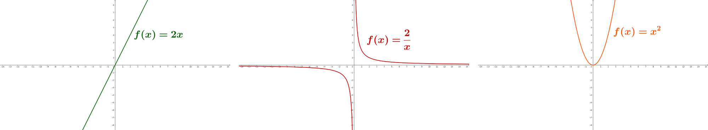

单调区间在线统计
++++++++++++++++++++++++

:strong:`单调性`\ 和\ :strong:`单调区间`\ 本是数学上的概念，在初等数学里，主要用于描述一元实数函数和数列的增减性，也叫\ :strong:`单调性`\ 。

**函数的单调性和单调区间**

对于一个一元实数函数 :math:`f(x)`，如果在某一个取值范围内，对于任意两个不同的自变量 :math:`x_1\lt x_2`，它们所对应的函数值大小关系是 :math:`f(x_1)\lt f(x_2)`，那么我们称函数 :math:`f(x)` 在这个自变量取值范围内\ :strong:`单调递增`\ ，这个取值范围叫做函数 :math:`f(x)` 的一个\ :strong:`单调递增区间`\ ；反之，如果在某一个取值范围内，对于任意两个不同的自变量 :math:`x_1\lt x_2`，它们所对应的函数值大小关系是 :math:`f(x_1)\gt f(x_2)` 的，那么我们称函数 :math:`f(x)` 在这个自变量取值范围内\ :strong:`单调递减`\ ，这个取值范围叫做函数 :math:`f(x)` 的一个\ :strong:`单调递减区间`\ 。通俗地说，单调递增就是函数值随着自变量的增大而增大，单调递减就是函数值随着自变量的增大而减小。

例如正比例函数 :math:`f(x)=2x` 就是一个单调递增函数，它的单调区间是整个实数域，对于任意两个不同的实数 :math:`x_1\lt x_2`，必定满足 :math:`2x_1\lt 2x_2`。

反比例函数 :math:`f(x)={2\over x}` 则有两个单调区间，:math:`(-\infty, 0)` 和\ :math:`(0,+\infty)`，它们都是单调递减区间。任意两个不同的正数 :math:`0\lt x_1\lt x_2` 满足 :math:`{2\over x_1} \gt {2\over x_2}`；对于任意两个不同的负数，情况同样如此。

平方数函数 :math:`f(x)=x^2` 也有两个单调区间，:math:`(-\infty, 0]` 和 :math:`[0,+\infty)`，但是前者是单调递减区间，后者是单调递增区间，这是因为负数的平方等于负数的绝对值的平方，而负数越大，其绝对值越小。和反比例函数的情况不同的是，平方函数的两个单调区间里增减性不同，而且两个区间在零点处是连续而且平滑的。

从上面三个函数的图像里，沿着自变量增大的方向去直观地看，在单调递增区间里，函数的图像是向上爬山的样子，在单调递减区间里，函数的图像是向下滑坡的样子。

.. admonition:: 补充

   事实上，还可以有函数值不变的区间，叫做常数区间。比如常数函数 :math:`f(x)=c`，整个实数域就是它的常数区间。

   另外，把单调区间可以通过降低条件降格为普通的递增或递减区间。以单调递增区间为例，如果把判断条件中关于函数值的不等式从严格的小于改成小于等于：:math:`x_1\lt x_2 \implies f(x_1)\le f(x_2)`，那么区间就降格成了普通的递减区间。在这样的区间里允许包含一些常数区间。这种情况在分段函数里经常出现。

**数列的单调性和单调区间**

函数的单调性是数学里特别特别特别重要的一个知识点，但是单调性并不只用于分析实数函数，它也经常用于分析数列。在计算机领域里数列的单调性（或者叫做离散数据依位置的单调性）是更加常见的问题。数列的单调性和函数单调性有类似的地方，也有不同的地方。

数列 :math:`\{a_n\}` 就是一组n个用正整数连续编号的数：:math:`a_1,a_2,\dots,a_n`，为了和函数的情形做类比，我们可以把每个数的下标编号看作是自变量，把数值本身看作是函数值，于是就把数列看成了一个自变量只能是整数的离散函数。有些书为了表示这种类比关系，会把数列的第i项写成 :math:`a(i)` 这样的类函数形式，也有些书上为了迎合C++语言而写成 ``a[i]`` 这样的数组元素形式，我们这里还是按照数学习惯写成 :math:`a_i`。

设有正整数 :math:`i\lt j\le n`，如果数列 :math:`\{a_n\}` 在从第i项 :math:`a_i` 到第j项 :math:`a_j` 这一段里，所有项都比它前面的项更大，我们就把这一段的下标范围 :math:`[i,j]` 称为数列的一个单调递增区间，长度为 :math:`j-i+1`；反之如果这一段里的所有项都比它前面的项更小，它就是数列的一个单调递减区间，长度当然也是 :math:`j-i+1`。

.. admonition:: 补充

   和函数类似，数列也可以有常数区间、普通的递增区间和递减区间。

.. attention::

   由于数列的下标是整数这个离散的特性，导致数列可以有只含有一个项的区间。这样的区间既可以认为是递增的，也可以认为是递减的，更可以认为是常数的。具体要怎样看待它需要根据题意来判断。

另外，在数列的任意一个区间里，用其中值最大的项去减值最小的项，二者之差称为这个区间的\ :strong:`振幅`\ 或\ :strong:`幅度`\ 。特殊的，如果区间 :math:`[i,j]` 是递增区间或递减区间，那么无论它单调与否，它的振幅一定是 :math:`\vert a_j-a_i\vert`。递增区间的振幅又叫\ :strong:`增幅`\ ，递减区间的振幅又叫\ :strong:`降幅`\ 。

例如数列 :math:`[1,5,17,8,6,6,5,3,3,4,5,6,7,8]` 中，单调递增区间有 :math:`[1,5,17],[3,4,5,6,7,8]`，长度分别为3和6，增幅分别为16和5；单调递减区间有 :math:`[17,8,6],[6,5,3]`，长度均为3，降幅分别为11和3。另外，中间的一整段 :math:`[17,8,6,6,5,3,3]` 共7项是一个普通的递减区间，它中间包含了两个常数区间 :math:`[5,5],[3,3]`，所以它不具有单调性。

数列单调区间的统计问题通常是求最长（最短）单调区间的长度和振幅最大（最小）单调区间的振幅两种统计指标，都能用在线统计算法解决，时间复杂度 :math:`O(n)`，空间复杂度 :math:`O(1)`，是效率极高的经典算法。

最长单调区间问题
^^^^^^^^^^^^^^^^^^^^

最长单调区间问题是指在一列数据中找出长度最长的某类单调区间，给出它的长度或前后端点，并要求采用的是在线算法。可能是要找最长单调递增区间，也可能是单调递减区间。

以求最长单调递增区间的长度为例。在读数的循环中，设当前读入的数为 :math:`a_i`。算法用两个变量 ``max_len`` 和 ``cur_len`` 分别表示已经读到过的所有数 :math:`[a_1,\dots,a_{i-1}]` 中最长的单调递增区间长度和以当前数 :math:`a_i` 为末端的当前单调递增区间的长度。这两个变量在读数循环开始前的初始值肯定都是0。

另外我们需要一个变量 ``last_data`` 来保存前一个数 :math:`a_{i-1}`，在读入当前数 :math:`a_i` 之后用来进行比较。在读数循环的第一轮，这个变量还起到了虚拟一个 :math:`a_0` 来供 :math:`a_1` 进行比较的作用。

.. admonition:: 思考

   很多书和题解会对这个前一个数据的变量应该如何初始化进行说明，但实际上它是不需要初始化的，任何值都不会影响算法的正确运行。请在看懂算法后仔细想想为什么。

1. 如果当前数大于前一个数 :math:`a_{i}\gt a_{i-1}`，说明当前数 :math:`a_i` 延长了以 :math:`a_{i-1}` 为末端的那个当前单调递增区间，而变量 ``cur_len`` 中应当记录着它的长度。所以遇到这种情况，就将 ``cur_len`` 加一。例如前例数列 :math:`[1,5,17,8,6,6,5,3,3,4,5,6,7,8]`，当读到第三个数17时，发现17比前一个数5大，这时候 ``cur_len`` 一定为2，表示的是 :math:`[1,5]` 这一段单调递增区间的长度，而17把它延长为了 :math:`[1,5,17]`，所以我们让 ``cur_len++``，把它变成3就可以了。

2. 如果 :math:`a_{i}\le a_{i-1}`，说明以 :math:`a_{i-1}` 为末端的那个当前单调递增区间到 :math:`a_{i-1}` 就结束了，当前数 :math:`a_i` 将开启一个新的单调递增区间 :math:`[a_i]`，长度为1。所以遇到这种情况，我们首先要将 ``cur_len`` 和 ``max_len`` 进行比较，看看以 :math:`a_{i-1}` 为末端的那个单调递增区间是不是长度比已经知道的最长的单调递增区间还要长，如果是的话就把 ``max_len`` 更换为 ``cur_len`` 的值，然后我们把 ``cur_len`` 改为1，让它改为指示新的当前单调递增区间 :math:`[a_i]`。仍看上面那个例子，当读到第4个数8时，发现8比前一个数17小，说明当前单调递增区间到 :math:`[1,5,17]` 就结束了，于是我们将 ``cur_len`` 和 ``max_len`` 进行比较，发现此时 ``max_len`` 为0，小于 ``cur_len``，所以把 ``max_len`` 设为 ``cur_len`` 的值3，表示已经读到过的最长单调递增区间长度为3，然后我们就放心地把 ``cur_len`` 改写为1，继续下一轮读数就可以了。

最后，在每一轮读入数据并按上面两种情况处理完后，别忘了把当前读入的数保存到 ``last_data`` 里面，因为长江后浪推前浪，把它推到沙滩上了。

最后的最后，别忘了在读数循环结束之后，在比较一下 ``cur_len`` 和 ``max_len``，因为最长单调递增区间可能恰好是以最后一个数 :math:`a_n` 结尾的呢。

.. index:: 最长单调递增区间, 洛谷P1567

下面我们通过一个实际的例题（洛谷P1567，统计天数）来看看最长单调递增区间统计问题的代码和应用。

**题目描述**

炎热的夏日，KC 非常的不爽。他宁可忍受北极的寒冷，也不愿忍受厦门的夏天。最近，他开始研究天气的变化。他希望用研究的结果预测未来的天气。经历千辛万苦，他收集了连续 :math:`N(1 \le N \le 10^6)` 的最高气温数据。现在，他想知道最高气温一直上升的最长连续天数。

**输入格式**

第 1 行：一个整数 :math:`N`。:math:`1 \le N \le 10^6`。

第 2 行：:math:`N` 个空格隔开的整数，表示连续 :math:`N` 天的最高气温。:math:`0 \le 最高气温 \le 10^9`。

**输出格式**

1 行：一个整数，表示最高气温一直上升的最长连续天数。

**输入输出样例**

输入：

.. code-block:: none

   10
   1 2 3 2 4 5 6 8 5 9

输出：

.. code-block:: none

   5

这就是一个彻头彻尾的求最长单调递增区间长度的题，难度系数入门级。用上面的算法编写出C++代码，然后提交，等AC，很简单，请看代码：

.. literalinclude:: ../../codes/221_p1567.cpp
   :language: c++

提交后判题结果：

此题应该没有多少难度，但是有几个问题值得大家思考和动手尝试一下：

.. admonition:: 思考

   1. 为什么用来保存上一个数据的那个变量，在读数开始之前不需要初始化？
   2. 如果要求的是最长单调递减区间，算法要怎样改动？用来保存上一个数据的那个变量是不是仍然不需要初始化？
   3. 如果要求的是最短单调区间，算法需要做怎样的改动？
   4. 如果要求的不是区间长度，而是区间的两个端点，算法要如何改动？
   5. 如果是要统计普通的增减区间，不一定非要单调，算法又该如何改动？

.. index:: 最大单调区间振幅

最大单调区间振幅
^^^^^^^^^^^^^^^^^^^^^^^^

上面的算法经过简单的改动就可以适用于解决最大单调区间振幅问题，也就是找出振幅最大的某类单调区间，给出它的振幅。可以是单调递增区间，也可以是单调递减区间。

仍然以求最大的单调递增区间增幅为例。假设在要统计的数列 :math:`\{a_n\}` 中，某一连续段 :math:`[a_i,\dots,a_j],(i\lt j)` 是一个单调递增数列，它的增幅是 :math:`A_{i,j}=a_j-a_i`。那么实际上这个增幅可以递归地表示为：

.. math::

   \begin{align}
   A_{i,j}
   =&A_{i,j-1}+(a_j-a_{j-1})\\
   =&A_{i,j-2}+(a_{j-1}-a{j-2})+(a_j-a_{j-1})\\
   =&\cdots\\
   =&(a_{i+1}-a_i)+(a_{i+2}-a_{i+1})+\cdots+(a_{j-1}-a{j-2})+(a_j-a_{j-1})=a_j-a_i
   \end{align}

这就意味着我们可以随着数据的循环读入，逐步地累积计算出一整个单调递增区间的增幅。所以我们可以继续沿用前面求最长单调递增区间长度的算法思路，用两个变量 ``max_amp`` 和 ``cur_amp`` 分别表示已经读到过的最大单调递增区间增幅和以上一个数为末端的当前单调递增区间增幅。每读入一个数，先判断它是否处于一个单调递增区间里，如果是那么相应增加当前单调递增区间的增幅；如果不是则说明那个以上一个数为末端的当前单调递增区间结束了，那么根据 ``cur_amp`` 的大小修正 ``max_amp``，再把 ``cur_amp`` 重置为0。这里出现和最长单调区间长度算法的一个不同点，``cur_amp`` 在重置的时候是置为0而不是1，为什么？请大家自行思考。

另一个不同点是对那个用于保存上一个数的变量 ``last_data`` 的初始化问题。我们说过，求最长单调递增区间长度的算法里这个变量根本不需要初始化。但是在求最大振幅的时候，它是必须要正确初始化的。事实上，正确初始化这个变量并不简单，理论上如果是统计单调递增区间的，那么这个数的初始值必须确保一定大于数列的第一个数；如果要统计的是单调递减区间，那么它的初始值必须确保小于数列的第一个数。这是为什么？这个规则的原理请大家一定要自己想出来。

但真正的麻烦并不是上述规则不好理解不好记，而是有时候这个规则根本无法实现。比如说某个题目给出的数据范围是所有可能的整数，覆盖整个数据类型的取值范围，那么就根本找不出一个能确保大于或者小于第一个数的初始值，除非使用取值范围更大的数据类型，但如果覆盖了C++最大的数据类型的取值范围呢？怎么办？办法很简单，这个变量的初始值的作用无非是虚拟一个 :math:`a_0` 出来，供真正的第一个数 :math:`a_1` 进行增减性判断，那么我们何不直接把这个变量初始化为第一个数 :math:`a_1`，而后面的读数循环我们从 :math:`a_2` 开始读就行了。

下面是求最大单调递增区间增幅的代码，请对照算法说明读懂代码，并和前面的最长单调递增区间长度算法做一对比。

.. literalinclude:: ../../codes/221_largest_amp.cpp
   :language: c++

最后还是请大家思考几个问题，并尝试动手试验。

.. admonition:: 思考

   1. 怎样求最大单调递减区间降幅？
   2. 怎样求最小单调区间振幅？
   3. 怎样改为适用于统计普通递增或递减区间的振幅问题？

