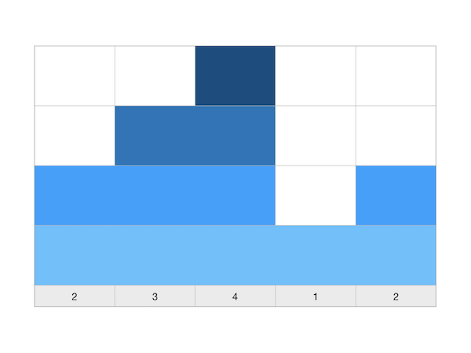
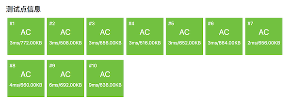
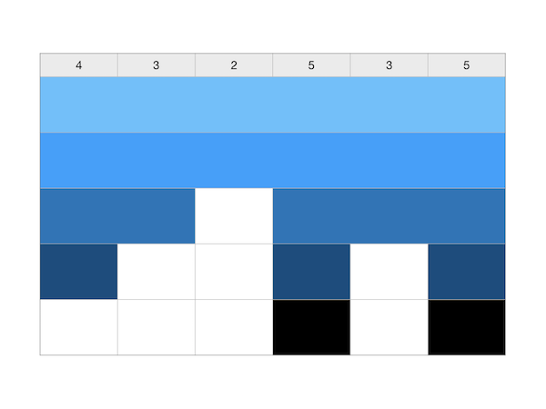
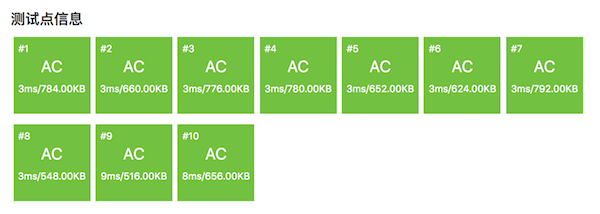

单调区间问题的应用：两个NOIP提高组复赛题
++++++++++++++++++++++++++++++++++++++++++++++++++++++++++

单调区间类问题在2013年和2018年两次出现在NOIP提高组的复赛中。虽然是提高组复赛，但两次都是Day1的第1题，难度并不大。按这两题的难度来看，甚至不如普及组的后几题，属于普及组阶段就应该熟练掌握的题型。

.. index:: 【积木大赛】, 〖NOIP2013S1.1〗, 〖洛谷P1969〗

积木大赛（NOIP2013-S组1.1，洛谷P1969）
^^^^^^^^^^^^^^^^^^^^^^^^^^^^^^^^^^^^^^^^^^^^^^^^^^^^

**题目描述**

春春幼儿园举办了一年一度的“积木大赛”。今年比赛的内容是搭建一座宽度为 :math:`n` 的大厦，大厦可以看成由 :math:`n` 块宽度为 :math:`1` 的积木组成，第 :math:`i` 块积木的最终高度需要是 :math:`h_i`\ 。

在搭建开始之前，没有任何积木（可以看成 :math:`n` 块高度为 :math:`0` 的积木）。接下来每次操作，小朋友们可以选择一段连续区间 :math:`[L,R]`\ ，然后将第 :math:`L` 块到第 :math:`R` 块之间（含第 :math:`L` 块和第 :math:`R` 块）所有积木的高度分别增加 :math:`1`\ 。

小 :math:`M` 是个聪明的小朋友，她很快想出了建造大厦的最佳策略，使得建造所需的操作次数最少。但她不是一个勤于动手的孩子，所以想请你帮忙实现这个策略，并求出最少的操作次数。

**输入格式**

包含两行，第一行包含一个整数 :math:`n`\ ，表示大厦的宽度。

第二行包含 :math:`n` 个整数，第i个整数为 :math:`h_i`\ 。

**输出格式**

建造所需的最少操作数。

**输入输出样例**

输入：

.. code-block:: none

   5
   2 3 4 1 2

输出：

.. code-block:: none

   5

**说明/提示**

【样例解释】

其中一种可行的最佳方案，依次选择

:math:`[1,5]` :math:`[1,3]` :math:`[2,3]` :math:`[3,3]` :math:`[5,5]`

【数据范围】

对于 :math:`30\%` 的数据，有 :math:`1 \le n \le 10`\ ；

对于 :math:`70\%` 的数据，有 :math:`1 \le n \le 1000`\ ；

对于 :math:`100\%` 的数据，有 :math:`1 \le n \le 100000,0 \le h_i \le 10000`\ 。

**题意分析和朴素的思路**

这是一个典型的区间统计题，可以这样反过来思考：读入的一组高度数据表示已经搭好的大厦，现在从大厦底部开始一段一段、一层一层地抽掉积木块，直到所有积木全部抽走，总共抽掉的段数就是要求的答案。

根据这个朴素的思路，可以用模拟的方法来解决问题。首先输入所有数据，放在一个数组中，然后不断循环地去做这样一件事情：在数组中找出并记录下其中所有不含0的区间，这样的区间数量就是这一轮要做的操作数量。给所有这些区间里的数字都减1后进入下一轮循环，直到数组中所有的数都变成0为止。

但是这样的朴素算法时间效率是比较差的。假设大厦的最高点高度为 :math:`m`\ ，每一轮循环要扫描一遍所有 :math:`n` 个数字，一共要循环 :math:`m` 轮，算法的时间复杂度为 :math:`O(mn)`\ 。我们需要一个更加高效的算法。

通过仔细分析题意我们可以发现，要求的那个最小操作次数其实是数列中所有单调递增区间的高度增幅之和。

任意一个正整数数列，必定是由一系列首尾相接的单调递增区间、单调递减区间和常数区间组成的。常数区间实际上并不会对逐层向上搭积木的操作次数产生任何影响，所以如果在数列中遇到常数区间，我们可以直接忽略它们，仅把它们视为一个单一的数。这样数列就可以看成是由一系列单调区间首尾相接而成，而其中单调递增区间和单调递减区间必然是相互间隔着的。整个数列可以看成是一个“增减增减增减......”这样的区间序列。由于题意是从高度0开始搭建积木，我们给第一个数之前增加一个虚拟的数0，这样就保证了第一个区间一定是单调递增区间。例如输入样例 [2,3,4,1,2]，它就由单调递增区间 [0,2,3,4]、单调递减区间 [4,1]、单调递增区间 [1,2] 这样三个单调区间相连接构成的。

设输入的大厦高度数据为一个正整数数列 :math:`H=\{h_n\}` ，首项为 :math:`h_0=0`\ 。当处于其中的单调递增区间时，每一对相邻两数都会带来一次高度增长，增出来的高度差 :math:`\Delta h_i=h_i-h_{i-1}` 是需要用 :math:`\Delta h_i` 次操作来搭建出来的。所以对于每一个单调递增区间 :math:`[l,r]` 都需要 :math:`h_r-h_l=\Delta h_r+\Delta h_{r-1}+\cdots+\Delta h_{i+1}` 次操作来完成搭建，这个次数就是这个区间的振幅。而当一个单调递增区间搭建完成后，紧跟在它后面的那个单调递减区间的作用是和下一个单调递增区间之间建立一个隔断区，并不需要对其进行任何积木搭建操作。所以遇到单调递减区间，我们可以和对待常数区间一样直接略过，直到下一个单调递增区间开始。

这样就得出了前面的结论，本题的算法就是要用最快的速度求出输入数列中所有单调递增区间的增幅之和。对前一节所述的求最大单调递增区间振幅的算法稍加改变就可以实现，而且是在线算法。

.. literalinclude:: ../../codes/222_p1969.cpp
   :language: c++
   :emphasize-lines: 11

事实上，鉴于数列中常数区间的无关紧要性，我们的要求可以进一步放松为求所有普通递增区间的增幅之和。因此上面代码中第11行完全可以改成 ``if (ht >= last_ht)``\ ，不会有任何问题。

在洛谷网站提交测试的结果：

可以看出，这个算法效率非常之高，而且思路和代码都非常简洁。只要想到了，就这么简单，没有用到任何复杂的算法技巧，而且很容易考到。比如到了2018年，它换了一条马甲又在提高组复赛第一天第一题出现了。

.. index:: 【铺设道路】, 〖NOIP2018S1.1〗, 〖洛谷P5019〗

铺设道路（NOIP2018-S组1.1，洛谷P5019）
^^^^^^^^^^^^^^^^^^^^^^^^^^^^^^^^^^^^^^^^^^^^^^^^^^^^^

**题目描述**

春春是一名道路工程师，负责铺设一条长度为 :math:`n` 的道路。

铺设道路的主要工作是填平下陷的地表。整段道路可以看作是 :math:`n` 块首尾相连的区域，一开始，第 :math:`i` 块区域下陷的深度为 :math:`d_i`\ 。

春春每天可以选择一段连续区间 :math:`[L,R]`\ ，填充这段区间中的每块区域，让其下陷深度减少 :math:`1`\ 。在选择区间时，需要保证，区间内的每块区域在填充前下陷深度均不为 :math:`0`\ 。

春春希望你能帮他设计一种方案，可以在最短的时间内将整段道路的下陷深度都变为 :math:`0`\ 。

**输入格式**

输入文件包含两行，第一行包含一个整数 :math:`n`\ ，表示道路的长度。 第二行包含 :math:`n` 个整数，相邻两数间用一个空格隔开，第 :math:`i` 个整数为 :math:`d_i`\ 。

**输出格式**

输出文件仅包含一个整数，即最少需要多少天才能完成任务。

**输入输出样例**

输入：

.. code-block:: none

   6   
   4 3 2 5 3 5

输出：

.. code-block:: none

   9

**说明/提示**

【样例解释】

一种可行的最佳方案是，依次选择：:math:`[1,6]`\ 、:math:`[1,6]`\ 、:math:`[1,2]`\ 、:math:`[1,1]`\ 、:math:`[4,6]`\ 、:math:`[4,4]`\ 、:math:`[4,4]`\ 、:math:`[6,6]`\ 、:math:`[6,6]`\ 。

【数据规模与约定】

对于 :math:`30\%` 的数据，:math:`1 \le n \le 10`\ ；
对于 :math:`70\%` 的数据，:math:`1 \le n \le 1000`\ ；
对于 :math:`100\%` 的数据，:math:`1 \le n \le 100000,0 \le d_i \le 10000`\ 。

**题意说明**

这个题和前面2013年的搭积木的题有任何区别吗？表面上看上去有点不一样，本质上是完全一样的，没有任何区别！它只是把高度换成了深度，把从地面开始向上一层一层地搭积木改成了从地面向下，一层一层地填坑而已。

用题目给出的样例数据画出示意图来看一下：

看上去和积木大赛题的样例数据图是有点不同，但是如果我们把图上下颠倒过来看：

.. image:: ../../images/222_road_block.003.png

好吧，出题老师所做的所有修改只是把搭积木改成了修道路，把高度改成了深度，从2013年到2018年，最大的变化是春春从一家幼儿园变成了一名道路工程师。其他没有任何变化，连数据规模都没有改。把前面积木大赛的代码原封不动地复制过来，提交过，顺利地AC了所有测试点。（所以参加竞赛之前做历年真题是非常非常有用的）

