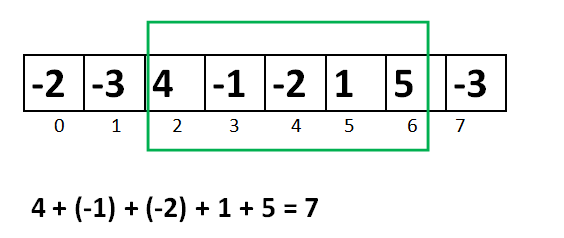
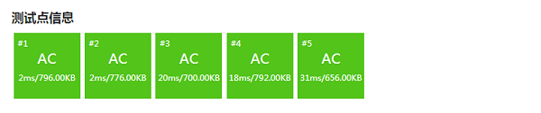

.. index:: 最大区间和, Kadane算法

最大区间和问题（洛谷P1115）
+++++++++++++++++++++++++++

:strong:`最大区间和`\ （Largest Interval Sum）问题就是在一个数列 :math:`A=\{a_n\}` 中寻找一段连续的子区间 :math:`\{a_i,\dots,a_j\}` 使得这个子区间中数字之和 :math:`\sum_{k=i}^j{a_k}` 是该数列的所有连续子区间数字之和的最大者。

例如，数列 [-2,-3,4,-1,-2,1,5,-3] 的最大区间和为7，是其中第3项到第7项的子区间 [4,-1,-2,1,5] 的和。注意：最大区间和问题只求那个最大的和数，不求子区间是哪一个。

数列 :math:`A=\{a_n\}` 中项数为1的连续子区间有 :math:`\{a_1\},\dots,\{a_n\}`\ ，共 :math:`n` 个；项数为2的连续子区间有 :math:`\{a1,a2\},\dots,\{a_{n-1},a_n\}`\ ，共 :math:`n-1` 个，依此类推，项数为 :math:`n-1` 的连续子区间共有 :math:`2` 个，分别为 :math:`\{a_1,\dots,a_{n-1}\}` 和 :math:`\{a_2,\dots,a_n\}`\ ；最后项数为 :math:`n` 的连续子区间共 :math:`1` 个，就是数列 :math:`A` 本身。所以它的连续非空子区间的总数为 :math:`1+2+\cdots+n=\frac{n(n+1)}{2}` 个。如果采用暴力搜索，就要对所有这些子区间分别进行求和，然后比较各自的大小找出最大的那一个，每次求和需要用一个次数和项数相等的循环，这是一个 :math:`O(n^3)` 时间复杂度的算法，显然不是一种好的算法。

如果采用下一节要介绍的\ :strong:`前缀和`\ 方法，那么计算每一个子区间之和的步骤可以降为 :math:`O(1)`\ ，这样如果还是用暴力搜索的话，整个算法的时间复杂度可以降低到 :math:`O(n^2)` 级别，但仍然不够好。另外还有一些别的精巧的算法思路，可以通过二分等方法来把时间复杂度降到 :math:`O(n\log n)`\ ，但是这些算法对于这么一个问题来说过于复杂了，一般我们不推荐使用。

求解最大区间和问题，有一个非常经典的标准算法叫做Kadane算法，是卡内基梅隆大学的Kadane教授发明的。它的思路和代码都相当简单，而且是一个在线算法，可以一边读数一边统计，不需要保存数据，读完一遍结果就统计出来了，时间复杂度为 :math:`O(n)`\ 。

.. warning::

   在大多数中文网站上去查Kadane算法，会查到Kadane教授最初设计的第一个版本，这个版本适用于数列中至少有一个非负项的情况，但是对于全负项数列是会出错的。我们将要介绍的是一个由Mohit Kumar改进过的Kadane算法，它适用于全负项的数列。

   其实对于全负项数列，它的最大区间和就是其中最大的那个负数。Kadane教授最初设计时可能觉得这种情况是没有什么实际意义的，所以并没有考虑它，但是算法编程题往往会放进一些全负数的坑测试点。所以我们直接学习改进的Kadane算法。

**算法思路**

Kadane算法在不断读数过程中，同时不断计算读到当前为止的正数的区间和，对这些正数区间和进行逐个比较大小，最后确定出最大区间和为多少。

算法的思路其实很简单，那就是最大和子区间的前任意个数之和都不能为负数。比如 :math:`[-2,4]`\ ，它的和是2。但是它就不可能成为一个最大和子区间，因为它的前1个数是负数-2，所以去掉第1项-2就可以分离出一个和更大的子区间 :math:`[4]`\ 。再比如 :math:`[2,-3,5]` 也不可能成为最大和子区间，因为它的前2项之和是负数-1，所以去除前2项之后就能得到一个和更大的子区间 :math:`[5]`\ 。

所以算法在逐个读入数据的同时，不断地累加读入的数，作为到当前项为止的潜在最大和 :math:`S`\ 。每当这个累加结果成为一个负数时，它就成为了一个“拖后腿”的负前缀，应该抛弃掉。这时候应该将下一个数作为潜在的最大和子数列的起始元素，重新开始累加。

每当我们读入一个新数 :math:`a_i` 后，按照上面的说法，如果此时 :math:`S\lt0` 那么就应该从 :math:`a_i` 开始重新累加，即应该让 :math:`S\leftarrow a_i`\ ；否则就应该继续累加，即让 :math:`S\leftarrow S+a_i`\ 。

.. math::

   S \leftarrow \begin{cases}a_i&,S\lt 0\\S+a_i&,S\ge0\end{cases}

无论 :math:`a_i` 是正是负还是零，总之按照不等式运算的规则，当 :math:`S\lt0` 时，有 :math:`S+a_i\lt a_i`\ ，这时候要让 :math:`S` 变成 :math:`a_i`\ ；而当 :math:`S\ge 0` 时，则 :math:`S+a_i\ge a_i`\ ，这时候要让 :math:`S` 变成 :math:`S+a_i`\ 。所以上面这个分情况赋值可以改写成更加简洁的形式：

.. math::

   S\leftarrow \max\{S+a_i, a_i\}

同时，累加过程中得到的潜在最大和要记录其最大值 :math:`Max`\ 。这个步骤其实就是最简单的在多个数中找最大者，每次更新了候选值 :math:`S` 之后让它和 :math:`Max` 进行比较然后记录下较大的那一个就可以了：

.. math::

   Max\leftarrow \max\{S,Max\}

最后，解决全负项数列的问题。其实很简单，我们只要把数列的第一项 :math:`a_1` 作为 :math:`S` 和 :math:`Max` 的初始值就可以了。全负项的情况下，每一次更新 :math:`S` 都会导致从新读入的项开始重新累加，于是所有的潜在最大和其实就是每一个项的值，算法于是退化成在数列中寻找最大项。

于是我们得出以下算法：

.. admonition:: 改进的Kadane算法

        :math:`\text{Kadane}(A,n):`

                :math:`S\leftarrow a_1`

                :math:`Max\leftarrow a_1`

                :math:`\text{FOR  } i \leftarrow 2 \text{  TO  } n \text{  DO}`

                        :math:`S\leftarrow \max(S+a_i, a_i)`

                        :math:`Max\leftarrow \max(S,Max)`

                :math:`\text{RETURN  } Max`

算法很简单，代码同样很简单。根据Kadane教授使用的变量名，“到当前项为止的潜在最大和” :math:`S` 用变量名 ``max_end_here``\ ，“到目前为止已经得到的最大和” :math:`Max` 用变量名 ``max_so_far``\ 。下面是在线算法版的代码，是一边从键盘读取数据，一边计算最后数据读完，结果出来的版本。为了让代码更加整洁易读，我们定义了一个内联函数 ``max(int a, int b)`` 来获取两个整数的较大者。

.. literalinclude:: ../../codes/223_kadane.cpp
   :language: c++

.. index:: 【最大子段和】, 〖洛谷P1115〗

这个程序不加任何修改就可以直接通过洛谷P1115题“最大子段和”，请完成此题。

