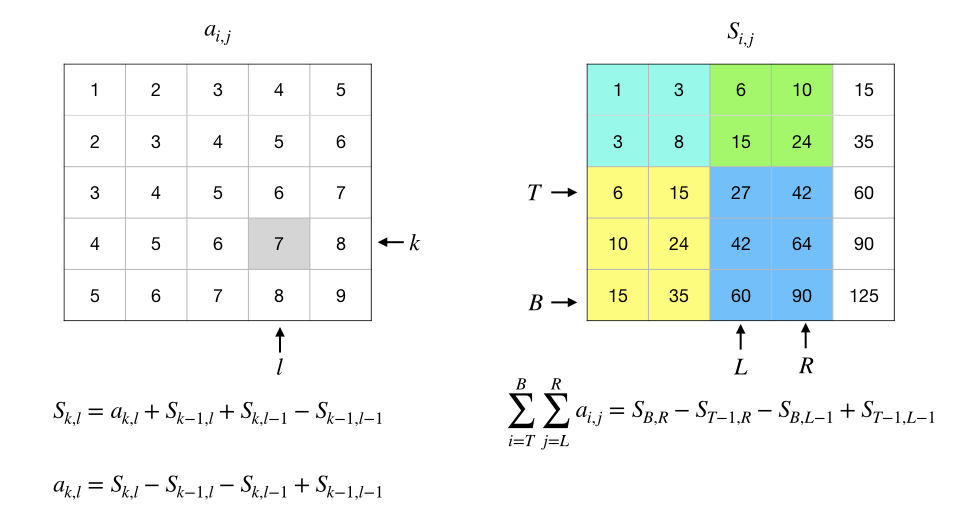

前缀和：概念、应用、线性差分
+++++++++++++++++++++++++++++++++++++

:strong:`前缀和`\ 是一种重要的序列数据预处理技术，能大大降低区间和查询问题的时间复杂度。假如一个算法需要对一个数列做多次区间求和，那么用前缀和就会非常高效。

根据要处理的数据集的维度也分各种维度的前缀和，比如最简单的是处理数列的一维前缀和，复杂一点的有处理矩阵的二维前缀和，当然也可以有三维、四维乃至非常高维的情况，但是很少见，算法编程中最最常用的就是一维和二维两种情况。

.. attention::

   前缀和只是一种数据预处理手段，并不是某种有特定功能的算法。它总是需要配合其他算法技巧一起来解决问题，比如差分、二分搜索等等。通常涉及前缀和的题目都会很难！我们将在第8章竞赛题精选精讲中选择一些典型的利用前缀和解决问题的题目进行讲解。

.. index:: 前缀和

一维前缀和
^^^^^^^^^^

一维前缀和是最为简单的，它用于对一个数列进行预处理。给定一个数列 :math:`\{a_n\}`，我们称其前 :math:`k` 项的和 :math:`S_k=\sum_{i=1}^ka_i` 为前缀和，从 :math:`S_1=a_1` 到 :math:`S_n=\sum_{i=1}^na_i` 的所有前缀和就组成了它的前缀和序列，一般也就简称为前缀和。

利用递推公式 :math:`S_k=S_{k-1}+a_k`，我们可以很方便地通过遍历一次整个数列，在 :math:`O(n)` 时间内完成计算整个前缀和序列的计算，也可以在连续读数的输入循环里直接完成预处理。而且同样利用这个公式，我们甚至可以不保存下原始的数列，只保存前缀和序列，因为 :math:`a_k=S_{k}-S_{k-1}`，就意味着只要有了前缀和序列，我们仍然可以用 :math:`O(1)` 时间来按序号随机访问到原数列中的任意项 :math:`a_k`。

前缀和最大的用处则是可以在常数时间内计算任意区间和。用 :math:`L` 和 :math:`R` 分别表示区间的左右端点，区间和为：

.. math::

   \sum_{i=L}^Ra_i=a_L+\cdots+a_R=(a_1+\cdots+a_R)-(a_1+\cdots+a_{L-1})=S_R-S_{L-1}

所以只要最多一次减法就可以计算出任意区间和，这就使得那些需要大量区间求和运算的算法能非常有效地降低时间复杂度。

.. image:: ../../images/224_prefix_sum.001.png

**编程实现**

在用C++语言编程实现一维前缀和预处理的时候，通常会使用一个数组来存放前缀和序列。由于需要用前缀和的算法往往数据规模都很大，往往需要开百万级长度的数组，所以一般会考虑使用全局变量来开数组。这里有两点需要注意的：一是内存消耗问题，如果内存量紧张，为了减少内存往往可以不保存数据，只保存前缀和序列，这样内存用量就会锐减；二是序号问题，C++数组从0开始编号，为了方便起见往往可以把数组长度开成比实际最大项数大1，把0号元素设置为0，模拟 :math:`S_0=0`，然后从1号元素开始放实际的数项。这样做还有一个好处，那就是在以后计算区间和时不需要特别判断左端点序号减一是否会变负数，使得代码可以变得非常简洁。

下面是在读入数据的同时完成前缀和处理的示例代码，数据也存放下来，统一从数组的1号元素开始存储。另外代码里定义了一个内联函数 ``ssum()`` 用来说明怎样求指定区间和，实际编程时由于求区间和的运算非常地简单，所以往往也不会特意去定义一个函数。

.. literalinclude:: ../../codes/224_1d_prefix_sum.cpp
   :language: c++
   :emphasize-lines: 5, 17

根据具体情况不同，有时候程序里可能不存储原始数据，有时候可能从数组的0号元素开始存放比较方便，但是无论怎样处理，前缀和的原理是一样的。弄懂原理之后，在程序代码里做一些不同的处理应该也是很简单的事情。

二维前缀和
^^^^^^^^^^

在数学里，把一个 :math:`m` 行 :math:`n` 列的矩形数阵称为\ :strong:`矩阵`\ ，通常用大写字母表示。例如 :math:`A=\begin{bmatrix}1&2&3\\4&5&6\end{bmatrix}` 就是一个矩阵，由于它有2行3列，所以也叫做2x3矩阵。数学习惯用大写字母表示矩阵，矩阵中的数称为元素，用小写字母加上所在行、列号的下标来表示，例如 :math:`a_{1,2}` 表示第1行第2列的那个元素。最小的矩阵是1x1矩阵，它实际上也就是一个数，有一个数学名词叫做标量，就是指一个单独的数。

C++语言里很自然的就可以用二维数组来表示矩阵。但还是要注意编号问题，在数学里矩阵的行和列都是从1开始编号的，最上面一行是第1行，最左边的列是第1列，但是C++语言的数组无论是行还是列都是从0开始编号的。

一个 :math:`m\times n` 矩阵 :math:`A` 内部的任意一个 :math:`k` 行 :math:`l` 列 :math:`(1\le k \le m,1\le l \le n)` 的矩形区域叫做 :math:`A` 的一个子矩阵。例如 :math:`B=\begin{bmatrix}1&2\\4&5\end{bmatrix}` 就是矩阵 :math:`A=\begin{bmatrix}1&2&3\\4&5&6\end{bmatrix}` 的一个子矩阵。用子矩阵所在位置的左上和右下两个角的位置坐标就可以唯一地确定这个子矩阵，例如在刚才那个例子里，子矩阵 :math:`B` 的左上角坐标是(1,1)，右下角则是(2,2)。一个矩阵最大的子矩阵就是它自己，最小的子矩阵是由单个元素构成的1x1矩阵，其实也就是元素本身。

在编程时，通常用四个变量 ``left, top, right, bottom`` 分别表示子矩阵所在区域的左、上、右、下四个位置的行号或列号，有时在不会有歧义的情况下也直接使用它们的首字母 ``l, t, r, b``。给出这样四个变量的值，就可以在一个二维数组中确定地标识出一个子区域。

很多算法需要随时查询一个数据矩阵中指定区域的子矩阵中所有元素的和。如果不做任何预处理，那么每查询一个 :math:`k\times l` 区域的子矩阵和就需要进行 :math:`k\times l` 次加法。如果算法中子矩阵和的查询量极大，那么算法的时间效率就会很低，接近 :math:`O(n^3)`。在这种情况下，使用二维前缀和对矩阵进行预处理会把单次计算子矩阵和的时间复杂度直接降到 :math:`O(1)`。

理解了一维前缀和之后再理解二维前缀和就不难了。位置 :math:`k` 上的一维前缀和就是指从数列的首项 :math:`a_1` 开始累加到第 :math:`k` 项 :math:`a_k` 的和。类似地，位置 :math:`b` 行 :math:`r` 列上的二维前缀和就是指以整个矩阵的第1行第1列那个元素 :math:`a_{1,1}` 为左上角，以 :math:`a_{b,r}` 为右下角的子矩阵的元素和：:math:`\sum_{i=1}^b\sum_{j=1}^ra_{i,j}`。

二维前缀和的预处理也可以随着逐行读入数据的过程同时完成，但是比一维的情况要复杂一些。例如在下面这个4x4矩阵中：

.. math::

   A=
   \begin{bmatrix}
   1 & 2 & 3 & 4\\
   2 & 3 & 4 & 5\\
   3 & 4 & 5 & 6\\
   4 & 5 & 6 & 6
   \end{bmatrix}

假如我们要计算第2行第3列位置上的二维前缀和，根据逐行逐列读取数据并同时预处理的规则，这时候我们应该已经读入和预处理了以下的部分：

.. math::

   A^\prime=\begin{bmatrix}1 & 2 & 3 & 4\\2 & 3\end{bmatrix},S^\prime=\begin{bmatrix}1 & 3 & 6 & 10\\3 & 8\end{bmatrix}

为了计算出第2行第3列上的前缀和，我们可以利用已经计算好的三个前缀和来完成计算：

1. “上面那个”，也就是第1行第3列上的前缀和 :math:`s_{1,3}=6`，它代表子矩阵 :math:`\begin{bmatrix}1 & 2 & 3\end{bmatrix}` 的元素之和；
2. “左边那个”，也就是第2行第2列上的前缀和 :math:`s_{2,2}=8`，它代表子矩阵 :math:`\begin{bmatrix}1 & 2\\2 & 3\end{bmatrix}` 的元素之和；
3. “左上方那个”，也就是第1行第2列上的前缀和 :math:`s_{1,2}=3`，它代表子矩阵 :math:`\begin{bmatrix}1 & 2\end{bmatrix}` 的元素之和。

我们发现，如果我们把“上面那个”和“左边那个”加起来，再减去二者重叠的“左上方那个”的部分，得到的和就应该是恰好缺了右下角元素的那个部分 :math:`\begin{bmatrix}1 & 2 & 3\\2 & 3\end{bmatrix}` 的元素之和，把缺了的那个右下角元素 :math:`a_{2,3}=4` 加上去就得到了第2行第3列上的前缀和 :math:`s_{2,3}`，它等于15。

所以我们在编程时，就随着逐行逐列的顺序，从第1行第1列开始按照上面这个递推公式逐个位置的进行 :emphasis:`(“读入的数”+“上面那个”前缀和+“左边那个”前缀和-“左上方那个”前缀和)` 的简单运算就可以完成二维前缀和的预处理。这里和一维前缀和时类似，一种比较好的实现是空出C++数组的第0行和第0列，把它们全部初始化为0，数据也好前缀和也好按照数学习惯从第1行第1列开始存放。虽然浪费了一点空间，但是在处理行号或者列号为1的位置时不需要关心出现负数坐标值的问题，而且也更加符合日常习惯。

现在相信大家已经不难理解，甚至能自己推导出怎样利用二维前缀和来计算出任意的子矩阵和了吧。同样只进行三次加减运算就可以了，只不过和预处理时前缀和的计算方法刚好相反，现在对于任意给定了左上右下四个位置的子矩阵，我们要计算的是 :emphasis:`（“右下角”的前缀和-“上面那个”前缀和-“左边那个”前缀和+“左上方那个”前缀和）`。在这里，全零的0号行和0号列又发挥了神奇的作用，使得程序代码可以大大简化。

另外，和一维前缀和的情形一样，如果为了节约内存，我们也可以不保存原矩阵。从二维前缀和中恢复出 :math:`k` 行 :math:`l` 列上的原矩阵元素，其实就是计算仅含这一个元素的子矩阵的元素和，所以这时候无非就是上下两个行号都是 :math:`k`，左右两个列号都是 :math:`l` 而已。

下面是和前面一维前缀和演示程序类似的一个小演示程序，用来说明怎样用C++语言实现常规的二维前缀和预处理以及怎样计算一个给定了左上右下四个坐标的子矩阵和，请务必试着运行一下看看效果。

.. literalinclude:: ../../codes/224_2d_prefix_sum.cpp
   :language: c++
   :emphasize-lines: 8, 9, 20, 21

前缀和的常见应用
^^^^^^^^^^^^^^^^

前缀和技术在算法编程中的应用非常广泛，下面列举一些最常见的应用，请大家作为思考题自行思考如何利用前缀和来解决这些问题。

1、求数列的平衡位置

   在一个给定的数列 :math:`\{a_n\}` 中寻找一个所谓的平衡位置 :math:`k`，使得在它之前的所有项之和与在它之后的所有项之和相等：:math:`a_1+\cdots+a_{k-1}=a_{k+1}+\cdots+a_n`。

2、寻找具有特定和的子区间（子区域）

   给定一个数列或矩阵，以及一个数 :math:`s`，寻找是否存在和为 :math:`s` 的子区间或子区域。

3、求使得区间和小于特定值的最大子区间尺寸

   给定一个数列和一个区间和最大值 :math:`m`，求一个子区间长度的最大值 :math:`s`，使得所有长度小于等于 :math:`s` 的子区间的区间和都小于 :math:`m`。

   .. admonition:: 示例

      输入: arr[] = {1, 2, 3, 4}, k = 8.

      输出: 2

      解释: 按长度从小到大来看，arr的长度为1的子区间共有4个，它们的区间和分别为 1, 2, 3, 4；长度为2的子区间共有3个，区间和分别为 3, 5, 7；长度为3的子区间有2个，区间和分别为 6, 9；现在发现有一个长度为3的子区间的区间和大于8了，所以答案为2。

4、求指定范围内最大的可分解为连续质数之和的质数

   给定一个大于2的正整数 :math:`n`，求不大于 :math:`n` 的范围内所有可以拆分为数个连续质数之和的质数中最大的那一个，连续的质数是指至少2个。通常题目会用数组的方式给出多个范围值，要求出所有这些范围值对应的解。

   .. admonition:: 示例

      输入: n[] = {10, 30}

      输出: 5, 17

      解释: 对于第一个范围值10，不大于10的质数中只有5可以拆分成两个连续质数2和3之和，5=2+3；对于第二个范围30，不大于30的质数中，可以表示成连续质数之和的质数有5和17两个，17=2+3+5+7。

5、求两个同尺寸数列（矩阵）的最大同和公共子区间（子区域）

   两个同尺寸的数列（矩阵）的公共子区间（子区域）是指起点和终点（左上和右下）相同的子区间（子区域）。给定两个尺寸相同的数列（矩阵），求所有具有相同区间和（区域和）的公共子区间（子区域）中最大的那个尺寸，即所含项（元素）的个数最多。

   .. admonition:: 示例

      输入: arr1[] = {0, 1, 0, 0, 0, 0}, arr2[] = {1, 0, 1, 0, 0, 1};

      输出: 4

      解释: 尺寸最大的公共子区间是从第2项到第5项的那个子区间，尺寸为4。

6、求模m的最大子区间和（子区域和）

   给定一个数列（矩阵）和一个模m，求所有模m的子区间和（子区域和）中的最大值。

7、求多个整数取值范围中出现次数最多的整数

   给定多个整数取值范围 :math:`[L_i, R_i]`，找出在所有这些范围内出现次数最多的那个整数，如果这样的整数有多个的话就指其中最小的那个。

   .. admonition:: 示例

      输入: L1 = 1, R1 = 4;

            L2 = 3, R2 = 5;

            L3 = 4, R3 = 8;

      输出: 4

      解释: 在给出的三个取值范围中，4一共出现了3次，每个范围里都有4，而其他整数都不到3次，所以答案是4。

      输入: L1 = 1, R1 = 6;

            L2 = 3, R2 = 5;

            L3 = 2, R3 = 8;

      输出: 3

      解释: 在给出的三个取值范围中，3, 4, 5都一共出现了3次，同是出现次数最多的，按照题目要求取最小的那个，所以答案是3。

上面这些典型应用场景请一定要自己去思考一下，要怎样应用前缀和的技巧来高效率地完成这些任务，自己动手编程试一试。

.. index:: 差分（线性差分）

线性差分
^^^^^^^^

:strong:`线性差分`\ 是一种极其常用的算法技巧，是普及组和提高组Day1试题中的常考知识点。线性差分用于简化处理数列上的一系列区间修改，它是基于前缀和来实现的。相应的也有针对矩阵的二维线性差分，在学会了线性差分后将其扩展到二维情形是不难的。另外还有一种针对树结构的\ :strong:`树上差分`，我们将在后面学过树结构后再介绍。本节就介绍最基本的一维线性差分，简称\ :strong:`差分`。

利用差分可以处理的区间修改是指在数列的一个指定区间里，将所有元素同增或同减一个数。例如我们有一个数列 :math:`[1,2,3,4]`，对其中从第1个到第3个数的子区间里做加1的操作之后，它就变成了 :math:`[2,3,4,4]`。然后我们再对从第2个到第3个数的子区间做加2操作，结果变成 :math:`[2,5,6,4]`。最后再对第2个到第4个数的子区间做减1操作，数列变成 :math:`[2,4,5,3]`。这就是我们要处理的所谓多次区间修改操作。

用最普通的模拟法，也可以完成上述这样的操作，只要每次都按照修改的要求对指定子区间中的元素进行循环，完成规定的加减就可以了。但是如果数列很大，每次修改的子区间长度都很长，而且整套操作下来修改的次数非常之多的话，这样简单地模拟会效率很低。假设修改次数为 :math:`m`，每次修改的子区间的平均长度为 :math:`n`，那么简单模拟的时间复杂度为 :math:`O(mn)`，当 :math:`mn` 的规模达到10\ :superscript:`6` 以上时，往往就要等着TLE了。因此我们需要用差分来优化整个操作过程，差分在这里可以理解为反向运用前缀和的技巧，通过计算前缀和来构造出数据，它可以把时间复杂度降低到 :math:`O(m+n)`。

差分，其实是把区间操作改成点上的操作。要实现这种改变，第一步要做的事情是：在每次修改时导致数据发生改变的起点（修改区间的左端点）和数据不再改变的起点（修改区间右端点之后的第一个位置，如果右端点是整个数列的终点，那么就忽略这个点）这两个特殊点上记录数据的改变情况，最终形成一张“修改指令表”。

这张重要的“修改指令表”有一个听上去很酷的名字，叫做\ :strong:`差分表`，在编程时通常用一个数组来表示，就叫\ :strong:`差分数组`。差分数组的长度应该至少为原数列的项数，一般我们会把它初始化为全0。让我们用上面所举的那个例子来看看怎样一步步地生成差分数组，假设原数列保存在数组 ``int data[4] = { 1, 2, 3, 4 }`` 中，差分数组定义并初始化为 ``int diff[4] = { 0 }`` （请注意我们这次没有把数组的0号元素空出来，而是从0号元素开始存放实际数据了）。下面演示怎样处理三次区间修改：

.. code-block:: none

   第1次修改：对从第1个到第3个数的子区间做加1操作

              区间左端点 L = 0，右端点 R = 2，加数 P = 1

              本次修改数据发生改变的起点为 L = 0，因此在差分数组相应位置上执行此修改 diff[0] += 1

              本次修改数据不再改变的起点为 R+1 = 3，因此在差分数组相应位置上执行此修改的反操作 diff[3] -= 1

              第1次修改处理完成，差分数组变成 { 1, 0, 0, -1 }

   第2次修改：对从第2个到第3个数的子区间做加2操作

              区间左端点 L = 1，右端点 R = 2，加数 P = 2

              本次修改数据发生改变的起点为 L = 1，因此在差分数组相应位置上执行此修改 diff[1] += 2

              本次修改数据不再改变的起点为 R+1 = 3，因此在差分数组相应位置上执行此修改的反操作 diff[3] -= 2

              第1次修改处理完成，差分数组变成 { 1, 2, 0, -3 }

   第1次修改：对从第2个到第4个数的子区间做加1操作

              区间左端点 L = 1，右端点 R = 3，加数 P = -1

              本次修改数据发生改变的起点为 L = 1，因此在差分数组相应位置上执行此修改 diff[1] += -1 (即减1)

              本次修改数据不再改变的起点为 R+1 = 4，超出范围，忽略

              第1次修改处理完成，差分数组变成 { 1, 1, 0, -3 }

处理完所有区间修改之后，我们得到了差分表 ``{1, 1, 0, -3}``。乍看上去好像很难理解这样一张差分表有什么用处，确实，它还是一个“半成本”，后面还有一步重要的操作让它变成成品，那就是对它做前缀和处理。这个例子的数据很简单，我们手工计算一下就可以很简单地得到它的前缀和 ``{1, 2, 2, -1}``。

.. hint::

   到这里为止，请大家暂停一下先不要继续往下阅读。先对照例子中的原数列和最终结果数列，再对照一下我们得到的成品差分表，想一想这张差分表里每一个位置上的数代表了什么意思？看懂了的话试着回过头去想一想半成品的时候它的每一个数代表什么意思？再想一想为什么能得到这张神奇的差分表？如果能想明白这三个问题，那么线性差分的原理就彻底搞懂了，以后也不会再忘了这个算法技巧了。

是的，现在差分表里每个位置上的数，就表示原数列相应位置的数的最终改变量（加还是减用正负统一为加法）。现在只需要简单得把差分数组里的每一个数 ``diff[i]`` 一一加到原数组相应位置 ``data[i]`` 上去就完成了整个多次区间修改操作。在这个例子里最后一步的操作是这样的：

.. code-block:: none

      data: { 1, 2, 3, 4  }
   +) diff: { 1, 2, 2, -1 }
   -------------------------
      data: { 2, 4, 5, 3  }

这正是我们所要的正确结果。

如果原数列一共有 :math:`n` 个数，区间修改一共进行了 :math:`m` 次，那么处理每一次修改要用2次加法，总共 :math:`2m` 次，差分数组求前缀和要用 :math:`n` 次加法，最后差分加到数据上去也是 :math:`n` 次加法。总共执行 :math:`2m+2n` 次加法，时间复杂度 :math:`O(m+n)`。

下面是这个一维线性差分的示例程序，请运行测试一下并看懂整个程序。注意这个程序里数据从数组0号元素开始存放，注意原地做前缀和处理的代码。

.. literalinclude:: ../../codes/224_diff.cpp
   :language: c++

.. admonition:: 思考

   学会一维线性差分了，你能不能把它拓展到矩阵的多次修改呢？也就是说拓展为二维差分算法。请务必思考并尝试一下。

