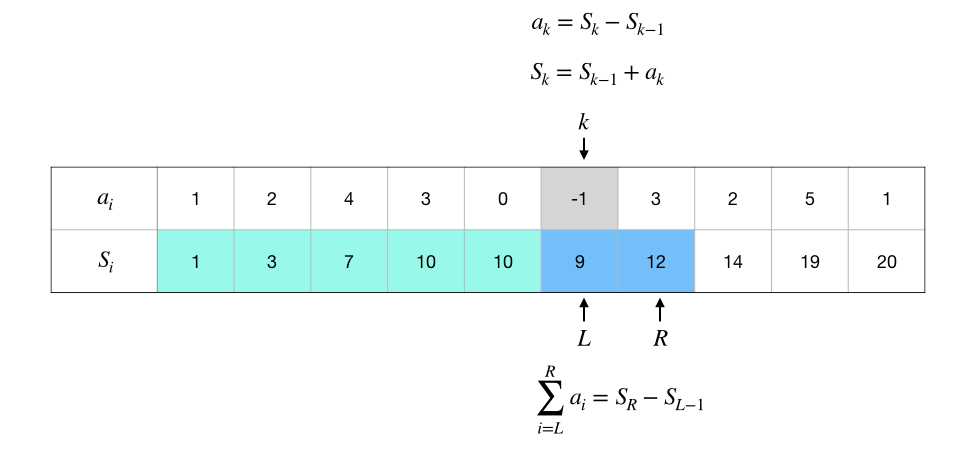

前缀和：概念与实现
+++++++++++++++++++++++++++++++++++++

:strong:`前缀和`\ 是一种重要的序列数据预处理技术，能大大降低区间和查询问题的时间复杂度。假如一个算法需要对一个数列做多次区间求和，那么用前缀和就会非常高效。

根据要处理的数据集的维度也分各种维度的前缀和，比如最简单的是处理一个数列的一维前缀和，复杂一点的有处理一个数据矩阵的二维前缀和，当然也可以有三维、四维乃至非常高维的情况，但是很少见，算法编程中最最常用的就是一维和二维两种情况。另外还有一种叫做\ :strong:`差分法`\ 的较为复杂的技巧，常用来配合前缀和处理数据分区块同增同减的问题。差分法同样根据数据集的维度不同而有不同维度，但是一般只会用到一维差分，极少见高维差分法的题目。

.. warning::

   前缀和只是一种数据预处理手段，并不是某种有特定功能的算法。它总是需要配合其他算法技巧一起来解决问题，比如差分法，比如二分搜索等等。通常涉及前缀和的题目都会很难！我们将在第8章竞赛题精选精讲中选择一些典型的利用前缀和解决问题的题目进行讲解。

一维前缀和
^^^^^^^^^^

一维前缀和是最为简单的，它用于对一个数列进行预处理。给定一个数列 :math:`\{a_n\}`，我们称其前 :math:`k` 项的和 :math:`S_k=\sum_{i=1}^ka_i` 为前缀和，从 :math:`S_1=a_1` 到 :math:`S_n=\sum_{i=1}^na_i` 的所有前缀和就组成了它的前缀和序列，一般也就简称为前缀和。

利用递推公式 :math:`S_k=S_{k-1}+a_k`，我们可以很方便地通过遍历一次整个数列，在 :math:`O(n)` 时间内完成计算整个前缀和序列的计算，也可以在连续读数的输入循环里直接完成预处理。而且同样利用这个公式，我们甚至可以不保存下原始的数列，只保存前缀和序列，因为 :math:`a_k=S_{k}-S_{k-1}`，就意味着只要有了前缀和序列，我们仍然可以用 :math:`O(1)` 时间来按序号随机访问到原数列中的任意项 :math:`a_k`。

前缀和最大的用处则是可以在常数时间内计算任意区间和。用 :math:`L` 和 :math:`R` 分别表示区间的左右端点，区间和为：

.. math::

   \sum_{i=L}^Ra_i=a_L+\cdots+a_R=(a_1+\cdots+a_R)-(a_1+\cdots+a_{L-1})=S_R-S_{L-1}

所以只要最多一次减法就可以计算出任意区间和，这就使得那些需要大量区间求和运算的算法能非常有效地降低时间复杂度。

**编程实现**

在用C++语言编程实现一维前缀和预处理的时候，通常会使用一个数组来存放前缀和序列。由于需要用前缀和的算法往往数据规模都很大，往往需要开百万级长度的数组，所以一般会考虑使用全局变量来开数组。这里有两点需要注意的：一是内存消耗问题，如果内存量紧张，为了减少内存往往可以不保存数据，只保存前缀和序列，这样内存用量就会锐减；二是序号问题，C++数组从0开始编号，为了方便起见往往可以把数组长度开成比实际最大项数大1，把0号元素设置为0，模拟 :math:`S_0=0`，然后从1号元素开始放实际的数项。这样做还有一个好处，那就是在以后计算区间和时不需要特别判断左端点序号减一是否会变负数，使得代码可以变得非常简洁。

我们给出在读入数据的同时完成前缀和处理的示例代码，数据和前缀和都从1开始存放，另外给出一个内联函数 ``sum()`` 用来求指定区间和。

（待续）