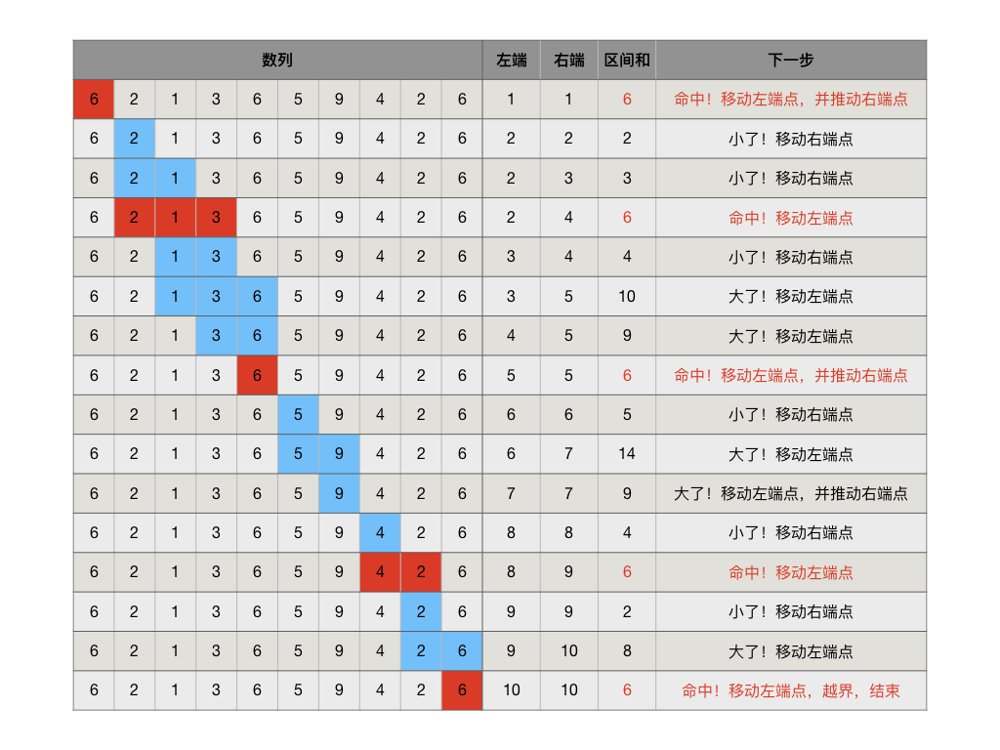
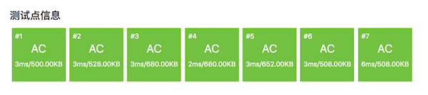

.. index:: 尺取法

尺取法（洛谷P1147）
+++++++++++++++++++

:strong:`尺取法`\ 又叫\ :strong:`双指针法`，它其实也是一种模拟，是解决寻找区间和问题的一种方法。

顾名思义，尺取法就是像尺子一样取一段来进行测量。尺取法通常是使用一对下标，表示所测量的区间的左右端点，然后根据测量结果不断地推进区间左右端点以找到答案。尺取法比直接暴力枚举区间效率高很多，尤其是数据量大的时候，所以说尺取法是一种高效的枚举区间的方法，是一种技巧，一般用于求取有特定区间和的所有子区间或最短的子区间等等。

比如要在一个项数为 :math:`n` 的数列中寻找所有区间和等于 :math:`s` 的子区间，如果用朴素的暴力枚举子区间的话，我们需要用一个双层嵌套循环，分别循环枚举所有可能的子区间左右端点，在这个嵌套循环内部很可能还需要用一个单循环来计算出区间和：

.. code-block:: c++

   for (int l = 0; l < n; l++) {
           for (int r = l; r < n; r++) {
                   // 计算区间[l, r]的区间和
           }
   }

这样的方法时间复杂度至少为 :math:`O(n^2)`。但是用尺取法可以把循环次数控制在 :math:`2n` 次以内，时间复杂度降低到 :math:`O(n)`。

当然任何技巧都存在其不足的地方，有些情况下尺取法不可行，无法得出正确答案，所以要先判断是否可以使用尺取法再进行计算。尺取法的条件就是区间和的变化是有规律的，通常要求是单调的，否则当一个子区间的测量结果出来后，我们就无从判断下一步是应该怎样移动尺子的端点。最为常见的这种数列就是全正项数列（或者全负项数列），这里我们用全正项数列为例来进行说明。

设有正项数列 :math:`\{a_n\}`，那么对于任意的左右下标 :math:`1\le l\le r\le n` 表示的子区间 :math:`[l,r]`，记它的区间和为 :math:`s[l,r]=\sum_{i=l}^ra_i`。那么当尺的两端向右移动的时候，我们可以确定，新的区间和有以下规律：

1. 左端向右移动，右端不变，区间和缩小：:math:`s[l,r] \gt s[l+1,r]`。
2. 右端向左移动，左端不变，区间和扩大：:math:`s[l,r] \lt s[l,r+1]`。

利用上述两条规律，我们可以设计出一种技巧，从左向右单方向地移动尺子，直到尺的左端移到数列末端的后面，可以找出区间和为指定的 :math:`s` 值的所有子区间。

.. hint::

   类似地我们容易发现另外两条规律：:math:`s[l,r] \gt s[l,r-1]`，:math:`s[l,r] \lt s[l-1,r]`。利用这两条规律也可以实现尺子从右向左探测的技巧，但是一般来说，对于大多数不是左撇子的人，从左向右移动尺子更加符合直观，容易理解。

* 初始时，让尺子的左右两个端点都指向数列的首项 :math:`a_1`，表示只含一个首项的区间 :math:`[1,1]`，这是整个尺取探测过程的起点。
* 假设某个子区间 :math:`[l,r]` 的区间和 :math:`s[l,r] \gt s`，说明从 :math:`a_l` 开始的子区间不需要再扩大长度了，它的区间和已经过大了。所以我们下一步不需要再探测这一类子区间，而应该改为去探测从 :math:`a_{l+1}` 开始的子区间了。于是我们向右移动左端点：:math:`l\leftarrow l+1`。
* 假设某个子区间 :math:`[l,r]` 的区间和 :math:`s[l,r] = s`，说明它就是一个我们要找的子区间。由于正项数列中没有小于等于零的项，所以我们下一步不需要再探测从 :math:`a_l` 开始的子区间，而应该改为去探测从 :math:`a_{l+1}` 开始的子区间了。于是我们记录下（或者输出）这个结果，然后向右移动左端点：:math:`l\leftarrow l+1`。
* 假设某个子区间 :math:`[l,r]` 的区间和 :math:`s[l,r] \lt s`，说明从 :math:`a_l` 开始的子区间还不够大。所以我们下一步要继续探测这一类子区间。于是我们向右移动右端点：:math:`r\leftarrow r+1`。
* 尺子的右端点一定先于左端点抵达数列的尾项，此后当尺子的左端点移动到某个位置 :math:`l^\prime` 使得 :math:`s[l^\prime,n] \lt s` 或左端点越过整个数列的尾项时，整个尺取探测过程便告结束。
* 要注意的是，子区间的长度是有要求的，题目没有提出特别要求的话，那么就是至少为1，有些题目会有特殊的要求，比如至少为2或者3等等。当我们移动右端点的时候，子区间的长度肯定是在增大的，所以不会有问题。但是移动左端点可能会让区间长度缩小到要求的最小长度范围以内，这种时候就要进行判断处理。假设题目要求的最小子区间长度为 :math:`m`，那么一旦移动左端点后 :math:`r-l+1\lt m`，就需要同时移动一次右端点：:math:`r\leftarrow r+1`，这有点像是左端点推动了一下右端点。

.. attention::

   有时候有些特定的问题（比如后面我们要讲解的洛谷P1147）会有一些不同的结束条件，但是移动尺子的方法都是一样的。

举个例子，正项数列 :math:`\{a_n\}=[6,2,1,3,6,5,9,4,2,6]` 一共有10项，为了找出其中区间和为6的所有子区间，我们要做以下的尺取探测过程：

尺取法扫描一遍找到全部四个和为6的子区间总共循环了16次，而如果采用双层嵌套循环暴力搜索，加上最内层用来计算区间和的循环，一共需要循环184次。有兴趣可以思考一下这个184次是怎么得出来的。

下面我们来看一看怎样编写一个程序，读入一个数列、一个指定的区间和值、一个区间最小长度，用尺取法找出所有符合要求的子区间。读入的数列存放在一个数组里，这次我们要求遵循C++的规则，从数组的0号位置开始存放数列。

根据前面的尺取过程说明，要编出这样一个程序，还缺少最后一环：怎样根据左右两个端点位置来计算出区间和？我们显然不喜欢循环累加的笨方法，希望在 :math:`O(1)` 时间内完成计算。前缀和肯定是一种方法，但是需要用前缀和吗？有一些特殊数列具有求和公式可以使用，比如等差数列，但不是所有数列都有一个简洁的求和公式的，很多数列甚至根本没有求和公式可用。怎么办？请暂停五分钟，认真思考一下，然后再看代码里的处理方法和你想的是不是一样？

.. literalinclude:: ../../codes/226_two_points.cpp
   :language: c++

.. note::

   1. 循环条件 ``(l < n && r < n)`` 是怎么来的？
      根据前面的描述，循环结束条件有两个：一是左端点超过界限 ``l >= n``；另一个是右端点已经抵达数列尾项 ``data[n-1]`` 区间和小于目标值 ``s``，也就是 ``r == n - 1 && sum < s``。所以直接的循环条件写法就是这两个条件都不具备，即 ``l < n && !(r == n - 1 && sum < s)``，但是这样太繁杂易错了。仔细思考一下不难发现，按照移动尺子端点的规则，如果左端点移动后区间和小于目标值，那么在下一轮循环时右端点就会被移动，于是发生右端点越界。这就是为什么我们的循环条件可以简化为“左右两个端点都在界内”：``(l < n && r < n)``。
   2. 计算区间和可以和移动尺子端点同步完成：移动右端点之后，区间和就是原来的区间和加上\ :strong:`现在`\ 右端点所指向的那个项，我们用前置增1运算来移动右端点，先移动，再取加数，``sum += data[++r]``；移动左端点之后，区间和就是原来的区间和减去左端点\ :strong:`之前`\ 所指向的那个项，可以用后置增1运算来移动左端点，先取减数，后移动，``sum -= data[l++]``。

尺取法在许多算法编程题中都会得到应用，下面我们看一个典型的常考题型，正整数分解为多个连续正整数之和。

.. index:: 【连续自然数和】, 〖洛谷P1147〗

连续自然数和（洛谷P1147）

**题目描述**

对一个给定的自然数 :math:`M`，求出所有的连续的自然数段，这些连续的自然数段中的全部数之和为 :math:`M`。

例子：:math:`1998+1999+2000+2001+2002 = 10000`，所以从 :math:`1998` 到 :math:`2002` 的一个自然数段为 :math:`M=10000` 的一个解。

**输入格式**

包含一个整数的单独一行，给出 :math:`M` 的值（:math:`10 \le M \le 2,000,000`）。

**输出格式**

每行两个自然数，给出一个满足条件的连续自然数段中的第一个数和最后一个数，两数之间用一个空格隔开，所有输出行的第一个按从小到大的升序排列，对于给定的输入数据，保证至少有一个解。

**输入输出样例**

输入：

.. code-block:: none

   10000

输出：

.. code-block:: none

   18 142 
   297 328 
   388 412 
   1998 2002

**题目分析**

本题是一个典型的尺取法考题，分析题目后可以发现它和通常的尺取法有三个略微不同之处：

1. 从样例的输出中没有长度为1的区间 ``[10000, 10000]`` 可以看出，仅含输入值 ``M`` 本身的单元素区间是不视作为一个解的，因此本题所要求的子区间长度至少为2。
2. 本题的数列就是从1开始的自然数序列，所以本题不需要一个数组来保存数据。把左端点、右端点、区间和分别初始化为1、2、3，以后端点所在位置的数值就是端点的值。
3. 因为子区间长度至少为2，所以尺取的探测范围可以减半。如果 ``M`` 是奇数，那么最后一个子区间一定是 ``[M/2, M/2+1]``；如果 ``M`` 是偶数，那么最后一个子区间的右端点一定比 ``M/2`` 更小。故探测范围的尾项最大也就是 ``M/2+1``，鉴于子区间最小长度为2，所以左端点的探测范围要比右端点小1。由此我们可以得出循环结束条件为：左端点大于 ``M/2`` 或 右端点大于 ``M/2+1``。

下面就是能够AC的代码，但是在看到代码之后，我们发现还有两个地方和前面描述的标准的尺取法有所不同，请想一想为什么再看解释。

.. literalinclude:: ../../codes/226_p1147.cpp
   :language: c++
   :emphasize-lines: 12, 18

现在我们来解释一下为什么出现了两处省略。

1. 循环条件为什么不需要判断右端点是否在界内？

   前面已经说过，对于奇数 ``M``，最后一个子区间一定是 ``[M/2, M/2+1]``。当找到这个解的时候，左端点是 ``M/2``，右端点是 ``M/2+1``，之后会把左端点移动到 ``M/2+1``，这样左端点就越界了，下一次循环就会结束。因此奇数的情况在找到最后一个解的时候整个过程就因左端点越界而自然结束了。

   ``M`` 是偶数的情况比较难理解，因为最后一个解的右端点不知道具体在哪里。但我们可以肯定它一定小于 ``M/2``，且最后一个解的区间长度一定至少为3。另外，当尺子逐渐接近但还没有越过 ``M/2`` 这个界限的时候，任意两个相邻自然数的和都一定小于 ``M``，而三个连续自然数的和在某个位置之后一定会大于 ``M``。所以按照尺子移动的规则，随着尺子的右端点离界限 ``M/2`` 越来越近，尺子的长度一定会缩短到2。这就意味着就算我们不判断右端点是否越界，事实上当右端点到达 ``M/2+1`` 的时候，左端点也一定随之达到 ``M/2``，这时候区间和为 ``M+1``，左端点会进一步也移动到 ``M+1``，于是发生左端点越界，循环结束。如此一来仅仅多做了2轮循环而已，根本不会有什么可以辨别的差异。

   综上所述，为了代码简洁，完全可以不考虑判断右端点是否越界。这是本题数列的特殊性带来的一个小便利。当然了加上条件 ``r <= mid + 1`` 也一样不会错，但是虽然在偶数情况下能减少2次循环，却在每次循环的时候多做了一次加法和一次比较运算（然而实际上二者的运行时间差距是在毫秒以内的，现代计算机的运算速度是非常快的）。

2. 为什么不需要在移动左端点后判断是否要推动右端点？

   标准的尺取法，在移动左端点后要判断区间长度是否变得小于最小长度，如果是，就要推动一下右端点。按照前面的分析，本题要求子区间长度至少为2，所以在移动了左端点之后应该判断是否导致 ``r - l + 1 < 2``，即 ``l > r - 1``，如果是就要推一下右端点。但是实际代码里并没有这么做，这还是和我们的界限 ``M/2`` 有关。在我们的探测范围内，任意两个相邻数之和都小于 ``M``，所以每当区间长度缩短到最小长度2，下一次必然是移动右端点使得区间长度增加到3。换句话说，整个过程中不可能出现区间长度小于2的情况，因此不需要做这一步。这仍然是题目的特殊性带来的便利。

下面是AC页面的截图，可以看出算法的运算速度非常之高。如果去看洛谷的题解，有人用了前缀和，有人用了二分搜索，还有用上了等差数列求和公式和二次方程求根等等方法。都很强，但是这就是一个普通的尺取法题目，而且基本可以肯定尺取法已经接近甚至达到了速度的巅峰。

.. important::

   从这一章介绍的单调区间统计、区间和、前缀和、尺取法等算法都可以看到，算法虽然有所谓模板算法、标准算法，但是在实际应用时，往往根据问题的不同，可以有不同的改变。有些题目数据的特性可以带来许多便利，可以减少标准算法里的一些步骤环节。有时候题目会引入一些特殊数据特殊情况，让我们必须对算法增加一些特殊处理。而且，在软件设计的世界里，永远没有背诵一遍全场适用的标准代码，只有弄懂算法的原理，然后在解题时灵活运用才是正确之道，请千万不要背代码，哪怕是最经典的算法教材上的代码。

