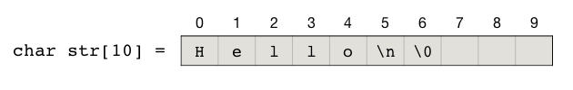
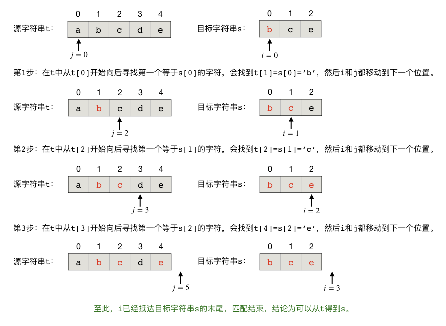
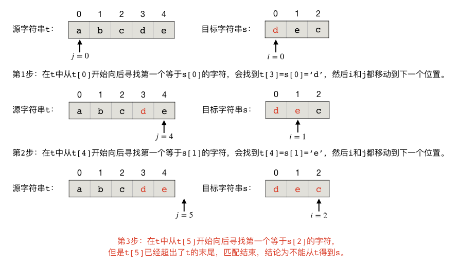

字符串处理基础知识(I)
++++++++++++++++++++++++++++++++

**基本概念**

字符串说到底就是由一系列字符按照一定顺序排列而成的，我们目前只处理ASCII字符串，在C++语言中就是一连串的 ``char``\ 。正如前面所说，C++有继承自C语言的C-string和自己特有的C++ string类型两种字符串解决方案。

1、传统的C-string采用一个 ``char`` 型数组来存放字符串，以一个空字符 ``\0`` 来标识字符串的结尾，例如：

.. code-block:: c++

   char str[10] = "Hello\n";

就是一个字符串，在内存中，这个C-string的实际存储情况是：

由于C-string本质上就是一个数组，所以可以用访问数组元素的方式访问其中的单个字符，例如 ``str[0]`` 就是第1个字符 ``'H'``\ 。也可以方便地使用指针，还记得数组的名字就是指向第一个元素的指针吗？所以 ``*(str+5)`` 就是第6个字符 ``'\n'``\ ，这是一个“换行”字符（newline）。每个C-string的最后一定要用一个空字符 ``'\0'`` （NULL）来标识结尾，否则C++就不知道该到哪里结束了，这个特殊的空字符的实际数值就等于0，所以可以视作整数0，也可以视作逻辑值false，这就给C-string的字符串处理带来了很大的便利。

.. attention::

   正因为有一个空字符收尾，C-string才成为了字符串，而不是普通的字符数组。但是这个空字符是不计入字符串的长度的。

由于C++数组的数组名单独使用时就是指向该数组第一个元素的指针，C-string既然是一个字符型数组，所以它又可以用字符型指针来表示。这通常用在给函数传递C-string参数时，例如下面这两种给函数传C-string的方式事实上是一样的：

.. code-block:: c++

   void func1(char *s);
   void func2(char s[]);

但是通常我们在传递字符串时会采用指针的形式而不是数组的形式，这是为了能够一眼看出这里要传递的是C-string而不是字符数组。

还记不记得传递数组的时候，由于本质上只是传递了指向数组第一个元素的指针，所以数组本身的长度（元素个数）这个重要的信息是丢失了的，因此给函数传递数组时往往还需要额外传递一个表示数组长度的参数。但是传递C-string不同，虽然本质上也只是传递了指向第一个字符的指针，但是由于字符串尾部会有一个特殊的空字符来标识结束，所以不需要单独给函数再传一个字符串长度的参数，在函数内部可以方便地找到字符串的结尾，获知字符串的长度。

.. tip::

   现在我们知道了，实际上一个C-string对于C++语言内部来说，仅仅只是一个字符型指针，从它所指向的那个字符开始一直顺序向后，直到第一个空字符 ``'\0'``\ ，这一整段内存里存放的所有字符就构成了一个C-string。

   例如我们定义了这样一个C-string：\ ``char s[20] = "abcdefg";``\ ，然后我们再定义这样一个字符型指针：\ ``char *t = s + 2;``\ ，这样 ``t`` 就是一个从 ``s[2]`` 开始直到结束的C-string：\ ``"cdefg"``\ 。

   这个技巧非常有用，在下面要讲的第一个问题“周期串”中我们就会用到这个技巧。

.. warning::

   和数组一样，采用C-string方式处理字符串，最大的危险是长度超限。一定要记住，长度为n的数组，最多能存放的字符串长度为n-1！因为至少要留出一个元素的位置来存放收尾的空字符。

要处理C-string方式的字符串，需要引入 ``cstring`` 标准库，其中提供了一些基本的字符串处理函数，例如测量长度、拼接、复制、比较、子串搜索等。它们的共同点是速度快，使用简单，但是功能有限，有几个函数使用起来还有点怪异。

2、C++的string类型则是一个定义完好的封装起来的类，它的底层是向程序员隐蔽起来的，但它开放了许多功能强大的成员函数供编程使用。要使用C++ string，先要引入STL库 ``string``\ ，使用命名空间 ``std``\ 。定义一个C++ string变量非常方便，和定义一个基本数据类型的变量一模一样，例如：

.. code-block:: c++

   #include <string>

   using namespace std;

   string str = "Hello\n";

要访问C++ string中指定位置的字符，也有两种方法，和C-string非常类似。通常我们也用 ``[]`` 下标运算符，例如 ``str[1]`` 就可以访问到第2个字符 ``'e'``\ 。也可以用和指针非常相似的迭代器来访问元素，\ ``str.begin()`` 返回头迭代器，指向第1个字符，\ ``str.end()`` 则返回尾迭代器，指向最后一个字符的后面一个位置。所以 ``*(str.begin()+1)`` 就是第2个字符 ``'e'``\ ，而 ``*(str.end()-1)`` 则是最后一个字符 ``'\n'``\ 。我们可以自己定义一个类型为 ``string::iterator`` 的变量来存放迭代器。例如下面这段代码片段会从尾到头逆向地输出字符串中的每一个字符：

.. code-block:: c++

   for (string::iterator it = str.end() - 1; it >= str.begin(); --it)
           cout << * it;

C++ string除了速度比C-string略慢外，其他各方面都比C-string要优秀得多。例如它没有长度超限的危险，它可以自动根据内容来调整自己占用的空间，它的成员函数也比 ``cstring`` 库函数丰富和强大得多。如果不是特别简单或者对速度要求特别高的情况，我们都建议在编程时使用C++ string进行字符串处理。

.. attention::

   通常说的C++ string速度比C-string慢，不仅仅来自于它本身的处理速度慢，更多地来自于输入输出慢。C++ string只能采用C++的IO流方式进行输入输出，IO流相比传统的C语言标准IO要慢很多。所以当字符串算法的输入输出量特别大时，应该考虑使用C-string。

在后面的内容中我们将先使用C-string来进行简单字符串处理，当对C-string及其常用操作有了一定的掌握之后就将改为使用C++ string。这一节我们先来看两个字符串处理问题：周期串和子序列。前两个问题来自《算法入门经典（第2版）》第三章的两个练习题，也是知名OJ网站UVa的题目，它们的解法都很简单，但都包含了最基本的字符串处理技巧。

.. index:: 【周期串】, 〖UVa455〗

周期串问题（UVa455）
^^^^^^^^^^^^^^^^^^^^^^

:strong:`周期串`\ 是指这样一种字符串，它是由某一个非空字符串重复若干次之后得到的。例如 ``"abcabcabcabc"`` 就是一个周期串，它是由子串 ``"abc"`` 重复4次之后得到的，也可以认为是由 ``"abcabc"`` 重复2次得到的。:strong:`周期`\ 是指被重复的那个短字符串的长度，所以一个周期串可能有多个周期。例如前面举的这个例子里，如果把它看作是 ``"abc"`` 重复4次，那么它的周期就是3；如果看作是 ``"abcabc"`` 重复2次，那么周期就是6。所有周期中最小的那个叫做\ :strong:`最小正周期`\ 。

特别要注意，任何一个非空字符串都可以看成是由它自己重复1次得到的，所以任何非空字符串都可视作是一个以它自身的长度为周期的周期串。例如 ``"abcabcabcabc"`` 的周期可以是12，\ ``"Hello,World!"`` 也可以看作是一个周期为12的周期串。

现在，输入一个长度不超过80个字符、不含空白字符的非空字符串，请输出它的最小正周期。例如输入 ``"abcabcabcabc"``\ ，那么输出3；如果输入 ``"Hello,World!"`` 那么输出12。

**解题思路**

一个字符串s，若其长度为n。那么它的周期可能有哪些呢？显然周期的取值范围一定是在整数区间 [1, n] 内的，而且这个周期一定能被n整除。换句话说，周期一定是长度的因数。并且除了n本身以外，其他的周期值都不会超过n的一半。所以我们只需要从1开始逐个检查n的不大于其自身一半的因数是不是s的周期，第一个找到是周期的因数就是最小正周期。如果找不到，那么最小正周期就是n本身。

这就是算法的大框架，可以这样描述：

.. admonition:: 最小正周期算法

   :math:`\text{Min_Period}(s):`

      :math:`n \leftarrow \text{length of }s`

      :math:`\text{FOR  } p \leftarrow 1 \text{  TO  } n/2 \text{  DO}`

         :math:`\text{IF  } n \bmod p \neq 0 \text{  THEN continue}`

         :math:`\text{IF Is_Period}(s, n, p) = \text{true THEN RETURN  } p`

      :math:`\text{RETURN  } n`

第二步要解决如何判断一个数是不是周期的问题，也就是算法中调用的那个子算法 :math:`\text{Is_Period}(s, n, p)`\ 。

测试的原理也很简单，我们只要对原字符串s的所有长度为p的分段进行逐个比较是否相等即可，算法如下（注意，字符串的范围一律采用含头不含尾的原则表示）：

.. admonition:: 判断是否周期

   :math:`\text{Is_Period}(s, n, p):`

      :math:`\text{FOR  } j \leftarrow p \text{  TO  } n-p \text{  DO}`

         :math:`\text{IF  } s[0:p] \neq s[j:j+p] \text{  THEN RETURN false}`

      :math:`\text{RETURN true}`

**程序编写**

有了上述算法，要写出这样一个程序就不难了。我们现在用C-string来进行处理，首先要了解一些必要的C-string处理技术。

1、表示

C-string用字符数组表示。题中说明了输入的字符串长度不超过80个字符，但是考虑到最后还要有一个额外的空字符作为结尾，所以我们需要定义一个长度至少为81的字符数组用来接收输入的字符串。

2、输入

用 ``cstdio`` 库的标准输入函数 ``scanf()`` 可以输入不含空白符的字符串，占位符为 ``%s``\ 。函数允许在占位符中提供一个限制长度，如果输入超长就会被截断为这个长度。

3、长度

用 ``cstring`` 库的 ``strlen()`` 函数即可方便地获取字符串的长度。

4、比较

``cstring`` 库提供了两个函数 ``strcmp()`` 和 ``strncmp()`` 来比较字符串，如果相等就返回0，否则就返回二者的字典序之差（按照英语词典中单词排序的方式对字符串进行排序，越前面的字典序越小）。这两个函数的不同之处在于，前者比较两个字符串的大小，后者比较两个字符串规定长度内的大小。

代码如下：

.. literalinclude:: ../../codes/231_period.cpp
   :language: c++

.. admonition:: 问题

   有心的你可能会发现，在 ``main()`` 函数和 ``is_period()`` 函数里我们都计算了字符串长度，这确实是一种时间开销上的浪费。你有什么办法可以优化这个小小的浪费问题吗？

.. index:: 【子序列】, 〖UVa10340〗

子序列问题（UVa10340）
^^^^^^^^^^^^^^^^^^^^^^

输入两个长度不超过80个字符的字符串s和t，判断是否可以从t中删除若干个字符（可以是0个），保留下来的字符顺序不变，从而得到s。例如从 ``"abcde"`` 中删去 ``'a'`` 和 ``'d'`` 就可以得到 ``"bce"``\ ，但是无法从 ``"abcde"`` 得到 ``"dc"``\ 。

要解决这个问题，我们需要分别遍历目标字符串s和源字符串t的每一个字符来进行“不走回头路”的比对。用两个下标 ``i`` 和 ``j`` 分别表示s和t当前被访问的字符位置，二者都从0开始直到各自字符串的结尾为止，逐个字符地向后行进，任何时候都不会往回走。

我们把对目标串s的遍历放在外循环。对于每一个字符 ``s[i]``\ ，我们都通过向后遍历t来找到下一个 ``t[j]==s[i]``\ 。如果能够找到，那么就继续比对下一个目标字符 ``s[i+1]``\ ，直到s中的每一个字符都找到为止。如果中途任何一次发生找不到的情况则说明不能通过t得到s。

下面是几个具体的例子，首先是一个能成功匹配的例子，从 ``"abcde"`` 中匹配 ``"bce"``\ ：

然后是一个不能成功匹配的例子，从 ``"abcde"`` 中匹配 ``"dec"``\ ：

现在可以给出这个算法的描述和具体的代码了。

.. admonition:: 子序列匹配算法

   :math:`\text{SubSequence}(s, t):`

      :math:`m\leftarrow \text{len}(s), n\leftarrow \text{len}(t), i\leftarrow0, j\leftarrow 0`

      :math:`\text{FOR  } i \leftarrow 0 \text{  TO  } m-1 \text{  DO}`

         :math:`\text{WHILE  } j \lt n \text{  AND  } t[j] \neq s[i] \text{  DO}`

            :math:`j \leftarrow j+1`

         :math:`\text{IF  } j=n \text{  THEN RETURN false}`

            :math:`\text{ELSE  } j \leftarrow j+1`

      :math:`\text{RETURN true}`

下面是具体的代码，对于能够匹配到子序列的情况，我们输出Yes，否则输出No：

.. literalinclude:: ../../codes/231_subseq.cpp
   :language: c++

.. note::

   把算法的代码单独实现在一个自定义函数里是一个好习惯，会让 ``main()`` 函数更加简洁和专注，也让算法代码的编写有了更多的技巧。例如我们这里在匹配失败的时候可以直接 ``return false;`` 来退出函数，返回失败信息。如果把算法全部写在 ``main()`` 函数里就无法做到这么直接了当。大家可以试一试直接在 ``main()`` 函数里实现这个算法应该怎么写，对于初学者来说还真是有一点小麻烦的呢。

   另外给大家留一个思考问题：为什么不需要考虑s和t是空字符串 ``""`` 的情况？

