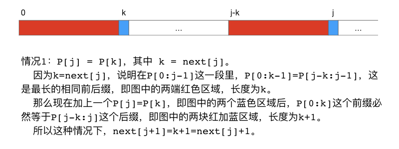
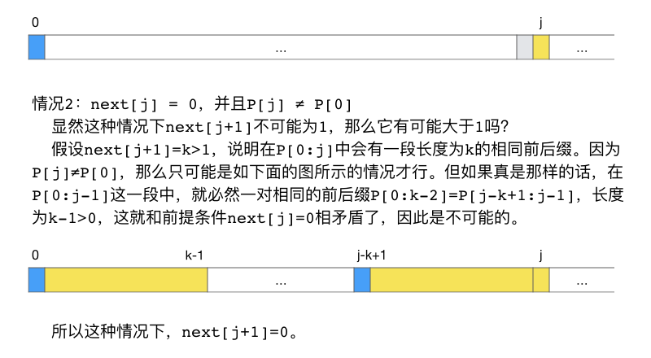
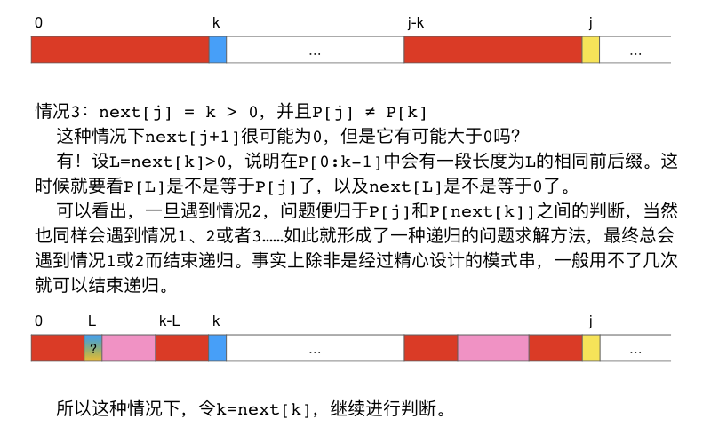

子串搜索及KMP算法
++++++++++++++++++++++++++++

:strong:`子串搜索`\ ，也叫\ :strong:`子串匹配`\ ，是字符串处理领域非常重要和常用的一种操作。一般的子串搜索操作是指，给定两个字符串S和P，检查P是不是S的一个子串，如果是则返回P第一次在S中出现的位置，即首字符P[0]在S中的对应元素位置；如果不是一般就返回-1。

例如：字符串 ``abc`` 就是 ``1234abcd`` 的一个子串，它第一次出现的位置是4，但它不是字符串 ``1234ABCD`` 的子串，因为ASCII字符是区分大小写的。

通常我们把字符串S称为\ :strong:`文本串`\ ，把P称为\ :strong:`模式串`\ 。最基本的子串搜索，模式串就是要搜索的子串，所做的是一字不差的精确匹配。高级的子串搜索，模式串中可能含有通配符，比如用 ``*`` 表示0个或任意多个任意字符，用 ``?`` 表示0个或1个任意字符。最灵活也最难实现的是\ :strong:`正则表达式`\ 匹配，此时模式串是一个正则表达式，它有自己的词法规则，可以非常灵活地表示各种各样的字符串样式，例如正则式 ``^-?[1-9]\d*$`` 表示任意的整数样式的字符串，而 ``^-?([1-9]\d*\.\d*|0\.\d*[1-9]\d*|0?\.0+|0)$`` 能匹配小数样式的表达式。后两种高级的搜索也是我们常会把子串搜索称作子串匹配的原因，因为它们的功能已经超越了简单的搜索。

这一节我们讨论最基本的子串搜索算法，在文本串中一字不差地精确搜索模式串。

朴素的蛮力搜索算法
^^^^^^^^^^^^^^^^^^^^^^^^^^^^

蛮力算法就是从文本串的头一个字符开始，作为起始位置与模式串进行比对，如果发现一致的子串，就返回起始位置，如果不一致就将起始位置移到文本串的下一个字符继续比对，直到找到子串或者找不到。

按照C++的习惯，字符串的字符从0开始编号，蛮力搜索的第一个起始位置是文本串的0号字符 :math:`S_0`。假设文本串长度为 :math:`n`，模式串长度为 :math:`M`，那么蛮力搜索的最后一个起始位置就应该是 :math:`n-M`，因为从这个位置到文本串的末尾还剩刚好 :math:`(n-1)-(n-M)+1=M` 个字符，再往后移剩余字符数量就不如模式串多了，不可能再存在和模式串相同的子串。

利用cstring库的 ``strncmp()`` 函数可以很简单地编写出这样一个函数：

.. code-block:: c++

   #include <cstdio>
   #include <cstring>
   
   int substr_search_bf(const char *s, const char *p);
   
   int main()
   {
           char s[81], p[11];
           scanf("%80s %10s", s, p);
           printf("%d\n", substr_search_bf(s, p));
   
           return 0;
   }
   
   int substr_search_bf(const char *s, const char *p)
   {
           int pos, n_s = strlen(s), n_p = strlen(p);
           for (pos = 0; pos <= n_s - n_p; ++pos)
                   if (strncmp(s+pos, p, n_p) == 0) break;
           return pos > n_s - n_p ? -1 : pos;
   }

这个蛮力算法非常简单易懂，但是它的时间复杂度是比较大的，是 :math:`O(nM)` 量级的，属于二阶的时间复杂度。

精确子串搜索有一个非常经典的算法，由算法界的三位大神D.E.Knuth、J.H.Morris和V.R.Pratt同时发明的。这个算法是每一本算法教科书都必讲、每一个学习算法的人都必学必会的超经典算法，就以三位发明者的姓氏首字母命名为KMP算法。它是迄今为止精确子串搜索第二快的算法，也是算法史上最伟大的发明之一，它的时间复杂度是 :math:`O(n+M)`。下面我们要来讲解一下这个KMP算法。

.. index:: KMP算法

KMP算法
^^^^^^^^^^^^^^^^^^^^^^^^^^^^

KMP算法是对蛮力算法的改进，所以要理解KMP算法必须先了解蛮力算法不好的地方在哪里。

假设文本串 :math:`S` 为 ``ABCAABCB``，模式串 :math:`P` 为 ``ABCB``。下面我们先看看蛮力搜索的过程：

.. code-block:: none

   第1步：比对位置 pos = 0
   S: ABCAABCB
   P: ABCB
   第1步比对结果：失败，pos后移一位。

   第2步：比对位置 pos = 1
   S: ABCAABCB
   P:  ABCB
   第2步比对结果：失败，pos后移一位。

   第3步：比对位置 pos = 2
   S: ABCAABCB
   P:   ABCB
   第3步比对结果：失败，pos后移一位。

   第4步：比对位置 pos = 3
   S: ABCAABCB
   P:    ABCB
   第4步比对结果：失败，pos后移一位。

   第5步：比对位置 pos = 4
   S: ABCAABCB
   P:     ABCB
   第5步比对结果：成功，返回子串首位置4。

从这个过程可以看出，其实第1步比对失败后，比对位置 ``pos`` 并不需要傻傻地一个一个往后挪，至少可以直接跳到第4步那个位置 ``pos = 3``，因为第1次发生比对不符合的字符就是 ``S[3] = 'A'``。

而KMP算法的改进思路就是：:emphasis:`当一次比对失败时，利用已经匹配的那部分信息，将模式串尽可能多地移动到一个合适的位置，使得下一次比对可以从上一次匹配失败的那个位置开始继续进行`。

例如在上面这个例子里，第1步比对中匹配正确的字符有 ``S[0],S[1],S[2]``，直到 ``S[3]`` 发生错误。使用蛮力法，第2步又回过头去从 ``S[1]`` 开始比对，这就是蛮力算法时间复杂度为 :math:`O(nM)` 的原因。如果我们能让模式串在第1步比对失败后移动到一个合适的位置，使得第2步可以从 ``S[3]`` 直接继续，那么我们在比对完整个文本串之后，最多进行了 :math:`n` 次比对，时间复杂度为 :math:`O(n)`。这就是KMP算法的基本思路。

有了思路，我们还要解决一个具体问题：所谓“合适的位置”到底在哪里？是不是简单地把模式串移动到对准上一次匹配失败的字符位置开始就可以了？当然不是，例如看下面这个例子：

文本串 :math:`S`：``ABCABCABE``，模式串 :math:`P`：``ABCABE``，用索引 ``i,j`` 分别表示在文本串和模式串上的比对位置。

.. code-block:: none

   第1次比对，从 i = j = 0 开始
      i: 0  1  2  3  4 [5] 6  7  8
      S: A  B  C  A  B  C  A  B  E
      P: A  B  C  A  B  E
      j: 0  1  2  3  4 [5]
   比对结果：在 i = 5 处匹配失败。

这时候，如果简单地把模式串移动到和 ``S[5]`` 对齐的位置，会发现文本串中剩余字符数量不够了，就会得出搜索失败的结论。然而这是错误的！

仔细观察模式串，可以发现上一次匹配成功的前5个字符 ``ABCAB`` 有相同的前缀和后缀 ``AB``。所以我们应该把开头的那一段前缀 ``AB`` 移动到后面这一段后缀 ``AB`` 所在的位置，然后就可以从上一次匹配失败的位置 ``S[5]`` 开始继续比对了：

.. code-block:: none

   第2次比对，P移动到和 S[3] 对齐的位置，
   仍从上一次不匹配字符的位置 i = 5 处开始比对，对应的模式串位置为 j = 2
      i: 0  1  2  3  4 [5] 6  7  8
      S: A  B  C  A  B  C  A  B  E
      P:          A  B  C  A  B  E
      j:          0  1 [2] 3  4  5
   比对结果：匹配成功，返回子串首位置3。

现在我们可以找到一点头绪了。当某一次比对在某个字符处发生了不匹配，那么模式串要移动到的“合适位置”与已经匹配成功的那一部分里面有没有相同的前后缀有关。

设上一次比对时，第一对不匹配字符为 :math:`S_i \neq P_j`，即文本串位置 :math:`i`、模式串位置 :math:`j`，假设在已经匹配成功的部分模式串里面最长的相同前后缀长度为 :math:`next`，那么就应该把模式串首字符相对于文本串的位置移动到 :math:`i-next`，因为从这个位置到发生不匹配的字符位置 :math:`i` 之间恰有 :math:`next` 个字符，模式串移过来之后刚好长度为 :math:`next` 的前缀部分位于这一段区域里，最长的相同前后缀恰好充分利用起来。这时候我们可以从字符 :math:`S_i` 继续开始比对，与之比对的模式串字符为 :math:`P_{next}`，这可以通过赋值 :math:`j\leftarrow next` 来完成。

.. hint::

   这里我们要明白一件事情，所谓将模式串移动到 :math:`i-next` 对应的位置，和将文本串位置 :math:`i` 对准模式串位置 :math:`next`，其实是完全一样的，我们通过上面这个赋值 :math:`j\leftarrow next` 实际上就是完成了所谓的“移动模式串到合适的位置”。

   这个赋值的意义用通俗的语言表示就是：这一次文本串位置 :math:`i` 上的字符和模式串位置 :math:`j` 上的字符匹配失败了，:strong:`下一次`\ 请将其和模式串位置 :math:`next` 上的字符进行匹配。这就是为什么KMP算法奇怪地把“最长相同前后缀长度”叫做next数组的原因。

按照这个规则，如果在上一次比对已经匹配成功的部分里没有相同前后缀，即相同前后缀的最大长度为0，比如在 ``"ABCDEFG"`` 中搜索 ``"ABCA"``：

.. code-block:: none

   第1次比对，从 i = j = 0 开始，到 i = 3 时匹配失败
      i: 0  1  2 [3] 4  5  6
      S: A  B  C  D  E  F  G
      P: A  B  C  A
      j: 0  1  2 [3]
   已经匹配的部分 "ABC" 中没有相同的前后缀，l = 0，所以 j = l = 0，相当于将模式串直接移动到 i 的位置

   第2次比对，i = 3， j = 0
      i: 0  1  2 [3] 4  5  6
      S: A  B  C  D  E  F  G
      P:          A  B  C  A
      j:         [0] 1  2  3
   第一个字符就匹配失败，已经匹配部分为空，整个模式串应该向后移动一个字符继续比对，但超长了，搜索失败

所以我们看到还有这样一种情况，比对时匹配部分长度为0，即第一个字符就不匹配，这时候就只能后移一个字符，:math:`i\leftarrow i+1,j\leftarrow 0`，然后继续开始比对。

下面我们来理一理思路，把算法的框架搭出来。设模式串中每一个字符 :math:`P_j` 之前的部分 :math:`P_0\cdots P_{j-1}` 中最长的相同前后缀长度为 :math:`next[j]`。对于模式串的第2个字符 :math:`P_1`，它前面的部分只有一个首字符，不存在前后缀，所以 :math:`next[1] = 0` 是固定的。对于模式串的首字符 :math:`P_0`，我们规定 :math:`next[0]=-1`，这是为了方便在算法中实现“如果第一个字符就不匹配”情况发生时的处理。下面是KMP算法的伪代码：

.. admonition:: KMP算法

   :math:`\text{KMP_Search}(S,P):`

      :math:`i\leftarrow0,j\leftarrow0`

      :math:`\text{WHILE  }j\lt \text{Len}(P) \text{  AND  } \text{Len}(S)-i \ge \text{Len}(P)-j \text{  DO}`

         :math:`\text{IF  }j=-1\text{  OR  }S_i=P_j`

            :math:`\text{THEN  }i\leftarrow i+1,j\leftarrow j+1`

            :math:`\text{ELSE  }j\leftarrow next[j]`

      :math:`\text{IF  }j=\text{Len}(P)`

         :math:`\text{THEN RETURN  }i-j`

         :math:`\text{ELSE RETURN  }-1`

.. note::

   一般许多教科书和网上关于KMP算法的讲解常会把循环条件简单得设置为 :math:`j\lt \text{Len}(P) \text{  AND  } i \lt \text{Len}(S)`，即文本串和模式串的指针都没有移动到字符串的后面。这当然是对的，这种简单的处理虽然比较易懂，但是如果当模式串事实上已经移出了文本串的范围时，或者模式串比文本串还要长时，循环仍然会继续比对下去，这其实是浪费的。所以我把它改成了我们算法里的样子。如果模式串长于文本串，循环根本不会被执行，然后因为 :math:`j=0`，所以直接返回-1，表示搜索失败；如果搜索过程中，一旦模式串已经移出了文本串的范围，那么循环也直接结束了，此时一定 :math:`j\neq\text{Len}(P)`，所以也返回-1表示搜索失败。

**next数组**

好了，现在看起来万事俱备只欠东风了。东风就是这个next数组，要怎样才能得到这个next数组呢？当然我们可以蛮力去计算每一个从首字母开始的子串的最长相同前后缀长度，时间复杂度 :math:`O(m^2)`。但是我们有更好的方法，时间复杂度 :math:`O(m)`。

再重复一遍（因为这很重要），next数组和模式串长度相等，第 :math:`j` 个元素 :math:`next[j]` 表示前 :math:`j` 个字符构成的子串 :math:`P_0\cdots P_{j-1}` 的最长相同前后缀长度。我们已经知道，对于任何一个模式串，:math:`next[0]=-1,next[1]=0`。对数学方法或者算法设计方法比较熟悉的人一看到这种“有初值”的数值序列形式，一定会想到“递推”这种重要的数学方法。而快速计算next数组就是要用递推的方法。

我们要解决的问题是，如果已经知道了从 :math:`next[0]` 到 :math:`next[j]` 的所有值，怎么求出 :math:`next[j+1]` 的值？

假设 :math:`next[j]=k`，说明在模式串的子串 :math:`P_0\cdots P_{j-1}` 中，长度为 :math:`k` 的前缀和后缀相同，而且这是最长的情况，即 :math:`P_0\cdots P_{k-1}=P_{j-k}\cdots P_{j-1}`。现在考虑新的子串 :math:`P_0\cdots P_{j-1} P_j`，它这是在原来那个子串的尾部添加了一个字符 :math:`P_j`，可想而知它的最长相同前后缀长度最多比原来大1，即最多为 :math:`next[j]+1`。最小的情况当然是为0，即没有相同的前后缀。当然也有可能出现介于二者之间的情况。总之，:math:`0 \le next[j+1] \le next[j] + 1`。下面我们就来讨论这些情况的产生条件以及怎样快速而正确地求 :math:`next[j+1]`。

.. hint::

   在以后的讨论中，我们用 :math:`a[m:n]` 这样的形式表示数组或字符串中 :math:`a` 中从 :math:`a[m]` 到 :math:`a[n]` 的一段。

可以分三种情况来讨论：

情况1：:math:`P_k=P_j`，这时候 :math:`next[j+1]=next[j]+1=k+1`，这是一种皆大欢喜的情况。为什么会这样？请看下面的图解：

可以看出这种情况即使在 :math:`k=next[j]=0` 时仍然是正确的。

情况2：:math:`P_k\neq P_j`，而且 :math:`k=next[j]=0`，这时候 :math:`next[j+1]=0`，请看下面的图解：

情况3：:math:`P_k\neq P_j`，而且 :math:`k=next[j]>0`，这时候需要让 :math:`k=next[k]` 然后用这个新的 :math:`k` 值去递归地去计算 :math:`next[j+1]`。这是比较难理解的部分，请仔细看下面的图解：

理解了上面三种情况之后，已经可以根据它们来归纳出一个递归算法，根据从 :math:`next[0]` 到 :math:`next[j]` 的值计算出 :math:`next[j+1]`。其中情况3为递归步骤，情况1和情况2是递归终止条件。然后我们从已知的两个初值 :math:`next[0]=-1,next[1]=0` 开始就可以循环地计算出之后的所有next数组的值了。

但是实际上程序并不会这样来写，算法还可以改进一下。如果直接依据三种情况来写这个递归程序，代码会比较复杂，而我们知道越是复杂的代码越容易有bug。复杂在什么地方呢？复杂在这个递归算法有两个不同的终止条件，而且二者的终止方式不相同。而一个理想的递归算法应该有尽量少的终止条件，或者至少所有终止条件的处理方式都一样。

在这里，我们可以利用 :math:`next[0]=-1` 来改进算法的代码。我们可以在遇到情况2的时候不要直接去终止递归，而是让它也继续递归下去。由于情况2时 :math:`k=0`，所以再递归一次会使 :math:`k=next[0]=-1`，而我们要的结果是让 :math:`next[j+1]=0=-1+1`。这样，我们把情况2转而变成另一个终止条件：:math:`k=-1` 时令 :math:`next[j+1]=k+1`，这就和情况1时的操作一模一样了。于是可以归纳出下面这种朴素的next算法数组：

.. admonition:: 朴素next算法

   :math:`\text{Naive_Next}(next, P):`

      :math:`next[0]\leftarrow-1`

      :math:`k\leftarrow-1`

      :math:`j\leftarrow0`

      :math:`\text{WHILE  }j\lt \text{Len}(P) \text{  DO}`

         :math:`\text{IF  }k=-1\text{  OR  }P_j=P_k`

            :math:`\text{THEN  }k\leftarrow k+1`

               :math:`j\leftarrow j+1`

               :math:`next[j]\leftarrow k`

            :math:`\text{ELSE  } k\leftarrow next[k]`

.. admonition:: 练习

   请自己用纸笔按照上面这个算法计算一下模式串 ``"ABAAXABABY"`` 对应的next数组。

   正确的答案应该是：``| -1 | 0 | 0 | 1 | 1 | 0 | 1 | 2 | 3 | 2 |``。

但是这样就结束了吗？上面这个算法既然被叫做“朴素”的算法，说明肯定还有点什么可以进一步改进的地方。请看这样一个模式串：``"ABAB"``，经过计算，它的next数组的值依次为 ``[-1,0,0,1]``。下面我们来看它在文本串 ``"ABACABAD"`` 中的搜索过程：

.. code-block:: none

   第1次比对，从 i = j = 0 开始，到 i = 3 时匹配失败
      i: 0  1  2 [3] 4  5  6  7
      S: A  B  A  C  A  B  A  D
      P: A  B  A  B
      j: 0  1  2 [3]
   next:-1  0  0 [1]
   在S[3]='C', P[3]='B'处匹配失败，根据next[3]=1的指示，下一次应该从P[1]开始继续匹配

   第2次比对，i = 3， j = 1
      i: 0  1  2 [3] 4  5  6  7
      S: A  B  A  C  A  B  A  D
      P:       A  B  A  B
      j:       0 [1] 2  3
   next:      -1 [0] 0  1
   S[3]='C'和P[1]='B'的匹配再次失败

到这里我们就看出了问题，当第一次匹配失败时，按照 ``next[3]`` 的指示，改为从 ``P[next[3]]==P[1]`` 继续匹配，但 ``P[1]`` 是等于 ``P[3]`` 的，都是字符 ``'B'``，所以下一次匹配必会继续失败。换句话说，这次移动实质上是无效的！这个问题会在一定程度上影响搜索效率，应该设法改进，也就是不能出现 ``P[j]==P[next[j]]`` 的现象。

从next数组本身的意义来看，这个问题很好理解。next数组实质上是一个移动模式串的“导航表”，每一个元素 ``next[j]`` 都是一条导航指令，表示如果与模式串中的字符 ``P[j]`` 匹配失败，那么下一步请将 ``P[next[j]]`` 移动过来尝试匹配。这个过程是一路连续下去的，如果下一步和 ``P[next[j]]`` 匹配仍然失败，那么再下一步请尝试和 ``P[next[next[j]]]`` 进行匹配，如此一直进行下去。

所以，如果我们实现就能确定一定以及肯定地知道，``P[next[j]]==P[j]``，那么这个 ``next[j]`` 就会把比对过程导航到一个坑里去。下一步必定仍然失败，然后必定会进一步被导航去 ``P[next[next[j]]``。既然如此，我们为什么还要跳这个坑呢？我们何不在计算next数组的时候就查出这些坑来并且直接跨过去？

对！我们只要在每次计算 ``next[j]`` 之后判断一下它会不会导致 ``P[next[j]]==P[j]``，如果是的话，就直接将 ``next[j]`` 设置成 ``next[next[j]]``，这样就可以在设计“导航表”的时候直接把这些坑都越过了。

用这种方法再计算一下 ``"ABAB"`` 的next数组，``next[0]`` 和 ``next[1]`` 的值不会变，仍然为-1和0。当计算得到 ``next[2]`` 等于0的时候，我们发现 ``P[2]==P[0]=='A'``，所以应该把 ``next[2]`` 设置成 ``next[0]``，即-1。然后计算 ``next[3]``，按照计算规则，由于上一个 ``next[2]`` 等于-1，所以 ``next[3]`` 应该直接设置为 ``next[2]+1``，即0。这样得到的next数组为 ``[-1, 0, -1, 0]``。然后再来看看它在 ``"ABACABAD"`` 中的搜索过程：

.. code-block:: none

   第1次比对，从 i = j = 0 开始，到 i = 3 时匹配失败
      i: 0  1  2 [3] 4  5  6  7
      S: A  B  A  C  A  B  A  D
      P: A  B  A  B
      j: 0  1  2 [3]
   next:-1  0 -1 [0]
   在S[3]='C', P[3]='B'处匹配失败，根据next[3]=0的指示，下一次应该从P[0]开始继续匹配

   第2次比对，i = 3， j = 0
      i: 0  1  2 [3] 4  5  6  7
      S: A  B  A  C  A  B  A  D
      P:          A  B  A  B
      j:         [0] 1  2  3
   next:        [-1] 0 -1  0
   S[3]='C'和P[0]='A'的匹配再次失败

   后续步骤省略...

可以看到，现在不会再跳那个坑了！下面是一个使用KMP算法进行子串搜索的示例程序，采用的是改进过的next数组算法。这个示例程序假定文本串和模式串的最大长度分别为1000和100个字符，允许包含空格。程序分两行按行输入文本串和模式串，然后输出搜索结果，即第2行的模式串在第1行的文本串中首次出现的首字符位置，如果搜索不到则输出-1。

.. literalinclude:: ../../codes/234_kmp.cpp
   :language: c++

.. admonition:: 思考

   有一个问题不知道大家有没有想到，我们在改进的next算法中只检查了下一步会不会是坑，即是不是 ``P[j]==P[next[j]]``，并没有进一步去判断越过第一个坑后会不会掉进第二个坑。也就是说，我们只让 ``next[j] = next[next[j]]``，但会不会 ``P[next[next[j]]]`` 也是等于 ``P[j]`` 的呢？

   当然是有可能的，比如 ``"ABABAB"`` 或者类似这种样子的模式串都会有“连续坑”。用朴素的next算法，会得到next数组 ``[-1, 0, 0, 1, 2, 3]``。如果在 ``P[5]`` 处匹配失败，下一步会跳到 ``P[next[5]]`` 即 ``P[3]``，这个字符还是 ``'B'`` 所以匹配肯定失败。再下一步会找到 ``P[next[3]]`` 即 ``P[1]``，仍然是坑 ``'B'``！

   所以我们上面的算法对吗？我们不是只判断了一步吗？难道不是应该递归地判断下去直到没有坑为止吗？然而算法是对的，大家可以试试在 ``compute_next_array()`` 函数里增加输出语句来观察next数组的计算结果，比如模式串 ``"ABABAB"`` 会得到正确的 ``[-1, 0, -1, 0, -1, 0]``，连续坑被全部填平！

   这是为什么？请务必思考一下这个问题！

.. attention::

   这个KMP算法应该是到目前为止我们接触到的最为玄学的一个经典算法了，不光算法思路理解有点麻烦，而且代码也有点难读。但是千万记住，KMP是字符串处理的必学算法，哪怕你记不住算法，哪怕你离开课本就写不出这个算法的正确代码，但是必须读懂它，必须用纸笔模拟运行它，必须看懂每一行代码的用意！这个算法非常重要，彻底搞懂KMP算法，然后尝试着不看教材自己正确地写一遍，然后大多数的字符串处理问题对你来说都不是问题了。

小结
^^^^^^^^

KMP算法的时间复杂度是 :math:`O(n+M)`。其中 :math:`n` 是文本串的长度，算法的子串搜索部分由于实现了文本串字符位置不走回头路，所以搜索需要花费的时间为 :math:`O(n)`。:math:`M` 是模式串的长度，搜索之前要耗费 :math:`O(M)` 的时间来计算出整个next数组，这部分的时间复杂度分析相当复杂，就不详细讲解了。总之记住KMP算法的总时间复杂度为 :math:`O(n+M)`。这比起蛮力搜索的 :math:`O(nM)` 是数量级的改进。

KMP算法虽然是子串搜索的经典算法，但它现在已经不是最快最好的了。比如1977年发明的Boyer-Moore算法，简称BM算法，从模式串的尾部开始向前匹配，最坏情况下达到 :math:`O(n)` 的时间复杂度。在实践中，它比KMP算法的效能略高。而1990年发明的Sunday算法，和BM算法一样从后向前进行匹配，它的实现比KMP算法和BM算法都简单，而且在实践中比BM算法的速度更快。目前绝大多数编程语言的子串搜索都采用了Sunday算法，包括C++ string的 ``substr()`` 成员函数。

如果对Sunday算法感兴趣，大家可以去网上找相关资料进行学习，但是学习Sunday算法之前最好能够把BM算法也一起学了，因为Sunday算法是在BM算法的基础上改进而来的，二者有前后的渊源。

在实际的算法问题编程时，如果需要进行子串搜索，我们完全不推荐手写KMP算法来自己实现，就算你会Sunday算法，我们也完全不推荐自己手写Sunday算法来实现。这种情况下应该遵循“不重复造轮子”的原则，使用语言提供的库函数来进行子串搜索。如果使用C-string来处理字符串，那么请使用cstring库的 ``strstr()`` 函数（另有一个在搜索时忽略大小写的 ``strcasestr()`` 函数和一个限定最大匹配长度的 ``strnstr()`` 函数，偶尔可能用得着，大家可以自行上网查询它们的用法）。比较复杂一些的字符串处理问题，更建议使用C++ string，它有两个很好用速度也很快的成员函数 ``string::find()`` 和 ``string::rfind()``，前者从前向后找模式串第一次出现的位置，后者从后向前找模式串最后一次出现的位置。

建议在实际编程时使用现成“轮子”还有一个原因是，这些现成的轮子都是经过优化的，一般自己手写的模板算法在运行效率上是比不过它们的。比如最简单的 ``strstr()`` 函数往往在实践中会比自己手写的KMP算法速度更快，C++ string的两个成员函数现在则多是用优化过的Sunday算法实现的，自己手写的模板Sunday算法是不如它们速度快的。

这种不要重复造轮子的原则在今后我们还会遇到，比如在学习排序算法之后，我们会建议大家在实际编程时使用C++ algorithm库提供的 ``sort()`` 和 ``stable_sort()`` 两个函数进行排序，而不要自己手写排序函数。``sort()`` 函数比手写的标准快速排序要快很多，``stable_sort()`` 则比标准的二分归并排序快不少。

.. attention::

   学些KMP这些经典算法，并不是要大家在实际解决问题的时候自己手写这些经典算法来实现所需功能。学习经典算法的目的是学习这些算法的设计思路和思考问题的一般方法，这些经典算法中凝聚的是算法设计最伟大的智慧和最精妙的思想，学好它们能够大大提升解决算法问题的能力。另外，还要学习从算法到代码的能力和技巧，有了思路还要有能力把思路变成实际的C++代码。这就是为什么我们在前面说过，必须做好理解算法、读懂代码、纸笔模拟，并且手写实现的学习步骤，一步都不能少，甚至可以在此基础上尝试做一做改进优化代码的练习。

