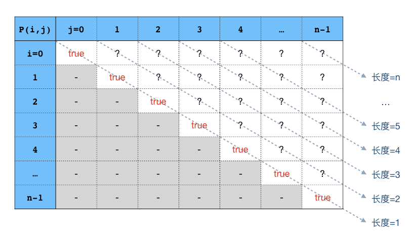

回文字符串
++++++++++++++++++

我们在前面简单数值算法时曾将讲过回文的概念，当时我们主要着眼于回文整数的相关问题，现在我们要重点讲一讲回文字符串的问题。

我们已经知道了回文的概念，所以回文字符串当然就是从左到右念和从右到左念完全一样的字符串，比如 ``"level"``。在这一节，我们先解决最基本的问题，怎样判断一个字符串是否为回文串。然后我们要解决一个经典的回文串问题：最大回文子串。

解决最大回文子串问题的方法有很多，我们先通过蛮力法来了解一些基本知识，然后学习一种比较容易理解和编程的方法：中心扩展法，它的时间复杂度是 :math:`O(n^2)`。由于中心扩展法编程比较简单，不使用什么复杂的数据结构，消耗空间仅为常数级的 :math:`O(1)`，时间上也能满足绝大多数普及、提高组级别的题目，所以是非常好用的一种算法，需要认真学习掌握。

最大回文子串问题的另一个 :math:`O(n^2)` 时间算法是一种动态规划法，但根据在LeetCode网站实测的结果，它的实际运行时间是中心扩展法的20多倍，而且空间复杂度同样高达 :math:`O(n^2)`，因此我们只打算对它进行一个简单的原理介绍。希望能够让大家对五大经典算法设计方法中最灵活最难掌握的动态规划法有一个初步的认识，当然有兴趣的话也可以自己动手试一试。

而最经典的最大回文子串问题解法是一个叫做Manacher算法的方法，通常习惯用谐音称呼它为\ :strong:`马拉车算法`。这个算法非常高明，非常精妙，时间复杂度低至 :math:`O(n)`，但是这个算法非常复杂，非常难掌握。初期不太指望能在考场上快速地写出一个正确的马拉车算法程序来，所以我们将在后面的章节再详细介绍马拉车算法，现阶段能熟练掌握中心扩展算法即可。

回文串的判断
^^^^^^^^^^^^^^^^^^^^

我们在前面3.1.3节回文数专题中曾经学过判断回文整数的方法，通过把整数前后反转然后判断是否和原数相等即可判断原数是否为回文数。现在我们要判断一个字符串是不是回文串，当然我们可以延续这一思路，先用原字符串所有字符前后反转的顺序生成一个新的字符串，然后比较新字符串和原字符串是否相等来进行判断。但是这种方法不够好，既浪费时间又浪费空间。

要知道字符串这种东西和整数有一个很大的区别，字符串可以用位置索引来直接获取其中每一个位置上的字符，而整数每一位上的数码却没有那么容易地想取就取到的。所以我们可以利用字符串这一特性，用两个不同的位置指针分别指向首字符和尾字符。这样就可以直接比较首字符和尾字符是否相同，如果相同那么让首位置后移一个字符，尾位置前移一个字符继续比较，直到两个位置交错而过（此时字符串为回文串）或者在二者交错之前就发现有字符不同（不是回文串）。这个简单的模拟过程应该很好理解吧，下面直接出代码：

.. literalinclude:: ../../codes/235_ispalin.cpp
   :language: c++

这个简单的程序里面提供了两个版本的判断函数，``is_palin()`` 函数使用了数组加下标的形式来访问C-string中指定位置的字符，而指针版的 ``is_palin_p()`` 函数则采用两个字符型指针来一前一后地迭代访问字符。

.. admonition:: 补充

   数组版和指针版，二者的运行效果是完全一样的，但是有些人会说，指针迭代版本的速度更快一些。这是有道理的。如果用数组加下标的方式来访问某个字符，例如 ``s[i]``，那么程序要计算指针加法 ``s + i``，然后能找到这个字符所在的内存地址从而取得这个字符；如果使用指针，那么指针本身就是地址，直接就可以访问这个字符。所以数组版在取字符的时候会比指针版多计算一次指针加法，这就是指针迭代版本速度更快一些的原因。

   但是在实际应用中，大家完全不用担心这一点点的速度差距。在现代计算机芯片的强大运算能力和现代C++编译器的强大优化能力下，这点速度差异微不足道，尤其是在使用C-string这种本身就以速度见长的表示方式时，二者几乎没有任何差别。除非字符串的长度非常非常的巨大，数十甚至数百万位。

   对于速度相对较慢的C++ string，差异就会略大一些。为此C++提供了一种叫做string迭代器 ``string::iterator`` 的东西来代替原先的指针用以快速访问字符串中的字符，这东西其实就是包装过的指针，我们在下一节会进行介绍。即使这家伙光类型名就这么长，用起来也挺麻烦，但在对运行速度要求极严格的场合还是很有必要的。不过我们要知道，即使是C++ string，也要在字符串长度达到万这个级别的时候二者之间才会有可感知的速度差异。

最长回文子串（蛮力、动态规划和中心扩展）
^^^^^^^^^^^^^^^^^^^^^^^^^^^^^^^^^^^^^^^^^^^^^^^^^^^^

接下来我们要尝试解决“最长回文子串”这个经典的回文串问题：给出一个非空字符串 :math:`S`，找出其中最长的回文子串。如果答案有多个，那么返回从左到右顺序的第1个。

注意：这个问题必然有解，因为单字符的字符串都是回文串，所以对于任何非空字符串，至少有长度为1的回文子串。

一、蛮力法

蛮力法，就是暴力枚举 :math:`S` 的每一个子串，判断其是否为回文串。枚举时按照子串长度从大到小的顺序，这样第一个找到的回文子串就是长度最大的了。

暴力枚举需要用到两层嵌套循环。设 :math:`S` 的长度为 :math:`n`，外层循环是子串长度 :math:`L`，从 :math:`n` 到 :math:`1` 的逆向循环。内层循环是从左到右所有具有长度 :math:`L` 的子串，即从 :math:`S[0:L-1]` 到 :math:`S[n-L:n-1]`。在内层循环里逐个对这些子串进行回文串判断，只要找到一个就是答案，就直接退出所有循环。显然这是一个 :math:`O(n^3)` 的算法。

在实际编程时，我们当然不会傻到真的每次复制出子串来进行回文串判断。为了尽量提高运行效率，我们一般都会修改一下上面讲过的那种回文串判断函数，让函数接受一左一右两个指针，然后对这两个指针所指定的范围进行判断。这样在程序里我们就不需要进行来来回回地子串复制，只要操作一对位于原字符串 :math:`S` 上的指针就可以实现判断了。下面是这个蛮力法的程序：

.. literalinclude:: ../../codes/235_mps_bf.cpp
   :language: c++

为了观察算法的运行速度，我在程序里加入了测运行时长的功能，并随机生成了五个测试点数据，分别是长度为10、100、1000、10000、100000的五个字符串。运行结果如下：

.. code-block:: none

   $ ./mps_bf < mps_1.in
   A
   time elapsed = 0 ms.

   $ ./mps_bf < mps_2.in
   LJL
   time elapsed = 0 ms.

   $ ./mps_bf < mps_3.in
   MOM
   time elapsed = 2 ms.

   $ ./mps_bf < mps_4.in
   MLVLM
   time elapsed = 228 ms.

   $ ./mps_bf < mps_5.in
   LMLXLML
   time elapsed = 22888 ms.

可以看出，当字符串长度为10000个字符时，速度已经相当慢了。最后一个测试点字符串长达10万个字符时，运行时间超过了22秒。这样的算法如果用于实际解题肯定是要吃到TLE的。

.. hint::

   蛮力的算法本身虽然不值一提，但是在程序编制时却是用了许多C-string处理的常用技巧。比如指针代替位置、双指针指定子串、循环时用字符是否为 ``'\0'`` 作为循环条件等，都是早期纯C语言阶段就积累起来的C-string处理最为常用也是最为重要的技巧。

   在算法竞赛中，由于C++ string的速度确实比较慢，所以现在还是有许多人宁愿使用功能较弱、风险和难度都较大的传统C-string来进行字符串处理。所以如果你也希望能熟练掌控C-string，那么get这些技能是必不可少的。

   务必请认真地读懂这个程序，遇到不太懂的，可以自己尝试着改一改没有看懂的地方，运行一下看看会发生什么变化。这是一种读懂别人程序的重要方法。

二、动态规划法

下面简单介绍一下动态规划的解法，这个解法的时间复杂度和空间复杂度都是 :math:`O(n^2)`，而且是比较慢的二阶算法，如果用来解实际的算法题，很可能还是会超时。所以我们对这个算法不做编程的要求，只需理解它的思路。

所谓动态规划，简单的来说就是通过列表格的方法，从简单的立即可知的情况开始，由简到难地逐步递推出所有情况下的解。这么说可能还比较模糊，不容易懂，没关系，我们现在先看最长回文子串问题怎么用动态规划的方法来求解，以后我们还会有专门的章节来详细介绍动态规划法。

对于任意一个长度为 :math:`n\gt0` 的字符串 :math:`S`，首先我们定义一个bool型函数 :math:`P(i,j)`：

.. math::

   P(i,j)=\begin{cases}\text{true}&\text{如果 }S[i:j]\text{ 是回文子串}\\ \text{false}&\text{如果 }S[i:j]\text{ 不是回文子串}\end{cases},(0 \le i \le j \le n-1)

如果我们能够对所有的 :math:`0 \le i \le j \le n-1` 计算出 :math:`P(i,j)` 的值，那么当然就能求出最长回文子串了。但是，显然暴力枚举来计算所有 :math:`P(i,j)` 的值是不行的，因为这正是蛮力法所做的事情。

我们现在要用列表和递推的方法来求解这个函数。我们这样考虑，假如我们已经知道了某一个子串 :math:`S[i,j]` 是不是回文串，那么对于“包围”它的那个子串 :math:`S[i-1,j+1]` 是不是也很容易判断了呢？当然很容易！如果 :math:`S[i,j]` 不是回文子串，那么 :math:`S[i-1,j+1]` 肯定也不会是回文子串的；如果 :math:`S[i,j]` 是回文子串，那么 :math:`S[i-1,j+1]` 是不是回文子串取决于两头的字符 :math:`S[i-1]` 和 :math:`S[j+1]` 是不是相同，如果相同那么 :math:`S[i-1,j+1]` 是回文子串，如果不同那么就不是。也就是说我们可以根据 :math:`P(i,j)` 的值轻松地推出 :math:`P(i-1,j+1)` 的值：

.. math::

   P(i-1, j+1) = (P(i, j) = \text{true}) \land (S[i-1] = S[j+1])

换个方向说，如果我们想计算某一个函数值 :math:`P(i,j)`，我们可以通过 :math:`P(i+1,j-1)` 的值来推导：

.. math::

   P(i, j) = (P(i+1, j-1)=\text{true}) \land (S[i] = S[j])

注意这里要满足 :math:`j-1\ge i+1`，即 :math:`j-i\ge2`，子串长度需要大于2。也就是说，像 :math:`P(i,i)` 和 :math:`P(i,i+1)` 这样的函数值不能用这个递推公式计算，它们需要作为函数的初始值实现计算好。幸亏长度为1和2的子串是否回文串是很容易判断的。我们已经知道，所有长度为1的单字符子串都是回文的，而长度为2的子串可以通过一次循环很轻松的判断完成。

所以我们就可以用列表的方式来求解所有的函数值：

表中对角线上的函数值都为true，对角线左下方的三角形区域是没有用的，那里 :math:`i\gt j`，我们需要求的是对角线右上方的三角区域里所有的值。还可以发现，这个表里每一条斜线上的所有函数值对应的子串长度都是相等的，对角线上都是长度为1的单字符子串，而右上角的 :math:`P(0,n-1)` 则代表原字符串 :math:`S` 自己，长度为 :math:`n`。

所以我们可以用一个二维数组 ``bool p[n][n]`` 来构成这张表。初始时把对角线上的所有元素设置为true，然后用一次循环把从 ``p[0][1]`` 到 ``p[n-2][n-1]`` 的所有函数值都计算好，接下来就可以从下到上一条斜线一条斜线地计算出所有的函数值了：

.. code-block:: c++

   p[i, j] = p[i+1, j-1] && s[i] == s[j]

计算完成之后，再从右上角开始从上到下一条斜线一条斜线的检查有没有true，找到的第一个等于true的函数值，利用它对应的行号 ``i`` 和列号 ``j`` 就可以找到那个最长回文子串了。

建议大家用几个短一点的字符串（长度10个字符以内）手动计算这张表格来完成这个算法试试。当然了，有兴趣自己编一下程序也是极好的一种编程锻炼。

.. hint::

   在正规的动态规划法术语里，这种可以由问题的简单情况解来逐步推出更复杂情况下的解的函数叫做\ :strong:`传递函数`，最简单情况下的解叫做传递函数的\ :strong:`初值`，程序里一般都用数组来完成列表计算，这样的表叫做\ :strong:`动态规划表`。

   虽然动态规划法在解决最长回文子串问题时显得相当笨拙，但是在很多其他问题的求解上展现出强大的能力，比如著名的背包问题，以后我们会详细讲解。

.. index:: 最大回文子串：中心扩展法

三、中心扩展法

:strong:`中心扩展法`\ 是我们重点要介绍，需要重点掌握的一种最长回文子串查找算法。它的时间复杂度虽然也是 :math:`O(n^2)`，但是它的运行效率非常之高，在实践中已经相当接近于 :math:`O(n)` 时间了。而且它的原理和编程都很简单，是一种非常实用的算法。

所谓中心扩展法，就是指以某处为中心，向两边\ :strong:`尽最大可能地`\ 等距离扩展来寻找回文子串。我们从回文串的特点可以看到，任何回文串都是有一个中心，两边呈中心对称的。对称中心有两种：

一种是以 :math:`S` 中的某个字符 :math:`S[i]` 为中心，形成长度为奇数的回文串。例如 ``"aba"`` 就是这样一个回文串，它以字符 ``'b'`` 为中心，长度为3。这一种回文子串的最小长度为1，也就是每一个单个字符本身，例如 ``"a"`` 就是一个回文子串。

另一种是以 :math:`S` 中的两个相邻字符 :math:`S[i]` 和 :math:`S[i+1]` 之间的空隙为中心，形成长度为偶数的回文串。例如 ``"abba"``，以中间相邻的两个 ``'b'`` 之间的空隙为中心，长度为4。这一种回文子串的最小长度为0，也就是相邻两个字符就不相同的情况。

例如字符串 ``"abbacdc"``，其中每一个字符本身就是一个长度为1的回文子串，另外在第2和第3个字符 ``'b'`` 中间的空隙处向两边扩展可以得到一个长度为4的回文子串 ``"abba"``，以倒数第二个字符 ``'d'`` 为中心向两边扩展可以得到一个长度为3的回文子串 ``"cdc"``。

对于一个任意给定的长度为 :math:`n` 的字符串 :math:`S=S[0:n-1]`，我们可以在所有可能的中心处进行上述的扩展，就可以像在一个数列中寻找最大数一样简单地找到最长回文子串了。在这样一个字符串中，一共有 :math:`2n-1` 个中心，分别是 :math:`n` 个字符本身，以及它们之间的 :math:`n-1` 个空隙。

以字符串 ``"abbacdc"`` 为例，它的长度为7，共有以下13个扩展中心：

.. code-block:: none

   0 1 2 3 4 5 6
   a b b a c d c
   ^ ^ ^ ^ ^ ^ ^   7个字符本身都是扩展中心，可以扩展长度为奇数的回文子串
    ^ ^ ^ ^ ^ ^    6个字符之间的空隙也是扩展中心，可以扩展长度为0或偶数的回文子串

整个算法可以分成两个部分，一个是算法的主流程本身，它需要调用一个中心扩展子算法。

先看中心扩展子算法。中心扩展子算法的功能是给定一个中心，然后尽最大可能地向左右两边等距离扩展，找到以此为中心的最长的回文子串。我们知道，中心有字符和字符间隙两种。对于每一个字符位置 :math:`0\le i \le n-1`，:math:`S[i]` 指定了一个字符型中心，:math:`S[i]` 和 :math:`S[i+1]` 则指定了一个字符间隙型中心。所以我们可以用两个位置变量 :math:`left` 和 :math:`right` 来作为中心扩展子算法的参数，如果用 :math:`left=right` 来调用它就表示以字符 :math:`S[left]` 为中心进行扩展，如果用 :math:`right=left+1`来调用它，就表示以 :math:`S[left]` 和 :math:`S[right]` 的间隙为中心进行扩展。

扩展的过程就比较简单了，从比较 :math:`S[left]` 是否等于 :math:`S[right]` 开始循环。每次比较二者如果相等，就让 :math:`left` 减1（向左扩展1个字符）、:math:`right` 加1（向右扩展一个字符），继续比较。直到出现二者不相等，或者某一端超出字符串的范围，即 :math:`left\lt0` 或者 :math:`right\gt n-1`。

按照上面的循环规则，当循环结束的时候，:math:`left` 和 :math:`right` 所指向的位置以内（但不包含它们所指向的字符）就是能扩展到的最长回文子串 :math:`S[left+1:right-1]`，它的长度恰好是 :math:`right - left - 1`。

例如在 ``abbacdc`` 中，以两个 ``'b'`` 之间的间隙为中心扩展，循环结束后 :math:`left=-1,right=4`，得到的回文子串 ``abba`` 的长度为 :math:`right-left-1=4-(-1)-1=4`；如果以第1个字符 ``'a'`` 和 第2个字符 ``'b'`` 之间的间隙为中心扩展，那么第一轮循环就出现了两端不等，循环直接结束，:math:`left=0,right=1`，长度为 :math:`right-left-1=1-0-1=0`。而以单个字符为中心进行扩展时，第一轮循环时由于 :math:`left=right`，所以两端一定是相等的，所以扩展至少能尝试一步，得到的长度至少为1。大家可以自己动笔试一试。

下面我们可以尝试总结这个子算法的伪码描述：

.. admonition:: 中心扩展子算法

   :math:`\text{Expand}(S,left,right):`

      :math:`\text{WHILE  }left \ge 0 \text{  AND  } right \lt \text{ Len}(S) \text{  AND  } S[left]=S[right] \text{  DO:}`

         :math:`left\leftarrow left-1`

         :math:`right\leftarrow right+1`

      :math:`\text{RETURN  }right-left-1`

算法的主流程就只需要从头到尾的遍历每一个字符 :math:`S[i]`，并对它先后进行两次扩展：一次调用 :math:`\text{Expand}(s,i,i)` 进行以该字符本身为中心的扩展，另一次调用 :math:`\text{Expand}(s,i,i+1)` 进行以它和它后一个字符之间的间隙为中心的扩展。

.. hint::
   对于最后一个字符，即 :math:`i=n-1` 的情况，也可以放心地调用 :math:`\text{Expand}(s,i,i+1)`，因为此时右指针已经超过限制，所以中心扩展子算法的循环根本不会进入，直接会返回 :math:`right-left-1=(i+1)-i-1=0`。

先后两次扩展，会得到先后两个长度，为了得到对应的子串，我们还需要根据长度来推算出子串的起始位置。首先我们分情况进行考虑：

1、以字符 :math:`S[i]` 为中心进行扩展时，设得到的回文子串长度为 :math:`l_1`，它一定为奇数且至少为1，即 :math:`l_1=2k+1`，其中 :math:`k` 是从0开始的自然数。子串应该是在 :math:`S[i]` 前后各有 :math:`k` 个字符，像下面这个样子：

.. math::

   \underbrace{S[i-k]\cdots S[i-1]}_{\text{从}i-k\text{到}i-1\text{共}k\text{个字符}} S[i]\underbrace{S[i+1]\cdots S[i+k]}_{\text{从}i+1\text{到}i+k\text{共}k\text{个字符}}

它的左端字符位置为 :math:`i-k=i-(l_1-1)/2`。

2、以字符 :math:`S[i]` 和 :math:`S[i+1]` 之间的间隙为中心进行扩展时，设得到的回文子串长度为 :math:`l_2`，它是一个偶数或零，即 :math:`l_2=2k`，:math:`k` 也是从0开始的自然数。子串应该是从 :math:`S[i]` 开始向前有 :math:`k` 个字符，从 :math:`S[i+1]` 开始向后也有 :math:`k` 个字符的样子：

.. math::

   \underbrace{S[i-k+1]\cdots S[i]}_{\text{从}i-k+1\text{到}i\text{共}k\text{个字符}}\underbrace{S[i+1]\cdots S[i+k]}_{\text{从}i+1\text{到}i+k\text{共}k\text{个字符}}

左端字符位置为 :math:`i-k+1=i-(l_2/2-1)`。

在数学上这是两个不同的公式，但是在用C++语言编程的时候，却可以利用整数除法的性质统一起来。我们知道C++的整数除法是直接删除小数部分进行取整的，即向下取整。所以对于偶数 :math:`l_2`，如果用C++整数除法来计算 :math:`(l_2-1)/2`，结果恰等于 :math:`l_2/2-1`：

.. math::

   \lfloor\frac{l_2-1}{2}\rfloor=\lfloor\frac{2k-1}{2}\rfloor=\lfloor\frac{2(k-1)+1}{2}\rfloor=\lfloor(k-1)+0.5\rfloor=k-1=\frac{l_2}{2}-1

于是我们就可把两种情况的公式统一为 :math:`i-(l-1)/2`，其中 :math:`l` 是得到的回文子串的长度。于是我们在循环中对每一个字符位置 :math:`i` 进行两次中心扩展后，得到的两个长度中只需选其较大者、抛弃较小者即可。剩下的事情就和在一列数字中找最大值一样，我们事先定义一个“到目前为止已知的最长回文子串长度”变量和对应的“左端点位置”变量，初始值分别为1和0（为什么？自己想）。每一轮循环得到新的回文子串长度 :math:`l=\max(l_1,l_2)`，将其与“已知最长”进行比较，如果更长则更新“已知最长”及其对应的“左端位置”。循环完毕最长回文子串就得到了。

完整的C++代码如下：

.. literalinclude:: ../../codes/235_mps_ex.cpp
   :language: c++

同样的我们在这个程序里添加了测量运行时间的功能，同样用和前面一样的五个测试点数据进行测试，结果如下：

.. code-block:: none

   $ ./mps_ex < mps_1.in
   A
   time elapsed = 0 ms.

   $ ./mps_ex < mps_2.in
   LJL
   time elapsed = 0 ms.

   $ ./mps_ex < mps_3.in
   MOM
   time elapsed = 0 ms.

   $ ./mps_ex < mps_4.in
   MLVLM
   time elapsed = 0 ms.

   $ ./mps_ex < mps_5.in
   LMLXLML
   time elapsed = 1 ms.

意不意外？惊不惊喜？十万个字符长度的字符串，整个过程只用了1毫秒！其他都在1毫秒以内。即使用了目前最快的 :math:`O(n)` 时间的马拉车算法，在平均情况下也不能比中心扩展法有明显的改进了。

.. attention::

   当然在最坏情况（所有字符全部相同，比如 ``"aaaaa"``）而且字符串长度很长时，二者还是有速度差异的。但是马拉车算法太难记住太难考场盲写了，所以通常来说还是中心扩展算法更加实用。在普及、提高这两个阶段，也很少出现非用马拉车算法不可的题目。所以大家一定要牢牢掌握中心扩展算法并且能自行编程实现。

