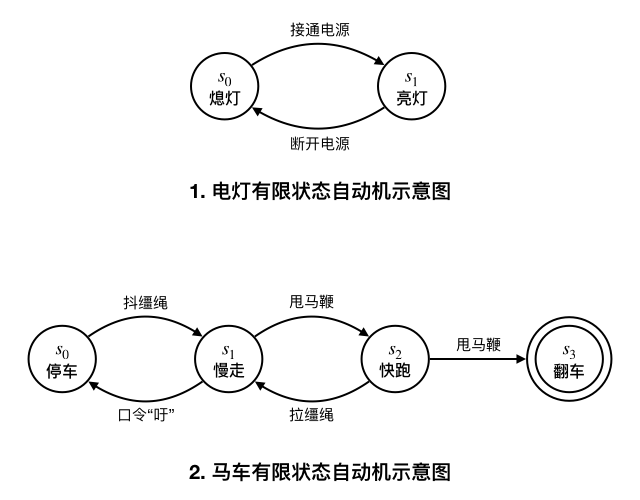
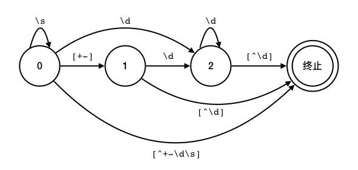
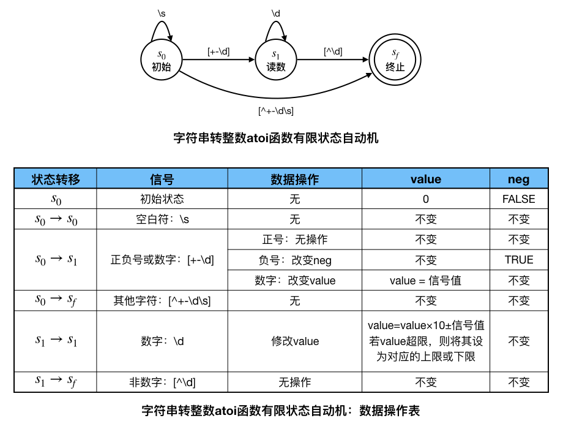

初识有限自动机：字符串转整数
++++++++++++++++++++++++++++++++++++++++

前一节我们介绍了利用字符串流实现字符串转整数乃至字符串转任意数值类型的简便方法。这种方法很方便，功能也很强，但是速度相当慢。为什么呢？主要原因有三个：

1. 字符串输入流并不是为某一种特定的转换单独设计的，它需要可以读取C++支持的各种基本数据类型，包括各种整型、浮点型、字符、字符串，其中整型的还分为有符号的、无符号的两类。这么多数据类型都有各自的读取和转换规则。功能太强是它速度慢的第一个原因。

2. 因为字符串中的输入文本不能保证一定格式正确，所以字符串输入流在读取的同时，还要进行正确性识别。发现有问题的时候，有时候可能需要进行类型转换，有时候可能需要报错处理。具有错误处理能力是它速度慢的第二个原因。

3. 有时候输入的文本格式并不错误，但不规范。比如可能在高位上会有填充的0，像用 ``"002"`` 来表示整数2；也可能前后有多余的空白符，像 ``"  2\t\n"`` 这样的，这时候字符串输入流又要进行额外的分析处理。容错性是它速度慢的第三个原因。

当然还有一些其他更深层次的原因，总之用字符串输入流来进行“文本”到“数”的转换，速度是比较慢的。

类似“文本”转“数”这样的问题还有很多，它们是计算机科学中一个极其重要的超级领域，一般称作\ :strong:`文本分析`。所谓“文本”，在计算机里的表示方式就是字符串，或长或短，短的比如一个单词、一个数字，长的可能是一本电子书，但它们终归就是一个字符串。“文本分析”要做的就是对文本进行分析，获取文本中的信息，进而可以根据这些信息进行进一步的处理。为什么说它是“超级领域”呢？

首先，它的重要性是超级的。计算机科学中有大量极重要的任务都是基于文本分析的，比如机器翻译、机器阅读。而其中最为经典最为超级的一个例子就是计算机程序的编译。我们编写的C++语言程序，其源代码就是一个长文本，在编译器的眼里无非就是一个长长的字符串。编译器在读入源程序后，要应用词法分析、语法分析这些高级文本分析技术对它进行分析，找出其中的错误，找出可能存在问题的地方发出警告，最终要对代码进行优化，并翻译成计算机可以直接运行的机器语言程序。整个编译过程充斥着极为复杂精细的大量文本分析技术，可说是计算机文本分析的集大成者。

第二，文本分析的难度也是超级的。考虑一下如果我们要自己编程实现字符串转整数的算法，有下面这些要求（与C语言标准库里的 ``atoi()`` 函数一致）:

1、要能丢弃无用的开头空格字符，直到寻找到第一个非空格的字符为止。

2、当我们寻找到的第一个非空字符为正号或者负号时，则将该符号与之后面尽可能多的连续数字组合起来，作为该整数的正负号；假如第一个非空字符是数字，则直接将其与之后连续的数字字符组合起来，形成正整数。

3、字符串中有效的整数部分之后也可能会存在多余的字符，这些字符可以被忽略，它们对于转换不应该造成影响。

4、假如字符串中的第一个非空格字符不是一个有效整数字符（正号、负号和数字）、字符串为空或字符串仅包含空白字符时，则表示该字符串不能进行有效转换，此时应取0。

5、转换的目标数据类型为int，如果字符串中的数值超过了其取值范围 :math:`[−2^{31},2^{31}−1]`，那就视情况取 :math:`−2^{31}` 或 :math:`2^{31}−1`。

例如：``"42"`` 转为42；``"   -42"`` 转为-42；``"4193 with words"`` 的转换中止于字符 ``'3'``，因为它的下一个字符不是数字，得到4193；``"words and 987"`` 第一个非空字符是 ``'w'``，不是数字或正、负号，因此无法执行有效的转换，得0；``"-91283472332"`` 则会转为-2147483648，因为数字-91283472332超过了int范围的下限，所以得到下限值−2\ :superscript:`31`\ =-2147483648。

.. admonition:: 问题版权

   来源：力扣（LeetCode）

   链接：https://leetcode-cn.com/problems/string-to-integer-atoi
   
   著作权归领扣网络所有。商业转载请联系官方授权，非商业转载请注明出处。

这是文本分析领域中最为简单的问题，没有之一！但是仔细去想一想，自己尝试一下就会发现，其复杂程度远超想象（在力扣网站中此题的难度等级为中等），更何况编译器这样的超级问题了。事实上，在大学计算机科学专业的所有课程中，编译原理都是一个超级杀手，在考场上收割不及格人数就像割韭菜一般，可见其有多难。

第三，文本分析技术的数学原理和工具也是非常超级的。目前主流的文本分析技术，都基于一种叫做“自动机理论”的深奥的数学基础理论，具体来说是应用了其中的\ :strong:`有限状态自动机`\ 这一模型，常被简称为\ :strong:`有限自动机`、:strong:`有限状态机`\ 或\ :strong:`状态机`。基于这种数学模型，就发展出了大量的词法分析工具、语法分析工具，都是非常神奇的文本分析技术。而在词法分析领域，又衍生出了一种程序员的超级大杀器：:strong:`正则表达式`，可以用来自动地识别、匹配文本中任意指定格式的信息。例如 ``[+-]?\d+`` 就是一个用来匹配任意整数的正则表达式。

学习文本分析的经典算法和模型，是算法学习的重要内容，也是难点。而且中等难度的文本分析问题是NOI等算法竞赛的常见题型，所以我们一定要掌握这一类问题的常见解法。这一节我们就先来认识一下有限状态自动机，认识几个正则表达式的入门级规则，并且利用它们来解决上面这个字符串转整数（atoi）问题。

虽然atoi问题只是文本分析的入门级问题，但是通过它我们可以了解有限自动机和正则表达式的基本原理，掌握它们的基本用法，是非常重要的基础。关于它们这两个终极武器更全面更深入的学习，我们在以后更难的题目中继续。

正则表达式简介
^^^^^^^^^^^^^^^^^^^^^^^^^^

:strong:`正则表达式`\ （regular expression）描述了一种字符串匹配的模式，可以用来检查一个串是否含有某种子串、将匹配的子串替换或者从某个串中取出符合某个条件的子串等。正则表达式的功能非常强大，但是它的语法规则也非常复杂，这里我们先只介绍几种最常用的语法形式，作为入门。

最简单的正则表达式其实就是一个普通的字符串，例如 ``Potter`` 这样的也是一个正则表达式，但它只能用来匹配 ``"Potter"`` 这个子串。但是光这样就和普通的子串搜索没有什么区别了，正则表达式之所以成为超级大杀器，其真正秘密来自于它有一批\ :strong:`元字符`。

正则表达式使用元字符（一些神秘的符号）来让自己能匹配不同的子串，比如最常用的三种\ :strong:`限定符`：``+``、``*`` 和 ``?``。把它们放在某个字符后面，分别表示这个字符可以出现“1或多次”、“0或多次”和“0或1次”。看下面的例子：

* ``Pott+er``，可以匹配 ``"Potter"``、``"Pottter"``、``"Pottttttter"`` 等，``+`` 前面的那个字符 ``'t'`` 必须至少出现一次（1次或多次）。

* ``Pott*er``，可以匹配 ``"Poter"``、``"Potter"``、``"Pottttter"`` 等，``*`` 前面的那个字符 ``'t'`` 可以不出现，也可以出现一次或者多次（0次、1次、或多次）。

* ``colou?r`` 可以匹配 ``"color"`` 或者 ``"colour"``，``?`` 号前面的那个字符 ``'u'`` 可以不出现，如果出现最多只可以出现一次（0次或1次）。

概括来说，正则表达式是由普通字符（例如字符 ``'a'`` 到 ``'z'``）以及特殊字符（元字符和一些运算符）组成的文字模式，用来描述在分析文本时要匹配的一个或多个字符串。也就是说，它描述了一个模板，将某个文字模式与所搜索的字符串进行匹配。

构造正则表达式的方法和创建数学表达式的方法一样，也就是用元字符和运算符将小的表达式组合起来创建更大的表达式。正则表达式的组件可以是单个的字符、字符集合、字符范围、字符间的选择或者所有这些组件的任意组合。

最常用的组件是字符范围，用一对中括号（这对中括号就是一种运算符）来表示可以匹配的字符范围，看下面的例子：

* 在中括号中写入所有允许的字符，中间不能有空格。例如 ``[abc]`` 表示这里的字符只能是 ``'a'``、``'b'`` 或 ``'c'``。

* 在中括号中写入允许的字符的首尾，中间是一个减号，注意不能有空格。例如 ``[a-z]`` 表示这里只能是一个小写字母，``[0-9]`` 表示这里只能是一个数字，``[a-zA-Z]`` 表示这里只能是所有英语字母。

* 在中括号里的字符范围前面加上一个 ``^`` 表示取反，即这个范围表示的是不能匹配的字符，同样不能有空格。例如 ``[^0-9]`` 表示这里不能出现数字。

所以我们现在已经看到，``[``、``]``、``+``、``*``、``?`` 这五个字符在正则表达式里面有特殊的用途了，那么如果我们确实要匹配这些字符怎么办？当然是用转义符的方式啦，写成 ``\[``、``\]``、``\+``、``\*``、``\?`` 这样子，就表示是这五个字符本身了。

.. admonition:: 转义符

   转义符这种用法最早是C语言发明出来用来表示某些无法直接表示在文本里的字符的，比如换行符 ``'\n'``、制表符 ``'\t'``、空字符（C-string结尾标志符）\ ``'\0'``、双引号 ``'\"'`` 等。现在这种用法已经成为计算机软件领域的一个标准，所有的编程语言和文本处理工具都使用它。一定要对它很熟悉哦。

另外，为了方便书写，正则表达式还提供了一些特殊的转义符（这些也是元字符）用来表示特定的字符范围。最常用的有：

* ``\d`` 表示任一数字，等价于 ``[0-9]``。

* ``\D`` 表示任一非数字，等价于 ``[^0-9]``。

* ``\s`` 表示任一空白字符，包括空格、制表符、换页符等等，等价于 ``[ \f\n\r\t\v]``。

* ``\S`` 表示任一非空白字符，等价于 ``[^ \f\n\r\t\v]``。

* ``\w`` 表示任一字母、数字或下划线（有些书里喜欢叫它们英数字和下划线，常用于变量名），等价于 ``[A-Za-z0-9_]``。

* ``\W`` 表示任一非字母、数字或下划线，等价于 ``[^A-Za-z0-9_]``。

所以我们现在就可以看懂那个用来匹配整数的正则表达式 ``[+-]?\d+`` 了，看懂了没有？这个正则表达式能够匹配的整数串，是允许在最高位上出现0的，比如可以匹配 ``"002"``，也可以匹配 ``"-002"`` 这样的。如果我们不允许在最高位上使用0，那么可以这样写：``[+-]?[1-9]\d*``。如果我们还不允许正整数前面出现 ``+`` 号，那么可以这样写：``-?[1-9]\d*``。

可见，正则表达式是非常灵活和强大的。但是也比较难掌握，还有许许多多其他运算符和匹配规则，目前我们只学这些就可以了，这些是最为常用的规则，而且已经能够满足大多数需要了。

.. admonition:: 练习

   作为练习，请大家试一试编写这些文本模式的正则表达式：正小数、非负小数、负小数、小数、C++变量名、一段长度任意的空白。

   大家可以在这个网站上测试自己编写的正则表达式：https://tool.lu/regex/

有限状态自动机
^^^^^^^^^^^^^^^^^^^^^^^^^^

有了正则表达式，似乎还不能做任何事情，因为我们还需要计算机能够使用正则表达式，否则它也就是一堆记号而已。如果没有合适的方法，要想编出一个实现正则表达式功能的程序可不容易。有了合适的方法，一切就变得简单了，这种合适的方法就是有限状态自动机。

.. attention::

   绝大多数比较年轻现代一点的编程语言，比如JavaScript、Python等等，都内置支持使用正则表达式，稍微老一点的语言比如Java、C#，也有很完善很好用的正则表达式库可供调用。然而非常不幸的是，C++从C++11标准才开始提供正则表达式的库，各类竞赛普遍使用的C++98是没有的。我们需要自己去编程实现正则表达式的理解和使用。

   但实际上通过学习怎么编写正则表达式应用的程序，我们主要学习的是有限状态自动机以及它的编程实现。有限自动机是算法竞赛的常见考点，也是难点考点，经常出现在中高等级的竞赛题中，是必须要熟练掌握的一种模型。

   要记住：正则表达式因有限状态机而变得超级，但有限状态机并不是只为正则表达式而生的。我们真正要学的是有限状态机！

有限状态自动机是离散数学里一种抽象的数学模型，它使用高度抽象的纯数学语言描述一类“带有状态”的机器。什么叫做“带有状态”呢？就是说这种机器每时每刻都处于某一个固定的状态之中。它的另一个特点是，机器可以接收一些特定的“信号”（或者也可以理解为“命令”），在不同的状态下接收到特定类型的信号后，机器会按照事先定好的“状态转移规则”转到另一种状态去，继续等待输入信号（或者听取命令）。机器就这样不断运行，根据不同的信号不断在各种状态之间转来转去。在转移状态的时候，机器也可以做一些别的工作，比如做出一些动作、输出一些东西、或者改变自身的一些数据等等。

既然名叫“有限状态”自动机，那么机器的状态数量一定要是有限的，不能有无穷多的状态。另外，机器需要有一个\ :strong:`初识状态`，表示机器在等待运行时的最初状态。机器还可以有\ :strong:`终止状态`，或者叫\ :strong:`停机状态`，表示一次运行结束后的状态。有些机器可能没有终止状态，有些简单的机器可能只有一个终止状态，有时候终止状态可能就是初识状态，表示机器一旦停机立刻进入初识状态等待下一次运行。也有一些比较复杂一些的机器会有多个终止状态，最常见的比如有一个正常停机的状态和一个出错停机的状态。

状态机虽然被叫做“机器”，但实际上它是一种高度抽象的数学模型，所以它是可以用来表示任何带有状态的事物的，不仅仅局限于机器设备。来看两个简单的例子吧。

家里的电灯就可以描述成一个非常简单的状态机。它只有两个状态：熄灯状态和亮灯状态。熄灯状态既是电灯的初识状态也是它的终止状态。当处于熄灯状态时，它接收打开电源开关的信号，然后就转移到亮灯状态。在亮灯状态下，它接收断开电源开关的信号，就会转移为熄灯状态。

第二个略微复杂的例子，是大家在电视剧里常见的马车（当然我们要进行适当的简化）。我们的马车有四种状态：停车、慢走、快跑、翻车。其中停车既是初识状态，也是正常终止状态；慢走和快跑是正常运行时的两种状态；翻车是出错终止状态。车夫可以给出四种信号：抖缰绳（让马开始走）、甩马鞭（让慢走的马开始跑）、拉缰绳（让快跑的马减速）、喊口令“吁”（让慢走的马停下来）。如果在快跑的时候再甩马鞭抽打马，就会导致翻车。这样一架马车就可以抽象为一个状态机，我们可以用列表的方式列出它的状态转移规则，也就是它的运行规则表：

.. table:: 马车的状态机描述表
   :widths: 20, 40, 20, 20

   +----------+----------------+----------+--------------+
   | 状态     | 状态类型       | 接收信号 | 状态转移规则 |
   +==========+================+==========+==============+
   | s0: 停车 | 初始、正常终止 | 抖缰绳   | -> s1: 慢走  |
   +----------+----------------+----------+--------------+
   |          |                | 甩马鞭   | -> s2: 快跑  |
   | s1: 慢走 | 运行           +----------+--------------+
   |          |                | 口令“吁” | -> s0: 停车  |
   +----------+----------------+----------+--------------+
   |          |                | 拉缰绳   | -> s1: 慢走  |
   | s2: 快跑 | 运行           +----------+--------------+
   |          |                | 甩马鞭   | -> s3: 翻车  |
   +----------+----------------+----------+--------------+
   | s3: 翻车 | 出错终止       |          |              |
   +----------+----------------+----------+--------------+

概括来说，有限状态自动机是表示有限个状态以及在这些状态之间的转移和动作等行为的数学模型。要构造一个状态机，需要五个组成部分：一个元素数量有限的状态集合 :math:`\Bbb{S}`，它的元素就是机器的各种不同状态；一个元素数量有限的信号集合 :math:`\Sigma`，它的元素是机器所能接收的各种信号；一个状态转移函数 :math:`\delta`，用来表示状态转移规则，比如机器在状态 :math:`s_i` 时接收信号 :math:`z` 会转移到状态 :math:`s_j` 这条规则就表示为 :math:`\delta(s_i,z)=s_j`；一个初始状态 :math:`s_0\in\Bbb{S}`，也就是说它一定是状态集合中的一个元素；一个元素数量有限的终止状态的集合 :math:`\Bbb{F}\subset\Bbb{S}`，它一定是状态集合的一个真子集。有限状态自动机在数学上的定义就是由这样五个组成部分构成的“五元组”，抽象的数学符号把它写作：:math:`M=\{\Bbb{S},\Sigma,\delta,s_0,\Bbb{F}\}`。

但是在实际使用的时候，数学符号过于抽象，文字或者列表描述对于复杂的状态机来讲又太过冗长，而且这些方式都很不直观。所以我们一般用画图的方式来直观清晰地描述状态机，人人都喜欢图。

状态机的图是一种有向图，图的节点表示机器的状态，边是有向边，表示状态迁移的规则。一般用圆圈来画状态节点，圈内标上状态的编号或名称。比较特殊的，我们总是用0号状态来表示初始状态，比如 :math:`s_0`、:math:`q_0` 之类的，用一个双圆周来表示终止状态，有时候为了效果突出还会把出错终止状态涂成红色等醒目的颜色。边则是普通的单箭头连线，一条边表示一个状态转移规则，从原状态指向转移到的新状态，在边上需要标准发生这次转移所需接收的信号。有时候也会附注上转移时进行的操作的简要说明。

例如我们前面所举的电灯和马车这两个例子，可以画成下面这样的图。

前面说过，正则表达式因为有了有限状态自动机的支持所以变成了程序员在处理文本时的超级大杀器。这是因为，每一个正则表达式都可以用一个确定的状态机来表示出来，一一对应。而这世界上的状态机无论有多少种，无论各自有多么不同，它们都可以用一种确定的算法来实现。这就意味着，无论给出一个什么样的正则表达式，我们只要把它“翻译”成状态机，就可以用同一个程序来操作它。

不用状态机，为一个正则表达式编写对应的程序很难，尤其是匹配模式很复杂很灵活的时候，而且不同的正则表达式要编写不同的程序，一万种正则表达式就要编一万个不同的程序。

用了状态机，所有正则表达式都可以用一种统一的方法来翻译成对应的状态机，而所有状态机可以只用一个程序来实现。更美妙的是，从正则表达式到状态机的翻译过程也是非常机械的，有一套成熟而完备的方法，所以现在许多语言都能够直接使用正则表达式。其原理就是语言本身就能自动把字符串形式的正则表达式编译成一个可直接运行的状态机程序。

唯一不太完美的就是C++98不支持正则表达式了，但是幸好，状态机程序并不难编，甚至可以说非常简单，简单到只有技巧，没有算法。下面我们就学习一下编程解决前面提到过的字符串转整数的atoi问题。

atoi问题
^^^^^^^^^^^^^^^^^^^^^^^^^^

前面那个atoi问题，就是一个编程实现正则表达式并且将其匹配到的整数字符串转为int型整数值的问题。我们前面说过，正则表达式 ``[+-]?\d+`` 可以匹配任意正整数串，现在问题中允许在整数串前面有空白符，所以atoi问题的正则表达式是 ``\s*[+-]?\d+``。首先要把这个正则表达式翻译成对应的状态机。

正则表达式翻译成状态机有一套完备的方法，但是这套方法是比较复杂的，我们这里不打算详细说明，只想说明几个要点，其余的通过atoi问题这个实际的例子来获得一些感性认识即可。

一般来说，要把一个正则表达式翻译成对应的状态机，有这么几条基本的规则：

1. 表达式中每一个元字符，包括它后面的重复次数限定符在内，对应状态机的一个状态。

2. 输入给状态机的消息就是要尝试匹配的字符串中的字符，按照从头到尾的顺序一个一个的字符陆续输入机器，形成消息序列。

3. 第一个元字符对应为初始状态。

4. 最后一个元字符对应最后一个运行状态，在它接收完可匹配的字符后进入匹配完成的成功终止状态。

5. 任何一个状态接收到的消息字符和它对应的正则表达式元字符不匹配，就转移到匹配失败的出错终止状态，这种转移是默认的所以一般不在图中画出来。

6. 不允许重复出现的元字符的转移路径直接指向下一个状态；允许重复出现的元字符用一条指向自己的转移路径表示重复出现，即转移回自己。

7. 画完之后一般要进行合并简化。

下面我们来看看atoi状态机的具体构造过程。

atoi问题的状态机会比前面的两个例子略微复杂一些，因为它现在还需要引入一些数据并且在状态转移的时候对这些数据进行必要的操作，以便到达终止状态的时候机器的数据是想要转换的那个正确的整数值。为了准确表示一个int型的整数值，我们需要在机器里加入两项数据：正负符号和绝对值。可以用一个bool型变量 ``neg`` 来表示这个数是不是负数，初始值为false，如果字符串中第一个字符是符号 ``'-'`` 就把它改成true。另外用一个long long型变量 ``value`` 存放绝对值，初始值为0。

.. admonition:: 问题

   刚才描述的两项数据，有两个问题需要大家思考。

   1、为什么正负符号和绝对值要分开放？C++的整数类型本身就支持负数，为什么我们还要采用正负符号和绝对值两个分开的变量来表示数据？

   2、绝对值为什么要用long long类型？

按照一一对应的原则，``\s*[+-]?\d+`` 中一共有三个元字符，分别是 ``\s*``、``[+-]?`` 和 ``\d+``，根据它们的自循环关系和相互转移关系，我们可以“对译”出下面这个状态机：

然后我们可以对它进行合并化简，状态0（对应 ``\s*``\ ）和状态1（对应 ``[+-]?``\ ）可以合并起来，因为它们到状态2（对应 ``\d+``）的转移信号是相同的，到终止状态的转移信号是有包含关系的（相容的）。所以可以把它们组合成一个状态，把它们俩中间的转移信号 ``[+-]`` 合并到向状态2转移的信号里去即可。最终得到下面的状态机和每次状态转移时的操作说明：

.. tip::

   其实像atoi这样的比较简单的状态机，通过正则表达式再翻译成状态机往往反而把简单问题复杂化。遇到这种难度的问题我们通常直接构造状态机！只要想清楚一个合法的整数串其字符的先后顺序规则和重复规则，把串分成正负符号和数本身两段，就可以很容易地直接构造出上面这个状态机。

   再比如小数，我们把它分成整数部分、一个小数点和小数部分三段，整数部分我们已经完成了，无非在后面再接上两段而已。请大家自己尝试一下直接构造表示小数的状态机。

接下来我们就要对上面这个最终形态的atoi状态机进行编程实现了。

（待续）
