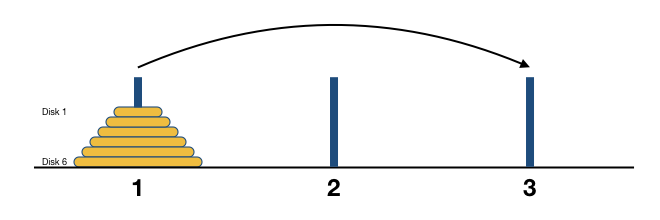
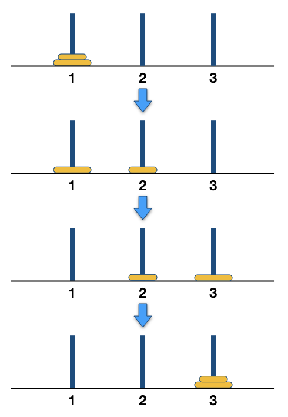
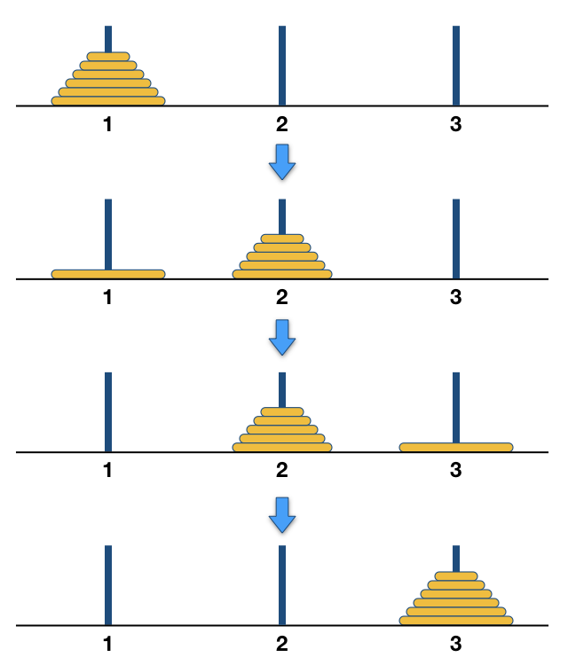

经典递归问题：Hanoi塔游戏
++++++++++++++++++++++++++++++++++++

法国数学家爱德华·卢卡斯曾编写过一个印度的古老传说：在世界中心贝拿勒斯（在印度北部）的圣庙里，一块黄铜板上插着三根宝石针。印度教的主神梵天在创造世界的时候，在其中一根针上从下到上地穿好了由大到小的64片金片，这就是所谓的Hanoi塔（汉诺塔）。不论白天黑夜，总有一个僧侣在按照下面的法则移动这些金片：一次只移动一片，不管在哪根针上，小片必须在大片的上面。僧侣们预言，当所有的金片都从梵天穿好的那根针上移到另外一根针上时，世界就将在一声霹雳中消灭，而梵塔、庙宇和众生也都将同归于尽。下面就是一个根据这个传说制作的层数较少的Hanoi塔玩具：

.. image:: ../../images/242_hanoi.jpg

为什么制作玩具的时候塔的层数总是要减少，而不是沿用传说中的64层呢？我们可以尝试一下怎样搬移这些金片，计算一下完成64片金片的搬移最少需要多少次移动。这里需要用到递归方法来求解。

让我们把三根针依次编号为1号、2号和3号针，目标是把 :math:`n` 片金片从1号针按规则搬移到3号针上去，金片从小到大依次编号，最顶上的最小一片为1号金片，其次的为2号金片，依此类推最下面的最大金片为 :math:`n` 号金片。例如 :math:`n=6` 时，初始状态如下图所示：

设 :math:`T(n)` 为完成一次 :math:`n` 层Hanoi塔最少需要移动的次数。显然当 :math:`n=1` 时，只要直接把这片金片移动过去就可以了，:math:`T(1)=1`。

当 :math:`n=2` 时，搬移的方法也很简单，先把1号金片移动到2号针上，然后把2号金片移动到3号针上，最后把2号针上的1号金片移到3号针上去就完成了，总共需要3步，:math:`T(2)=3`。

接下来我们可以这样来考虑，对于更大的金片数量 :math:`n\gt2`，先把上面的一叠 :math:`n-1` 片金片“整体地”搬移到2号针上，然后把最底下的 :math:`n` 号金片移动到3号针上，最后把2号针上这一叠 :math:`n-1` 片金片再整体地搬移到3号针上去，任务就完成了。

.. note::

   之所以可以这样递归地搬移，主要基于以下两个事实：

   1、一定可以整体搬移任意高度的一叠金片，否则就意味着Hanoi塔变成一个无解的问题了。既然规模为 :math:`n` 的整个问题可解，那么规模为 :math:`n-1` 的部分问题就一定有解，因为它们有相同的解法，只是规模小1。

   2、在整体搬移 :math:`n-1` 片金片时，剩下的那片 :math:`n` 号金片既不会被移动，也不会影响其他金片的移动。即对于整体搬移上面的 :math:`n-1` 片金片这一子问题而言，:math:`n` 号金片可以视为不存在。

这样我们就设计出了一个可行的递归搬移算法，算法的递归终止条件为金片数等于1，但是在实际编程的时候，为了让代码更简洁，往往会用金片数等于0作为终止条件。这样一个程序将会非常地优雅简洁：

.. code-block:: c++

   #include <cstdio>
   
   // Hanoi递归算法的递归函数，从 from 号针搬到 to 号针，金片数量为 n
   void hanoi(int from, int to, int n) // 针采用1、2、3来编号，故辅助针编号为 (6 - from - to)
   {
           if (n) { // 如果 n == 0 就什么都不做直接返回
                   hanoi(from, 6 - from - to, n - 1); // n == 1 时的递归调用会直接返回
                   printf("move disk %d from needle %d to %d\n", n, from, to); // 移动最底一片
                   hanoi(6 - from - to, to, n - 1);
           }
   }
   
   int main()
   {
           int n;
           scanf("%d", &n);
           hanoi(1, 3, n);
   
           return 0;
   }

大家可以运行一下上面这个程序，输入要搬移的金片数量，感受一下随着金片数量的增加，程序运行的时间长短。

.. warning::

   如果你想尝试30片以上的金片，最好先插上笔记本电脑的充电器，然后去看会儿电视或者睡一觉，第二天再去看有没有运行完。

随着金片数量的增加，程序运行的时间以极快的速度激增，所以让我们来精确地计算一下 :math:`T(n)` 吧。

假设有n片，移动次数是f(n).显然f(1)=1,f(2)=3,f(3)=7，且f(k+1)=2*f(k)+1。此后不难证明f(n)=2^n-1。n=64时，
假如每秒钟一次，共需多长时间呢？一个平年365天有31536000 秒，闰年366天有31622400秒，平均每年31557600秒，计算一下：
18446744073709511615秒
这表明移完这些金片需要5845.42亿年以上，而地球存在至今不过45亿年，太阳系的预期寿命据说也就是数百亿年。真的过了5845.42亿年，不说太阳系和银河系，至少地球上的一切生命，连同梵塔、庙宇等，都早已经灰飞烟灭。