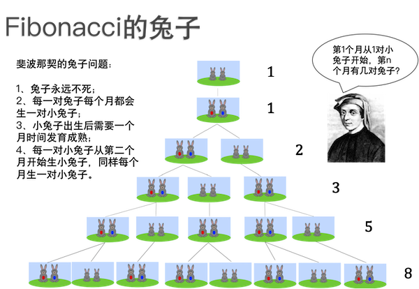
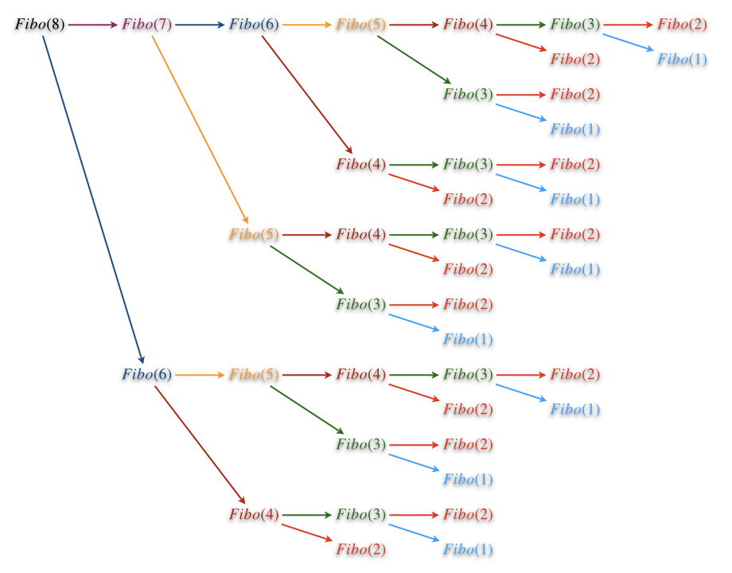

Fibonacci数列
++++++++++++++++++++++++++

Fibonacci数列，中文一般翻译成“斐波那契数列”，是数学和自然科学中最为重要的一个整数数列。它说自己第二重要，就没有别的数列敢说自己第一重要。

Fibonacci数列得名于中世纪意大利的学者Fibonacci，这里还有一个有趣的故事，和兔子生小兔子有关。据说Fibonacci先生是在帮一位养兔子的朋友计算兔子的数量时发现的这个数列。有一天，Fibonacci先生的一位朋友来信说，他买了一对神奇的兔子，这种兔子永远不死而且会不断地以固定的速度生小兔子。更神奇的是，小兔子总是一公一母成双成对地出生。朋友觉得这下要发大财了，但是自己读书少，不太会算术，所以他请Fibonacci先生帮他算一算几个月之后他将拥有多少对这样的兔子。

经过严谨的分析计算，Fibonacci先生发现兔子的数量按这样的规律增长：

最初的第1个月有1对小兔子。

过完1个月，第2个月还是1对，因为小兔子需要1个月时间成长为大兔子。

再过1个月，到了第3个月，大兔子生出1对小兔子，加上它们自己，总共变成2对，1对大兔子和1对小兔子。

第3个月之后，大兔子又生出一对小兔子，而原来的小兔子成长为了大兔子，现在第4个月有了2对大兔子和1对小兔子，一共3对。

到了第5个月，原来的2对大兔子又各生出1对小兔子，原来的小兔子长成了1对大兔子，这样一共有了5对兔子......

就这样一直生生不息地下去，每个月兔子的数量等于前面两个月的数量之和。写成整数数列就是 1,1,2,3,5,8,13,21,34, ... 。

这就是Fibonacci数列，用现代数学的符号可以表示成一个递推公式：

.. math::

   F(n)=
   \begin{cases}
   F(n-1)+F(n-2)&,n\gt2\\
   1&,n=1,2
   \end{cases}

这个递推公式有两个初值 :math:`F(1)=F(2)=1`\ 。数列的第n项 :math:`F(n)` 称为第n个Fibonacci数。

.. hint::

   有时候也会在前面加上一个 :math:`F(0)=0`\ ，这往往是一些特殊问题为了数学上的便利而人为添加的，并不影响Fibonacci数列本身的性质。

恐怕连Fibonacci先生自己都不会想到他发现的这个数列在数学、几何、艺术、音乐、自然、科学等各方面都有非常重要的意义和应用，大自然中有大量的规律和现象都遵循着它所规定的规律，不仅仅神奇兔子的数量和它有关，黄金比例、Pascal三角形、向日葵花盘的纹理、螺旋线......甚至一个人走楼梯有多少种走法，都和Fibonacci数列息息相关。

关于Fibonacci数列本身的知识和应用，这里不打算细讲，事实上也讲不完，有兴趣的可以自己上网或找相关的书籍查阅。这里我们重点要学习和比较计算Fibonacci数的两种算法，递归的算法和递推的算法。

递归计算Fibonacci数
^^^^^^^^^^^^^^^^^^^^^^^^^^

现在给出正整数n，要求出Fibonacci数 :math:`F(n)`\ 。按照数列递推公式的形式，很容易想到一个简单的递归算法，用C++语言可以写出下面这样一个函数：

.. code-block:: c++

   unsigned long long fibo(unsigned int n)
   {
           if (n <= 2) return 1;
           return fibo(n - 1) + fibo(n - 2);
   }

这个函数的形式看上去非常简洁优美，计算结果也是无可挑剔，但这是一个典型的滥用递归的坏例子。我们可以编写一个简单的测试程序，加上测量耗时的功能试一试它的运算速度有多“快”。虽然每台电脑的性能不同，但是我们可以查看随着n的增大运算时间的增长趋势。在我的电脑上测试结果是：当n在20以内时运算速度都在1ms以内，计算 :math:`F(30)` 使用了5ms，计算 :math:`F(40)` 就激增为约400ms，计算 :math:`F(50)` 居然花了约45s，再大的数字就不敢再尝试了。简直是慢到了随心所欲的程度！

为了分析这个算法的时间复杂度，我们先来测算一下这个递归算法的工作量。以加法运算为基本运算，这个算法在计算 :math:`F(1),F(2)` 时是直接返回其值的，工作量为0；在计算其他Fibonacci数的时候，它递归调用两次，然后再进行一次加法，所以工作量为：

.. math::

   T(n)=T(n-1)+T(n-2)+1,T(1)=T(2)=0

下面用迭代法来求解：

.. math::

   \begin{align}
   T(n)&=T(n-1)+T(n-2)+1\\
       &=[T(n-2)+T(n-3)+1]+[T(n-3)+T(n-4)+1]+1=T(n-2)+2T(n-3)+T(n-4)+1+2\\
       &=T(n-3)+3T(n-4)+3T(n-5)+T(n-6)+1+2+4\\
       &=T(n-4)+4T(n-5)+6T(n-6)+4T(n-7)+T(n-8)+1+2+4+8\\
       &=\cdots
   \end{align}

到这里虽然还没有迭代完成，但是已经可以从“1+2+4+8+...”这个余项形式很明显地看出来，当把所有的函数项全部规约为 :math:`T(1)` 或者 :math:`T(2)` 的时候，工作量的数值一定是一个2的指数的形式。这后面的计算比较复杂，这里就不详细说明了，只要记住，用这样的递归法来计算Fibonacci数，时间复杂度为 :math:`O(2^n)`\ ，是一种无法容忍的慢速算法。

那么到底是什么原因造成了算法会如此之慢呢？原因是“重复计算”，它在运行过程中有大量的重复计算。比如调用 ``fibo(5)`` 会引起调用 ``fibo(4)`` 和 ``fibo(3)``\ ；二者会分别发生调用 ``fibo(3)``\ 、\ ``fibo(2)`` 和 ``fibo(2)``\ 、\ ``fibo(1)``\ ；而其中的 ``fibo(3)`` 又会再次调用 ``fibo(2)``\ 、\ ``fibo(1)``\ 。整个过程中 ``fibo(3)`` 被调用2次，\ ``fibo(2)`` 被调用3次，\ ``fibo(1)`` 被调用2次，可见已经发生了多次重复计算。

也可以通过画递归调用树（注意不是计算工作量的递归树哦）来更加直观的看看重复调用的情况，比如我们要计算 :math:`F(8)`\ ，为此我们调用函数 ``fibo(8)``\ ：

图中用不同的颜色标出了每一种调用，可以看出整个过程中出现了大量的重复调用。\ ``fibo(6)`` 被调用2次，\ ``fibo(5)`` 被调用3次，\ ``fibo(4)`` 5次，\ ``fibo(3)`` 和 ``fibo(1)`` 各8次，最多的 ``fibo(2)`` 被重复调用了13次。C++程序调用函数会造成一些时间和空间上的开销，比如保存状态、复制参数、跳转、复制返回值、再次跳转、恢复状态等，虽然一次调用这点开销微不足道，但是如果出现指数级别的大量重复调用，那么这些开销积累下来就不容小视了。

更重要的是，这些大量的重复劳动带来的一个更大的时间浪费是多做了许多次加法运算（我们在衡量时间复杂度时就是用加法运算来作为基本工作量的）。比如上面的图中，树的每一次分叉都意味着此处有一次加法，总共有20次。而实际上笔算 :math:`F(8)`\ ，从 :math:`F(3)` 开始向后推算，只需要计算6次加法即可。

随着n的增大，递归计算Fibonacci数的程序中重复调用的次数以2\ :superscript:`n`\ 级别增长，随之带来多余的加法次数同样以2\ :superscript:`n`\ 的级别增长，这就是这个算法运算速度慢到无法忍受的原因。

.. warning::

   Fibonacci数的递归算法是滥用递归导致翻车的反面典型。

   具有下面这两个特征的递归算法往往很容易演变成类似的指数时间算法：

   1. 有两次或更多次递归调用；

   2. 递归调用时，子问题的规模缩减是“按数量减少”，例如 :math:`T(n-1)` 或者 :math:`T(n-9)`\ ，而不是“按比例缩小“，例如 :math:`T({n\over2})` 或者 :math:`T({5n\over6})` 这样的。\ :emphasis:`按数量减少，哪怕每次减少的量很大，也是慢的！按比例缩小，哪怕每次缩小的比例很小，也是快的！`

   一定要警惕这种模式，出现这种模式往往意味着这个算法不够好。

.. hint::

   其实上一节所讲的Hanoi塔算法也是一个具有这样的模式的递归算法，而它的时间复杂度也恰恰好是 :math:`O(2^n)`\ ，但是没办法，这就是Hanoi塔问题的最优解了。

递推计算Fibonacci数
^^^^^^^^^^^^^^^^^^^^^^^^^^

一般在计算Fibonacci数的时候都会用递推的方法，也就是从初值开始，逐步向后推算，直到要计算的那个数为止。这种方法非常方便也很快速，没有重复计算。在程序里我们需要定义两个变量，分别表示前两个数。初始的时候都赋值为1，表示 :math:`F(1)` 和 :math:`F(2)`\ 。随后我们不断循环地去计算它们的和，直到我们需要计算的 :math:`F(n)` 就可以了。

.. code-block:: c++

   unsigned long long fibo(unsigned int n)
   {
           if (n <= 2) return 1;
           unsigned long long a = 1, b = 1, c;
           while (n-- > 2) {       // 计算fibo(n)，需要递推n-2次
                   c = a + b;
                   a = b;
                   b = c;
           }
           return c;
   }

这种方法就非常的快速，时间复杂度是 :math:`O(n)` 的线性时间，在 ``unsigned long long`` 数据范围以内的所有Fibonacci数的计算都能在1ms以内完成。

前面讲过的阶乘运算，大多数时候也是使用普通的单循环从1开始逐个自然数乘起来的方法，不会去使用递归法。这种单循环计算阶乘的方法也是递推法。归纳起来讲，递归法和递推法是用来求解递推公式的两种方法。给定一个递推公式，要求解其第n个值，递归法的思路是从第n个值开始一层层地向前归约，直到遇到初值，然后再层层地往回解套；递推法的思路刚好相反，从初值开始，根据公式一层层地向后推进，直到遇到第n个值，计算就此结束。

理论上说，任何递归算法都有等价的递推算法。但是算法往往有自己的天性，有些算法天生适合用递归，比如Hanoi塔，很难把它们改成递推；有些算法则天生适合用递推，用递归反而不好，比如Fibonacci数。

递归法的优势在于思路清晰、代码简洁、直观易懂，但是往往有性能上的劣势。一个算法如果使用递归并不能减少计算步骤，那么往往无法提高性能，甚至适得其反。像阶乘、Fibonacci数这样的简单递推运算，递归法就不能减少计算量，所以在实际应用时一般不使用递归法。说得通俗一点，递归法是高阶技能，主要用来解更复杂的难题，用于阶乘、Fibonacci这样的简单问题就是杀鸡用牛刀、大炮轰蚊子了，用得不好反而弄巧成拙。至于什么样的问题适合用递归，什么样的问题适合用递推，以后的学习中我们会遇到很多实际案例，见多了自然就会有感觉。

最后说一下\ :strong:`打表法`\ 。打表是算法竞赛中常用的一种小技巧，如果能预见到程序中要经常使用某一类数，比如一万以内的质数，比如200以内的Fibonacci数，那么我们可以用一种比较高效的算法事先计算好所有可能用到的数，存在一个数组里。当程序中要使用其中某个数的时候，直接从数组中取用即可。

假设我们现在要做这样一个题，计算 :math:`F(1)` 到 :math:`F(90)` 这90个Fibonacci数两两之间的差距，即 :math:`\vert F(i)-F(j) \vert`\ 。

90个数两两配对，不考虑顺序，这是90选2的组合数，总共有90×89÷2=4005对。假如我们在程序里每次用到Fibonacci数时都调用上面这个函数进行计算，那么总共需要调用8010次，但实际上只是计算了90个Fibonacci数。是不是太浪费了？

我们可以改用打表法，在开始循环之前，先把要用到的90个Fibonacci数计算好，保存在数组里。这个打表计算只要顺序计算一遍就够了，速度非常快：

.. code-block:: c++

   #include <cstdio>
   
   int main()
   {
           unsigned long long fibo[100] = { 0, 1, 1 }; // 前2个Fibonacci初值
           for (int i = 3; i <= 90; ++i) // 打表fibo[3]到fibo[90]
                   fibo[i] = fibo[i-1] + fibo[i-2];
   
           for (unsigned int i = 1; i <= 90; ++i)
                   for (unsigned int j = i + 1; j <= 90; ++j)
                           printf("fibo(%u) - fibo(%u) = %llu\n", j, i, fibo[j] - fibo[i]);
   
           return 0;
   }

这种方法就叫打表，以前其实我们就已经接触过，我们用Pascal三角形打过组合数表，这是一种实用的小技巧。

经过实测，上面这个问题不打表的方法总共运行时间为2ms，打表的方法1ms。看上去好像差距很小，但再小也是一倍的差距。要知道，我们的数据范围很小，只是前90个Fibonacci数，总共4005次减法。在这么小的数据规模下就已经有了一倍的差异，其实二者的速度差距是很大的。假设题目把数据范围扩大到前1000个Fibonacci数会怎样？首先计算规模扩大到499500次减法，是原来的124倍。第二，这里有一个很隐蔽但是很重要的知识点，\ ``unsigned long long`` 数据类型，能够支持的最大的Fibonacci数仅仅是 :math:`F(93)`\ ，从第94个开始就必须自己编写高精度整数算法来提供支持了。而自己编写的高精度整数加减法，运算速度何止是内置整数类型 ``unsigned long long`` 的十倍之慢。

所以，在很多算法题中，合适地使用打表会带来性能上的很大提升，也会给编程带来很多便捷。

.. warning::

   但是有些人很“聪明”，他们会“活用”打表法。当他们想不出性能足够好的算法的时候，会先写一个性能差但是结果正确的算法，比如蛮力法。然后用这个慢算法运行出所有可能的答案来，把答案导入到自己的程序里，做成一个大数组。最后他们的程序就是：根据输入的数据去查答案表，直接输出答案。这种投机取巧的方法万万不可取，千万不能学。现在大多数判题系统都会特判这样的提交为错误，并且对提交者进行一定的惩罚。

