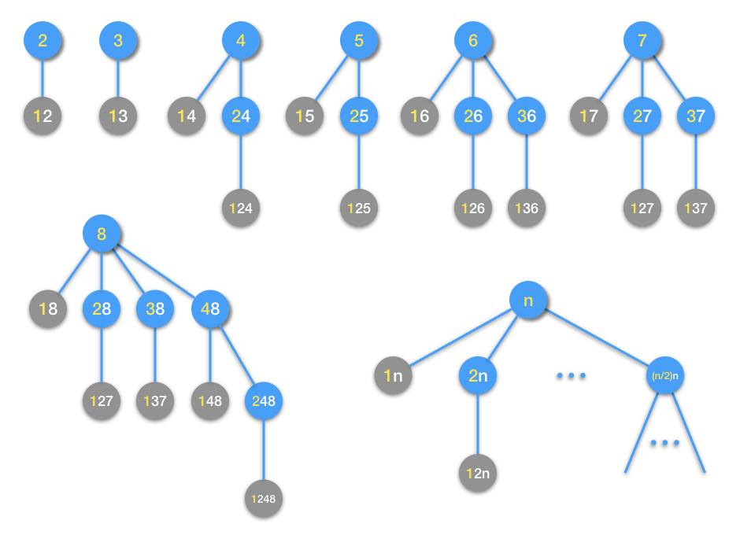
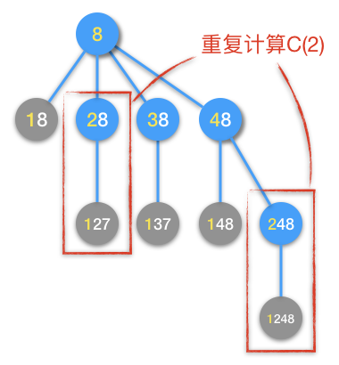
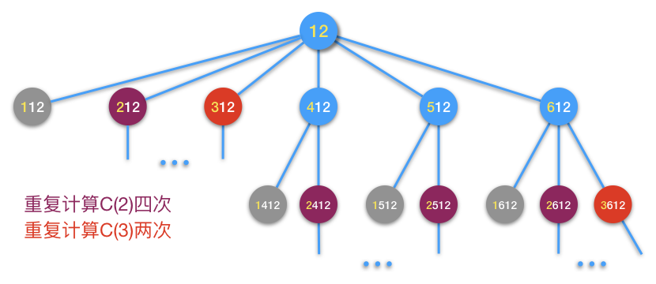
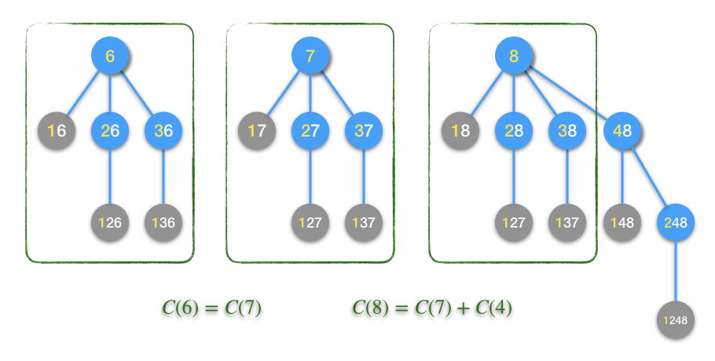
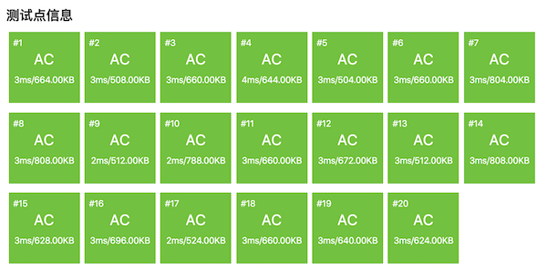

.. index:: 【数的计算】, 〖洛谷P1028〗

递归与递推例题：数的计算（洛谷P1028）
++++++++++++++++++++++++++++++++++++++++++++++

.. attention::

   洛谷网站上的原题在描述问题时不够精确，容易引起误导，这里进行了适当修改，修改的部分为斜体字。

**题目描述**

我们要求找出具有下列性质数的个数(包含输入的自然数 :math:`n` )：

先输入一个自然数 :math:`n,(n \le 1000)`\ ，然后对此自然数按照如下方法进行处理：

1. 不作任何处理；

2. 在它的左边加上一个自然数,但该自然数不能超过原数的一半；

3. 加上数后，:emphasis:`以刚加上去的数为原数部分，对新生成的数`\ 继续按此规则进行处理，直到不能再加自然数为止。

**输入格式**

1个自然数 :math:`n,(n \le 1000)`

**输出格式**

1个整数，表示具有该性质数的个数。

**输入输出样例**

输入：

.. code-block:: none

   6

输出：

.. code-block:: none

   6

**说明/提示**

满足条件的数为

6，16，26，126，36，136

**解题分析**

从题目的描述来看，数的生成具有递归的特征，体现在第3条规则：“继续按此规则进行处理”体现了递归性，“直到不能再加自然数为止”体现了递归终止条件。

用函数 :math:`C(n)` 来表示要求的解，即从n开始按题目所述规则能够生成出来的数的个数。显然有 :math:`C(0)=C(1)=1`\ ，这就是终止条件。那么 :math:`C(n)` 的递推方程是怎样的呢？我们先用几个小一点的数试一试，可以用树的形式来画出新数生成的过程，比如下面这几个数：

在上面这个图中，蓝色的小圆圈代表还能继续扩展的数，它们将以圆圈内数字的左边黄色部分为原数进行下一步扩展。灰色的小圆圈代表已经不能进行下一步扩展的数，因为它们数字的左边黄色部分已经是1了，对应了终止条件。从图中2到8这几个数的扩展生成新数过程来看，越是大的数，它对应的扩展数不断递归向下延伸的层数越深，同一层上的节点数也越多。每一个蓝色圆圈节点代表一次扩展，所有的扩展都遵循相同的规则，所以这是一个具有完美的递归结构的问题，适用于递归法。

经过简单的分析，我们可以对任意数n，归纳出一个扩展生成新数的规则：

1. 数n的第一次扩展可以在其左边添加 :math:`1,2,\cdots,\left\lfloor{n\over2}\right\rfloor` 这些自然数。

2. 每一次扩展后得到的新数，以该次扩展新添在左边的部分为原数，用相同的规律进行下一次扩展。

3. 每发生一次扩展，:math:`C(n)` 加1，可直接得出结果的终止条件为 :math:`C(0)=C(1)=1`\ 。

归纳成递推公式如下：

.. math::

   C(n)=
   \begin{cases}
   1+C(1)+\cdots+C(\left\lfloor{n\over2}\right\rfloor)&,n\gt1\\
   1&,n=0,1
   \end{cases}

公式中的第一个加数1代表数n自己，后面从 :math:`C(1)` 累加到 :math:`C(\left\lfloor{n\over2}\right\rfloor)` 代表它的第一层扩展。更后层的扩展当然就交给递归调用去幕后完成了。此公式对应上图中最后一棵生成树。

现在我们就可以编写一个正确的计算结果 :math:`C(n)` 的程序了，利用函数递归调用把递推公式“直译”为C++代码即可，程序相当简单：

.. code-block:: c++

   #include <cstdio>
   
   int count(int n);
   
   int main()
   {
           int n;
           scanf("%d", &n);
           printf("%d\n", count(n));
           return 0;
   }
   
   // 这个就是递推公式的数学函数C(n)对应的C++函数
   int count(int n)
   {
           if (n <= 1) return 1; // 递归终止条件
           int c = 1;
           for (int i = 1; i <= n / 2; ++i)
                   c += count(i);
           return c;
   }

.. warning::

   编写这样的程序虽然简单，但有一点必须小心，那就是结果的数据类型是否足够大。这里我们用了 ``int`` 型，是经过测试的。根据题目所给出的范围 ``n <= 1000``\ ，我们先用最为保险的 ``unsigned long long`` 来作为 ``count()`` 函数的返回类型，然后测试了一下至少可以用哪一种数据类型。测试过程如下：

   首先测试四个输入，500、998、999和1000，如果数据没有溢出，那么输入998和999得到的结果应该一样的，并且加上输入500得到的结果应该等于输入1000得到的结果。

   如果这一步测试就发现数值溢出了（结果各种乱七八糟毫无规律），那么说明连 ``unsigned long long`` 都hold不住，那就只能自己编写高精度算法了。本题还好，很完美地通过了这一步测试，如果不想进一步优化了也行。如果想进一步优化那么就根据数据大小去选择一种最合适的数据类型。

   按照第一步测试得到的结果，:math:`C(1000)=1981471878`，恰好在 ``int`` 数据类型能表示的范围之内，所以当然就用 ``int`` 了，它的运算速度最快。

   遇到这一类题目，都必须注意结果和所有中间数据的取值范围，能估算当然最好，不能估算的一定要设法验证。

但是在运行中，发现这个程序当输入数据比较大的时候，会很慢！经过实测，当n>700十有八九就要超过1秒。在洛谷网站提交，有TLE发生。看来算法性能不足，必须优化。

开始优化之前，我们先来看看为什么会造成算法速度过慢。还是回到扩展数的图形中去寻找原因比较直观，先来看看前面已经做过的几个图。当我们仔细观察数字8的扩展过程时，一个“老朋友”的面孔又悄然出现了，这个老朋友就是“重复计算”。看下面这张图：

从图中可见，在第一层扩展时已经计算过一次 :math:`C(2)`\ ，但是到了第二层扩展，又计算了一次 :math:`C(2)`\ 。当n=8时，算法出现了第一次重复计算。可以想象，按照这种递归模式，越是大的n，越会出现大量的重复计算，这和Fibonacci数列的递归算法是一样的问题。比如我们看一下数字12的扩展过程：

这次重复计算已经累计达到6次，:math:`C(2)` 被计算了4次，:math:`C(3)` 计算了2次。

随着n的不断变大，这样的重复计算会越来越多。和Fibonacci数列递归算法一样，到后面会出现规模很大的重复计算的子树，而每一个重复计算的子树中又会递归地包含其他规模较小的重复子树。按照树形结构的递归生长规律，就会造成指数时间。

知道了问题所在，就要对算法进行优化。递归算法的优化，一般只有一条路可走：改成递推。也就是从初值开始，逐步推导直到要求的解。

这个递归改递推的过程我们在前面已经看过两个简单的例子：递推阶乘，只需知道前一个数的阶乘，就能推出下一个；Fibonacci数知道前两个就能推下一个。但这次这个问题就比较复杂，从 :math:`C(n)=1+C(1)+\cdots+C(\left\lfloor{n\over2}\right\rfloor)` 这个公式的形式可以看出，要推出某个 :math:`C(n)`\ ，需要用到前面的 :math:`\left\lfloor{n\over2}\right\rfloor` 个结果，进行 :math:`\left\lfloor{n\over2}\right\rfloor` 次加法。那么如果直接按照这个公式来递推，当然也是可以的，但是每项后推一个数都需要进行 :math:`\left\lfloor{n\over2}\right\rfloor` 次加法的话，时间复杂度会是 :math:`O(n^2)`\ （等差数列求和，类似于双重嵌套循环的情况，请自己琢磨），仍然比较大。如果是竞赛中遇到这种情况，或许数据范围还会更大，那么二阶时间的算法能不能保证AC确实是一个问题。我们应该尽量再优化一下。

有没有什么进一步优化的办法呢？还是得从递推规律本身入手，最直观的，还是来看图。

首先我们观察已经画过图的几个数，我们可以发现一些规律，比如6、7、8这三个数的扩展树。

我们可以发现，扩展6和扩展7的过程是一模一样的，原因在于 :math:`\left\lfloor{6\over2}\right\rfloor=\left\lfloor{7\over2}\right\rfloor=3`\ 。由此自然可以有这样的归纳：对于任何一个偶数 :math:`2k,(k=1,2,\cdots)`\ ，都满足 :math:`\left\lfloor{2k\over2}\right\rfloor=\left\lfloor{2k+1\over2}\right\rfloor=k`\ ，因此任何一个奇数 :math:`2k+1` 的扩展一定和它前面那个偶数 :math:`2k` 的扩展一模一样。这就是我们发现的第一条递推规则：

.. math::

   C(2k+1)=C(2k),(k=1,2,\dots)\tag{A}

利用这条规律，我们就可以从 :math:`C(2)` 直接得到 :math:`C(3)`\ ，从 :math:`C(4)` 直接得到 :math:`C(5)` ......

现在整条递推链条已经搭建完成一半了，为了能够环环相扣，我们还需要把另一半链条也补充完整。即怎样从 :math:`C(1)` 推出 :math:`C(2)`\ ，从 :math:`C(3)` 推出 :math:`C(4)` ...... 从 :math:`C(2k-1)` 推出 :math:`C(2k)`\ ，也就是从奇数推出紧挨着它后面的那个偶数。这一半链条的答案也在上面这个图中的绿色方框中。

观察发现，8的扩展树只是比7的扩展树多了最右边扩展4的那一支，其余部分是一样的。这是因为 :math:`\left\lfloor{8\over2}\right\rfloor=4=\left\lfloor{7\over2}\right\rfloor+1`\ ，对8进行扩展，在第一层仅仅是多了最后一个数4。依此类推，容易发现任何一个偶数 :math:`2k` 的第一层扩展都是它前面一个奇数 :math:`2k-1` 的扩展再外加一次 :math:`k` 的扩展。这就是第二条递推规则：

.. math::

   C(2k)=C(2k-1)+C(k),(k=1,2,\dots)\tag{B}

这样，我们的整个递推链就完整了，接下来就可以用递推法来改造原来的递归法程序了。

这个程序在递推过程中，遇到由奇数推导后一个偶数，会用到前面部分中点位置的数，所以不能像阶乘或者Fibonacci数的递推一样，仅保存递推位置前面一到两个数。幸而数据规模不是太大，最多也就是1000个数，所以我们干脆开设一个长度大于1001的数组，把每一个数都保存起来即可。程序如下：

.. literalinclude:: ../../codes/244_p1028.cpp
   :language: c++

这个程序运行的速度就非常快。

最后我们来分析一下算法的工作量和时间复杂度。仍然以加法运算为基本运算，设工作量为 :math:`T(n)`\ 。

当n=2k时，算法从2开始递推到2k，总共进行k轮循环，每轮循环中仅进行1次加法运算，故总工作量 :math:`T(2k)=k`\ 。

当n=2k+1时，算法同样是从2开始递推到2k，共k轮循环，每轮循环1次加法，总工作量 :math:`T(2k+1)=k`\ 。

因此，无论n是奇数还是偶数，算法的总工作量都是 :math:`T(n)=\left\lfloor{n\over2}\right\rfloor`\ ，时间复杂度为 :math:`O(n)`\ ，非常优秀。

