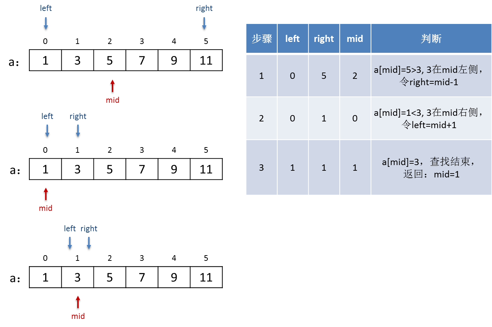
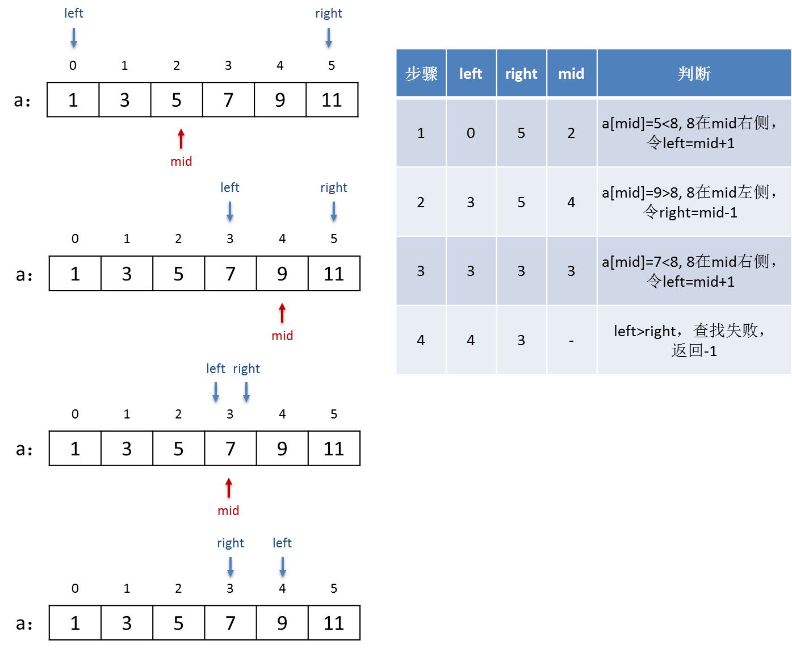
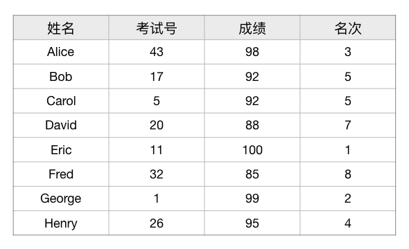
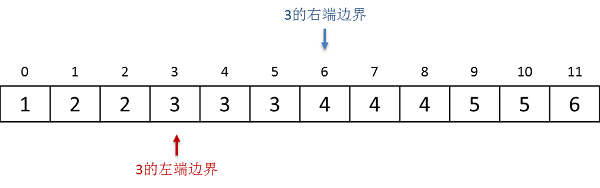
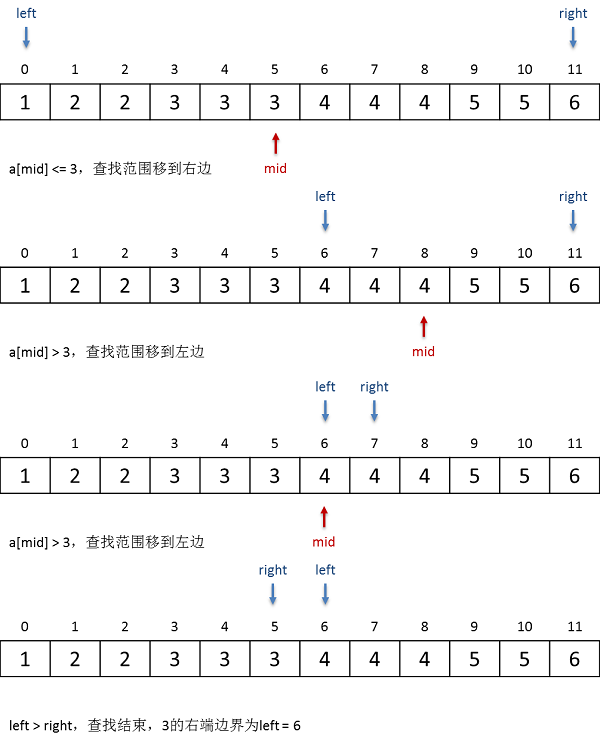

二分法基础及二分查找
++++++++++++++++++++++++++++++++++

:strong:`二分法`\ 是一种重要的算法设计技巧。简单来说，二分法就是利用一定的判断规则，不断地将问题规模减半，从而使得规模较大的问题能够快速地缩减为规模较小的问题，从而实现快速地解决问题。采用了二分法设计的算法，其时间复杂度往往是 :math:`O(\log n)` 的级别，可以说非常之快。

二分法本质上是一种递归法，每次讲问题规模减半时不能使得问题的性质发生变化，变化的只是计算规模，因此可以利用递归法来使用同样的解法去求解缩减后的小规模问题。但是在实际编程时，大多数二分算法并不使用函数的递归调用，而是采用循环的方法来实现递归。递归只是思路，不是手段。

.. attention::

   一定要搞清楚，二分法不等于二分查找。二分查找只是一种二分算法，二分法是算法设计技巧。

另一个要注意的是二分法和分治法的区别。分治法是五大算法之一，是一种算法设计思想，以后我们会详细进行讲解。现在要搞清楚的二者的区别：

分治法是将一个难求解的大问题分解为多个规模较小性质相同的小问题，然后逐个求解各个小问题，得到一系列小问题的解，最后将这些小问题的解组合起来得出大问题的解。

二分法是将一个难求解的大问题的规模逐步减半，使问题本身的规模不断缩小，直至能够求出其解。

那么什么样的问题可以采用二分法来进行求解呢？一般来说，问题如果具有以下这些特点，就可以考虑采用二分法：

1. 问题要么有一个\ :strong:`确定`\ 的解 :math:`s`，要么无解。

2. 存在这样一个集合（注意：集合的元素是不重复的）\ :math:`S`，问题如果有解，那么解一定是这个集合中的某个元素，如果这个集合中的所有元素都不是问题的解，那么问题就无解。我们称这个集合 :math:`S` 为问题的\ :strong:`解空间`，称它的元素为问题的\ :strong:`候选解`。

   .. attention::

      候选解的个数可以是有限的也可以是无限的。

3. 候选解之间可以通过某一种特定的规则来进行比较，确定相互顺序。

   最常见的比较规则即为数的大小关系，但并不仅限于此。我们已经见过的一种并非数的大小关系的次序就是字符串的字典序，今后我们还会在图结构中看到所谓的图节点的“拓扑序”。总之，有一种明确的比较规则，能够\ :strong:`唯一确定`\ 不同候选解之间的“先后顺序”即可。

   纯粹数学上的概念，元素之间若能通过一种明确的比较规则来判定一个唯一的明确的先后顺序的集合，叫做\ :strong:`良序集`，元素之间的先后顺序就叫做\ :strong:`序`。常见的整数集合、有理数集合、实数集合等都是良序集，数与数之间的大小关系就是它们的序，用小于号 :math:`\lt` 就可以表示数与数之间的序关系。

   一般情况下，不管是整数、实数，还是字符串、图的节点，都用符号 :math:`\prec` 来表示“先于”关系，:math:`a\prec b` 表示在序关系上，:math:`a` 先于 :math:`b`。对于数的大小关系，相当于小于号 :math:`\lt`，而按照数轴左小右大的规则，我们也可以称较小的数在前、较大的数在后。

   当然了，等于和不等于这两个关系 :math:`=,\neq` 总是通用的。另外，和数的其他三个大小关系 :math:`\le,\gt,\ge` 对应，一般的序关系还有先于等于、后于和后于等于，符号分别为 :math:`\preceq,\succ,\succeq`。

   .. attention::

      为了表述方便，可能也是为了向“数”这个最古老最重要的数学概念致敬，通常我们把“先于”、“后于”的一般序关系也称为“小于”和“大于”。

   .. admonition:: 补充
   
      实际上，只有小于关系是必要的，其他关系都是补充性质的。使用大于、等于这些关系只是为了便利起见，因为所有其他关系都可以用小于关系表示出来。

      在C++语言中允许对任何自定义数据类型，通常是结构（struct），定义它们的关系运算，以便程序可以对自定义类型的数据进行大小比较。比如我们已经见过的C++ string，就可以直接用 ``==,!=,<,>,<=,>=`` 这六种关系运算来比较它们的字典序。而C++语言的规则规定，最少仅需要为自定义类型定义 ``<`` 运算就够了，这就是因为其他五种运算都可以用小于运算来实现。例如 ``>=`` 运算只要对 ``<`` 运算的结果取反就可以了，大于等于就是不小于。

      请大家思考一下，怎样仅用小于运算就能实现所有六种关系运算。

4. 给出解空间中的任意一个候选解 :math:`s_j`，我们有办法判断它是不是问题的解 :math:`s`，如果不是，那么我们还能进一步判断它比解大还是小。换句话说，我们可以对 :math:`s_j` 和 :math:`s` 进行序的比较。

满足以上四个条件的问题，可以用二分法求解。二分算法的基本框架如下：

.. admonition:: 二分算法基本框架

   参数：解空间 :math:`S`

   如果 :math:`S` 为空，那么问题无解，结束。

   从 :math:`S` 中找到位于中间位置的候选解 :math:`s_{mid}`

   如果 :math:`s_{mid}` 就是问题的解 :math:`s`，那么问题解决，返回解 :math:`s=s_{mid}`，结束。

   否则

       如果 :math:`s_{mid} \prec s`，那么解一定在 :math:`S` 的后一半中，所以用 :math:`S` 的后一半作为新的解空间递归本算法

       如果 :math:`s_{mid} \succ s`，那么解一定在 :math:`S` 的前一半中，所以用 :math:`S` 的前一半作为新的解空间递归本算法

下面我们看一个最简单也是最常见的入门例子，二分查找及其应用。

二分查找
^^^^^^^^^^^^^^^^^^^^^^^^^^^^^^^^^^

:strong:`二分查找`\ 是一种非常快速地在有序数组（或其中连续的一段）中查找特定值的元素位置的算法，时间复杂度为 :math:`O(\log n)`。如果数组中存在有相同值的元素，那么二分查找也可以找到其中一个，但是找到的是哪一个却不能确定。所以二分查找一般会要求数组中的元素没有重复值，某些具体应用对于查到的是哪一个元素没有特别要求的，当然也可以，要看具体问题而定。

.. admonition:: 约定

   在算法描述中，说到“有序”，若没有特指的话，就是指从小到大的顺序。

需要特别注意的是，二分查找算法要解决的问题，其解空间是数组中元素的位置（或者叫下标），而不是数组中元素的值。这一点很多教材都没有特别说明，初学者很容易误以为解空间是元素值。

C++和所有其他编程语言中，数组或者向量、列表这一类的顺序表数据类型，其元素的位置都是从小到大的连续整数，C++数组的下标是从0开始排列的连续自然数。这符合解空间所需要的特征。其次，由于元素值本身也是有序的，所以我们可以用其中任意一个元素值和要查找的值进行比较，以确定要查找的值在该元素之前还是之后。最后，问题的解只有两种，要么存在某个元素，其值等于要查找的值，解就是该元素的位置，要么找不到，即无解。综上所述，在有序数组中查找某个特定值元素的位置这个算法符合采用二分法的条件。

要在有序数组中进行二分查找，我们需要三个变量。``left`` 和 ``right`` 分别表示要查找部分的左右两个端点，例如数组共有10个元素，要在整个数组中进行查找，那么初始时 ``left = 0, right = 9``，如果要在其中第3个到第7个元素这一段中查找，那么初始时 ``left = 2, right = 6``。另外还需要一个用来比对的中间位置变量 ``mid``，每一轮比对的时候，取 ``mid = (left+right)/2``，也就是左右端点的中间位置，这个位置的元素就是每次用来和要查找的值进行比较的元素。

从初始的左右端点开始，我们进行如下循环：在每一轮循环里，计算好 ``mid``，然后比较该处元素值和要查找的值，如果 ``mid`` 处的元素值恰好等于要查找的值，那么查找就成功结束了，``mid`` 就是问题的解；如果 ``mid`` 处元素更大，说明要查找的位置一定在 ``mid`` 前面，于是我们让 ``right = mid - 1`` 然后继续循环；反之若是 ``mid`` 处的元素值小了，说明要查找的位置一定还在 ``mid`` 的右边，于是我们让 ``left = mid + 1`` 并继续循环。每一轮循环之后，要么查找成功结束，要么查找范围缩减一半。

如果要没有任何元素的值等于要查找的值，那么上面这个循环一定会一轮一轮的进行下去，直到最后出现 ``left > right`` 的情况，通俗地说，左右颠倒了。出现左右颠倒，即说明查找失败，一般的惯例会返回-1表示查无此值。

下面是两个实例，分别表示了查找成功和查找失败的两种情况。设数组有6个元素，分别是整数1、3、5、7、9、11，在其中搜索数字3所在位置的二分查找过程如下图所示：

如果要查找一个不存在的数字8，那么查找的过程如下图所示：

上述就是二分查找的算法。以整型数组中查找整数为例，用C++语言编写这样一个程序是很简单的事情，例如：

.. literalinclude:: ../../codes/245_bis_1.cpp
   :language: c++

但是我们发现这种把查找过程直接在main函数中实现的方法其实并不太好。``left, right, mid`` 这些只是用于查找过程的变量同时在main函数中定义和使用，在循环结束后需要判断循环退出的原因，这些都使得主程序显得比较杂乱。而且一般一个算法问题的程序结构会更加复杂，把二分查找过程和主程序合并在一起会让主程序的易读性变差。所以我们一般建议把二分查找这样的“小型”算法过程单独写在一个函数里，在主程序中调用这个函数来实现查找，这叫做“封装”。

.. literalinclude:: ../../codes/245_bis_2.cpp
   :language: c++

.. note::

   程序中使用了一个预定义宏 ``LEN(a)`` 来获取一个数组的长度，这是传统C语言数组处理时的一个常用技巧，需要记住。

   main函数在查找值 ``t`` 的时候，用一个 ``if`` 语句来判断查找是否成功，利用了“赋值表达式的值为被赋予的值”这个特点，在判断表达式里同时实现了二分查找函数的调用、保存查找函数返回值和判断返回值是否为-1这样三个功能，这也是C++语言常用的一种模式，需要记住。

这样一来，程序的结构就显得优雅多了，个中妙处大家慢慢在今后越来越复杂的程序编写时自然会体会得到。

二分查表
^^^^^^^^^^^^^^^^^^

实际问题中，上面这样的单纯的二分查找是很少见的，一般二分查找最常见的用法是查表。

例如有这样一张考试成绩单：

在计算机软件中这样的表是很常见的，称为\ :strong:`二维数据表`，简称\ :strong:`表`。数据表的每一列称为一个\ :strong:`字段`，每一行称为一条\ :strong:`记录`。字段是用来定义数据表的，字段的定义包括字段的名称、数据类型，有时候也包括数据的取值范围等其他必要信息。每张表至少要有一个字段，所有字段的定义按照从左到右的顺序组合在一起就定义好了一张表，称为\ :strong:`表结构`。记录则是表中具体的内容，没有记录的表称为\ :strong:`空表`。

在C++语言中，最合适的定义字段和表结构的方法是用结构，例如上面这张成绩单的表结构就可以定义为：

.. code-block:: c++
   
   struct Record {
           string name;    // 姓名
           int test_no;    // 考试号
           int score;      // 分数
           int rank;       // 名次
   };

而实际的表就是上面这个结构类型的数组：

.. code-block:: c++

   Record records[100];    // 最多可以容纳100条考生信息记录的成绩单表

如果表的内容就如上面所示的8个考生的成绩信息，可见是已经按照姓名的字典序有序排列了的。通常我们把按照某个字段的值进行查表时，这个字段就叫做这次查找的\ :strong:`关键字`。那么如果我们以姓名为关键字进行查找，就可以使用二分查找来实现快速查表。

这个问题作为一个练习题留给大家自行完成，下面是输入格式：

   第1行，一个整数n，表示共有n个考生。

   第2到n+1行，共n行，每行依次为一个字符串name和三个整数test_no、score、rank，分别表示一个考生的名字（最多16个字符，中间没有空格）、考试号、分数和名次。

   第n+2行，一个整数m，表示共有m个人要查考试成绩。

   第n+3行开始一共m行，每行一个字符串，表示要查分数的人的名字（最多16个字符，中间没有空格）。

要求按以下格式进行输出：

   一共输出m行，每行代表一名查分的人。

   每一行中，如果表中有该查分人，就输出 ``name: 名字, No.考试号, score = 分数, rank = 名次``，如果找不到则输出 ``名字 is not found``。

下面是输入的内容，请复制后自行编辑成一个文本文件用于测试程序：

.. code-block:: none
   
   8
   Alice 43 98 3
   Bob 17 92 5
   Carol 5 92 5
   David 20 88 7
   Eric 11 100 1
   Fred 32 85 8
   George 1 99 2
   Henry 26 95 4
   3
   Fred
   James
   Alice

输入上面的内容后，程序应该给出如下的输出：

.. code-block:: none
   
   name: Fred, No.32, score = 85, rank = 8
   James is not found
   name: Alice, No.43, score = 98, rank = 3

涉及字符串的字典序比较，建议使用C++ string。如要挑战C-string，请注意 ``strcpy()`` 的使用。

边界查找
^^^^^^^^^^^^^^^^^^^^

有时候我们需要在一个有序数组中寻找以某个指定的值 :math:`v` 为界的边界位置 :math:`p`，即以 :math:`v` 为边界，将数组分成大小两部分，左小右大。

由于数组中本身就可能存在值为 :math:`v` 的元素，所以边界一般有两种：一种叫左端边界，在它左边的所有元素值都小于 :math:`v`，从它开始一直到数组末尾的所有元素值都大于等于 :math:`v`；另一种叫右端边界，在它左边的所有元素值都小于等于 :math:`v`，而从它开始一直到数组末尾的所有元素值都大于 :math:`v`。从下面这张图中可以直观的看出什么叫边界，左端和右端又是什么意思：

由于边界查找时数组本身有序，所以边界查找总是可以使用二分法。二分边界查找在其他更加复杂的算法中是经常要使用到的，比如二分插入排序。具体用哪一种边界要看具体问题而定，但是二者的查找过程是相同的，只是规则略有不同。我们下面将介绍二分查找右端边界的方法。

和二分查找值不同，查找边界时找到某个元素的值等于 :math:`v` 不代表查找结束，因为我们要找的是边界位置，而不是元素的位置。仍以整数数组 ``a`` 为例，我们需要找某个值 ``v`` 的右端边界。现在我们需要把所有等于 ``v`` 的元素都归在边界的左边，所以我们在比较时，应该把 ``a[mid] == v`` 视同为 ``a[mid] < v``。换句话说，假如 ``a[mid] == v``，我们就当作是 ``a[mid]`` 小了，这样下一步要会把查找范围改到 ``mid`` 后面那一半，这样就相当于把等于 ``v`` 的元素归到边界之前去了。

所以边界查找一定会找到 ``left > right`` 循环结束为止。根据二分查找的特征，查找范围总是在折半折半的缩小，最终如果查找失败，循环结束时，一定是 ``left`` 在 ``right`` 右边一个位置。而我们要找的边界就是最终的 ``left`` 位置。

.. admonition:: 思考

   为什么边界一定是最终的 ``left`` 位置？这个问题留给大家去认真思考。这个问题一定要能够想通，非常重要。提示一下：假如我们可以把边界位置定在两个相邻元素中间的空挡，那么边界一定是在循环结束之后的 ``right`` 之后 ``left`` 之前这个空挡里。

下面是怎样用二分查找来找到上图中那个3的右端位置的过程示意图：

可见边界查找的算法只是对二分查找进行一点小小的改动即可。原先我们在找到一个中间位置元素和要查找的值相等时，查找就结束了。现在要查找右端边界，我们只需要把“等于”这种情况归为“小于”的情况里面去，即把“等于”强行认定为“小于”，这样就会让查找过程一直以为“找不到”要查找的值，最终查找失败。而我们要的边界正是查找失败后的 ``left`` 位置。示例代码如下：

.. literalinclude:: ../../codes/245_edge.cpp
   :language: c++

.. admonition:: 练习

   请大家在理解右端边界查找之后，自行编写二分查找左端边界的程序，数组就用示例程序中的数组 ``a`` 即可。

