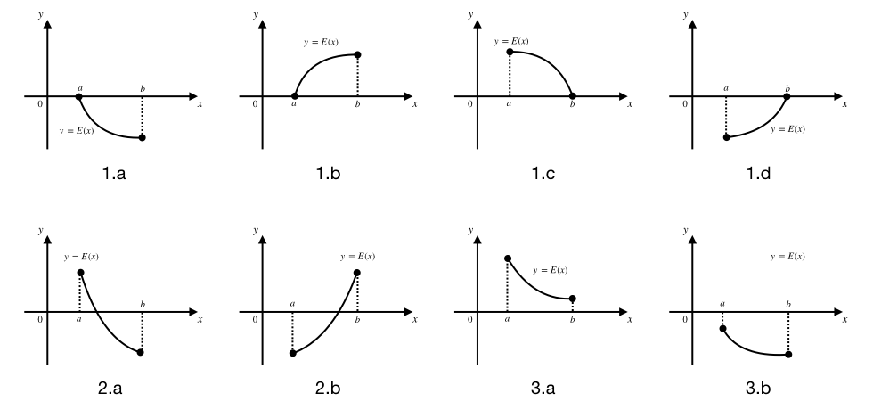
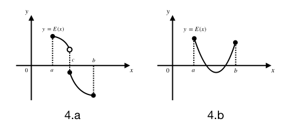
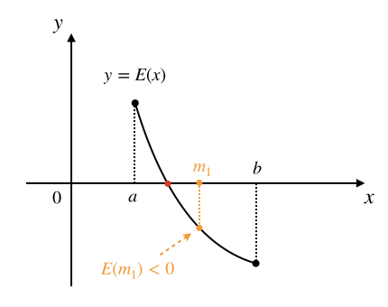
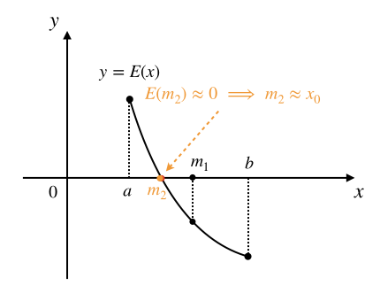

二分迭代法求方程根
++++++++++++++++++++++++

解方程，即求方程的根，是数学界永远的研究话题。有些方程很简单，比如小学就学过这样的简单方程 :math:`2x=4`，根为 :math:`x=2`。比较难一点的像初中数学的重中之重一元二次方程 :math:`ax^2+bx+c=0`，这是人类研究地最透彻的一种方程。人类使用数学方法可以解出很多方程的根，包括一元二次方程在内的许多方程类型都有完美的数学解法。但是更多的复杂方程类型是没有一套完善的解法的，比如高于二次的一元高次方程就没有完美的普遍适用的解法，它们只有一些特殊形式可以求解，比如 :math:`x^3=8`。

这一节我们学习怎么用计算机程序来求解一元方程的根。我们知道，对于任何一个一元方程，都可以通过把等号右边的所有项移动到等号左边的方式来整理成 :math:`E(x)=0` 的形式，其中 :math:`E(x)` 是关于变量 :math:`x` 的一个数学表达式。比如 :math:`x^3+3x+7=2x^2+1`，通过移项和整理就可以写成 :math:`x^3-2x^2+3x+6=0`。所以我们可以用通用的形式 :math:`E(x)=0` 来表示任何一元方程。

下一步我们把方程左边的表达式看成一个函数 :math:`y=E(x)`，于是求解方程 :math:`E(x)=0` 可以转化为这样一个问题：找到一个变量值 :math:`x_0`，使得函数值 :math:`y_0=E(x_0)` 等于零。

如果理解了上一步，我们就可以再进一步把这个代数问题用几何方法来考虑。我们都知道，任何一个一元函数 :math:`y=E(x)` 都可以在平面直角坐标系中画出图像来，通常是一根曲线，曲线上每一个点的坐标 :math:`(a,b)` 都满足 :math:`b=E(a)`。若 :math:`x_0` 是方程 :math:`E(x)=0` 的一个根，即 :math:`E(x_0)=0` 成立，那么它对应的函数值 :math:`y_0=E(x_0)` 一定就满足 :math:`y_0=0`。同时，它在函数图像上对应的点的坐标就是 :math:`(x_0,0)`。从几何意义上考虑，这个点是函数图像和横坐标轴的一个交点。如下图所示：

.. image:: ../../images/246_func_1.png

于是就有聪明人想到了一种方法，可以不停地用不同的 :math:`x` 值去计算 :math:`y=E(x)` 的值，一直试到某一次出现 :math:`y=0` 的时候，就找到了对应的一个方程根。这个方法挺起来不错，但是实行起来有点困难。

一方面，实数是无穷多的而且是稠密的，稠密的意思就是对于任意两个不相等的实数，无论它们的差有多小，在它俩之间总是有无穷多个实数存在，所以就没有办法像整数一样挨个儿举出一系列相邻实数来。对于这个问题，我们可以用设定根的精度来解决。比如规定根的精度为小数点后三位，这是最常用的一个精度，这样就意味着0的下一个“相邻”数是0.001，再下一个是0.002，依此类推，任意一个实数 :math:`a`，它的下一个“相邻”数就是 :math:`a+0.001`，这中间的数不会影响到精确度，所以我们就认为它们不存在了。这样一来我们就可以“穷举”实数了，在0到1之间，原本应该有无穷多个的实数现在实打实变成了1000个（不含1）。

上一个问题解决了，但是还有另一个方面的问题。方程是不是有根，如果有那么有多少个根，它们在数轴上都分布在什么位置？这几个问题的存在导致我们想“穷举”自变量的值却无从下手，从哪儿开始？到哪儿结束？测试出几个根来算结束？这些问题，实实在在地无法彻底解决。不过，如果我们能确定一些条件，使得上面这几个问题在一定范围内可以得到解决：

1. 有范围：即在一个确定的取值范围 :math:`x\in[a,b]` 内进行求根，闭区间 :math:`[a,b]` 表示大于等于 :math:`a` 且小于等于 :math:`b`。

2. 无断点：即当 :math:`x\in[a,b]` 范围内时，函数的图像是一条连续的曲线，中间没有间断点。

3. 单调性：即当 :math:`x\in[a,b]` 范围内时，函数要么单调递增，要么单调递减，不会出现水平线，也不会出现波浪线。

如果方程对应的函数 :math:`y=E(x)` 具有上述三个特点，那么我们就有办法知道方程在 :math:`x\in[a,b]` 范围内的根的数量，共有三种情况：

1. :math:`E(a)=0` 或 :math:`E(b)=0`：即有一个根恰好在某个端点处，就是 :math:`a` 或 :math:`b`，不会有其他根了。

2. :math:`E(a)` 和 :math:`E(b)` 异号：即一正一负，那么方程必定有且只有一个根，这个根位于 :math:`a` 和 :math:`b` 之间的某处。

3. :math:`E(a)` 和 :math:`E(b)` 同号：即同正同负，那么方程必定无根。

下图展示了一些满足上述条件的情形，很好理解：

图1.a到1.d是第1种情况，恰有一根在区间端点处，因为函数是单调的，所以在另外任何地方都不会再和 :math:`x` 轴相交了。

图2.a和图2.b是左右端点处函数值异号的情况，由于函数连续而且单调，函数图像就像一根细线，两头分别在 :math:`x` 轴的两侧，所以一定会穿过 :math:`x` 轴一次，并且只有一次。

图3.a和图3.b是左右端点处函数值同号的情况，这时候函数图像这根细线的两头在 :math:`x` 轴的同一侧，由于连续性和单调性，这个细线一定不可能穿越 :math:`x` 轴。

这里一定要记住，函数 :math:`y=E(x)` 在 :math:`x\in[a,b]` 这一区间上必须同时具有连续性和单调性，缺一不可，比如下图的两种情况：

图4.a是函数不连续的情况，虽然它在左右两个端点处函数值异号，但是因为它中间不连续，所以可以直接跳过 :math:`x` 轴，造成无根。图4.b是函数不单调的情况，不单调的函数可能存在多个根。

总之，一旦函数在区间 :math:`[a,b]` 上缺失连续性或者单调性，那么这个范围里有没有根，有多少个根这个问题就无法预判了。如果遇到这种情况，只能逐个 :math:`x` 值地蛮力测试，无法使用二分迭代法。

.. hint::

   连续而且单调，这样的条件听起来很苛刻，其实所有初等函数都是连续的。初等函数就包括了常见的所有线性函数、幂函数、多项式函数、指数函数、对数函数、三角函数、反三角函数、双曲函数、反双曲函数......并且，所有初等函数通过有限次的加减乘除或者复合组合出来的函数还是初等函数！可以说，在中学阶段能遇到的函数，除了某些刻意安排的分段函数以外，几乎都是连续的。而且这些初等函数的单调性和单调区间在数学上都是可以分析求解的。

   所以函数在某个区间上连续而且单调，这种情况其实是大量存在的，这个条件并不苛刻。

因此，如果要在区间 :math:`[a,b]` 上求解方程 :math:`E(x)=0`，而且已经知道了函数 :math:`y=E(x)` 在这个区间上连续且单调，就可以很方便地根据端点值 :math:`E(a)` 和 :math:`E(b)` 确定根的3种情况。情况1和情况3可以直接得到结果，情况2可以通过二分迭代法来进行快速求根。下面我们看一下二分迭代法求根的原理和算法。

假如函数 :math:`y=E(x)` 是下图所示的这样一个在区间 :math:`[a,b]` 上连续且单调递减的函数，设它的图像和 :math:`x` 轴的交点位于点 :math:`(x_0,0)` 处，那么我们要求的根就是这个 :math:`x_0`。

.. image:: ../../images/246_func_2.png

我们可以用这样的方法来循环地逐步逼近这个根：先求区间中点 :math:`m_1=(a+b)/2`，计算函数值 :math:`E(m_1)`：

计算后发现 :math:`E(m_1)\lt0`，由于这是一个递减函数，端点值总是左正右负，所以我们把区间的右端点改成 :math:`m_1`。区间于是减半为 :math:`[a,m_1]`，而且可以保证根 :math:`x_0` 还是在新的区间内，然后用同样的方法进行下一轮迭代。

第2轮迭代基于新的区间 :math:`[a,m_1]`，先求区间中点 :math:`m_2=(a+m_1)/2`，求出 :math:`E(m_2)`：

计算后发现 :math:`E(m_2)` 已经非常接近0了，已经满足了根的精度要求，就可以认为已经求得了方程 :math:`E(x)=0` 的根 :math:`x_0\approx m_2`。

总结上面的过程，我们就可以得出二分迭代法求方程根的算法框架。但是在实际设计算法并编写C++程序的时候，还有两个地方需要特殊处理：

1. 前面说过，由于实数的稠密性，大多数情况下很少能真正出现某次中间值 :math:`E(m_k)=0` 的情况，同时由于计算机使用的浮点数天生存在误差，即使某个中间值应该确实等于0，计算机计算出来的值很可能是0.0001或者-0.000019之类的有误差的数值。因此我们在判断一个值是不是等于0的时候，不能用 ``if (x == 0.0)`` 这样去判断，而是应该判断它的绝对值是不是小于某个很小的数，这个数我们称为\ :strong:`零点误差`，一般取 :math:`10^{-4}` 到 :math:`10^{-9}` 之间的某个很小的小数。具体取到多小，视题目的要求而定，在求方程根的问题中，一般 :math:`10^{-6}` 就足够了。

2. 方程求根问题一般会规定一个根的精度要求，通常都是要求保留小数点后2位或3位，即解得的答案和真正的根之间可以接受的最大误差为 :math:`10^{-2}` 或者 :math:`10^{-3}`，我们称之为\ :strong:`精度误差`。它不同于零点误差，往往中间值还没有达到小于零点误差时，迭代过程已经让区间长度缩小到精度误差以内了，这时候再迭代下去已经没有意义了。所以我们还要对求根区间的长度进行控制，一旦发现其已经满足题目规定的答案精度要求，就结束迭代，并把当时的区间中点就认为是方程的根。简单地说，迭代过程每迭代一次都会让区间长度减半，如果减到足够小了，我们就认为根已经找到了，就是当时的区间中点。

综上所述，二分迭代法求方程 :math:`E(x)=0` 根的算法框架如下：

.. admonition:: 二分迭代法求根算法

   :math:`\text{Solve}(a,b,ACC)`: // a,b为求根区间左右端点，ACC为根的精度误差

      :math:`\text{IF  }E(a)\approx0\text{  THEN  RETURN  }a` // 约等于0表示绝对值小于零点误差

      :math:`\text{IF  }E(b)\approx0\text{  THEN  RETURN  }b`

      :math:`\text{IF  }E(a)\lt0\text{  THEN  }inc\leftarrow true` // inc表示是否递增

      :math:`\text{WHILE  }b-a\gt ACC\text{  DO}`

         :math:`m\leftarrow(a+b)/2`

         :math:`\text{IF  }E(m)\approx0\text{  THEN RETURN  }m`

         :math:`\text{IF  }m\lt0\text{  THEN}`

            :math:`\text{IF  }inc=true\text{  THEN  }a\leftarrow m\text{  ELSE  }b\leftarrow m`

         :math:`\text{ELSE}`

            :math:`\text{IF  }inc=true\text{  THEN  }b\leftarrow m\text{  ELSE  }a\leftarrow m`

      :math:`\text{RETURN  }(a+b)/2`

在实际编程中，方程求根问题往往会在题目中给出一些可以利用的已知条件。有时候会事先知道函数的增减性，这样就不需要在程序中判断了；有时候题目会直接告诉你根不在区间端点处，这样算法又可以省略一些步骤。这种情况会很多，读题的时候要学会判断题目中给出的条件，也要会自行对方程对应的函数进行一些数学上的分析，得到一些隐藏的条件。总之，算法会根据不同的问题而有所不同，不能生搬硬套算法框架。

接下来我们先看一个比较简单的实例，求-1000000到1000000之间任意实数的立方根。下一节我们再单独学习一个来自洛谷网站的更复杂一些的实际问题。

求正负一百万之间任意实数的立方根
^^^^^^^^^^^^^^^^^^^^^^^^^^^^^^^^^^^^^^^^

(待续)
