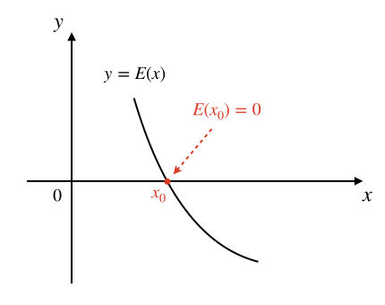
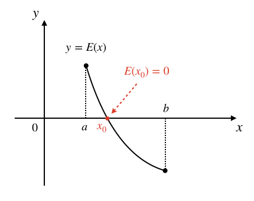

二分迭代法求方程根
++++++++++++++++++++++++

解方程，即求方程的根，是数学界永远的研究话题。有些方程很简单，比如小学就学过这样的简单方程 :math:`2x=4`，根为 :math:`x=2`。比较难一点的像初中数学的重中之重一元二次方程 :math:`ax^2+bx+c=0`，这是人类研究地最透彻的一种方程。人类使用数学方法可以解出很多方程的根，包括一元二次方程在内的许多方程类型都有完美的数学解法。但是更多的复杂方程类型是没有一套完善的解法的，比如高于二次的一元高次方程就没有完美的普遍适用的解法，它们只有一些特殊形式可以求解，比如 :math:`x^3=8`。

这一节我们学习怎么用计算机程序来求解一元方程的根。我们知道，对于任何一个一元方程，都可以通过把等号右边的所有项移动到等号左边的方式来整理成 :math:`E(x)=0` 的形式，其中 :math:`E(x)` 是关于变量 :math:`x` 的一个数学表达式。比如 :math:`x^3+3x+7=2x^2+1`，通过移项和整理就可以写成 :math:`x^3-2x^2+3x+6=0`。所以我们可以用通用的形式 :math:`E(x)=0` 来表示任何一元方程。

下一步我们把方程左边的表达式看成一个函数 :math:`y=E(x)`，于是求解方程 :math:`E(x)=0` 可以转化为这样一个问题：找到一个变量值 :math:`x_0`，使得函数值 :math:`y_0=E(x_0)` 等于零。

如果理解了上一步，我们就可以再进一步把这个代数问题用几何方法来考虑。我们都知道，任何一个一元函数 :math:`y=E(x)` 都可以在平面直角坐标系中画出图像来，通常是一根曲线，曲线上每一个点的坐标 :math:`(a,b)` 都满足 :math:`b=E(a)`。若 :math:`x_0` 是方程 :math:`E(x)=0` 的一个根，即 :math:`E(x_0)=0` 成立，那么它对应的函数值 :math:`y_0=E(x_0)` 一定就满足 :math:`y_0=0`。同时，它在函数图像上对应的点的坐标就是 :math:`(x_0,0)`。从几何意义上考虑，这个点是函数图像和横坐标轴的一个交点。如下图所示：

于是就有聪明人想到了一种方法，可以不停地用不同的 :math:`x` 值去计算 :math:`y=E(x)` 的值，一直试到某一次出现 :math:`y=0` 的时候，就找到了对应的一个方程根。这个方法挺起来不错，但是实行起来有点困难。

一方面，实数是无穷多的而且是稠密的，稠密的意思就是对于任意两个不相等的实数，无论它们的差有多小，在它俩之间总是有无穷多个实数存在，所以就没有办法像整数一样挨个儿举出一系列相邻实数来。对于这个问题，我们可以用设定根的精度来解决。比如规定根的精度为小数点后三位，这是最常用的一个精度，这样就意味着0的下一个“相邻”数是0.001，再下一个是0.002，依此类推，任意一个实数 :math:`a`，它的下一个“相邻”数就是 :math:`a+0.001`，这中间的数不会影响到精确度，所以我们就认为它们不存在了。这样一来我们就可以“穷举”实数了，在0到1之间，原本应该有无穷多个的实数现在实打实变成了1000个（不含1）。

上一个问题解决了，但是还有另一个方面的问题。方程是不是有根，如果有那么有多少个根，它们在数轴上都分布在什么位置？这几个问题的存在导致我们想“穷举”自变量的值却无从下手，从哪儿开始？到哪儿结束？测试出几个根来算结束？这些问题，实实在在地无法彻底解决。不过，如果我们能确定一些条件，使得上面这几个问题在一定范围内可以得到解决：

1. 有范围：即通过一些方法（比如数学的分析，或者干脆就是题目里给出的）能够知道根的取值范围，用闭区间 :math:`[a,b]` 表示，意思是方程如果有根，那么根一定大于等于 :math:`a` 且小于等于 :math:`b`。

2. 无断点：即当 :math:`x\in[a,b]` 范围内时，函数的图像是一条连续的曲线，中间没有间断点。

3. 单调性：即当 :math:`x\in[a,b]` 范围内时，函数要么单调递增，要么单调递减，不会出现水平线，也不会出现波浪线。

如果方程对应的函数 :math:`y=E(x)` 具有这样的特点，那么我们就可以确定方程在 :math:`x\in[a,b]` 的范围内是不是有解，如果有的话我们还可以保证，解只有一个，不多不少正好一个。大概有这么三种情况：

1. :math:`E(a)=0` 或 :math:`E(b)=0`：即有一个根恰好在某个端点处，就是 :math:`a` 或 :math:`b`，不会有其他根了。

2. :math:`E(a)` 和 :math:`E(b)` 异号：即一正一负，那么方程必定有且只有一个根，这个根位于 :math:`a` 和 :math:`b` 之间的某处。

3. :math:`E(a)` 和 :math:`E(b)` 同号：即同正同负，那么方程必定无根。

下图展示了满足条件的恰有一根的情形，很好理解：

(待续)
