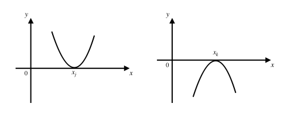
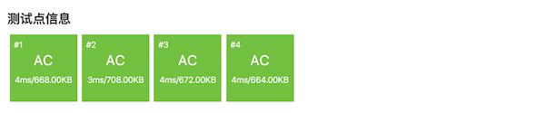

一元三次方程求解（洛谷P1024）
++++++++++++++++++++++++++++++++++++++

要完成洛谷P1024题“一元三次方程求解”，我们需要灵活应用二分迭代法，利用题目中给出的额外条件设计出合理的迭代过程。另外我们还需要学习一些和多项式有关的预备知识

.. index:: 快速多项式算法

快速多项式算法
^^^^^^^^^^^^^^^^^^^^^^^^^^

一个n阶多项式在数学上的定义为这样一个式子：:math:`P(x)=a_0+a_1x+a_2x^2+\cdots+a_nx^n`\ 。现在给定任意实数 :math:`x`\ ，要计算这个多项式的值。最简单的蛮力计算法为了计算出每一项 :math:`a_1x,a_2x^2,\dots,a_nx^n`\ ，共需要做 :math:`1+2+\cdots+n` 次乘法，这显然是 :math:`O(n^2)` 时间的。我们现在已经很有经验了，一看就知道这个方法不好，因为重复计算非常的多。

第二种方法可以这样，我们先建立一个长度为n的数组，然后从头到尾分别计算和存放 :math:`x,x^2,\dots,x^n` 的值，这个计算过程中后一个值可以用前一个值乘上 :math:`x` 来得到（有点类似计算前缀和，或许我们可以给它取个名字叫前缀积），一共需要n-1次乘法，然后再各自乘上自己对应的系数，这样整个计算过程需要进行2n-1次乘法。这就快了许多，但是还不够快！而且增加了空间使用，所以还不是我们真正要学习掌握的最好算法。

那么最好的算法怎么来计算多项式呢？我们先来看具体的例子，再来归纳出一个一般的算法。

零阶多项式，也就是常数多项式 :math:`P(x)=a_0`\ ，这个不需要计算。

一阶多项式 :math:`P(x)=a_0+a_1x`\ ，这个没法简化。按照常规，先计算 :math:`a_1x`\ ，然后加上常数项系数 :math:`a_0` 即可，一共需要进行1次乘法。

二阶多项式 :math:`P(x)=a_0+a_1x+a_2x^2`\ ，我们可以先在后面两项中提出一个 :math:`x`\ ，整理成 :math:`P(x)=a_0+x(a_1+a_2x)`\ 。现在我们可以先计算括号中的值 :math:`P_1=a_1+a_2x`\ ，这是一个一阶多项式。接下来原式就变成了 :math:`P(x)=a_0+P_1x`\ ，这还是一个一阶多项式。通过这种方法，我们用2次乘法就完成了二阶多项式的求值。

同理，三阶多项式也可以分解成3个一阶多项式的求值：

.. math::

   P(x)=a_0+a_1x+a_2x^2+a_3x^3=a_0+(a_1+a_2x+a_3x^2)x=a_0+(a_1+(a_2+a_3x)x)x

用这个方法，我们可以把任何一个n阶多项式 :math:`P(x)=a_0+a_1x+a_2x^2+\cdots+a_nx^n` 分解成n个一阶多项式的求值：

.. math::
   
   \begin{align}
   P_1 &= a_{n-1}+a_nx\\
   P_2 &= a_{n-2}+P_1x\\
          &\vdots\\
   P_n &= a_0+P_{n-1}x\\
   P(x)   &= P_n
   \end{align}

整个计算过程只需要n次乘法，这是目前最快的实数多项式求值算法，可以描述成下面这样的算法框架：

.. admonition:: 快速多项式求值算法

   :math:`\text{Polynomial}(a_0,a_1,\cdots,a_n,x):`

      :math:`P\leftarrow a_n`

      :math:`\text{FOR  } i \leftarrow n-1 \text{  TO  } 0 \text{  DO}`

         :math:`P \leftarrow a_i + P\cdot x`

      :math:`\text{RETURN  }P`

在本节后面的程序代码中我们讲看到用这个算法计算三阶多项式的C++函数。

多项式方程的根：奇穿偶不穿
^^^^^^^^^^^^^^^^^^^^^^^^^^^^^^^^^^^^^^^^

接下来我们要了解多项式方程 :math:`P(x)=0` 的根的性质。这部分为高中数学内容，初中阶段属于数学竞赛知识，若看不懂无需强求，可以跳过。如果能有所了解，记住结论就更好了。

设 :math:`P(x)` 为任意n阶多项式，根据代数定理，它对应的多项式方程 :math:`P(x)=0`\ ，通常称为一元n次方程的，可能有0到n个不同的实数根。也就是说，它可以无解也可以有解，如果有解，它可能只有1个实根，也可能有2个不同的实根，......，最多可以有n个不同的实根，都有可能。

假设我们可以把方程通过多项式因式分解变形成下面这样的形式：

.. math::

   P(x)=(x-x_1)^{m_1}(x-x_2)^{m_2}\cdots(x-x_k)^{m_k}

其中 :math:`1\le k \le n`\ ，:math:`x_1,x_2,\dots,x_k` 是 :math:`k` 个互不相等的常数，:math:`m_1,m_2,\dots,m_k\ge1` 且满足 :math:`m_1+m_2+\cdots+m_k=n`\ 。

这样，这个方程就有 :math:`k` 个不同的实根 :math:`x_1,x_2,\dots,x_k`\ 。整数 :math:`m_1,m_2\dots,m_k` 称为对应的根的\ :strong:`重数`\ ，根 :math:`x_i` 称为方程的一个 :math:`m_i` 重根，其中重数为1的根称为\ :strong:`单根`\ ，重数大于1的称为\ :strong:`重根`\ 。

例如：方程 :math:`x^2-4x+3=0` 有两个根 :math:`x_1=1` 和 :math:`x_2=3`\ ，这个方程可以变形成 :math:`(x-1)(x-3)=0`\ ，所以 :math:`x_1` 和 :math:`x_2` 都是方程的单根。方程 :math:`x^2-2x+1=0`\ ，经过整理可以变形为 :math:`(x-1)^2=0`\ ，它只有一个2重根 :math:`x_{1,2}=2`\ 。

再如：方程 :math:`x^3-6x^2+11x-6=0` 可以因式分解成 :math:`(x-1)(x-2)(x-3)=0`\ ，它有三个单根 :math:`x_1=1,x_2=2,x_3=3`\ 。方程 :math:`(x-1)^2(x-3)=0` 有一个单根 :math:`x_1=3` 和一个2重根 :math:`x_{2,3}=1`\ 。而方程 :math:`(x+2)^3=0` 则只有一个3重根 :math:`x_{1,2,3}=-2`\ 。

.. admonition:: 补充

   事实上，并不是所有多项式都可以因式分解成上面这样完美的形式的，比如 :math:`x^3+8` 在实数域内就只能分解成 :math:`(x+2)(x^2-2x+4)`\ 。

.. warning::

   这里牵涉到一个特别容易被误解的概念：重根，即重数大于1的根。在代数学上，一个m重根并不是一个根，而是m个根，只不过这m个根的数值相等！这一基本概念一定要记住，非常重要。

.. admonition:: 补充之后的补充

   有人可能听说过“代数学基本定理”这个东西，代数学这一条特别特别重要的基本定理说：一元n次方程一定恰好有n个根，其中重根按重数计为多个根。

   那么无解的方程，比如 :math:`x^2+2=0` 怎么算？那些不能完美因式分解的方程又要怎么算？比如刚才提到过，:math:`x^3+8=0` 就只能因式分解为 :math:`(x+2)(x^2-2x+4)=0`\ ，似乎只有一个单根 :math:`x_1=-2`\ 。事实上，我们前面一直在描述的都是针对\ :strong:`实数根`\ 而言的，初中所学的实数并不是数的全部，在实数以外还有\ :strong:`虚数`\ ，实数和虚数还能组合成\ :strong:`复数`\ 。代数学基本定理所说的恰有n个根是指一定恰好有n个复数根。

接下来是我们真正要关心的问题：一元n次方程 :math:`P(x)=0` 的实根，能不能用二分迭代法求解？

根据前面一节的介绍，一个方程的根能不能使用二分迭代法求解，有“范围”、“连续”、“单调”三个条件。其中求解的取值范围这个条件，一般是作为条件在问题中明确给出的，或是不言而喻的。而多项式函数 :math:`y=P(x)` 经过一些高等玄学的证明，也早已知道了在实数域内都是连续的。问题的关键在于单调性条件，严格地说，在包含一个根的某个前后相邻区间内，函数 :math:`y=P(x)` 是否单调？这种某个数 :math:`x_0` 的前后相邻区间，数学上叫做 :math:`x_0` 的\ :strong:`邻域`\ ，指区间 :math:`[x_0-\delta,x_0+\delta]`\ 。:math:`\delta` 是一个任意的正实数，称为邻域的\ :strong:`宽度`\ 。很不幸的是，这里确实存在某些根在它的任何邻域里函数 :math:`y=P(x)` 都不单调的情况。情况一共有两种：

有些根 :math:`x_i`\ ，总能找到一个正数 :math:`d`\ ，使得在它的任何宽度小于 :math:`d` 的邻域内函数 :math:`y=P(x)` 都是单调的。不失一般性，我们假设函数单调递增。那么对于任意正数 :math:`\delta`\ ，只要 :math:`\delta\le d`\ ，就都满足 :math:`P(x_i-\delta)\lt P(x_i)=0` 和 :math:`P(x_i+\delta)\gt P(x_i)=0`\ ，所以函数的图像在这个根附近就是“穿 :math:`x` 轴而过”的。同时我们知道，只要确定能确定任何一个小于等于 :math:`d` 的宽度，就可以把这个宽度的邻域作为求值范围来进行二分迭代求解。

另一种不太友好的情况就是，某些根 :math:`x_j`\ ，在其任何一个邻域内函数 :math:`y=P(x)` 都不单调，此时函数图像在这个根处和 :math:`x` 轴相切，而不是穿过，如下图：

例如 :math:`y=x^2` 的图像就在 :math:`x=0` 处和 :math:`x` 轴相切。这种根就没法用二分迭代法来求解。

那么怎么判断一个根是穿过 :math:`x` 轴的那种呢还是与之相切的那种？经过一些现在可以忽略不谈的玄学分析，我们有以下结论：凡是重数为偶数的重根都是和 :math:`x` 轴相切的根，单根和重数为奇数的根则都是穿 :math:`x` 轴而过的那种根。这在高中数学里是一个必备知识，有一个很好记的别名，叫做\ :strong:`“奇穿偶不穿”`\ 。大家记住就好。

另外，从上面这个结论我们又可以得到一个重要的推论：\ *如果一元n次方程恰有n个不同的实根，那么所有这些实根在其邻域内多项式函数都是单调的，可以用二分迭代法求解。*

接下来，我们就可以开始做题了。

.. index:: 【一元三次方程求解】, 〖洛谷P1024〗

洛谷P1024问题题解
^^^^^^^^^^^^^^^^^^^^^^^^^^

**题目描述**

有形如：:math:`ax^3+bx^2+cx^1+dx^0=0` 这样的一个一元三次方程。给出该方程中各项的系数( :math:`a,b,c,d` 均为实数)，并约定该方程存在三个不同实根(根的范围在 :math:`-100` 至 :math:`100` 之间)，且根与根之差的绝对值 :math:`\ge 1`\ 。要求由小到大依次在同一行输出这三个实根(根与根之间留有空格)，并精确到小数点后 :math:`2` 位。

提示：记方程 :math:`f(x)=0`\ ，若存在 :math:`2` 个数 :math:`x_1\lt x_2` 使得 :math:`f(x_1) \cdot f(x_2)<0`\ ，则在 :math:`(x_1,x_2)` 之间一定有一个根。

**输入格式**

一行，:math:`4` 个实数 :math:`A,B,C,D`\ 。

**输出格式**

一行，:math:`3` 个实根，并精确到小数点后 :math:`2` 位。

**输入输出样例**

输入：

.. code-block:: none

   1 -5 -4 20

输出：

.. code-block:: none

   -2.00 2.00 5.00

**题目解析**

这是一个典型的二分迭代法求根问题。题目已经明确了要求的是一元三次方程，而且保证了有3个不同的实根。根据前面的预备知识，这三个根都是单根，都是穿 :math:`x` 轴的可以二分迭代求解的根。

但是题目没有明确给出每一个根附近的单调邻域，只是给了一个大的范围，三个根都在区间[-100,100]上。可是即然要二分迭代，那么单调的求根范围是必须要有的。经过仔细看题，我们发现有这样一个条件：根与根之差的绝对值 :math:`\ge 1`\ 。那么在任何一个长度为1的闭区间里，根的分布一共有四种情况：

1. 如果左端点为一个根，那么唯一有可能右端点还是一个根，这样就在左右端点处各有一个根，共2个根；
2. 左端点或右端点，某一个端点处有一个根；
3. 左右端点都不是根，但是二者的函数值异号，那么在区间内部必有一个根；
4. 左右端点都不是根，且二者的函数值同号，那么整个区间上无根。

这就好办了。我们可以把整个[-100,100]区间划分为200个长度为1的小区间：[-100,-99], [-99,-98], ... ,[99,100]，然后从左到右逐一地分析它们的情况，如果有根就求出来并记录下来。整个过程在三个根全部求出的时候就可以结束了。

对于任意一个小区间[m,m+1]，我们进行下面的分析：

1. 如果左端点是一个根，那么记录下这个根，并进入下一轮循环。因为如果左端点为根，那么下一个根至少是本区间右端点，但是本区间右端点可以交给下一个区间作为它的左端点去处理，所以此处可以直接进入下一轮循环。但要注意这里有一个小漏洞，至于是什么小漏洞我们留到程序里再说明，请在看到最后的程序之前自己先思考一下是个什么漏洞。
2. 如果左端点不是根，那么判断右端点。如果右端点是根，记录下之后，将循环跳到下下个区间。因为如果本区间的右端点是根，那么下一个根至少是下一个区间的右端点，也就是下下个区间的左端点，所以可以直接跳过下一个区间而进入下下个区间。
3. 如果两个端点处都不是根，那么按二分迭代法的标准做法，先判断区间内有无根存在（同时可以完成增减性判断），若有根则二分迭代求出来。

好了，下面是就是代码了。对了，你知道前面所说的那个小漏洞是什么了吗？你知道该怎样补上这个漏洞吗？

.. literalinclude:: ../../codes/247_p1024.cpp
   :language: c++

现在，你看懂这个漏洞是怎么回事了吗？你能不能给出另一种修补的方法呢？有一种一句语句都不需要增加，只是对现有某一句语句进行小小的修改的方法，你能想出来吗？

Anyway，就算不弥补这个小漏洞，洛谷的四个测试点里也没有安排类似 :math:`x^3-199x^2+9900x=0` 这样的恶心数据。但是洛谷的测试数据简单并不代表我们不需要追求完美，没有漏洞应该是每一个编程人的终极追求。

最后看看AC截图，我们利用了线性时间的快速多项式求值算法之后，这个程序的运行速度是非常快的。

