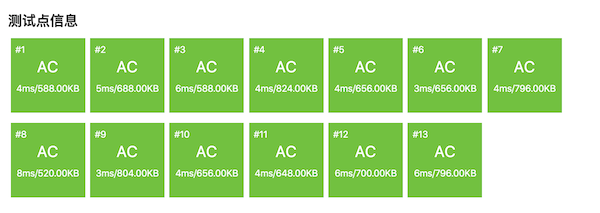

.. index:: 【切绳子】, 〖洛谷P1577〗

二分法例题：切绳子（洛谷P1577）
++++++++++++++++++++++++++++++++++++++++

**题目描述**

有 :math:`N` 条绳子，它们的长度分别为 :math:`L_i`。如果从它们中切割出 :math:`K` 条长度相同的绳子，这 :math:`K` 条绳子每条最长能有多长？答案保留到小数点后2位(直接舍掉2位后的小数)。

**输入格式**

第一行两个整数 :math:`N` 和 :math:`K`，接下来 :math:`N` 行，描述了每条绳子的长度 :math:`L_i`。

**输出格式**

切割后每条绳子的最大长度。

**输入输出样例**

输入：

.. code-block:: none

   4 11
   8.02
   7.43
   4.57
   5.39

输出：

.. code-block:: none

   2.00

**说明/提示**

对于 :math:`100\%` 的数据：:math:`0\lt L_i \le 100000.00, 0\lt n\le10000, 0\lt k\le10000`

**题目解析**

这又是一个经典的二分法问题，虽然和前一节的跳石头问题表面上看起来很不同，但是通过分析我们可以发现它们俩的本质惊人的相似。

这个题目有一个设定很反常，它用小数来表示绳子的长度。如果真的长度可以是任意的小数，那就很麻烦了，因为实数是稠密的无法穷举的，而计算机浮点数又是不精确的。幸亏题目描述里讲了，答案保留小数点后2位，更关键的是括号里的说明：直接舍掉2位后的小数！这就意味着，如果把绳子长度乘以100再强制类型转换为整数，是不会造成误差的。因为输入的绳子长度最多就是2位小数。另外，按照C++的整数运算规则，不能整除时直接舍弃小数部分，这不正是题目里说的直接舍弃2位后的小数吗？所以本题看上去是一个基于小数运算的问题，实质上还是一个基于整数的算法。

根据题目给出的数据范围，长度最多为 :math:`100000.00`，乘100之后是 :math:`10^7`。所以我们完全可以用一个int型数组来存放这些数据，在读数时，先将数据读入到一个double型临时变量 ``temp`` 中，然后赋值 ``(int)(temp * 100)`` 给对应的数组元素就可以了。整个算法就使用整数进行处理，得到的结果也是整数，输出时只要除回100.0以变回浮点数，输出格式保留2位小数就可以了。

.. tip::

   要知道算法题真的很少很少会需要处理小数的，就算有，我们也都会想尽一切方法来转换成等价的整数处理。所以在遇到数据涉及小数的题目时，首先要想一下能不能改成用整数，当然前提是不会带来误差而且不会让算法复杂度大幅度增加。

搞定了没人喜欢的小数之后，问题就更容易分析了，接下来的分析我们就都使用转换过的整数了。

首先，本题的解是一个长度值，是一个整数，很显然它的取值范围为 :math:`1` 到 :math:`M=\max_i\{L_i\}`，即所有绳子长度中的最大值。整数是天然有良序的，所以我们可以进一步分析是不是可以使用二分法来求解。

那么如果给出任意一个候选解 :math:`m\in[1,M]` 上的任意一个整数值，能不能找到一种方法来判断它和真正的解之间的顺序关系呢？我们可以尝试去切割长度为 :math:`m` 的绳子，看看能切得多少段，这个段数就是候选解的判断依据。模拟切割的过程非常简单，用每一根绳子的长度去除 :math:`m`，把得到的商累加起来就是了。如果能切割得到比 :math:`K` 段更多的绳子，说明这个候选解 :math:`m` 小了，我们下一步可以尝试切割更长的长度。如果得到的绳子段数比 :math:`K` 小，则说明候选解大了，下一步应该尝试切割更短一点的长度。但是要小心，和跳石头问题类似，刚好等于 :math:`K` 并不代表 :math:`m` 就是真正的解。因为与 :math:`m` 前后相邻的其他候选解也可能会切出相同的绳子段数来。

就拿题目的样例数据来说，乘以100转整型后四条绳子的长度分别为802、743、457和539。假如候选解 :math:`m=350`，从四条绳子里分别可以切出2段、2段、1段和1段长度为350的绳子，总共可得6段。但是候选解如果是 :math:`m=300`，结果也是可以切割出6段来。当然了，300和350之间的每一个候选解都可以切割出6段与之等长的绳子来。

因此和跳石头问题一样，本题候选解的判断依据也是有重复的，但可以确保所有判断依据相等的候选解都是连续地排在一起的，也就是说，候选解排好序之后，它们的判断依据值也是相应有序的。那么本题即然是要求可切得 :math:`K` 条长度相同的绳子时的“最大”长度，显然如果候选解满足判断依据等于 :math:`K` 时，我们应该进一步尝试比它更大的候选解，以便找到可能的最大长度。所以本题又是一个边界查找问题，同样是要找右边界的前一个位置，和跳石头问题一模一样。

然而本题和跳石头问题存在一个重要的不同点，其实在前面的分析过程中已经暴露了这个不同点，但是可能大家并没有注意到。通过把候选解和它们的判断依据视作一个虚拟的数组我们可以清楚地看到这个差异。当然了，虚拟数组的下标 :math:`m` 代表候选解，下标0的元素就当它不存在好了。数组元素 :math:`q[m]` 就是 :math:`m` 对应的判断依据，即切割长度为 :math:`m` 的绳子能切得的段数。当我们去填写数组的第一个元素 :math:`q[1]` 和最后一个元素 :math:`q[M]` 时，我们就会发现，如果以所有绳子长度中的最大值 :math:`M` 为长度去切割，那么长度为 :math:`M` 的绳子原本有几条，能切割得到的绳子就有几条，最少可能只有一条；如果以长度 :math:`1` 去切割，那么能切割得到的绳子数量等于所有绳子长度之总和 :math:`L=L_1+L_2+\cdots+L_N`。数组大概会是下面这个样子：

.. code-block:: none

     m:    0   1   2   3   4   5   6   7   8   9   ...   M
         +---+---+---+---+---+---+---+---+---+---+-----+---+
   q[m]: |   | L | 9 | 9 | 9 | 8 | 8 | 8 | 8 | 7 | ... | 1 |
         +---+---+---+---+---+---+---+---+---+---+-----+---+

这个数组里元素值是按照逆序排列的！

再来回顾整理前面所述的尝试和判断规则，如果我们用二分法查找右边界，左右端点和中间点仍然沿用 ``left、right、mid`` 这三个变量名，查找规则如下：

1. 如果 ``q[mid] >= K``，那么下一步应该查找后半段：``left = mid + 1``。
2. 如果 ``q[mid] < K``，那么下一步应该查找前半段：``right = mid - 1``。

是不是和“通常”的右边界查找规则恰好反了？反了就对了，说明我们的分析过程和结论都是正确的，会和通常的规则恰好相反就是因为这次判断依据是逆序的。

.. tip::

   本题这样的判据逆序，如果只是在脑子里想，对于初学者来说还是挺烧脑的。试着去画一画判断依据的数组，填一下最小候选解和最大候选解的对应元素值，这往往会是一个帮助整理思路的好方法。

不管怎样，算法仍然是二分查找右边界，并返回右边界前一位置（\ ``right``\ ）。例如 :math:`K=9`，那么解就是最后一个元素9的位置下标：4。所以返回的还是 ``right``。

到此为止，应该已经可以写出正确的程序了吧？请大家在看下面的代码之前先自己试一试，然后对比下面的代码。

.. literalinclude:: ../../codes/249_p1577.cpp
   :language: c++

AC截图：

可以看出，速度非常快，二分法的特点就是速度快。这个程序使用的算法，主架构是一个二分边界查找，是 :math:`O(\log M)` 的量级。在每一轮查找里，我们要对所有 :math:`N` 条绳子进行切割，即一次整数除法，然后还要累加起来，这个是 :math:`O(N)` 时间的。所以整个算法的工作量为 :math:`O(N\log M)` 量级。

.. attention::

   很多人会误以为这是一个类似 :math:`O(n\log n)` 时间的算法，比二阶算法快，比线性算法略慢。其实不然，它实际上是一个 :math:`O(Nm)` 时间算法，严格说属于二阶时间复杂度。为什么？因为二分查找的右端点 :math:`M` 不是一个“数据的数量”，而是一个“数据的值”，它的性质和“绳子的条数” :math:`N` 是不同的。

   数据规模是用于衡量算法时间复杂度的参数，按照真正的定义，这个参数应该是指数据在计算机中储存的长度，以二进制位（bit）为计量单位。

   如果一个参数是“数据的数量”，比如这里的绳子条数 :math:`N`，每一个数据对应一个int变量，即32个bits，那么 :math:`N` 代表的数据规模就是 :math:`32N` 个bits。当它用做数据规模的参数来计算时间复杂度时，常数系数32可以忽略，所以 :math:`O(32N)` 就是 :math:`O(N)`。

   如果一个参数是“数据的值”，比如这里的绳子最大长度 :math:`M`，它是一个整数，假设其二进制数共有 :math:`m` 位，则有 :math:`2^m\le M\le 2^{m+1}-1`，所以 :math:`O(M)` 实际上代表的是 :math:`O(2^m)`，是指数型的！

   因此，我们这个程序的算法时间复杂度 :math:`O(N\log M)`，实际上是 :math:`O(N\log 2^m)=O(Nm)`，是一个二阶算法。但是题目规定了绳子的最大长度乘100转整型后不会超过int的取值范围，也就是说 :math:`m\le31`，所以这个 :math:`m` 很小，虽然是个二阶时间算法但实际上非常接近线性时间的。

最后留一个问题。在本题中，题目描述已经明确了绳子长度、绳子条数和要求切割得到的绳子段数都大于0，所以我们的二分查找左端点是从1开始的。还记得上一节的跳石头问题吗？那个题目就比较恶心，它保留了数据为0的可能性，使得算法的左端点要从0开始。

那么假如本题也改成有可能出现绳子为0条，或者所有绳子的长度都为0的情况呢？要怎么处理？这里把左端点也改成从0开始可以吗？请仔细地思考一下这个问题，并完成洛谷P2440“木材加工”。
