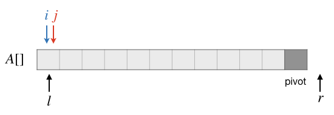
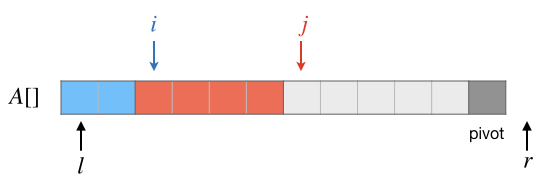
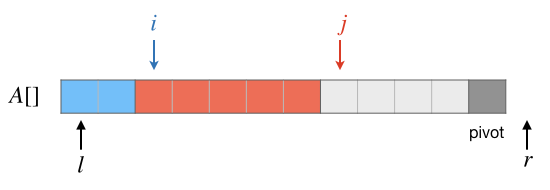
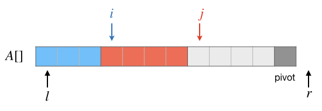
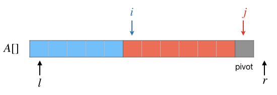
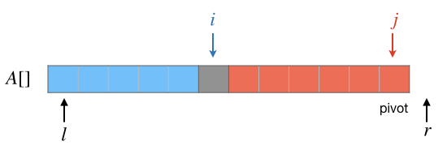

快速排序
++++++++++++++++

:strong:`快速排序`，简称\ :strong:`快排`，简单粗暴的算法名称彰显了目前为止人类所发明的最快的排序算法的霸气。快速排序是目前实际应用中速度最快的排序算法，它是一种不稳定的排序算法，实际应用中大量使用优化过的快排算法来进行不稳定排序，大多数编程语言内置的排序功能，比如C++语言algorithm库中的 ``sort()`` 函数、Java语言的容器排序方法等，都是基于快排的优化排序算法。

快速排序基于递归分区的思想进行设计，其基本思想分为三步：

1. 在待排序的序列中选出一个元素作为\ :strong:`基准(pivot)`；
2. 对序列进行分区，将小于基准值的元素分在左半边，大于基准值的元素全部分在右半边，基准值在中间，至于等于基准值的元素，放在左边还是右边都没有关系；
3. 分别对分区后形成的左半边和右半边再递归进行分区，直到分区的长度为1为止。

序列分区方法
^^^^^^^^^^^^^^^^

可见快速排序的关键步骤是对一段序列进行分区。由于上述第2步中对于那些等于基准值的元素到底放哪一边是无所谓的，导致在现实中存在很多种不同版本的分区代码写法。其实这些写法实际效果都是一样的，只要在分区之后，序列以某一个位置为界，此元素的值等于基准值，它之前的所有元素都小于等于基准值，它之后的元素都大于等于基准值就可以了。

网上介绍最多的是一种版本是选择待分区序列的第一个元素为基准，从两头开始向中间逐个比较元素，先从后向前找第一个小于基准值的元素将其放到前面，然后从前向后找第一个比基准值大的元素将其放到后面，不断循环这个过程直到前后两个位置交错了整个过程就结束了，最后把基准值插到中间交错的地方就可以了。这种方法是网上流传最广的方法，有许多的网页在详解这个分区过程，许多初级算法教材也用这种方法进行分区，大家可以自己去搜索相关资料学习。

前面这种分区方法虽然不是很难但是也不算简单，要理解它的原理不难，但是要准确地写出正确代码来却不是很容易，它对于两个哨兵位置的控制很精细，不容易一下子完全写对，而且不容易记住。另一个问题是代码需要在一个大循环内部嵌套两个小循环，小循环之外还可能要进行一些判断（有些写法需要，有些写法不需要）。最后一个问题，根据内部两个哨兵判断条件的不同，可以进行大于小于的判断，也可以进行大于等于或小于等于的判断，造成这种方法的写法纷繁复杂，在网上搜索，四篇文章里可能会出现四种不同的写法，给初学者造成很大困扰。

所以我们在这里将介绍另一种分区方法，来自被奉为经典的《算法导论》一书中使用的分区方法。这种方法画风就完全不同了，它只用一个从头到尾遍历每一个元素的循环来进行分区，没有前后的哨兵，没有嵌套的循环，思路和代码都相对简单，容易理解和记忆。要知道分支和判断都是开销比较大的结构，少用它们就能让代码的运行效率有所提高。而且《算法导论》这本书相当专业，不太适合中小学阶段的算法初学者，所以在教学网站、教材上都鲜有介绍这种分区方法的。因此我们特意把它拿出来，请大家学习记住这种方法。

.. attention::

   如果大家试着去看过《算法导论》，或者在网站上看过对该书中快速排序算法的解读，会发现在《算法导论》中所有的序列都是从1开始计数的。这是因为这本书是脱离开任何具体的编程语言而讲解纯粹的算法的，书中没有任何具体的程序，都是高度抽象的。但是我们在初学算法的时候使用C++语言，所以要改成符合C++习惯的从0开始计数，序列范围用含头不含尾规则来表示。

设序列为 :math:`A`，要分区的子序列范围为 :math:`[l, r)`，即从 :math:`A[l]` 到 :math:`A[r-1]`。我们将使用子序列的最后一个元素 :math:`A[r-1]` 为基准值，令 :math:`pivot\leftarrow A[r-1]`。然后我们将把范围 :math:`[l, r-1)` 划分为三段，第一段的范围为 :math:`[l, i)`，里面的元素都是小于基准值的，第二段的范围为 :math:`[i, j)`，里面的元素都是大于基准值的，第三段的范围为 :math:`[j, r-1)`，里面是还没有完成分区的元素。

初始的时候，因为还没有进行过分区，所以范围 :math:`[l, r-1)` 内的所有元素都属于第三段，因此我们初始化 :math:`i=j=l`，这样第一段的范围为 :math:`[l, i)=[l, l)` 即是一个元素都没有，第二段的范围为 :math:`[i, j)=[l, l)`，同样也是空的，而第三段的范围为 :math:`[j, r-1)=[l, r-1)` 就是所有待分区的元素。初始的状态如下图：

接下来使用位置 :math:`j` 从头到尾逐个将每一个元素和基准值 :math:`pivot` 进行比较，直到 :math:`j=r-2` 即元素 :math:`A[r-2]` 为止，逐步建立起正确的第一段和第二段。在此过程中的处理方法很简单，假设在某一步已经建立了如下图所示的三段，蓝色为小于基准值的第一段，红色为大于等于基准值的第二段，淡灰色为尚待处理的第三段：

下一步要处理的是当前 :math:`j` 所指向的元素 :math:`A[j]`。先看 :math:`A[j]\ge pivot` 的情况，这种情况下，:math:`A[j]` 应该放在第二段中，所以这时什么都不需要做，继续下一个元素的判断即可。结果如下图：

假如 :math:`A[j]\lt pivot`，那么要把 :math:`A[j]` 的值放到第一段中去。观察上面的图可以发现，受益于含头不含尾的规则，此时第一段的右端点位置 :math:`i` 恰好值向着第二段的第一个元素，所以我们只要交换 :math:`A[i]` 和 :math:`A[j]` 的值，并且把 :math:`i` 移动到下一个位置就可以继续下一个元素的判断了。结果如下图：

上述这个过程循环下去，直到最后一个元素 :math:`A[r-2]` 处理完毕，这时候的情况应该如下图所示：

最后要把 :math:`pivot` 这个值插入到两段中间去，可以发现这时候正好 :math:`A[j]=pivot`，而且 :math:`i` 正好指向第二段的第一个元素。所以很简单地，让 :math:`A[r-1]\leftarrow A[i]`，然后让 :math:`A[i]\leftarrow pivot` 就可以了。真个分区过程至此结束，结果如下图：

.. tip::

   处理刚开始的时候，把 :math:`A[r-1]` 的值作为基准值暂存在了临时变量 :math:`pivot` 中，所以在分区处理过程中出现要交换元素值的时候，:math:`A[r-1]` 可以直接用做交换值的中间变量，真是便利啊！

记住，分区结束后，要把基准元素最后所在的位置作为返回值返回出去，这个方法的返回值就是 :math:`i` 的值。

光看上面这样的描述可能还是有点糊涂，让我们来看一看《算法导论》书中给出的一个实例，给整数序列 [2, 8, 7, 1, 3, 5, 6, 4] 进行分区。

.. code-block:: none

   1: 初始状态：
        j
        v
    [|| 2  8  7  1  3  5  6 | 4 ]
        ^
        i
   2: 第1次比较，A[j] < pivot，所以交换 A[i] 和 A[j]，并 ++i，然后 ++j 进入下一轮
           j
           v
    [ 2 || 8  7  1  3  5  6 | 4 ]
           ^
           i
   3: 第2次比较，A[j] >= pivot，所以什么都不做，直接 ++j 进入下一轮
              j
              v
    [ 2 | 8 | 7  1  3  5  6 | 4 ]
          ^
          i
   4: 第3次比较，A[j] >= pivot，所以什么都不做，直接 ++j 进入下一轮
                 j
                 v
    [ 2 | 8  7 | 1  3  5  6 | 4 ]
          ^
          i
   5: 第4次比较，A[j] < pivot，所以交换 A[i] 和 A[j]，并 ++i，然后 ++j 进入下一轮
                    j
                    v
    [ 2  1 | 7  8 | 3  5  6 | 4 ]
             ^
             i
   6: 第5次比较，A[j] < pivot，所以交换 A[i] 和 A[j]，并 ++i，然后 ++j 进入下一轮
                       j
                       v
    [ 2  1  3 | 8  7 | 5  6 | 4 ]
                ^
                i
   7: 第6次比较，A[j] >= pivot，所以什么都不做，直接 ++j 进入下一轮
                          j
                          v
    [ 2  1  3 | 8  7  5 | 6 | 4 ]
                ^
                i
   8: 第7次比较，A[j] >= pivot，所以什么都不做，直接 ++j 进入下一轮
                             j
                             v
    [ 2  1  3 | 8  7  5  6 | 4 ]
                ^
                i
   9. 至此 j 抵达最后一个位置，比较结束，将 A[i] 值填入 A[j]，pivot 的值填入 A[i]
                             j
                             v
    [ 2  1  3 | 4 | 7  5  6  8 ]
                ^
                i
   10. 分区结束，返回位置 i

从上面的示例可以看出：

1. 假设待分区序列一共有 :math:`k` 个元素，那么总共需要进行元素比较 :math:`k-1` 次，属于 :math:`O(k)` 时间。
2. 位置 :math:`i` 从 :math:`l` 开始，每发生一次元素交换，就增加1，所以整个分区过程中总共需要进行的元素交换次数等于 :math:`i-j`，即分区后基准值所在位置位于整个序列中的相对位置。
3. 当待分区序列本身严格增序的时候，例如 [1,2,3,4,5] 这样的序列，每一次元素比较都是 :math:`A[j]\lt pivot`，所以每次比较都会造成元素交换，共交换 :math:`n-1` 次，这是效率最低的情况。
4. 当待分区序列逆序（并不需要严格逆序）的时候，每一次元素比较都是 :math:`A[j]\ge pivot` 的情况，所以不会产生元素交换，这是分区效率最高的情况。
5. 当待分区序列严格增序或者逆序（并不需要严格逆序）的时候，划分出的左右两个区域有一个分区长度为0，另一个长度为 :math:`n-1`，基准值元素位于序列的头部或尾部。

上述分区过程可以写成一个工具函数，用以今后在快排主函数中调用：

.. literalinclude:: ../../codes/254_quick_sort.cpp
   :language: c++
   :lines: 1-2, 5-6, 20-33

快速排序的实现和分析
^^^^^^^^^^^^^^^^^^^^^^^^^^^^^^

有了分区算法之后，快速排序就变得很简单了。按照算法的思路，我们可以写出下面的算法伪代码：

.. admonition:: 快速排序算法

   :math:`\text{QuickSort}(A, l, r)`

      :math:`\text{IF  }r-l\le 1\text{  THEN  RETURN}`

      :math:`p\leftarrow\text{  Partition}(A, l, r)`

      :math:`\text{QuickSort}(A, l, p)`

      :math:`\text{QuickSort}(A, p+1, r)`

.. admonition:: 练习

   请完成快速排序算法的程序，输入输出和前一节归并排序程序的要求相同，利用前一节实验环节提供的随机整数序列生成工具来测试运行，并和归并排序进行速度比较。

快速排序算法是一种不稳定的排序算法，这一点还是留给大家自己去思考。

在空间方面，大家记住快排的空间复杂度为 :math:`O(\log n)` 即可。这是因为虽然快速排序的每一层递归都只用了常数个额外的变量，但是在递归的下层还没有返回之前，上层使用的额外变量不会被释放掉，所以要把整个递归深度中每一层额外使用的变量空间累加起来。

下面我们来看看快速排序的时间复杂度。快速排序的时间复杂度分析比较复杂，和每一次分区所分成的左右两个子序列长度有关。

最好的情况，每一次分区都把原序列均匀地划分成长度相等（或相差1个元素）的左右两个子序列。根据算法的描述，我们可以写出总工作量的递推公式如下：

.. math::

   W_{best}(n)=2W({n\over2})+O(n)=O(n\log n)

加号前面的项表示对分区得到的两个长度相等子序列的两次递归调用，后面的 :math:`O(n)` 表示分区所需要的工作量，这在前面已经说过，是线性时间的。这种情况下时间复杂度就和归并排序是一样的了，经过迭代计算或者绘制递归树可以得到最好情况下快速排序的时间复杂度为 :math:`O(n\log n)`。

但是事实上要每次分区都这么完美地分成等长的左右两半是不太可能的，平均情况需要依照概率分析来获得。我们以每一次分区后基准值元素最终的位置在原序列中的相对位置来进行测算。如果用 :math:`l,r,p` 分别来表示原序列的左端点位置、右端点位置和基准元素最终的位置，那么这个相对位置就可以表示成：

.. math::

   p^\prime = \frac{p-l}{r-l-1}

当 :math:`p=l` 即分区后基准元素落在了序列头部，那么相对位置 :math:`p^\prime=0`，此时左半部分为空，除基准元素为所有其他元素都在右半部分；当 :math:`p=r-1` 即分区后基准元素落在了序列尾部，那么相对位置 :math:`p^\prime=1`，此时右半部分为空，除基准元素为所有其他元素都在左半部分；其余情况则会产生一个在0和1之间的相对基准位置。

在一次分区之后，:math:`p^\prime` 的值决定了接下来两次递归调用快速排序的工作量分配，其中左半边子序列的递归调用工作量为 :math:`p^\prime\cdot n`，右半边工作量为 :math:`(1-p^\prime)\cdot n`。整个快排过程的工作量是每一次这样的工作量分配的综合，每一次分区产生的这个相对基准位置的平均值（数学期望） :math:`E[p^\prime]` 就决定了递归的时候工作量怎么分配。

假设原序列中元素的无序程度是随机的而且均匀的，即每一个元素出现在任何一个位置的概率都是相等的，那么经过一系列数学运算可以得到 :math:`E[p^\prime]=0.5`。这个计算过程大家现在不需要太在意，记住结论就好，或者直观的想一想，应该是这样的吧，对吧？总之在这种情况下，快速排序的总工作量在每次分区此起彼伏地共同影响之下，平均下来的期望值仍然是：

.. math::

   W_{avg}(n)=W\bigl(E[p^\prime]\cdot n \bigr)+W\bigl((1-E[p^\prime])\cdot n \bigr)+O(n)=2W({n\over2})+O(n)=O(n\log n)

平均情况下，快速排序的时间复杂度也是 :math:`O(n\log n)`。

可是快速排序有一种最差情况，当待排序的原序列本身就有序的情况下，每一次分区得到的结果总是会一个子序列为空，除了基准元素以外的所有元素全部在另一个子序列中。注意，各种不同版本的分区方法在什么叫“本身有序”这个概念上是有所区别的，需要具体分析一下。对于我们这种分区方法，基准元素为序列最后一个元素，所有严格小于它的元素分在左边，大于等于它的元素分在右边，因此如果待分区的子序列本身是严格升序的，那么分完之后所有元素在左边而且仍然保持严格升序，右边为空。这样的话如果整个待排序序列都是严格升序，那么整个排序过程中每一次分区都会产生这样的结果，这就造成了最差情况，总工作量如下分配：

.. math::

   W_{worst}(n)=W(n-1)+O(n)=W(n-2)+O(n-1)+O(n)=\cdots=O(2)+\cdots+O(n)=O(n^2)

经过迭代计算，发现最坏情况下快速排序的时间复杂度为 :math:`O(n^2)`。通过直观观察，我们可以发现造成这种坏结果的根本原因是“不断重复无效劳动”，快速排序退化成了冒泡排序（使用别的一些分区方法的快排可能会退化成选择排序）。

快速排序的优化
^^^^^^^^^^^^^^^^^^^^

虽然快排存在最坏情况的退化问题，但并不影响它成为最优秀的不稳定排序算法，一般情况下它的实际工作量比其他 :math:`O(n\log n)` 排序算法（归并、堆排）要小，运行速度是最快的。至于最坏情况，除了一些故意恶心人的算法竞赛题以外，实际应用中很少出现把一个已经排好序的序列拿来用快速排序再排一次的情况。所以快速排序仍然是实际应用中速度最快、应用最广泛的不稳定排序算法。

当然了，为了尽量避免和最差情况不期而遇，在实际应用中快速排序算法一般都会从两个方面进行优化。一是采用随机化选择基准元素的方法来把最差情况变成平均情况，二是当排序的序列中元素数量较少的时候直接用二分插入进行排序而不是继续递归下去。

第二种优化方法我们在前一节归并排序的优化实验中已经做过练习，这里就不再赘述。

第一种优化是更为重要的，它的原理和实现都很简单，就是每次分区的时候我们不再固定选择序列的头元素或者尾元素或者任何一个确定位置的元素作为基准，而是随机选一个元素出来作为基准元素。这样就能把已经有序的序列人为地打乱成平均情况，对于本来就是平均情况的，再打乱一遍也不会有什么不良影响。采用这种优化之后，快排理论上能够对所有情况达到 :math:`O(n\log n)` 的时间效率。

要实现随机化选取基准元素，我们只需要在快排主函数开始分区之前，利用 ``rand()`` 函数在 :math:`[l, r)` 这个范围内生成一个随机数 :math:`t`，然后交换 :math:`A[t]` 和 :math:`A[r-1]` 就可以了，非常简单，代码片段如下：

.. literalinclude:: ../../codes/254_quick_sort.cpp
   :language: c++
   :lines: 1-4, 9-10, 38-51

不过千万要记住，调用 ``quick_sort()`` 函数开始排序之前，先用 ``srand(time(NULL));`` 语句种一下随机数种子。

.. admonition:: 练习

   参照上一节的实验，对快速排序和二分插入排序在不同数据量下的运行速度进行对比，确定一个优化阈值，当排序的子序列长度小于该阈值的时候不再递归调用快排，而是用二分插入排序直接完成该子序列的排序。

   按照上面的实验结果，完成优化的快速排序算法，使其同时具有两种优化能力。最后比较优化前和优化后两种快速排序算法在速度上的差距。

分区的应用：快速k位数算法
^^^^^^^^^^^^^^^^^^^^^^^^^^^^^^^^^^^^

利用分区的方法，可以设计一种二分的k位数算法，当然由于分区不一定每次都能得到二分的结果，所以实际运行效果只能是在平均情况下接近于二分，但平均情况也是 :math:`O(\log n)` 的时间效率。

观察分区的方法，我们先从整个无序序列 :math:`A` 进行划分，返回基准元素最终所在的位置 :math:`p` 作为划分结果的分界线。可以看出来，在元素 :math:`A[p]` 之前一共有 :math:`p` 个元素 :math:`A[0],\dots,A[p-1]` ，它们都比 :math:`A[p]` 小；它后面的所有元素 :math:`A[p+1],\dots,A[r-1]` 则都大于等于它。因此 :math:`A[p]` 就是整个序列中第 :math:`p+1` 小的元素，即 :math:`p+1` 位数。

如果我们要找的k位数恰好满足 :math:`k=p+1`，那么太好了，:math:`A[p]` 就是我们要的答案。如果 :math:`k\lt p+1`，那么说明要找的k位数在这次分区得到的前一部分里面，所以我们就可以在 :math:`[0, p)` 范围内继续进行划分，尝试能不能恰好分到 :math:`k=p+1` 的结果。同样的，如果 :math:`k\gt p+1`，那么说明要找的k位数在这次分区得到的后一部分里面，所以下一步在 :math:`[p+1, r)` 范围内继续尝试划分。

这个循环可以一直进行下去，总有一次能够得到我们要的结果 :math:`k=p+1`，算法如下：

.. admonition:: 快速k位数算法

   :math:`\text{kthNumber}(A, l, r, k):`

      :math:`\text{WHILE  }true\text{  DO}`

         :math:`p\leftarrow\text{  Partition}(A,l,r)`

         :math:`\text{IF  }k= p+1\text{  THEN  RETURN  }A[p]`

         :math:`\text{IF  }k\lt p+1\text{  THEN  }r\leftarrow p`

         :math:`\text{ELSE  }l\leftarrow p+1`

和普通的快速排序一样，此算法在极为罕见的最好情况下可以达到二分法的效果，通常的平均情况下也是 :math:`O(\log n)` 时间。但是存在序列本身有序的最差情况，这时候就会退化成逐个比较的 :math:`O(n^2)` 时间。同样的，在每一次分区之前对基准元素进行随机化可以消除这种最坏情况，使算法达到平均 :math:`O(\log n)` 的时间复杂度。

这个快速k位数算法是一个非常简单实用的算法，容易编程，速度也很快。相比其他 :math:`O(\log n)` 时间的k位数算法更适合于竞赛和考场使用，请务必自己练习一遍它的编程实现。

.. admonition:: 练习

   编写一个寻找k位数的程序，要求无论什么情况都能达到 :math:`O(\log n)` 时间。输入为两行，第一行两个整数 :math:`n,k`，:math:`0\lt k\le n\le 10^5`，第二行为 :math:`n` 个在int型取值范围内的整数，两数之间用一个空格分隔。输出为一行，一个整数，即输入的 :math:`n` 个整数中第 :math:`k` 小的数。

   请自行修改前一节实验中提供的工具 ``randints.cpp``，使其能够接收 :math:`n,k` 两个输入并生成符合本练习所需输入数据格式的数据。用这个工具对本次练习的程序进行大数据量测试。

