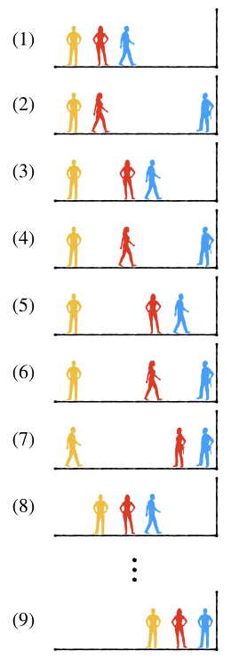

组合生成算法
++++++++++++++++++++++++

组合的生成算法和排列生成算法类似，但是更加简单。组合生成算法同样可以分为\ :strong:`索引组合生成`\ 和\ :strong:`原地组合生成`\ 两类，也可以按照运行模式的不同分为\ :strong:`循环模式`\ 和\ :strong:`迭代模式`\ 两类。

由于组合不关心元素之间顺序的特殊性质，实际问题中选取数一般总是少于元素总数，也很少出现需要在一个序列上原地去构建组合的情况。另外，当元素本身是取值不连续或者类型不同的时候，比如要对这样的一个元素集合 :math:`\{3.14, \pi, 2^{\pi}, {22\over7}, \log\pi \}` 进行五选三的组合，这种情况下要做原地组合生成也没有什么太好的算法。所以一般我们不建议使用原地生成组合的方法，而是生成索引组合，利用索引表去完成组合的选取。例如对于任何五选三的组合，我们只要能生成出下面这样十张索引表，就可以利用它们来对应到相应位置上的元素，从而完成所有的十种选择了：

.. code-block:: none

   [0, 1, 2]
   [0, 1, 3]
   [0, 1, 4]
   [0, 2, 3]
   [0, 2, 4]
   [0, 3, 4]
   [1, 2, 3]
   [1, 2, 4]
   [1, 3, 4]
   [2, 3, 4]

循环索引组合
^^^^^^^^^^^^^^^^^^^^^^^^^^^^

循环模式生成索引的组合，和循环生成排列的原理是一样的，就是利用嵌套循环来进行选取。比如最简单的 :math:`n` 选 :math:`1` 的情况，只要一个单循环就可以遍历出从 :math:`0` 到 :math:`n-1` 的所有索引了：

.. code-block:: c++

   for (int index = 0; index < n; ++index) { // 选出并消费第 index 号元素 }

生成 :math:`n` 选 :math:`2` 的组合比生成 :math:`n` 取 :math:`2` 的排列简单不少。因为组合不关心元素之间的顺序关系，例如 {1,2} 和 {2,1} 二者是同一个组合，所以当外层循环已经选定了第一个元素的索引 :math:`i`，内层循环在选取第二个元素索引 :math:`j` 的时候不需要考虑 :math:`i` 之前的那些索引了，内层循环总是从它的外层循环当前选定的索引之后开始就可以。因此也就不需要设计什么是否已经占用的标志了，代码就会变得简单许多：

.. code-block:: c++

   for (int i = 0; i < n; ++i) {
           for (int j = i + 1; j < n; ++j) {
                   // 得到索引表 [i, j]，调用消费者函数
           }
   }

:math:`n` 选 :math:`3` 的组合无非就是内部再嵌套一层循环，如下所示：

.. code-block:: c++

   for (int i = 0, i < n; ++i) {
           for (int j = i + 1; j < n; ++j) {
                   for (int k = j + 1; k < n; ++k) {
                           // 得到索引表 [i, j, k]，调用消费者函数
                   }
           }
   }

要选的元素数量 :math:`m\le3` 时，就这样直接嵌套循环即可。:math:`m\gt 3` 时简单的嵌套循环就会变成典型的箭头形代码，此时就需要参考循环生成排列所用的方法，递归构造多层嵌套循环。

生成组合的嵌套循环在改写成递归模式的时候更加简单，没有额外的标志需要维护。递归函数还是需要有一个参数来表示当前的嵌套层数，最外层为 :math:`0`，最内层为 :math:`m-1`，最外层开始的时候要动态分配生成好空索引表，结束时要释放掉索引表的空间。层数达到 :math:`m` 的时候就调用消费者函数并结束递归。但是现在每一层循环的起点变得不同，最外层循环总是从0开始，所有内层循环则从它的上层循环所选定的索引位置的后一个索引开始。请看下面的示例程序：

.. literalinclude:: ../../codes/265_choose.cpp
   :language: c++

.. admonition:: 练习

   将上面的示例程序中的消费者函数改为输出索引表，并且尝试修改其代码，使得可以不用 ``start`` 这个辅助变量。完成之后多用几种 :math:`n,m` 值运行一下，看看生成的索引组合有什么规律。

迭代索引组合
^^^^^^^^^^^^^^^^^^^^^^^^^^^^

索引的组合经过仔细观察也是有规律可循的。我们先规定索引表里的每一项索引值都是升序排列的，就如循环嵌套生成的索引表一样，即 ``index[0] < index[1] < ... < index[m-1]``。然后以五选三的十种索引表为例，按照上面的练习中看到的索引表生成顺序，观察索引表中三个位置上索引值的变化规律。为了观察方便，下面用小括号来表示 ``index[0]`` 所选中的位置，方括号表示 ``index[1]`` 所选中的位置，花括号表示 ``index[2]`` 所选中的位置：

.. code-block:: none

   [0, 1, 2]  ==>  (0) [1] {2}  3   4
   [0, 1, 3]  ==>  (0) [1]  2  {3}  4
   [0, 1, 4]  ==>  (0) [1]  2   3  {4}
   [0, 2, 3]  ==>  (0)  1  [2] {3}  4
   [0, 2, 4]  ==>  (0)  1  [2]  3  {4}
   [0, 3, 4]  ==>  (0)  1   2  [3] {4}
   [1, 2, 3]  ==>   0  (1) [2] {3}  4
   [1, 2, 4]  ==>   0  (1) [2]  3  {4}
   [1, 3, 4]  ==>   0  (1)  2  [3] {4}
   [2, 3, 4]  ==>   0   1  (2) [3] {4}

不难看出，从第一个索引组合 {0,1,2} 到最后一个 {2,3,4} 逐个变化的过程有一个明显的“行动模式”。每一次改变都是最后一个索引 ``index[2]`` 尝试向后移动一个位置，如果它已经在最后的位置而不能再后移了。那么就尝试让它的前一个索引 ``index[1]`` 后移一个位置，``index[1]`` 如果成功的后移了一个位置的话，那么 ``index[2]`` 就回到 ``index[1]`` 后面那个位置。如果 ``index[1]`` 也已经在它所能到达的最后一个位置了，那么就尝试后移 ``index[0]``，然后 ``index[1]`` 和 ``index[2]`` 整体回到紧挨着 ``index[0]`` 的后面。如果连 ``index[0]`` 也已经抵达它所能抵达的最后位置了，那么就没有哪个索引值可以后移了，迭代就结束了。

形象地说，这个过程就好像几个人在离开一堵墙一定距离的位置上排成一列纵队，离墙壁最近的是队尾，最远的是队头。接下来按照这样的规则整个队伍慢慢向墙壁靠近：

:math:`(1)` 队尾的人先开始一步一步向墙壁走去。:math:`(2)` 当他走到墙边，倒数第二个人开始向墙边走。:math:`(3)` 倒数第二个人只走一步就停下来了，同时把队尾那个人叫回来仍然排在自己身后，接下来还是由队尾的人一步一步向墙边走去。:math:`(4),(5),(6)` 就这样，队尾每抵达墙边一次，倒数第二个人就向墙边走一步并把队尾叫回自己身后，然后继续上述过程。:math:`(7)` 直到后面两个人都抵达了墙边，谁也不能再向后走动的时候，队首那个人开始向墙边走。:math:`(8)` 当然他也是每次只走一步，走完一步就停下来并把后面那两个在墙边动弹不得的人叫回自己身后，然后继续从队尾那个人开始，按照前面所描述的规则向墙壁逐步移动...... :math:`(9)` 直到三个人都抵达墙边的时候，整个过程就结束了。

上面这个移动规则很容易扩展到任意 :math:`m` 个人的情况，无非是不断重复这个过程：从后向前找第一个还能走动的人，让他向后走一步，然后把他身后的所有已经走到头的人叫回他的身后去，直到所有人都走到了自己的尽头位置。也很容易从中归纳出索引组合迭代的算法规则，大概分成下面三步：

1. 从 ``index[m-1]`` 开始向前找第一个还没有达到最大值的索引，假设其为 ``index[i]``。

   很容易总结出每一个索引的最大值，最后一个索引 ``index[m-1]`` 的最大值为最后位置 ``n-1``，倒数第二个索引 ``index[m-2]`` 的最大值就是倒数第二大的位置 ``n-2``，依此类推，第一个索引 ``index[0]`` 的最大值就是 ``n-m``。实际上我们并不需要为任一具体索引 ``index[i]`` 计算它的最大值，只要随着从后向前查找的过程从 ``n-1`` 开始逐渐递减就可以了。

2. ``++index[i]``，这一步就不需要多解释了吧。

3. 从 ``index[i+1]`` 开始一直到最后一个索引 ``index[m-1]``，逐个把它们的值变成比各自的前一个索引值大1，也就是把后面的所有索引值都重新排回 ``index[i]`` 位置的后面。

现在就很容易根据这个算法编写出和迭代排列函数功能类似的索引组合迭代函数了，下面这个程序功能与前面的示例程序相同，使用迭代的方法实现：

.. literalinclude:: ../../codes/265_next_combination.cpp
   :language: c++

.. admonition:: 练习

   仿照上例中的 ``next_combination()`` 函数，编写逆序迭代索引组合的函数 ``prev_combination()`` 并进行测试。

排列组合生成的时间复杂度
^^^^^^^^^^^^^^^^^^^^^^^^^^^^^^

排列数和组合数的量级都是非常大的，而且会随着 :math:`m` 的取值而变化。

对于排列数 :math:`P_n^m`，若考虑 :math:`m` 是一个定值，:math:`n` 为数据规模。当 :math:`m=1` 时，排列数 :math:`P_n^1` 为线性 :math:`O(n)`；当 :math:`m=2` 时为 :math:`O(n^2)`，此后随着 :math:`m` 的不断增大，量级会迅速攀升，但只要 :math:`m` 还是一个定值，那么总是 :math:`m` 阶的多项式级别 :math:`O(n^m)`。但若 :math:`m` 随着 :math:`n` 同时增大，那么排列数的增长量级会直接超过指数级，:math:`m` 越接近 :math:`n` 就越趋向于阶乘级，而最恐怖的全排列 :math:`P_n^n` 就是 :math:`O(n!)` 阶乘级的。C++最大的内置整型数仅能容纳到 :math:`P_{20}^{20}`。

组合数的量级要比排列数小很多，但仍很大。若考虑 :math:`m` 为定值，:math:`n` 为数据规模，考虑对称性，令 :math:`k=\min\{m,n-m\}`，:math:`C_n^m` 的量级为 :math:`O(n^k)`，是 :math:`k` 阶多项式级别。但是如果 :math:`m` 随着 :math:`n` 的增大而增大，事情就会迅速失控，甚至比排列数的情况更糟糕，会接近于幂指数级别。极限状态为 :math:`m` 始终等于 :math:`\lfloor{n\over2}\rfloor`，那就确确实实的成为了 :math:`O(n^{\lfloor{n\over2}\rfloor})`，恐怖的幂指数级别。C++最大的内置整型数仅能容纳到 :math:`C_{62}^{31}`。

所以在选择排列组合生成算法时必须要注意数据规模，稍大一点的数据规模马上会让循环生成模式成为mission impossible，这种时候最好改成迭代模式，并且要事先妥善确定好迭代方案，包括迭代起点和迭代方向。这些选择是至关重要的。

为了对排列组合生成的实际运行速度有一个直观的感性认识，请认真完成下面的练习。

.. admonition:: 练习

   使用循环生成的方式，:math:`n` 值从小到大地尝试生成全排列，测试生成时间，记录下生成时间超过1ms、10ms、100ms、500ms、1s这几个时间点时的 :math:`n` 值，试一试还能耐着性子等到生成完毕的最大 :math:`n` 值。

   用同样的方式完成循环生成索引组合的时间测试，不同点是 :math:`n` 的取值范围可以更大一些，:math:`m` 总是取中间值。

.. warning::

   在上述实验过程中，如果生成时间比较长，千万不要死等下去，果断用Ctrl-C结束程序，否则可能等到海枯石烂。

练习做完之后，请牢牢地记住实验结果，在今后实际编程遇到排列组合生成问题时确保心中有数。
