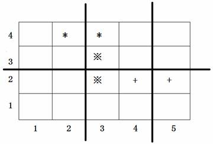

.. index:: 【排座椅】, 〖洛谷P1056〗

复杂排序技巧例题：排座椅（洛谷P1056）
++++++++++++++++++++++++++++++++++++++++++++++

**题目描述**

上课的时候总会有一些同学和前后左右的人交头接耳，这是令小学班主任十分头疼的一件事情。不过，班主任小雪发现了一些有趣的现象，当同学们的座次确定下来之后，只有有限的 :math:`D` 对同学上课时会交头接耳。

同学们在教室中坐成了 :math:`M` 行 :math:`N` 列，坐在第 :math:`i` 行第 :math:`j` 列的同学的位置是 :math:`(i,j)`，为了方便同学们进出，在教室中设置了 :math:`K` 条横向的通道，:math:`L` 条纵向的通道。

于是，聪明的小雪想到了一个办法，或许可以减少上课时学生交头接耳的问题：她打算重新摆放桌椅，改变同学们桌椅间通道的位置，因为如果一条通道隔开了 :math:`2` 个会交头接耳的同学，那么他们就不会交头接耳了。

请你帮忙给小雪编写一个程序，给出最好的通道划分方案。在该方案下，上课时交头接耳的学生的对数最少。

**输入格式**

第一行，有 :math:`5` 个用空格隔开的整数，分别是 :math:`M,N,K,L,D(2 \le N,M \le 1000,0 \le K \lt M,0 \le L \lt N,D \le 2000)`。

接下来的 :math:`D` 行，每行有 :math:`4` 个用空格隔开的整数。第 :math:`i` 行的 :math:`4` 个整数 :math:`X_i,Y_i,P_i,Q_i`，表示坐在位置 :math:`(X_i,Y_i)` 与 :math:`(P_i,Q_i)` 的两个同学会交头接耳（输入保证他们前后相邻或者左右相邻）。

输入数据保证最优方案的唯一性。

**输出格式**

共两行。

第一行包含 :math:`K` 个整数 :math:`a_1,a_2,\ldots,a_K`，表示第 :math:`a_1` 行和 :math:`a_1+1` 行之间、第 :math:`a_2` 行和 :math:`a_2+1` 行之间、...、第 :math:`a_K` 行和第 :math:`a_K+1` 行之间要开辟通道，其中 :math:`a_i \lt a_{i+1}`，每两个整数之间用空格隔开（行尾没有空格）。

第二行包含 :math:`L` 个整数 :math:`b_1,b_2,\ldots,b_L`，表示第 :math:`b_1` 列和 :math:`b_1+1` 列之间、第 :math:`b_2` 列和 :math:`b_2+1` 列之间、...、第 :math:`b_L` 列和第 :math:`b_L+1` 列之间要开辟通道，其中 :math:`b_i \lt b_{i+1}`，每两个整数之间用空格隔开（列尾没有空格）。

**输入输出样例**

输入：

.. code-block:: none

   4 5 1 2 3
   4 2 4 3
   2 3 3 3
   2 5 2 4

输出：

.. code-block:: none

   2
   2 4

**说明/提示**

上图中用符号*、※、+标出了 :math:`3` 对会交头接耳的学生的位置，图中 :math:`3` 条粗线的位置表示通道，图示的通道划分方案是唯一的最佳方案。

*2008 年普及组第二题*

**题解**

本题的算法思路是很简单的，但实际编程需要用到一些排序技巧，否则会变得比较复杂。

题目要求给出 :math:`K` 条行通道和 :math:`L` 条列通道，能够分隔开\ *“尽可能多”* 的交头接耳同学对，而且\ *“输入数据保证最优方案的唯一性”*，所以可以用一种非常简单粗暴的思路来解决问题（其实是一种贪心法的思路）：假设在所有行之间和列之间都开辟通道，计算出它们各自能隔离开的交头接耳同学对数，然后按照从多向少的原则，取 :math:`K` 条行通道和 :math:`L` 条列通道就是最优解了。

根据题目给出的数据范围可知，行、列通道可能的数量都是至少有1条，至多999条，用其下方的行号或左边的列号作为通道编号，则编号的范围就是1号到999号。故可以用两个长度为1000的数组来分别表示所有可能的行列通道，数组的下标就对应通道编号。

首先要计算每一条通道总共可以隔开的交头接耳学生对数，所以定义好通道数组后先初始化为全0，因为还不知道它们都能隔开多少对。随后在读入数据时，一边读取交头接耳学生对的行列坐标 :math:`(X,Y)-(P,Q)`，一边根据坐标值来判断出哪一条通道可以将其隔开，将相应通道的数组元素值加1。读完所有的学生对坐标后，这个统计工作就完成了。所以读入的学生对坐标并不需要保存下来，属于用过即扔的数据。

这里有一个需要注意的地方，题目并没有说输入数据中的交头接耳学生对坐标一定是左前右后的或下前上后的。换句话说，对于一左一右的情况，只能知道两位学生的行坐标相同 :math:`X=P`，但不能保证 :math:`Y\lt Q`，因此不能简单地以为此时通道编号就是 :math:`Y` 号列通道，而应该是是 :math:`\max\{Y,Q\}` 号列通道。对于一上一下的情况也是类似。在编程的时候可以使用algorithm库的 ``min()`` 函数来取最小值，不需要自己写判断语句或者三元表达式了，这是C++语言编程所推荐的方式。

对于每一套实际的测试数据，可能的行通道一共有 :math:`M-1` 条，列通道 :math:`N-1` 条。统计好它们各自能隔开的学生对数之后，需要对它们进行排序，然后分别取隔开学生对数最多的 :math:`K` 条行通道和 :math:`L` 条列通道就是最优解。听起来很简单，但是细想一下还是有一定的麻烦。

如果简单地对统计好的数组进行排序，排序结束之后就丢失了通道的编号信息了，比如我们确实可以得知隔开学生对数最多的通道到底隔开了几对交头接耳学生，但是却不知道这条通道是几号通道了。因此我们应该把通道编号（也就是数组的下标）一起带数据里去进行排序，而且这个附带进去的编号还不能影响排序结果，排的顺序仍然应该是按照“隔开的学生对数”的。这其实就是一个我们在排序这一节讲过的多关键字排序，主关键字是数组里原先统计好的数据，即“隔开的学生对数”，次关键字是“通道编号”，只有在主关键字相等的情况下才允许次关键字对局部的顺序产生影响。根据题目给出的取值范围，这两个关键字取值范围都不大，事实上都在1000以内，所以我们可以采用关键字拼接的技巧，把次关键字“通道编号”拼接到主关键字后面去，即数组元素的新值为原值乘1000再加上下标。

举例来说，如果2号通道可以隔开3对学生，那么就把对应数组元素的值拼接成 :math:`3\times1000+2=3002`，如果4号通道不能隔开任何一对交头接耳学生，那么它对应的数组元素新值为 :math:`0\times1000+4=4`，直接变成了通道号的值。请想一想，经过这样的拼接之后，是不是确实可以符合我们需要的排序规则要求了。

现在就可以对行通道数组的 :math:`[1,M)` 段、列通道数组的 :math:`[1,N)` 段进行排序了，使用algorithm库的 ``sort()`` 函数排序即可，这里不需要稳定性。

这里还有一个小小的却很实用的额外技巧，按照题意，解是从大向小取的，整数数组用 ``sort()`` 排的是升序，所以排完序之后取解需要从后向前取。这种逆向行驶的操作总是会让人不愉快，如果能够进行降序排序就更好了，我们只要排完序直接取前 :math:`K` 个行通道和前 :math:`L` 个列通道就好，这样的顺着习惯的方向取范围的代码写起来就非常舒适，不用多动一点脑筋。所以怎么让 ``sort()`` 对一段整数进行降序排序呢？

.. tip::

   没有比“用相反数进行常规升序排序”更简单的数值排降序方法了，所以你懂得怎么做了吧。

当然了上面这个小技巧用不用都无所谓，如果对逆向行驶自觉得心应手的，不用也可以。

.. admonition:: 思考

   上述的数据拼接处理还有一个有趣的副作用，在本题的情况下，很可能会让 ``sort()`` 函数运行地更快一些。这是为什么？请思考一下。

最后一步操作，是按照输出格式的要求对得到的解再进行一次排序。因为输出格式要求按顺序（升序）输出通道编号，所以在输出之前，需要把数据中的主关键字部分去掉，只留下次关键字，即通道编号，然后再排升序一次。这个操作很简单，直接除1000取余数即可。如果前面用了相反数排序，那么还需要再取一次相反数，把负数变回正数。此后按照题目所要求的格式输出结果即可。

下面是一种可以AC本题的代码：

.. literalinclude:: ../../codes/266_p1056.cpp
   :language: c++

AC截图：

.. image:: ../../images/266_p1056_ac.png

