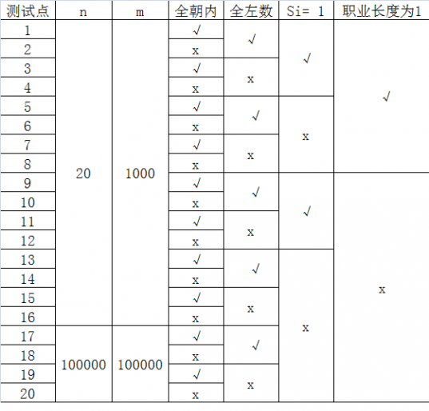
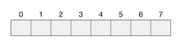
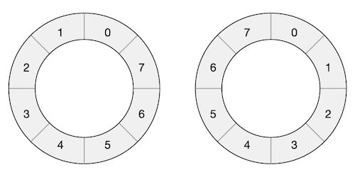
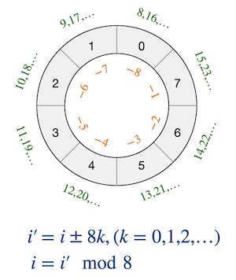
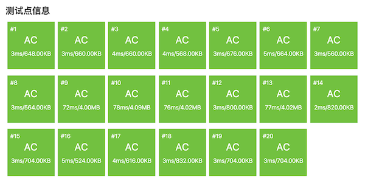

.. index:: 【玩具谜题】, 〖洛谷P1563〗

数组环形访问：玩具谜题（洛谷P1563）
++++++++++++++++++++++++++++++++++++++++++++++

**题目描述**

小南有一套可爱的玩具小人，它们各有不同的职业。

有一天，这些玩具小人把小南的眼镜藏了起来。小南发现玩具小人们围成了一个圈，它们有的面朝圈内，有的面朝圈外。如下图：

这时 :math:`singer` 告诉小南一个谜題：“眼镜藏在我左数第 :math:`3` 个玩具小人的右数第 :math:`1` 个玩具小人的左数第 :math:`2` 个玩具小人那里。”

小南发现，这个谜题中玩具小人的朝向非常关键，因为朝内和朝外的玩具小人的左右方向是相反的：面朝圈内的玩具小人，它的左边是顺时针方向，右边是逆时针方向；而面向圈外的玩具小人，它的左边是逆时针方向，右边是顺时针方向。

小南一边艰难地辨认着玩具小人，一边数着：

:math:`singer` 朝内，左数第 :math:`3` 个是 :math:`archer`。

:math:`archer` 朝外，右数第 :math:`1` 个是 :math:`thinker`。

:math:`thinker` 朝外，左数第 :math:`2` 个是 :math:`writer`。

所以眼镜藏在 :math:`writer` 这里！

虽然成功找回了眼镜，但小南并没有放心。如果下次有更多的玩具小人藏他的眼镜，或是谜題的长度更长，他可能就无法找到眼镜了。所以小南希望你写程序帮他解决类似的谜題。这样的谜題具体可以描述为：

有 :math:`n` 个玩具小人围成一圈，已知它们的职业和朝向。现在第 :math:`1` 个玩具小人告诉小南一个包含 :math:`m` 条指令的谜題，其中第 :math:`z` 条指令形如“左数/右数第 :math:`s` 个玩具小人”。你需要输出依次数完这些指令后，到达的玩具小人的职业。

**输入格式**

输入的第一行包含两个正整数 :math:`n,m`，表示玩具小人的个数和指令的条数。

接下来 :math:`n` 行，每行包含一个整数和一个字符串，以逆时针为顺序给出每个玩具小人的朝向和职业。其中 :math:`0` 表示朝向圈内，:math:`1` 表示朝向圈外。 保证不会出现其他的数。字符串长度不超过 :math:`10` 且仅由小写字母构成，字符串不为空，并且字符串两两不同。整数和字符串之间用一个空格隔开。

接下来 :math:`m` 行，其中第 :math:`i` 行包含两个整数 :math:`a_i,s_i`，表示第 :math:`i` 条指令。若 :math:`a_i=0`，表示向左数 :math:`s_i` 个人；若 :math:`a_i=1`，表示向右数 :math:`s_i` 个人。 保证 :math:`a_i` 不会出现其他的数，:math:`1 \le s_i \lt n`。

**输出格式**

输出一个字符串，表示从第一个读入的小人开始，依次数完 :math:`m` 条指令后到达的小人的职业。

**输入输出样例**

输入 #1：

.. code-block:: none

   7 3
   0 singer
   0 reader
   0 mengbier 
   1 thinker
   1 archer
   0 writer
   1 mogician 
   0 3
   1 1
   0 2

输出 #1：

.. code-block:: none

   writer

输入 #2：

.. code-block:: none

   10 10
   1 C
   0 r
   0 P
   1 d
   1 e
   1 m
   1 t
   1 y
   1 u
   0 V
   1 7
   1 1
   1 4
   0 5
   0 3
   0 1
   1 6
   1 2
   0 8
   0 4

输出 #2：

.. code-block:: none

   y

**说明/提示**

【样例1说明】

这组数据就是【题目描述】中提到的例子。

【子任务】

子任务会给出部分测试数据的特点。如果你在解决题目中遇到了困难，可以尝试只解决一部分测试数据。

每个测试点的数据规模及特点如下表：

其中一些简写的列意义如下:

全朝内：若为“√”，表示该测试点保证所有的玩具小人都朝向圈内。

全左数：若为“√”，表示该测试点保证所有的指令都向左数，即对任意的

:math:`1 \le z \le m, a_i=0`

:math:`s=1`：若为“√”，表示该测试点保证所有的指令都只数 :math:`1` 个，即对任意的

:math:`1 \le z \le m, s_i=1`

职业长度为 :math:`1`：若为“√”，表示该测试点保证所有玩具小人的职业一定是一个长度为 :math:`1` 的字符串。

**题解**

本题主要考察的是一个环形访问数组元素的技巧。

数组本身是一个线性的存储结构，一般情况下我们总是把它想象成一连串的元素，像糖葫芦一样连成一串，是长条状的。长度为 :math:`n` 的数组 :math:`A`，第一个元素 :math:`A[0]` 位于这个长条状存储结构的左端，最后一个元素 :math:`A[n-1]` 则位于最右端，中间按顺序存放着所有元素。当我们需要访问其中某一个元素 :math:`A[i]` 时，C++语言的语法要求 :math:`0\le i\le n-1`，下标 :math:`i` 不能越界，越界就会出现段错误。例如一个长度为 8 的数组，通常情况下的形象是这样的：

但是这并不妨碍我们有时候可以把数组想象成一个圆环，像一串佛珠一样，元素就像是佛珠上一颗颗的念珠排列在圆环上，最后一个元素 :math:`A[n-1]` 的位置位于第一个元素 :math:`A[0]` 的前面。在这个虚构的环上，称数组元素下标增大的方向为\ :strong:`正方向`，下标减小的方向为\ :strong:`反方向`。下标从 :math:`0` 开始沿着正方向不断增加，达到 :math:`n-1` 之后再前进就回到 :math:`0`；反之，若下标沿着反方向不断减小直到 :math:`0` 之后再后退就会抵达 :math:`n-1`。

需要注意的是，正方向并没有一定的规定，可以是逆时针也可以是顺时针。如果按照数学的惯例，一般以逆时针为正方向，但是数据结构中涉及到环形队列等环状结构时比较多地习惯将顺时针视作正方向。事实上，数组的环形结构本来就是想象出来的虚拟的结构，我们只要知道以元素下标增大的方向为正方向即可，顺时针还是逆时针只不过关系到画图怎么画而已，并没有实质性的区别。比如我们可以把数组 ``int a[8] = { 0, 1, 2, 3, 4, 5, 6, 7}`` 画成如下的环状结构图：

要在这样一个想象出来的虚拟环形结构上访问数组元素，需要使用一套虚拟的下标值规则。现在不再是一个有头有尾的长条状，而是一个没头没尾的环了，我们可以绕着圈子一圈一圈地走下去，没有尽头。对于长度为 :math:`n` 的数组，每沿着正方向走一圈，下标值就会增加 :math:`n`，沿着反方向就会减少 :math:`n`。比如长度为 :math:`8` 的数组，其环形结构下标值的示意图如下，图中我们把真正的数组下标值标在元素位置内，把绕圈的下标值标在对应的元素位置旁边：

所以在环状结构下数组的每一个位置会对应有无穷多个下标值 :math:`i^\prime=i\pm nk,(k=0,1,2,\dots)`，:math:`i` 为数组中的实际下标值。由此也很容易得出还原真正下标值的数学公式 :math:`i=i^\prime(\mod n)`。

为什么要强调这是数学公式呢？因为C++取余运算 ``%`` 的运算规则和数学里的余数规则不太一样，如果被除数是负数，C++取余时会简单地取成对应的正数取余结果的负值。比如 ``-9 % 8`` 的计算结果是 -1 而不是数学意义上的余数 7。所以在根据环状结构下的虚拟下标值计算真正的数组下标时，需要判断正负，如果得到的结果为负数还需要再加上一个数组长度 :math:`n` 才是真正的数组下标。比如数组长度为 8 时，虚拟的环状下标 -9 表示从数组的 0 号元素开始又反方向走了 9 个位置，最终的位置应该是实际数组中的 7 号元素，所以计算 ``-9 % 8`` 得到 -1 之后再加上 8 才是数组中的真正下标值。

有了上面这个技巧铺垫之后，本题就变得非常简单了。先读入 :math:`n` 个玩具的名称及其朝向，保存在两个数组 ``names[]`` 和 ``faces[]`` 之中，把这些数组看成是环形的结构。然后按照读入的指令，根据指令的方向和步数逐条指令地完成绕着圆圈行走就可以了。

面向圈内（朝向为0）的玩具，向左边（指令为0）走时为反方向，向右边（指令为1）走时为正方向。

面向圈外（朝向为1）的玩具，向左边（指令为0）走时为正方向，向右边（指令为1）走时为反方向。

综上所述，当玩具小人的朝向值和某条指令的方向值相等时，沿反方向走；二者不想等时，沿正方向走。从当前玩具小人的实际下标值出发，反方向走多少步就是减去多少，正方向走多少步就是加上多少，得到的虚拟下标值指向着这条指令的目的地，也就是下一条指令的出发点。由虚拟的环形下标值计算出实际的数组下标值之后就可以继续下一条指令即可，所有指令处理完就得到了解。第一条指令的起点，根据题意，就是数组中的 0 号玩具小人。

现在，这个题目就已经很容易解决了。题目里有涉及到玩具小人姓名的数组，也就是字符串数组，如果用传统的C-string，那么需要定义二维字符数组，比较麻烦，类似这样的情况使用C++ string类更加简单。下面是一份AC代码，供参考：

.. literalinclude:: ../../codes/267_p1563.cpp
   :language: c++

.. admonition:: 思考

   本题的基本框架是按照指令或正方向或反方向地沿着虚拟的环状结构行走，最后停在哪里，根据虚拟的环状结构下标值计算出其对应的真实数组下标。上面的示例程序中，每走一条指令就计算一次真实数组下标。为什么要这样做？使用虚拟环状结构的下标值走完全部指令后再一次性计算出解的真实数组下标不行吗？

   自己动笔模拟一下试试，应该是可以的，那为什么上面的程序要每走一条指令就计算一次真实下标呢？可以在洛谷网站上试试，全部走完再计算真实坐标行不行？如果不行，想一想问题出在什么地方？为什么数学上行得通的，到了实际编程的时候行不通？
