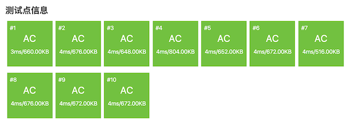

.. index:: 【字符串的展开】, 〖洛谷P1098〗

字符串处理：字符串的展开（洛谷P1098）
++++++++++++++++++++++++++++++++++++++++++++++

**题目描述**

在初赛普及组的“阅读程序写结果”的问题中，我们曾给出一个字符串展开的例子：如果在输入的字符串中，含有类似于“\ ``d-h``\ ”或者“\ ``4-8``\ ”的字串，我们就把它当作一种简写，输出时，用连续递增的字母或数字串替代其中的减号，即，将上面两个子串分别输出为“\ ``defgh``\ ”和“\ ``45678``\ "。在本题中，我们通过增加一些参数的设置，使字符串的展开更为灵活。具体约定如下：

(1) 遇到下面的情况需要做字符串的展开：在输入的字符串中，出现了减号“\ ``-``\ ”，减号两侧同为小写字母或同为数字，且按照\ ``ASCII``\ 码的顺序，减号右边的字符严格大于左边的字符。

(2) 参数 :math:`p_1`\ ：展开方式。:math:`p_1=1` 时，对于字母子串，填充小写字母；:math:`p_1=2` 时，对于字母子串，填充大写字母。这两种情况下数字子串的填充方式相同。:math:`p_1=3` 时，不论是字母子串还是数字字串，都用与要填充的字母个数相同的星号“\ ``*``\ ”来填充。

(3) 参数 :math:`p_2`\ ：填充字符的重复个数。:math:`p_2=k` 表示同一个字符要连续填充 :math:`k` 个。例如，当 :math:`p_2=3` 时，子串“\ ``d-h``\ ”应扩展为“\ ``deeefffgggh``\ ”。减号两边的字符不变。

(4) 参数 :math:`p_3`\ ：是否改为逆序：:math:`p3=1` 表示维持原来顺序，:math:`p_3=2` 表示采用逆序输出，注意这时候仍然不包括减号两端的字符。例如当 :math:`p_1=1`\ 、:math:`p_2=2`\ 、:math:`p_3=2` 时，子串“\ ``d-h``\ ”应扩展为“\ ``dggffeeh``\ ”。

(5) 如果减号右边的字符恰好是左边字符的后继，只删除中间的减号，例如：“\ ``d-e``\ ”应输出为“\ ``de``\ ”，“\ ``3-4``\ ”应输出为“\ ``34``\ ”。如果减号右边的字符按照ASCII码的顺序小于或等于左边字符，输出时，要保留中间的减号，例如：“\ ``d-d``\ ”应输出为“\ ``d-d``\ ”，“\ ``3-1``\ ”应输出为“\ ``3-1``\ ”。

**输入格式**

共两行。

第 :math:`1` 行为用空格隔开的 :math:`3` 个正整数，依次表示参数 :math:`p_1,p_2,p_3`\ 。

第 :math:`2` 行为一行字符串，仅由数字、小写字母和减号“\ ``−``\ ”组成。行首和行末均无空格。

**输出格式**

共一行，为展开后的字符串。

**输入输出样例**

输入 #1：

.. code-block:: none

   1 2 1
   abcs-w1234-9s-4zz

输出 #1：

.. code-block:: none

   abcsttuuvvw1234556677889s-4zz

输入 #2：

.. code-block:: none

   2 3 2
   a-d-d

输出 #2：

.. code-block:: none

   aCCCBBBd-d

**说明/提示**

:math:`40\%` 的数据满足：字符串长度不超过 :math:`5`

:math:`100\%` 的数据满足：:math:`1 \le p_1 \le 3,1 \le p_2 \le 8,1 \le p_3 \le 2`\ 。字符串长度不超过 :math:`100`

*NOIP 2007 提高第二题*

**题解**

这是一个典型的字符串处理的模拟题，解决这类问题最重要的就是\ :strong:`仔细！仔细！再仔细！`\ 。按照题目给出的处理规则，一条一条地去实现即可。

本题给出的五条处理规则，首先当然要解决规则(1)，它决定了是否要进行处理。根据这条规则，只有在字符串中间出现了减号字符 ``'-'`` 才有可能需要进行扩展，而且如果减号出现的位置是在字符串的首字符或尾字符，也是不需要进行扩展的。由此就可以得到算法的主框架步骤如下：

1. 读入字符串 ``str``\ ，并建立一个新的空字符串 ``res`` 用于存放扩展后的字符串，即问题的解。
2. 复制 ``str`` 的第一个字符到 ``res`` 尾部。
3. 从 ``str`` 的第2个字符到倒数第二个字符进行循环，判断是否为减号字符 ``'-'``\ ：

   * 若不是，则复制到 ``res`` 的尾部并继续循环；
   * 若是，则根据规则(1)判断该处是否需要扩展：

      * 若是则按照规则(2)-(5)进行扩展，扩展的内容复制到 ``res`` 尾部，扩展完毕后继续循环；
      * 若不是则复制该 ``'-'`` 字符到 ``res`` 尾部并继续循环。

4. 复制 ``str`` 的最后一个字符到 ``res`` 尾部。

第3步的处理分成判断和处理两个部分，判断部分比较简单，根据 ``'-'`` 前后两个字符的类型和大小进行判断即可。这里推荐 ``cctype`` 标准库提供的两个工具函数：

``isalpha()`` 函数接收一个字符作为参数，判断其是不是英语字母，如果是则返回1，不是返回0，可以当作逻辑值 ``true`` 和 ``false`` 使用。由于题目规定了原字符串仅由数字、小写字母和减号字符构成，所以只要判断是不是英语字母即可。

``isdigit()`` 函数以同样的方式判断一个字符是不是数字。

一旦在第3步的循环中发现了一个 ``'-'`` 字符，那么对其前后两个字符按照规则(1)进行判断就可以确定是不是需要对这个减号进行扩展。我们可以写一个内联函数来进行这个判断：

.. literalinclude:: ../../codes/268_p1098.cpp
   :language: c++
   :lines: 2-8

接下来的第二部分处理是当 ``to_expand()`` 函数返回 ``true`` 时，按照规则(2)-(5)进行扩展。第一步是要确定扩展的字符范围，即从左边字符的后继字符开始，到右边字符的前驱字符为止，这个可以通过一个循环来进行遍历，循环变量为要扩展出来的字符，循环起点为左边字符的后一个字符，循环条件为循环变量小于右边字符，循环方式为每次加1。

上述循环首先要对循环变量，即要扩展出来的字符应用规则(2)，可能会统一变成星号 ``'*'``\ ，也可能需要将英语字母改成大写（因为原字符串中只有小写字母，所以循环变量也一定是小写的）。这里可以调用 ``cctype`` 库的 ``toupper()`` 函数来进行大写化，这个函数非常方便，而且不需要事先判断字符是不是英语字母，它不会对非英语字母的字符进行任何改变。

真正要扩展出来的字符确定了之后，根据规则(3)，再用一次循环逐个地把这些字符添加到 ``res`` 尾部即可。但是在添加之前要记得用一个临时变量保存下开始添加的位置，这是为了接下来应用规则(4)。

在添加完所有扩展出来的字符之后，根据规则(4)，如果要逆序扩展的，把刚才扩展出来的这一段子串做一下颠倒就可以了。

最后看一下规则(5)，它的第2个子规则（减号左边的字符大于右边的字符时不予处理）其实已经蕴含在算法对规则(1)的判断过程中了，可以不去管它。它的第1个子规则规定了当减号右边的字符恰好是左边字符的后继时的扩展方式，这条子规则其实也不用管它。为什么？这个问题留作思考题。

接下来就需要进行仔细的编程了。凡是字符串处理问题的编程，首先都要选择一种字符串表示方式，要么用传统的C-string，要么用C++ string类。通常情况下，总是选择C++ string类比较好，因为它提供的功能灵活而且强大，尤其是当需要进行子串替换和需要用到字符串数组的时候。选择传统的C-string一般有两个原因，一个是字符串数据量极大或处理工作极其复杂和大量，因而需要极高的运行速度，另一个原因是不会用C++ string类。

这里我们用传统C-string来编制示例程序。如果选择了使用C-string，那么在处理时还有一个选择，是用数组方式来访问字符串中的字符，还是用指针的方式？示例程序是使用指针的方式的，但是在实际编程中，我们强烈建议用数组元素访问的方式，不要轻易尝试用指针，很容易写错。

下面是选用了最麻烦的C-string加指针的方式写的示例程序，这是老式的纯C程序员喜欢的方式，并不建议在C++语言尤其是竞赛编程中使用。但有时候在笔试题中会出现这样的写法，看不懂就麻烦了。

.. literalinclude:: ../../codes/268_p1098.cpp
   :language: c++

.. admonition:: 练习

   在洛谷网站AC本题，要求用C++ string类表示字符串。
