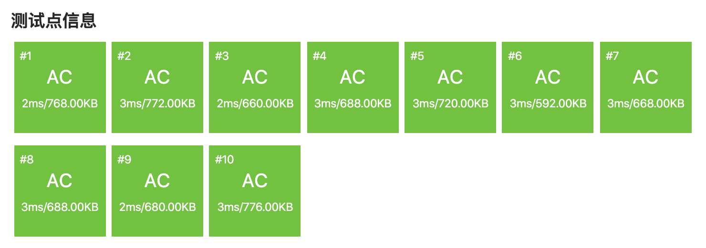

.. index:: 【生活大爆炸版石头剪刀布】, 〖洛谷P1328〗

查表的技巧：生活大爆炸版石头剪刀布（洛谷P1328）
++++++++++++++++++++++++++++++++++++++++++++++++++

**题目描述**

石头剪刀布是常见的猜拳游戏：石头胜剪刀，剪刀胜布，布胜石头。如果两个人出拳一样，则不分胜负。在《生活大爆炸》第二季第8集中出现了一种石头剪刀布的升级版游戏。

升级版游戏在传统的石头剪刀布游戏的基础上，增加了两个新手势：

斯波克：《星际迷航》主角之一。

蜥蜴人：《星际迷航》中的反面角色。

这五种手势的胜负关系如表一所示,表中列出的是甲对乙的游戏结果。

.. image:: ../../images/269_p1328.png

现在，小A和小B尝试玩这种升级版的猜拳游戏。已知他们的出拳都是有周期性规律的，但周期长度不一定相等。例如：如果小A以“石头-布-石头-剪刀-蜥蜴人-斯波克”长度为 :math:`6` 的周期出拳，那么他的出拳序列就是“石头-布-石头-剪刀-蜥蜴人-斯波克-石头-布-石头-剪刀-蜥蜴人-斯波克-......”，而如果小B以“剪刀-石头-布-斯波克-蜥蜴人”长度为 :math:`5` 的周期出拳，那么他出拳的序列就是“剪刀-石头-布-斯波克-蜥蜴人-剪刀-石头-布-斯波克-蜥蜴人-......”

已知小A和小B一共进行 :math:`N` 次猜拳。每一次赢的人得 :math:`1` 分，输的得 :math:`0` 分；平局两人都得 :math:`0` 分。现请你统计 :math:`N` 次猜拳结束之后两人的得分。

**输入格式**

第一行包含三个整数：:math:`N,N_A,N_B`\ ，分别表示共进行 :math:`N` 次猜拳、小A出拳的周期长度，小B出拳的周期长度。数与数之间以一个空格分隔。

第二行包含 :math:`N_A` 个整数，表示小A出拳的规律，第三行包含 :math:`N_B` 个整数，表示小B出拳的规律。其中，:math:`0` 表示“剪刀”，:math:`1` 表示“石头”，:math:`2` 表示“布”，:math:`3` 表示“蜥蜴人”，:math:`4` 表示“斯波克”。数与数之间以一个空格分隔。

**输出格式**

输出一行，包含两个整数，以一个空格分隔，分别表示小A、小B的得分。

**输入输出样例**

输入 #1：

.. code-block:: none

   10 5 6
   0 1 2 3 4
   0 3 4 2 1 0

输出 #1：

.. code-block:: none

   6 2

输入 #2：

.. code-block:: none

   9 5 5
   0 1 2 3 4
   1 0 3 2 4

输出 #2：

.. code-block:: none

   4 4

**说明/提示**

对于 :math:`100\%` 的数据，:math:`0 < N \leq 200, 0 < N_A \leq 200, 0 < N_B \leq 200`\ 。

**题解**

本题的核心在于查表，查表的核心在于怎样设计一个合理的表。

所谓合理的表，既要能方便地利用输入数据来查找结果，又要能方便地使用查表得到的结果来构造问题的解。一般有两种方法，要么是从表格本身出发，先设计好表格，然后根据表格提供的查表结果来设计如何构造问题的解；要么从问题的解出发，先设计好怎样构造问题的解，然后根据构造解所需要的信息来设计表格。本题我们采用后一种方法。

怎样构造本题的解呢？本题的解是小A和小B两个人的得分，所以很显然我们需要两个变量，分别存放小A和小B的得分。这种情况最方便的方法是用一个数组 ``bonus`` 来放二人的得分，可以让 ``bonus[0]`` 表示小A的得分，\ ``bonus[1]`` 表示小B的得分。为了让代码看起来更加易读，可以定义两个常量来作为小A、小B的编号：

.. code-block:: c++

   const int A = 0, B = 1;

这样就可以用 ``bonus[A]`` 来表示小A的得分，\ ``bonus[B]`` 来表示小B的得分，代码的含义就一下子清楚了很多，

接下来要根据每一轮小A和小B的出拳来判断胜负并相应进行加分，为此首先要知道每一轮他俩各自出什么拳。根据题意，他们二人出拳都是周期性的，可以用二维数组 ``periods[2][200]`` 分别存放小A和小B的一个出拳周期，用数组 ``t[2]`` 存放他们各自的周期长度。按照周期数列取数规律不难算出，第 :math:`i` 轮时小A出的是 ``periods[A][i % t[A]]``\ ，小B出的是 ``periods[B][i % t[B]]``\ 。这里要注意轮数 :math:`i` 的取值范围是 :math:`[0, n)`\ ，也就是从第0轮到第n-1轮。这是根据C++语言数组从0开始计数的原则来的，如果要按照日常习惯从1开始计数，那么计算公式就要相应修改。大家可以自己体会一下，不难发现从0开始计数的规则在这里让问题变得简单了一些。

现在用来构造解的基本构件都已经齐全了，只要利用一个循环来计算每一轮小A和小B各自的得分，并加到 ``bonus`` 数组的相应元素上去即可。如果直接使用题目中给出的规则表行不行？当然可以，但是大家去试一试就会发现其实并不是很好用。如果我们能够根据二人的出拳情况，直接查表查到这一轮谁获胜，比如查到0表示小A获胜，1表示小B获胜，即查表结果为获胜者的编号，那么直接给这个编号的得分加一分就好了，这样就非常方便了。所以更好的办法设计一个“胜负表”，而不是“得分表”。这个表格应该是一个二维数组 ``rules[5][5]``\ ，第一维表示小A的出拳，第二维表示小B的出拳，对应的元素是获胜者的编号，可以用下面的方式获取：

.. code-block:: c++

   rules[periods[A][i % t[A]]][periods[B][i % t[B]]]    // 这是获胜者的编号

所以我们要根据题目给出的胜负规则，设计这样一张5x5的胜负表。比较麻烦的是平局的情况，因为题目中说平局的时候，谁都不得分，所以表示平局的表格项该填什么好呢？似乎填表示小A的0也不对，填表示小B的1也不对，怎么办？答案是既然谁也不能填，那就干脆填一个谁也不是的虚假编号。我们假设有一个小C存在，他代表平局时的获胜者，出现平局就给小C加一分，当然小C的编号是2号，相应地在得分表里也增加一个元素 ``bonus[2]`` 用来存放小C的得分。在设计胜负表的时候，平局就是神秘的2号选手小C获胜。

因为小C是虚拟的，所以他的分数最后也没有什么用，题目需要输出的解仍然只是 ``bonus[A]`` 和 ``bonus[B]`` 而已。但是如果本题的得分规则改成足球联赛的规则，即获胜得3分，失败得0分，平局各得1分的话，那么小C的得分就有用处了。想一想为什么？要怎么用？这是本节的练习题哦。

请大家在看下面的代码之前，先自己设计好胜负表，然后再和代码中给出的胜负表进行对照。下面的AC代码本身非常简单，本题主要的技巧在于二维数组的灵活运用和查表的设计，编程时要注意的是二维数组之间相互嵌套的下标，虽然很费眼神，但却是书面考试时经常要考到的代码类型，要多练习书写和阅读这样的代码。

.. literalinclude:: ../../codes/269_p1328.cpp
   :language: c++

.. admonition:: 练习

   本题的得分规则改成足球赛得分规则，即每一轮获胜得3分，失败不得分，平局双方各得1分，再次完成本题。

.. index:: 【迎春舞会之数字舞蹈】, 〖P1538〗 

查表的技巧：迎春舞会之数字舞蹈（洛谷P1538）
++++++++++++++++++++++++++++++++++++++++++++++++

**题目背景**

HNSDFZ的同学们为了庆祝春节，准备排练一场舞会。

**题目描述**

在越来越讲究合作的时代，人们注意的更多的不是个人物的舞姿，而是集体的排列。

为了配合每年的倒计时，同学们决定排出——“数字舞蹈”。顾名思义就是所有人一起排成若干个数字 -___-|||| 更为创新的是，每个人都是趴在地上，保证横竖。

现在给出数字及其要求摆出的大小，请你编程，模拟同学们的优美姿态。

**输入格式**

第一行为k。k表示要摆出数字的大小。

第二行为全部由数字组成的字符串，即要摆出的几个数字。

**输出格式**

按题目要求输出。

**输入输出样例**

输入 #1：

.. code-block:: none

   2
   1234567890

输出 #1：

.. code-block:: none

         --   --        --   --   --   --   --   -- 
      |    |    | |  | |    |       | |  | |  | |  |
      |    |    | |  | |    |       | |  | |  | |  |
         --   --   --   --   --        --   --      
      | |       |    |    | |  |    | |  |    | |  |
      | |       |    |    | |  |    | |  |    | |  |
         --   --        --   --        --   --   -- 
   .

**说明/提示**

除了第一个数字之外，每个数字之前有1个空格，所有数字全部对齐。

k<=30，s的长度不超过255

建议大家直接输出，不要保存。

如果对于大小和k有疑问，请自行理解。

**题解**

本题又是一个典型的查表模拟题，不同的是这次要查的表里面存放的不是数据，而是图形，或者说是“图纸”。

先仔细观察输出样例的图形特点，可以归纳出以下几点：

1. 每两个数字之间隔开一个空列，最后一个数字之后没有空列。
2. 每一个数字占用 :math:`k+2` 列，:math:`2k+3` 行。
3. 如果用 :math:`k=1` 的情况来画出图纸，那么每个数字占用3列5行，其中第0、2、4三行为横线行，第1、3两行为竖线行。

如果有了 :math:`k=1` 的图纸，就可以用来画出任意大小的数字，方法为按照图纸的第0行到第4行依次画出横线、竖线或空格。横线行为“两端各一个空格、中间连续 :math:`k` 个 ``'-'``\ ”，每个竖线行连续画 :math:`k` 遍，均为“左右两端根据图纸可能为一个 ``'|'`` 可能为一个空格、中间为连续 :math:`k` 个空格”。

手绘一下 :math:`k=1` 的图纸：

.. code-block:: none

        -  -       -   -   -   -   -   -
     |   |  | | | |   |     | | | | | | |
        -  -   -   -   -       -   -    
     | |    |   |   | | |   | | |   | | |
        -  -       -   -       -   -   -
   .

画完图纸，把图纸变成一张可以用来查询的表格，方法有许多许多，这里介绍其中一种。用一个二维整型数组 ``int paper[5][10]`` 来存放图纸，其中第一维度表示行，第二维度表示数码，比如 ``paper[0][0]`` 表示数码0的第一行要怎么画、\ ``paper[3][6]`` 表示数码6的第4行怎么画。

在图纸数组的第0、2、4行，用数字0表示没有横线、1表示有横线；第1、3行，用数字0表示没有竖线、1表示左端有竖线、2表示右端有竖线、3表示两端都有竖线。

现在应该可以轻松地搞定这个题目了吧，只要仔细就行。编程时要注意，读取输入的第二行不能用整数，要读成字符串。另外，在还不会用堆栈等数据结构的时候，用数组来生成每一行的输出，要注意数组的长度，注意逐个字符画线条的时候的位置下标，还要注意数字图形之间的空列。

.. admonition:: 练习

   在洛谷网站完成本题。强烈建议自己设计另外一种表示图纸的方式。

