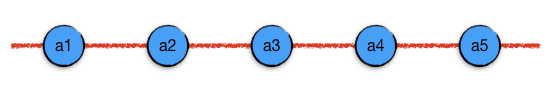

线性表
------

所谓线性表，又叫\ :strong:`线性存储数据结构`，是指把一个数据序列中的多个数据项按照它们在序列中的先后次序一连串地存储在存储空间里的数据结构。直观的理解可以把数据项看成是一个一个的串珠，用一根线把这些串珠按顺序串起来就形成了线性表。

按照数据结构的术语，我们把存储在线性表中的数据项称作\ :strong:`元素`。由于线性表中元素的存储是有先后次序的（请理解有次序和有序的区别），所以我们可以给每一个元素编号，然后按照编号一一对应地找指定序号的元素。另外还有两个术语需要知道，:strong:`前驱`\ 表示某个元素的前一个元素；:strong:`后继`\ 表示某个元素的后一个元素。线性表中的每一个元素，最多只能有一个确定的前驱，最多只能有一个确定的后继。

例如上面这个图中表示的线形表中，a3元素的前驱是a2元素，它的后继是a4元素。对于第一个元素a1，它的前驱是空元素，有时候我们喜欢按C++的惯例把空元素写做 ``NULL``。类似的，最后一个元素a5的后继是 ``NULL``。

.. attention::
   
   在C++语言的世界里序号是从0开始的，千万要记住并熟悉这一规则。我们不建议某些算法书上常见的把0号元素留空不用，强行使序号从1开始的做法。

我们要知道，虽说线性表是把数据项按次序组织成一连串的数据结构，但是实际的物理存储方式并不一定要是连续的，只要在逻辑关系上它们是有次序的就可以。简单地说，不管元素在存储空间里是不是真正按次序并且紧挨着存放的，只要它能提供一种方法来准确地定位到每个元素的前驱和后继，我们就认为它是线性表。按照物理存储方式是否连续，线性表分为\ :strong:`顺序存储结构（顺序表）`\ 和\ :strong:`链式存储结构（链表）`\ 两大类。

按照访问元素规则的不同，又产生出两种特别常用又特别重要的线形表：:strong:`栈`\ 和\ :strong:`队列`。

在本章我们将学习这些最基础的线性表类数据结构。

1. 顺序表
2. 链表
3. 栈
4. 队列

.. toctree::
   :maxdepth: 2

   sec01/311_sequence_list
   