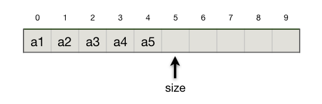
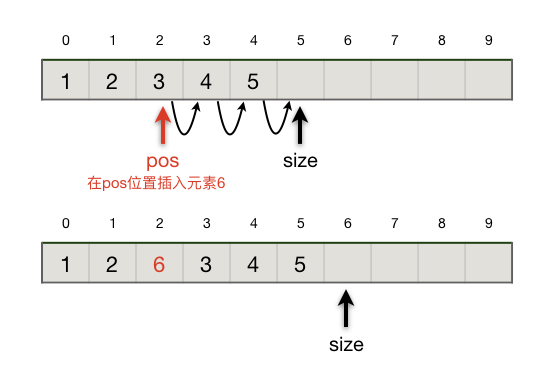
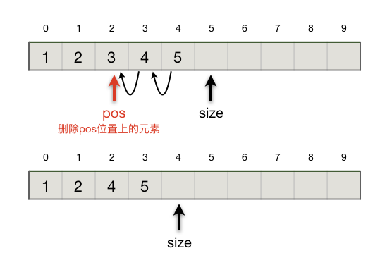
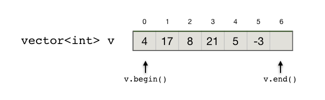

顺序表
++++++

:strong:`顺序表`\ ，全名\ :strong:`顺序存储结构`\ ，是线性表的一种。和所有线性表一样，它采用位置和元素一一对应的方式组织数据。在实际存储时，顺序表会先在内存中开辟一块足够存放所有元素的连续的空间，然后把所有元素按其序号依次紧挨着存放，彼此之间不允许出现空隙。由于顺序表并不要求它开辟的所有空间全部填满数据，因此还需要一个额外的表示当前表中有多少个元素的长度变量，通常会叫做 ``length`` 或 ``size``\ 。

例如，序列 :math:`\{a_1,a_2,a_3,a_4,a_5\}` 在用顺序表来表示的时候，实际的存储状态如下图所示。

.. note::

   图中每个元素上方的数字是它的下标（序号），按照C++和大多数其他编程语言的习惯从0开始编号。\ ``size`` 指示当前表中的元素数量，等于5，由于下标从0开始计数，所以最后一个元素的下标是 ``size-1``\ ，也就是4，而 ``size`` 刚好指向表尾后的下一个空位。

我们可以发现，顺序表极其天然的适合用C++数组来实现。事实上在许多算法程序里，为了简化编程，顺序表往往就是一个普通的数组加一个表示数据量的整型变量而已。

.. code-block:: c++
   
   int a[100], size = 0;

这样一句简单的变量声明语句就足以构造出一张最简单的顺序表。由于顺序表比普通的数组增设了一个长度变量，所以我们甚至不需要初始化数组元素。

如果程序中要用到多张顺序表，每一张都这样定义就会让代码变得很难看。因此一般我们会用一个结构来把存放元素的数组和长度变量封装起来，形成一个顺序表数据类型。这是实现一个定义完好的数据结构的第一步：:strong:`数据封装`\ 。

.. code-block:: c++

   const int MAXN = 1e6;

   // 定义一个最多能放1,000,000个元素的顺序表
   struct List {
           int data[MAXN];
           int size;
   };

.. hint::

   虽然数据结构和算法是紧密结合的，但毕竟是两门不同的课程。二者在研究的目标、方法和技巧上有着诸多不同。正如我们刚才所看到的，如果重点是算法的设计与实现，那么常常可以不拘泥于数据结构是否完美实现。但如果是学习数据结构，那么我们会很注重数据结构定义和实现的完整性，主要有以下几个关注点：

   * 所有数据和辅助变量是否有完整的封装，一般用一个或几个结构体来完成数据的封装。
   * 所需的最基本的功能是否都已经实现，传统的方式是定义一系列对封装了数据结构的结构体变量进行操作的函数，这也是大多数C语言数据结构教科书使用的方式；C++的方式则是给封装了数据结构的结构体（或者类）增加\ :strong:`成员函数`\ 。

   我们采用给结构体增加成员函数的方式来同时封装数据和功能。

   
.. admonition:: 说明

   由于本章是数据结构部分的内容，所以本章我们将展示怎样利用C++ struct来实现一系列封装完好的数据结构。在学会了每一种数据结构的原理之后，实际算法编程时往往不需要如此完好地去手打代码自己实现它们，而是有两种变通的方法：一是根据程序需要自己实现一个简化版；二是利用C++ STL库的容器类，我们对此也会进行说明。

**顺序表的初始化**

定义了结构 ``List`` 之后，如果我们在程序里需要用到顺序表，那么我们就声明一个 ``List`` 型变量并对其进行初始化。顺序表的初始化只需要做一件事：把长度设为0。

.. code-block:: c++
   
   List l1 = { { 0 }, 0};     // 采用初始化结构变量和数组的方式进行初始化
   
   List l2;      // 也可以像这样分两句进行，但在开始使用这张表前一定要初始化好
   l2.size = 0;

这样的初始化方式会让使用顺序表的程序代码显得杂乱，我们可以用C++的方式给 ``List`` 结构增加一个构造器函数：

.. literalinclude:: ../../codes/311_seq_list.cpp
   :language: c++
   :lines: 4-10, 14

现在我们只需要声明变量就可以了，不需要自己去显式地初始化它了，在变量被生成出来的时候构造器会自动被调用并执行其中的代码。

.. code-block:: c++

   List l3; // 生成一张顺序表 l3，自动初始化为 size = 0

.. note::

   构造器类似普通函数，不过它没有返回类型，所以也无需返回任何东西，甚至最后连 ``return`` 语句都不需要。

   构造器也可以有参数表，接收一些参数用来初始化结构的成员变量。那样的话我们在声明变量时在变量名后面像调用函数一样加上参数表就可以了。

   甚至可以给一个结构定义多个构造器，只要每个构造器的参数表不同即可。在声明变量时会自动按照参数表来匹配应该调用哪一个构造器。

**插入元素**

向顺序表里插入元素要符合以下规则：

1. 指定位置：插入时要指定新元素插入表中的位置，这个位置要大于等于0，小于等于当前表中元素的个数。当插入位置为0时新元素放在表头，当插入元素等于当前表中元素数量时新元素放在表尾。
2. 保持次序：新元素插入后，位于它之前的元素保持位置不变，从插入点开始的所有后序元素保持原有次序依次向后移动一个位置。
3. 长度限制：一般情况下基于数组构建的顺序表不能长度超限，基础数组的长度就是整张表的长度限制。当然我们可以利用动态内存技术来实现可自动调节最大长度的顺序表，STL库的 ``vector`` 容器就是这样一种顺序表。但是我们在学习数据结构的时候就不讨论这种技术了，毕竟首先要掌握的是原理。编程时如果要用到动态线性表，一般建议使用STL库提供的现成容器。

可以看出，插入位置在表尾时效率最高，:math:`O(1)`\ ；在表头时效率最低，:math:`O(n)`\ 。

.. tip::

   通常在实现顺序表的插入功能时，我们会把不在合理范围内的插入位置默认处理为插入在表尾。同时，鉴于插入在表尾效率最高，我们更喜欢新元素都按次序从前往后添加在表尾，所以往往我们会利用C++函数的默认参数，把插入位置做成默认参数，参数值为-1。这样的话如果不提供插入位置，就是插在表尾。

   另外，我们会提供一个返回值，正常情况下就返回新元素实际被插入的位置。当出现长度超限错误时，返回一个特殊的值（错误码），比如这种场景下最常见的是返回-1。

.. literalinclude:: ../../codes/311_seq_list.cpp
   :language: c++
   :lines: 4-11, 14-27

**删除元素**

从顺序表里删除元素要遵循的规则和插入元素时很类似，只是方向相反，我们采用的实现技巧也很类似。有一个惯例要遵循，删除元素之后返回被删除元素的值。下面用示意图和代码来进行说明。

和插入元素的情形类似，删除表尾元素效率最高，:math:`O(1)`\ ；删除表头元素时效率最低，:math:`O(n)`\ 。

.. literalinclude:: ../../codes/311_seq_list.cpp
   :language: c++
   :lines: 4-12, 14-38

**获取元素**

获取元素，就是按位置访问数组里的具体元素。你可能会惊讶，直接访问结构变量里面的数组不就成了吗？当然是可以的，而且在许多算法编程里也确实这样干了，但是数据结构的规范告诉我们，这是不允许的。\ ``data`` 数组是构成顺序表 ``List`` 的底层组件，并不是顺序表本身。按照封装的要求，外部代码是不可以直接访问底层组成部分的。外部代码必须通过数据结构提供的功能对数据进行访问操作，比如这里提供的成员函数。这些成员函数就有责任统一进行有效性、安全性、一致性检查，比如元素下标位置的有效性检查等等。

事实上，严格的数据封装标准甚至连当前长度这个变量 ``size`` 都是不允许直接读取的，因为允许直接读取就意味着外部代码也可以直接修改它，这就造成了很大的不安全性。所以如果是严格的数据封装，我们往往还需要提供一个获取当前表中元素个数的函数，例如 ``size()`` 函数。STL库的所有容器类，包括 ``vector`` 都是这样做的。

也许你会问，但是提供这样的函数还是不能阻止不遵守惯例的坏习惯程序员在结构外部直接访问成员变量啊？其实C++语言还提供了一套完整的\ :strong:`成员可见性`\ 机制用来从技术角度实现真正的限制。但在算法编程里，我们都提倡通过惯例，养成好习惯来自己管住自己。所以我们也不准备介绍它。

.. hint::

   成员可见性是面向对象技术的核心，早期的面向对象编程语言都提供了完善的可见性机制。但是近几年随着JavaScript、Python等脚本语言的兴起，以及\ :strong:`惯例高于设置`\ 的新一代编程哲学的兴起，现代较新的编程语言都放宽甚至放弃了严格的可见性机制，而是鼓励程序员通过遵循惯例来进行自我约束。

.. literalinclude:: ../../codes/311_seq_list.cpp
   :language: c++
   :lines: 4-45

.. tip::

   我们的代码里使用了C++的抛异常机制来处理位置参数错误的情况。因为在这里如果位置参数不正确，我们不能简单地处理为默认返回最后一个元素了。当访问元素时，最后一个并没有什么特殊性，不能默认返回它。

   C++异常机制是工程编程的手段，整个异常处理体系相当复杂。但是适当应用一些最简单的异常技术往往会给调试程序带来极大的帮助。请自行编制一段测试代码来触发这个错误的发生，看看会发生什么情况，另外也可以自行查阅相关书籍和网站学习一下C++异常机制的基本用法。

大多数算法编程课程里不会使用这样的代码来处理传入的位置参数不正确的情况，一般情况下算法书会这样处理这个问题：要么输出一段出错信息，要么返回一个不可能是元素值的特殊值，要么干脆默认参数不会有错。我们这里的 ``get()`` 函数用一种比较特别的方法来处理，当遇到传入的位置参数不正确时，抛出（throw）一个异常，这时候程序运行会被强制终止，屏幕上会输出一段出错消息。当然了，这远远不是C++异常处理机制真正的能力，我们并不打算在算法编程时使用完整的异常处理机制。异常机制的目的是确保程序运行出现无法预测的异常时能得到妥善处置，这是属于工程编程领域的技术。我们这里借用了异常处理机制中最简单的一点小技巧，只是为了方便程序调试和确保异常发生时 ``get()`` 函数不会不知所措。有点类似\ :strong:`断言`\ （assert），但是比使用断言要简单一些。

**算法编程的实用方法**

实际上，在算法编程时一般不需要也不会像学习数据结构时那样自己去实现一个完善的顺序表。通常用两种方法，当程序中只需要用到一份顺序表，表中元素数量可以预计而且内存也足够时，我们就直接用一个普通的数组来代替顺序表，这是比较常见的情况；另一种情况是可能需要用到多份顺序表，或者元素数量无法准确预期时，又或者我们对表有比较特殊的要求，比如要求元素值不能重复或者元素按值有序排列等，我们可以使用C++的STL容器。下面我们将简单介绍一种顺序表容器，向量（vector）。

.. _ref_311_vector:

STL的vector容器
^^^^^^^^^^^^^^^^^^^^^^^^^^^

C++的STL库提供了一个叫做\ :strong:`向量`\ （vector）的容器，就是一个非常完美的顺序表，也可以视为一个可变长度数组。它支持范型，支持动态增长，功能丰富，安全可靠而且效率很高，和数组几乎没有区别。如果在算法编程中需要用到顺序表，首选是采用它而不是自己写一个顺序表的代码。

要在程序中使用 ``vector`` 容器，首先要引入 ``vector`` 库，并且在程序中使用命名空间 ``std``\ 。然后就可以定义 ``vector`` 变量了。STL库提供的所有容器都是所谓的模板容器，它们对元素的数据类型没有预先限定，所以我们在定义具体的容器变量时需要指定它将要存放什么数据类型的元素。

.. code-block:: c++

   #include <vector>       // 引入STL库中的vector容器
   
   using namespace std;    // 指定本程序中要用到命名空间std

   vector<int> n;          // 定义一个存放int型变量的vector容器，未初始化，没有任何元素
   vector<double> x(10);   // 定义一个存放double型变量的vector容器，初始长度10个元素，值不定
   vector<bool> b(5, true);   // 定义一个存放bool型变量的vector容器，初始长度为5，值全部为true

一个 ``vector`` 容器里如果有元素，那么就可以像一个数组一样用方括号 ``[]`` 来访问其中的元素，:strong:`当然同样要注意下标越限问题！`

.. warning::

   如果定义 ``vector`` 变量的时候没有初始化，那么定义出来的容器长度为0，在还没有添加过元素之前是不能用 ``[]`` 来访问的，会导致\ :strong:`段错误`\ 。

除了用下标访问元素外，\ ``vector`` 和所有其他STL容器都还支持使用迭代器（iterator）来访问元素。和C++ string一样，各类STL容器都提供了一头一尾两个预设的迭代器，分别用 ``begin()`` 和 ``end()`` 两个成员函数来获得。头迭代器指向首元素；尾迭代器指向紧跟在尾元素后面的那个位置。容器迭代器的基本用法可以参考前面介绍 ``algorithm`` 库排序函数的章节：:ref:`ref-256-container-iterator-range`\ 。

下面这段代码片段演示了怎样定义、获取、操作迭代器，利用迭代器来输出一个 ``vector`` 里的所有数据。

.. literalinclude:: ../../codes/311_iterator.cpp
   :language: c++

可以看出来，迭代器事实上就是一个升级版的指针。

``vector`` 容器的使用非常简单，虽然它提供了大量的成员函数，但在算法编程时一般掌握一些常用的成员函数就基本够用了。

.. csv-table::
   :header: "成员函数", "作用"

   "``vector()``", "无参构造函数，将容器初始化为空"
   "``vector(int n)``", "将容器初始化为有n个元素"
   "``vector(int n, const T &val)``", "假定元素的类型是T，此构造函数将容器初始化为有n个元素，每个元素的值都是val"
   "``void clear()``", "删除所有元素"
   "``bool empty()``", "判断容器是否为空"
   "``void pop_back()``", "删除容器末尾的元素"
   "``void push_back(const T &val)``", "将val添加到容器末尾"
   "``int size()``", "返回容器中元素的个数"
   "``T &front()``", "返回容器中第一个元素的引用"
   "``T &back()``", "返回容器中最后一个元素的引用"
   "``iterator insert(iterator i, const T &val)``", "将val插入迭代器i指向的位置，返回i"
   "``iterator erase(iterator i)``", "删除迭代器i指向的元素，返回值是被删元素后面的元素的迭代器"

下面是一个示例程序，用来演示怎样使用上面这些常用成员函数、下标访问元素和迭代器访问元素的方法。这些都是算法编程中最为常见的用法，请务必要熟练掌握。

.. literalinclude:: ../../codes/311_vector.cpp
   :language: c++

运行的结果如下：

.. code-block:: none

   v.size() = 10
   v:   5  4  3  2  1  1  2  3  4  5
   v:   5  4  3  2  1  1  2  3  4
   v:   5  4  3  1  1  2  3  4
   v:   9  5  4  3  1  1  2  3  4
   v.empty() = true

.. admonition:: 经验

   仿写程序是一种高效的学习方法，尤其是对笔试的大题（程序阅读、程序填空）特别有帮助。如果能在仿写的时候修改一下再试试看，学习效果更佳。
