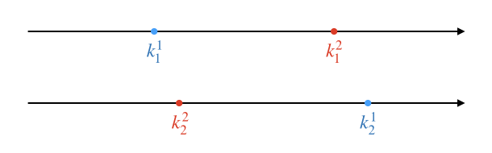
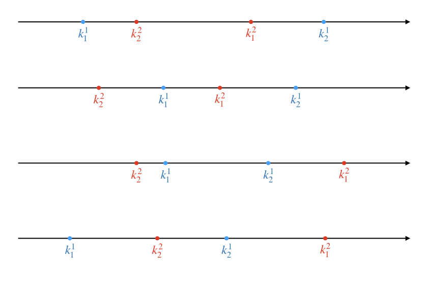
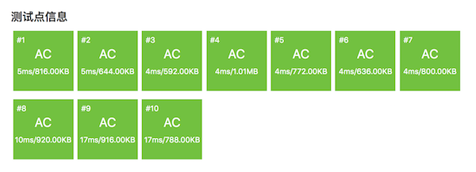

.. index:: 【国王游戏】, 〖洛谷P1080〗

高精算法例题：国王游戏（洛谷P1080）
++++++++++++++++++++++++++++++++++++++++++

**题目描述**

恰逢 :math:`H` 国国庆，国王邀请 :math:`n` 位大臣来玩一个有奖游戏。首先，他让每个大臣在左、右手上面分别写下一个整数，国王自己也在左、右手上各写一个整数。然后，让这 :math:`n` 位大臣排成一排，国王站在队伍的最前面。排好队后，所有的大臣都会获得国王奖赏的若干金币，每位大臣获得的金币数分别是：排在该大臣前面的所有人的左手上的数的乘积除以他自己右手上的数，然后向下取整得到的结果。

国王不希望某一个大臣获得特别多的奖赏，所以他想请你帮他重新安排一下队伍的顺序，使得获得奖赏最多的大臣，所获奖赏尽可能的少。注意，国王的位置始终在队伍的最前面。

**输入格式**

第一行包含一个整数 :math:`n`，表示大臣的人数。

第二行包含两个整数 :math:`a` 和 :math:`b`，之间用一个空格隔开，分别表示国王左手和右手上的整数。

接下来 :math:`n` 行，每行包含两个整数 :math:`a` 和 :math:`b`，之间用一个空格隔开，分别表示每个大臣左手和右手上的整数。

**输出格式**

一个整数，表示重新排列后的队伍中获奖赏最多的大臣所获得的金币数。

**输入输出样例**

输入：

.. code-block:: none

   3 
   1 1 
   2 3 
   7 4 
   4 6 

输出：

.. code-block:: none

   2

**说明/提示**

【输入输出样例说明】

按 :math:`1`、:math:`2`、:math:`3` 这样排列队伍，获得奖赏最多的大臣所获得金币数为 :math:`2`；

按 :math:`1`、:math:`3`、:math:`2` 这样排列队伍，获得奖赏最多的大臣所获得金币数为 :math:`2`；

按 :math:`2`、:math:`1`、:math:`3` 这样排列队伍，获得奖赏最多的大臣所获得金币数为 :math:`2`；

按 :math:`2`、:math:`3`、:math:`1` 这样排列队伍，获得奖赏最多的大臣所获得金币数为 :math:`9`；

按 :math:`3`、:math:`1`、:math:`2` 这样排列队伍，获得奖赏最多的大臣所获得金币数为 :math:`2`；

按 :math:`3`、:math:`2`、:math:`1` 这样排列队伍，获得奖赏最多的大臣所获得金币数为 :math:`9`。

因此，奖赏最多的大臣最少获得 :math:`2`个金币，答案输出 :math:`2`。

【数据范围】

对于 :math:`20\%` 的数据，有 :math:`1 \le n \le 10,0 \lt a,b \lt 8`；

对于 :math:`40\%` 的数据，有 :math:`1 \le n \le 20,0 \lt a,b \lt 8`；

对于 :math:`60\%` 的数据，有 :math:`1 \le n \le 100`；

对于 :math:`60\%` 的数据，保证答案不超过 :math:`10^9`；

对于 :math:`100\%` 的数据，有 :math:`1 \le n \le 1000,0 \lt a,b \lt 10000`。

NOIP 2012 提高组 第一天 第二题

题目解析
^^^^^^^^^^^^^^^^

这道题目对于普及组的初学者来说有一定的难度，涉及到一个比较隐蔽的贪心策略和一个简化版高精度算法，同时在实际编程时会遇到复杂结构、排序、STL容器等的灵活运用，代码量比较大，成员函数比较多，对于初学者来说在编程技法上也有较高的考验。下面我们逐步来分析如何解题。

**1、大臣排队的策略发现**

大臣们如何排队才能满足“获得奖赏最多的大臣其所获得的奖赏尽可能少”这个要求呢？这个排队策略是比较隐蔽的，并不容易发现，下面我们来讨论一下怎么找出这个策略。

假如大臣数量 :math:`n=1`，那么没有什么排队可言，所以递推的起点为 :math:`n=2`。不妨设国王左右手的数字分别为 :math:`a_0` 和 :math:`b_0`，两位大臣为 :math:`p_1` 和 :math:`p_2`，它们的左右手数字分别为 :math:`a_1,b_1` 和 :math:`a_2,b_2`。显然这时总共有两种排队方法，要么 :math:`p1` 在前要么 :math:`p_2` 在前：

.. image:: ../../images/316_p1080_q.png

队列1：大臣 :math:`p_1` 的奖赏为 :math:`k^1_1=a_0/b_1`，:math:`p_2` 的奖赏为 :math:`k^1_2=a_0a_1/b_2`，奖赏最多的大臣将获得 :math:`K^1=\max\{k^1_1,k^1_2\}`。

队列2：大臣 :math:`p_2` 的奖赏为 :math:`k^2_2=a_0/b_2`，:math:`p_1` 的奖赏为 :math:`k^2_1=a_0a_2/b_1`，奖赏最多的大臣将获得 :math:`K^2=\max\{k^2_2,k^2_1\}`。

从上面的计算公式我们可以看出两个基本的不等式：:math:`k^1_1=a_0/b_1 \lt k^2_1=a_0a_2/b_1`，:math:`k^2_2=a_0/b_2 \lt k^1_2=a_0a_1/b_2`。有了这两个不等式就可以继续后面的分析了。事实上纯粹用代数方法分情况讨论还是很麻烦的，为了观察方便，我们可以把已经知道的这两个数字关系标在数轴上，然后直观地进行几何意义上的分析：

在这个图里，我把队列1时两位大臣的奖赏数点标为蓝色，队列2的两个奖赏数点标为红色。在分别的两个数轴里，我们只关心大小关系，一红一蓝两个点只要顺序不变，二者之间的距离是无所谓的，它们也不会重合。接下来我们要把两条数轴拼合到一起，由于上下两条数轴上的点相互之间的大小关系不确定，所以拼合的时候两条数轴之间可以左右移动，产生多种拼合结果，例如下面这样的各种情况：

当然拼合的结果远不止这四种，还可以有很多很多种，大家可以试着画画看。但是不论怎样，我们关心的只是最右边（最大）的蓝点和最右边（最大）的红点之间的位置关系。所以我们可以发现，我们只需要关心 :math:`k^2_1` 和 :math:`k^1_2` 之间的大小关系。

1. 如果 :math:`k^2_1 \lt k^1_2`，那么 :math:`k^1_2` 就一定是最右边的点，它比两个红点都更右边，此时 :math:`K^1=k^1_2` 而且一定满足 :math:`K^1 \gt K^2`，因此我们应该采取队列2的排法才能使得奖赏的最大值更小。把具体数字代进去我们可以得到：

   .. math::

      k^2_1 \lt k^1_2 \implies \frac{a_0 \cdot a_2}{b_1} \lt \frac{a_0 \cdot a_1}{b_2} \implies a_2 \cdot b_2 \lt a_1 \cdot b_1

   换句话说，要让大臣 :math:`p_2` 排在大臣 :math:`p_1` 前面，就要使得它左右手数字的乘积更小：:math:`a_2 \cdot b_2 \lt a_1 \cdot b_1`。

2. 如果 :math:`k^2_1 \gt k^1_2`，那么 :math:`k^2_1` 就一定是最右边的点，它比两个蓝点都更右边，此时 :math:`K^2=k^2_1` 而且一定满足 :math:`K^2 \gt K^1`，因此我们应该采取队列1的排法才能使得奖赏的最大值更小。把具体数字代进去我们可以得到：

   .. math::

      k^2_1 \gt k^1_2 \implies \frac{a_0 \cdot a_2}{b_1} \gt \frac{a_0 \cdot a_1}{b_2} \implies a_2 \cdot b_2 \gt a_1 \cdot b_1

   换句话说，要让大臣 :math:`p_1` 排在大臣 :math:`p_2` 前面，就要使得它左右手数字的乘积更小：:math:`a_2 \cdot b_2 \gt a_1 \cdot b_1`。

3. 如果 :math:`k^2_1 = k^1_2`，那么最右边的蓝点和红点重合，而且 :math:`K^1=k^1_2=k^2_1=K^2`，二者相等，取任意一种排队方法都可以，这种情况可以不用考虑。

总之，现在我们可以知道，当 :math:`n=2` 时，两个大臣的排法应该是让左右手数字之积较小的那一个排在另一个前面。依此类推，我们完全有理由猜测排队的正确策略是\ :strong:`“按照大臣左右手数字之积从小到大的顺序排队”`。但是我们需要证明，我们的证明方法称为\ :strong:`微扰法`。

.. note::

   这个策略是一个典型的但比较隐蔽的\ :strong:`贪心策略`，即每次都取比较简单的局部最优解，而不考虑复杂的全局最优解。如果每次的局部最优解都不会对前面已经产生的和后续将要产生的局部解产生影响，那么通过每一步都取局部最优，最后能达到全局最优。使用贪心策略来解决问题的方法叫做\ :strong:`贪心法`。使用贪心法解决问题必须证明其贪心策略的正确性，而证明贪心策略正确性的最常用方法即为\ :strong:`微扰法`。关于贪心法，在后续算法设计方法一章中会有专题讲解。 

所谓微扰法，就是先假定用待证明的贪心策略生成出了一个贪心解，然后给这个贪心解加入一点与策略相违背的最小程度的改变（微扰），通过证明加入任意微扰后是否会使得解变差或可能变差来证明此贪心策略的正确性。

设大臣人数为 :math:`n \gt 2`，已经按照“左右手数字之积从小到大”的策略排好队伍，设其中奖赏最多的大臣获得的奖赏数为 :math:`M`。从游戏规则很容易看出，对于任意两个相邻大臣 :math:`p_i` 和 :math:`p_{i+1}`，其中 :math:`1 \le i \lt n`，改变他们俩在队伍中的顺序，并不会改变排在他们俩前面的大臣们的奖赏，也不会改变排在他们俩后面的大臣们的奖赏。现在记排在 :math:`p_i` 前面的所有大臣中获得的最大奖赏数为 :math:`M_{1:i-1}`，如果 :math:`i=1`，则 :math:`M_{1:i-1}=0`；记排在 :math:`p_{i+1}` 后面的所有大臣中获得的最大奖赏数为 :math:`M_{i+2:n}`，如果 :math:`i=n-1`，则 :math:`M_{i+2:n}=0`；记他们二人中奖赏较多的那个人的奖赏数为 :math:`M_{i:i+1}`，显然现在的全局解 :math:`M=\max\{M_{1:i-1},M_{i:i+1},M_{i+2:n}\}`。

现在调换 :math:`p_i` 和 :math:`p_{i+1}` 的位置，用这个微扰来改变贪心解。设得到的新的解为 :math:`M^\prime`。仍然以这两个大臣为界分为前中后三段，显然，排在他们俩之前的所有大臣中的最高奖赏仍然为 :math:`M_{1:i-1}` 不变，排在他俩之后的所有大臣中的最高奖赏也仍然为 :math:`M_{i+2:n}` 不会变。改变的仅仅是他俩中得到较高奖赏的那个人的奖赏数，我们把它记为 :math:`M^\prime_{i:i+1}`。故 :math:`M^\prime=\max\{M_{1:i-1},M^\prime_{i:i+1},M_{i+2:n}\}`。

现在尽管在这两个大臣可能已经不是紧挨在国王之后的了，但是我们在考虑他们两人的奖赏时，完全可以把他俩前面的所有大臣和国王进行“合体”，即把这些队伍前面的大臣左手上的数字与国王左手上的数字都乘起来，把这个乘积看作是一个“合体”后的国王左手上的数字。这样，我们前面针对 :math:`n=2` 情形的结论完全适用于大臣 :math:`p_i` 和 :math:`p_{i+1}` 的情况，:math:`M_{i:i+1} \le M^\prime_{i:i+1}` 恒成立。

那么，虽然贪心解 :math:`M=\max\{M_{1:i-1},M_{i:i+1},M_{i+2:n}\}` 有可能等于 :math:`M_{1:i-1}`、:math:`M_{i:i+1}`、:math:`M_{i+2:n}` 中的任一个，微扰后得到的解 :math:`M^\prime=\max\{M_{1:i-1},M^\prime_{i:i+1},M_{i+2:n}\}` 同样也可能等于 :math:`M_{1:i-1}`、:math:`M^\prime_{i:i+1}`、:math:`M_{i+2:n}` 中的任一个，但无论如何，现在成立着这样的关系：:math:`M \le M^\prime`。

结论：对贪心解引入任意逆序微扰都有可能使得全局解的值增大。“按照大臣左右手上数字之积从小到大的顺序排队”是正确的贪心策略，能保证“获得奖赏最多的大臣其所获得的奖赏尽可能少”。

**2、数据的组织，Person结构以及STL算法库排序函数的应用**

得到上面的贪心策略之后，我们就可以搭建出本题算法的框架：

1. 读入国王和所有大臣的左右手数字，并按各自左右手数字之积进行升序排序。
2. 依此计算每一个大臣应得奖赏的数额，并统计出其中的最大值。
3. 输出答案。

看上去事情已经非常简单了，但实际上只有第三步还算简单，其他两步都不是那么简单的，对于初学者来说。我们先考虑第一步怎么做。

数据的组织方式很明确应该是顺序表，每个人（国王和大臣）有左手右手两个数字，显然用一个结构来组织这两个数字并把他们放入一个顺序表中是最合理的数据结构。所以我们可以先定义这样一个数据结构：

.. code-block:: c++

   struct Person {
           int a;
           int b;
   };

然后在main函数中用一个vector来存放所有人，按顺序读入所有数据，组织成结构变量依序存放起来即可：

.. code-block:: c++

   vector<Person> persons;

这样数据就被正确的读入了，按照输入数据格式，国王天然地会被存放在第一个元素。so easy！接下来就是不easy的部分了，排序。感恩吧，现在算法竞赛放开了对C++ STL库的限制，我们不用自己手写排序算法。STL的通用算法库algorithm中提供了一个速度极快的排序算法函数 ``sort()``，可以比手写模板快速排序更快那么一丢丢的速度进行排序。

.. warning::

   切记：``sort()`` 函数提供的不稳定排序。本题无需进行稳定排序，所以我们就用它来进行排序。如果遇到需要进行稳定排序的，要使用algorithm库中的 ``stable_sort()`` 函数，二者的用法完全一样，区别就在于一个是不稳定排序，一个是稳定排序。

   但是稳定排序的运行速度比不稳定排序要慢许多，所以通常对稳定性没有要求的情况下，都使用不稳定的 ``sort()``。

``sort()`` 函数能对所有STL顺序容器以及普通的C++数组进行升序排序。它可以对其中所有元素或部分连续元素进行排序，比如我们这个题中就需要对除第一个元素（国王）以外的其他元素进行排序，是属于其中一部分。这时候就需要指定一个范围，由两个参数 ``first`` 和 ``last`` 按“含头不含尾”的原则指定。如果要排序的是数组，那么这两个参数就是两个指针；如果是对vector这样的STL标准容器，那么要用两个\ :strong:`迭代器`\ 来作为参数。所谓迭代器，其实就是一种包装过的指针。所有容器都提供了首尾两个迭代器，首迭代器用 ``begin()`` 成员函数获得，指向容器中第一个元素；尾迭代器用 ``end()`` 成员函数获得，指向容器中最后一个元素之后的那个位置。迭代器和指针一样，是可以进行加减运算的。

要使用 ``sort()`` 函数，需要引入algorithm库，也要用到命名空间std。我们这里在读完所有数据后，应该马上调用 ``sort()`` 函数对第2个元素到最后一个元素这一段数据进行排序：

.. code-block:: c++

   #include <algorithm>
   // ...
   int main()
   {
           // ...
           sort(persons.begin()+1, persons.end());
           // ...
           return 0;
   }
   

这样就可以了吗？如果容器中的元素数据类型是C++基本数据类型，这样就可以了。但是 ``persons`` 中的元素是一个自定义的结构类型，C++本身并不知道怎样比较两个 ``Person`` 结构变量的大小，所以 ``sort()`` 函数没法进行元素大小比较，这样是不可能进行排序的！

既然C++不知道，那么我们就直接告诉 ``sort()`` 函数怎么比较两个 ``Person`` 型元素的大小吧。事实上 ``sort()`` 有两个途径可以了解自定义类型元素之间怎么比较大小，一是给这种自定义类型重载小于比较运算 ``<``，另一种是给 ``sort()`` 函数传入第三个参数，一个用于比较元素大小的自定义函数。我们建议使用第一种方法，代码比较简洁易读。

.. note::

   ``sort()`` 函数为什么要提供传入一个比较函数这种较为复杂的方式呢？这是为了应付同一种数据类型在程序中可能有多种比较大小方式的情况。如果在程序某个部分要这样比大小，另一个部分又要那样比大小，重载 ``<`` 运算的方法就不适用了。所以传比较函数的方法也是今后必须要掌握的，下一次遇到需要对自定义类型数据排序的问题时，我们将采用传比较函数的方法。

.. tip::

   这里我们推荐一种良好的编程习惯：当需要编写大量自定义函数（成员函数）的时候，先在main函数之前写好所有自定义函数的原型，暂时先不要去写函数的定义。我们先集中精力把算法的主程序写完，然后再去写自定义函数。自定义函数的函数体全部放在main函数之后，整个程序各部分的先后顺序依次为：引入库、命名空间、全局变量（常量）、自定义数据结构、自定义函数原型、main函数、自定义函数。这样main函数中的算法主程序和数据结构这些部分尽量贴近，易于阅读。

现在，我们可以完成整个算法的第一步了，读入数据，按照每个元素中两个成员变量的乘积进行升序排序。写完主体后在最后写上 ``Person`` 结构的 ``<`` 运算符重载函数，很简单，返回比较两个乘积的结果即可。下面是这部分的完整代码：

.. literalinclude:: ../../codes/316_p1080.cpp
   :language: c++
   :lines: 1, 3-14, 27-38, 48-51

.. admonition:: 思考

   留一个思考题：``sort()`` 函数是对容器中元素进行升序排序的，请问你有没有什么办法让它完成降序排序？对于自定义数据类型应该怎么做？对于内置数据类型，比如 ``int`` 又该怎么做？

**3、简化版高精度算法**

接下来我们把算法的剩余部分完成。理论上讲，第2部分只是一个普普通通的最大值在线统计，我们按照游戏规则逐一计算所有大臣的奖赏数额，找出其中最大值，最后输出这个最大值就可以了。但是题目的数据取值范围显示，大臣人数最大可能有1000人，而左手的数字最大可能为9999。在计算大臣奖赏额度时，他前面所有人的左手数字乘积显然会超过C++内置整数中最大的 ``unsigned long long`` 型的取值范围。

坏消息：来自数据取值范围，必须使用高精度算法。

但是仔细观察上述取值范围和奖赏数计算方法，我们可以发现所有的数据不超过10000，连乘的时候其中一个乘数必是一万以内的正整数，整个算法中只用到乘法、除法和比较大小三种运算。这就给我们的高精度算法带来了诸多便利：

1. 恰好可以采用万进制；
2. 不需要实现高精度的输入流重载，只需实现输出即可；
3. 不需要实现各种赋值，构造器也只需要支持用 ``int`` 型初始值构造即可，构造器代码会非常简单；
4. 只需重载 ``*=, /, <`` 三个运算；
5. 因为 ``*=`` 运算的参数一定是10000以内的正整数，所以乘法可以直接将该参数从低到高依次乘到自身各节上去，然后按运算规则写数进位即可；
6. 因为 ``/`` 运算的除数一定是10000以内的正整数，所以除法可以直接从高到低用各节除以除数，取数留余即可，使用的是 ``int`` 的除法和取余运算，不需要用高精度减法来模拟。

下面是完整的AC代码：

.. literalinclude:: ../../codes/316_p1080.cpp
   :language: c++

.. note::

   ``BigInt`` 的输出流重载函数和 ``<`` 比较函数和前面几节已经讲解过的完全一样。请记住，同种数据类型的变量之间的赋值是不需要自己重载赋值运算来实现的，这种拷贝赋值是C++天生就会完成的任务。

   算法主体程序中，``left`` 变量保存到目前为止前面所有人左手上数字的乘积，``max`` 变量保存的是到目前为止最大的奖赏数，统计最大值的循环体中的临时变量 ``current`` 是当前大臣应得的奖赏数。

   最后再强调一下，一定要看懂 ``*=`` 和 ``/`` 这两个简化过的高精度乘除运算。

有不少人认为C++新增的高级特性运行速度都很慢，比如vector容器比普通数组慢，比如cin和cout比scanf和printf慢。实际上它们确实是慢一点的，但是一般来说这点慢基本上感觉不出来。特别是vector容器，它的实际运行速度是非常非常接近普通数组的。这个程序的代码可以证明，它们其实并不是某些人想象的那样“慢到飞起”。

