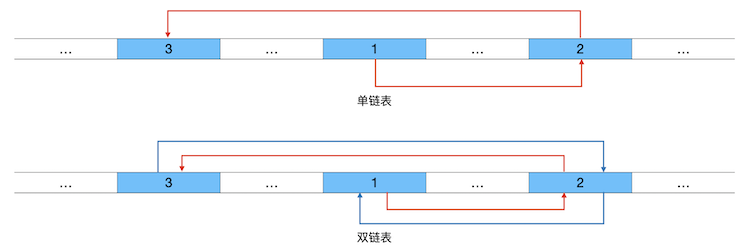
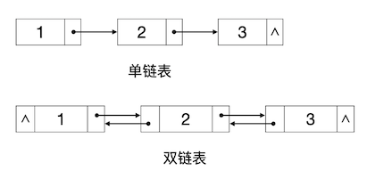
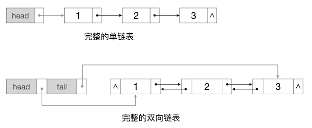
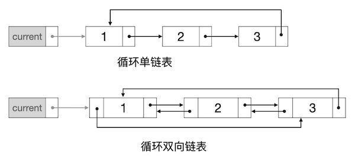
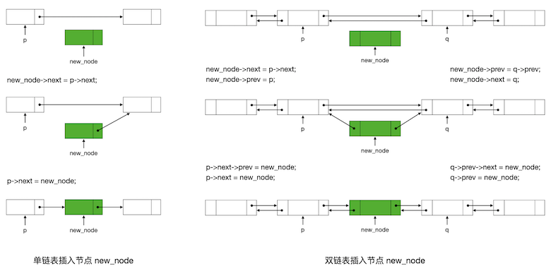
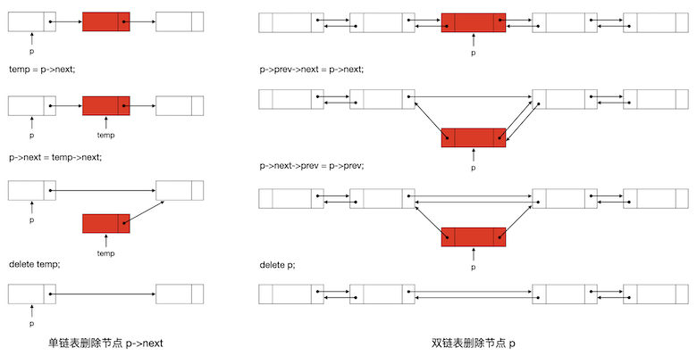

线性表的链式存储结构：链表
++++++++++++++++++++++++++

链表的概念
^^^^^^^^^^

:strong:`链表`\ 采用链式存储结构来实现线性表。既然是线性表，那么元素在逻辑关系上一定是一个接着一个连成一串的，用精确的定义语言来描述就是：每一个元素都至多有一个唯一确定的前驱，也至多有一个唯一确定的后继。但是和顺序表不同，链表中的元素在实际的物理存储上并不要求严格地一个紧接着一个的顺序排放。链表可以在内存中任意的位置存放其中的元素，只要找到一块可以存放元素的内存空间即可。为了维持元素之间逻辑上的前驱后继关系，链表为每一个元素节点增设表示元素间前后关系的\ :strong:`链`\ 字段，指向前驱元素的链称作\ :strong:`前链`\ 或\ :strong:`前向链`\ ，指向后继元素的链称作\ :strong:`后链`\ 或\ :strong:`后向链`\ 。

.. tip::

   通常在C++语言中，链就是指向另一个元素节点的指针。

如果链表中的每一个元素节点都只有一个后链，那么这样的链表叫做\ :strong:`单链表`\ 。如果每一个元素节点同时有一个后链和一个前链，那么称为\ :strong:`双链表`\ 或\ :strong:`双向链表`\ 。

例如整数序列[1,2,3]，如果用链表来存储，那么三个元素在物理内存中各自可能存放在任意的位置中，但是相互之间用链来维持前后关系，如下图所示：

其中红色的箭头线表示后链指针，蓝色的表示前链指针。但是这样的示意图看起来非常不舒服，一般我们把链表的示意图画成下面这样更为抽象但是更简洁易懂的方式：

这样，在一个链表的元素节点中，包含一个存放实际元素值的变量和一到两个存放链的指针变量。在用C++语言实现链表的时候，一般总是用一个结构来定义链表节点。如果链表元素的类型是C++内置数据类型，例如 ``int``\ ，最简单的单链表节点可以这样定义：

.. code-block:: c++

   struct Node {
           int value;   // 元素值
           Node *next;  // 后链指针

           Node(int val = 0) { value = val; next = NULL; } // 构造函数
   };

如果希望让链表能像STL库的那些容器一样，可以支持任意数据类型，那么可以将节点定义为模板结构，比如下面这个双向链表节点的结构：

.. code-block:: c++

   template <typename T>
   struct Node {
           T value;     // 元素值
           Node *next;  // 后链指针
           Node *prev;  // 前链指针

           Node() { next = NULL; prev = NULL; }      // 默认构造函数
           Node(const T &val) { value = val; next = NULL; prev = NULL; }  // 指定元素值的构造函数
   };

.. attention::

   如果给结构提供了一个构造器，而且这个构造器函数必须提供参数，那么就必须同时再提供一个不需要参数的默认构造器，否则这个结构类型就不能用于数组。

   不需要参数的默认构造器函数可以是本身就没有参数的函数，也可以是所有参数都有默认值的函数。

一般数据结构教程中都会使用模板类型，我们也一样，后面将介绍怎样实现支持任意数据类型的链表。但是在实际编程解决算法问题时，元素的数据类型一般都是明确的，所以往往并不需要使用模板，将数据类型写死就可以了。因此在实际例题中，除非确有必要，我们也将不再使用模板了。

.. warning::

   如果函数的参数、返回值不是内置数据类型，而是结构的话，千万记住一定要传引用或者指针。当然了，首选传引用。

从链表的这种存储结构我们可以看出，链表虽然也是一个线性表，但是不能像顺序表一样通过元素的下标来直接跳转找到对应的元素。这是因为元素的实际存储位置可能在任何地方，相互之间没有确定的关系。给定一个下标，要找到对应的元素，对于单链表，我们只能从首元素开始沿着指向后继的链条逐个找下去，顺藤摸瓜找到相应位置为止；如果是双链表，也可以从尾元素开始沿着前驱链逐个向前找。

在单链表中，从一个节点只能通向它的下一个节点，一旦过了某个节点，就回不去了，只能从头再来。双链表则功能强大一些，在任何一个节点上，都可以沿着前驱、后继两个方向来回访问。

所以这就引出了一个新的问题，首尾元素的节点在哪里？对于单链表，至少要知道它的首元素在哪里；对于双链表，它的首尾两个元素都应该知道，否则就无法正确访问链表中的元素。因此像上面给出的示意图中这样的链表还是不完整的，我们还需要有两个特殊的指针来指向链表的头节点和尾节点（单链表可以只有一个头节点，当然有一个尾节点有时候会更方便），称为\ :strong:`头指针`\ （head）和\ :strong:`尾指针`\ （tail），如下图所示：

.. tip::

   在双向链表中，有时候我们会在实际的尾元素节点后面人为添加一个假后继，也叫做\ :strong:`哑节点`\ （dummy），并让尾指针指向它，这样一头一尾两个指针就能和含头不含尾的范围规则保持一致了。STL的双链表容器 ``list`` 就是这样做的。
   
在实际编程的时候，我们很少会仅是简单地定义两个指针，这样太简陋了，而且会多出两个独立的变量来。如果程序中要用到很多张链表，那么难道用一大堆独立的指针变量吗？一般我们定义另一个结构类型来存放链表的头尾指针，这个结构类型就代表了完整的链表数据结构。这个链表结构里面通常还会放上一些别的和链表有关的信息，比如最常见的会放入表的长度。另外我们还会把链表的各种操作（增加、删除、访问等）以成员函数的形式也集成入这个链表结构里去。这样，我们就通过这个链表结构把数据（元素节点）和功能（各种处理）都封装和隐藏了起来，把数据结构部分的代码固定了下来，并且把相对稳定变化不多的数据结构和千变万化多种多样的算法程序从逻辑上隔离了开来。

以上所述就是链表最常见的两种形态：单链表和双链表。作为一种非常灵活的线性表数据结构，链表还可以有许多其他变种，其中最常见的是把首尾相接起来改造成所谓的\ :strong:`循环链表`\ 。循环单链表中尾节点的后继不再是空指针而是指向头指针；循环双链表中尾节点的后继指向头节点，头节点的前驱指向尾节点。这样一来，表被改造成了一个环，从而也就没有了严格意义上的头尾节点，所以这种循环链表中我们通常会用一个\ :strong:`当前指针`\ （current）来代替原来的头尾指针。如下图所示：

不过我们这里并不想过多介绍链表的各种变种，我们下面先只学习标准的单链表和双链表，其他变种等到需要用到的时候再学习。

元素的插入和删除
^^^^^^^^^^^^^^^^

我们已经学过，在顺序表中插入或删除元素，需要搬移操作点之后的所有元素，所以时间复杂度为 :math:`O(n)`\ 。

而链表最大的优势是可以实现常数时间 :math:`O(1)` 的元素增删操作。由于链表的特殊结构，在链表指定位置插入或删除元素时并不需要搬移其后的所有元素，只需要相应修改其自身和相邻节点的前后链指针就可以了。另外就是新增元素的时候需要动态生成一个新节点（new），而删除元素的时候需要将存放该元素的节点释放掉（delete）即可。

**向链表中插入元素**

通常在链表中指定位置插入一个元素的操作如下图所示：

单链表由于只有后链，所以只能在某一个节点之后进行插入。如图所示，要在节点 ``p`` 之后插入一个元素，操作步骤为：生成一个新节点，把新节点的后继设为原先 ``p`` 的后继，再把 ``p`` 的后继改成新节点，这样就完成了。

双链表稍微复杂一点，因为要维护前后两条链，并且有在节点 ``p`` 之后插入和在节点 ``q`` 之前插入两种方式，但也都是固定步数可以解决问题的。以在节点 ``q`` 之前进行插入为例：首先也是为元素生成一个新节点，然后让 ``q`` 的前驱成为新节点的前驱，\ ``q`` 本身则作为新节点的后继，这样新节点就已经挂在了原先的链条上了，最后把 ``q`` 的前驱的后继和 ``q`` 的前驱都改成新节点，这样就完成了链条的重建，插入完成。要注意的是最后一步必须先改 ``q`` 的前驱的后继再改 ``q`` 的前驱，这个道理很容易明白吧。在节点 ``p`` 之后插入的操作大同小异，请自己看图理解。

看上去非常简单，但是实际上仔细一想却还有麻烦存在。我们上面所说的操作，都是指 ``p`` 或者 ``q`` 这些节点确实存在的普通情况。那么会不会有 ``p`` 或者 ``q`` 实际上并不存在的情况呢？仔细想想确实有！这种奇葩情况有两种：

1. 链表为空，要插入的是第一个元素的时候，这时候原先链表里根本就没有实际的节点存在。
2. 在单链表的头部插入元素，这时候就不会有所谓的 ``p`` 节点存在。

另外，在双链表的头节点之前进行插入时，头节点的前驱为空，最后一步修改头节点的前驱的后继时需要进行预先判断，否则会导致访问空指针的错误。同理在双链表的尾节点之后插入时，最后一步要修改尾节点的后继的前驱，也有同样的麻烦。

上面这些麻烦，只要在编程的时候足够仔细，可以用判断语句来进行区别处理，但是比较繁琐，而且影响运行速度。一般的链表实现都会采用在头尾节点的前后增加\ :strong:`哑节点`\ 的方法来进行处理。所谓哑节点，就是没有实际意义，不存放实际元素，只是用来占个位置的虚构出来的节点，它们存在的意义就是让算法变得简单，程序运行变得更快。当然了，会稍微多花那么一丁点内存空间。

单链表一般只需要一个头部哑节点，这个哑节点在链表创建的时候就会生成好，链表的头指针就始终指向它。链表中第一个实际的元素节点是这个头部哑节点的后继，当链表为空时，头部哑节点的后继为空指针。

双链表需要一头一尾两个哑节点，同样在链表创建的时候就生成好，头指针和尾指针就分别始终指向它们。头部哑节点的后继是链表的首元素节点，尾部哑节点的前驱是链表的尾元素节点，当链表为空时，一头一尾两个哑节点相互链接。

另外，为了方便实现在单链表尾部添加节点的操作，豪华版的单链表也可以增设一个尾指针，但不需要尾部哑元素，单链表的尾指针应该指向表中的尾元素节点，这是因为单链表只能在某个节点之后进行插入。当链表为空时，尾指针同样指向头部哑节点。

**删除链表中的元素**

删除链表中指定位置的元素节点的操作如下图所示：

