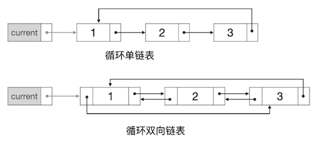

线性表的链式存储结构：链表
++++++++++++++++++++++++++

链表的概念
^^^^^^^^^^

:strong:`链表`\ 采用链式存储结构来实现线性表。既然是线性表，那么元素在逻辑关系上一定是一个接着一个连成一串的，用精确的定义语言来描述就是：每一个元素都至多有一个唯一确定的前驱，也至多有一个唯一确定的后继。但是和顺序表不同，链表中的元素在实际的物理存储上并不要求严格地一个紧接着一个的顺序排放。链表可以在内存中任意的位置存放其中的元素，只要找到一块可以存放元素的内存空间即可。为了维持元素之间逻辑上的前驱后继关系，链表为每一个元素节点增设表示元素间前后关系的\ :strong:`链`\ 字段，指向前驱元素的链称作\ :strong:`前链`\ 或\ :strong:`前向链`\ ，指向后继元素的链称作\ :strong:`后链`\ 或\ :strong:`后向链`\ 。

.. tip::

   通常在C++语言中，链就是指向另一个元素节点的指针。

如果链表中的每一个元素节点都只有一个后链，那么这样的链表叫做\ :strong:`单链表`\ 。如果每一个元素节点同时有一个后链和一个前链，那么称为\ :strong:`双链表`\ 或\ :strong:`双向链表`\ 。

例如整数序列[1,2,3]，如果用链表来存储，那么三个元素在物理内存中各自可能存放在任意的位置中，但是相互之间用链来维持前后关系，如下图所示：

.. image:: ../../images/317_linkedlist_mem.png

其中红色的箭头线表示后链指针，蓝色的表示前链指针。但是这样的示意图看起来非常不舒服，一般我们把链表的示意图画成下面这样更为抽象但是更简洁易懂的方式：

这样，在一个链表的元素节点中，包含一个存放实际元素值的变量和一到两个存放链的指针变量。在用C++语言实现链表的时候，一般总是用一个结构来定义链表节点。如果链表元素的类型是C++内置数据类型，例如 ``int``\ ，最简单的单链表节点可以这样定义：

.. code-block:: c++

   struct Node {
           int value;   // 元素值
           Node *next;  // 后链指针

           Node(int val = 0) { value = val; next = NULL; } // 构造函数
   };

如果希望将链表实现为一个\ :strong:`抽象数据类型`\ （ADT），即可以支持任何数据类型，就像STL库的那些容器一样，那么可以将节点定义为模板结构，比如下面这个双向链表节点：

.. code-block:: c++

   template <typename T>
   struct Node {
           T value;     // 元素值
           Node *next;  // 后链指针
           Node *prev;  // 前链指针

           Node() { next = NULL; prev = NULL; }      // 默认构造函数
           Node(const T &val) { value = val; next = NULL; prev = NULL; }  // 指定元素值的构造函数
   };

.. attention::

   如果给结构提供了一个构造器，而且这个构造器函数必须提供参数，那么就必须同时再提供一个不需要参数的默认构造器，否则这个结构类型就不能用于数组。

   不需要参数的默认构造器函数可以是本身就没有参数的函数，也可以是所有参数都有默认值的函数。

一般数据结构教程中都会使用模板实现抽象数据类型，我们也一样，后面的实现代码将使用模板结构来实现链表的ADT。但是在实际编程解决算法问题时，数据类型一般都是明确的，而且大多数时候是基本的C++内置数据类型。所以实际的算法编程往往并不需要进行模板编程，将数据类型写死就可以了，就像前面那个单链表节点的示例一样。在后续章节的实际算法问题中，除非确实有必要，我们也不再实现ADT了。

.. warning::

   如果函数的参数、返回值不是内置数据类型，而是结构的话，千万记住一定要传引用或者指针。当然了，首选传引用。

从链表的这种存储结构我们可以看出，链表虽然也是一个线性表，但是不能像顺序表一样通过元素的下标来直接跳转找到对应的元素。这是因为元素的实际存储位置可能在任何地方，相互之间没有确定的关系。给定一个下标，要找到对应的元素，对于单链表，我们只能从首元素开始沿着指向后继的链条逐个找下去，顺藤摸瓜找到相应位置为止；如果是双链表，也可以从尾元素开始沿着前驱链逐个向前找。

在单链表中，从一个节点只能通向它的下一个节点，一旦过了某个节点，就回不去了，只能从头再来。双链表则功能强大一些，在任何一个节点上，都可以沿着前驱、后继两个方向来回访问。

所以这就引出了一个新的问题，首尾元素的节点在哪里？对于单链表，至少要知道它的首元素在哪里；对于双链表，它的首尾两个元素都应该知道，否则就无法正确访问链表中的元素。因此像上面给出的示意图中这样的链表还是不完整的，我们还需要有两个特殊的指针来指向链表的头节点和尾节点（单链表可以只有一个头节点，当然有一个尾节点有时候会更方便），称为\ :strong:`头指针`\ （head）和\ :strong:`尾指针`\ （tail），如下图所示：

.. tip::

   在双向链表中，有时候我们会在实际的尾元素节点后面人为添加一个假后继，也叫做\ :strong:`哑节点`\ ，并让尾指针指向它，这样一头一尾两个指针就能和含头不含尾的范围规则保持一致了。STL的双链表容器 ``list`` 就是这样做的。
   
在实际编程的时候，我们很少会仅是简单地定义两个指针，这样太简陋了，而且会多出两个独立的变量来。如果程序中要用到很多张链表，那么难道用一大堆独立的指针变量吗？一般我们定义另一个结构类型来存放链表的头尾指针，这个结构类型就代表了完整的链表数据结构。这个链表结构里面通常还会放上一些别的和链表有关的信息，比如最常见的会放入表的长度。另外我们还会把链表的各种操作（增加、删除、访问等）以成员函数的形式也集成入这个链表结构里去。这样，我们就通过这个链表结构把数据（元素节点）和功能（各种处理）都封装和隐藏了起来，把数据结构部分的代码固定了下来，并且把相对稳定变化不多的数据结构和千变万化多种多样的算法程序从逻辑上隔离了开来。

以上所述就是链表最常见的两种形态：单链表和双链表。作为一种非常灵活的线性表数据结构，链表还可以有许多其他变种，其中最常见的是把首尾相接起来改造成所谓的\ :strong:`循环链表`\ 。循环单链表中尾节点的后继不再是空指针而是指向头指针；循环双链表中尾节点的后继指向头节点，头节点的前驱指向尾节点。这样一来，表被改造成了一个环，从而也就没有了严格意义上的头尾节点，所以这种循环链表中我们通常会用一个\ :strong:`当前指针`\ （current）来代替原来的头尾指针。如下图所示：

本节我们将逐步实现一个普通的双向链表的ADT，具有最常见的增删和访问元素功能。我们已经有了链表节点的结构，接下来便逐步实现链表本身的结构和基本功能。

链表的实现
^^^^^^^^^^

**基本结构**

