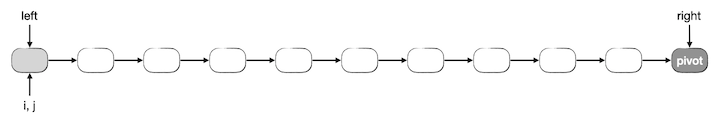
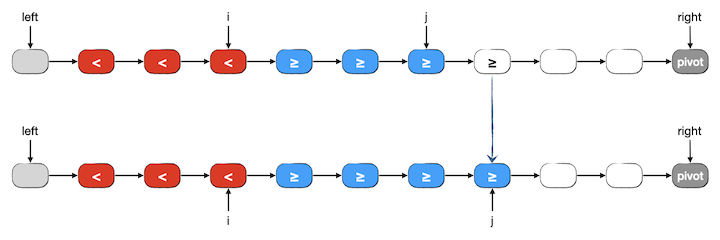
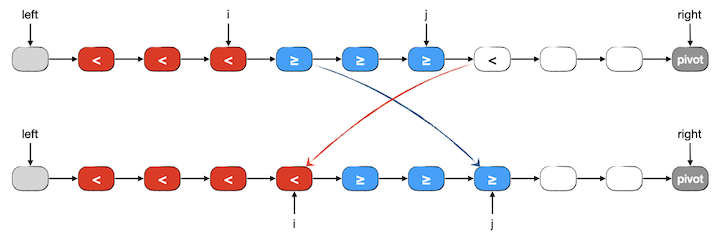
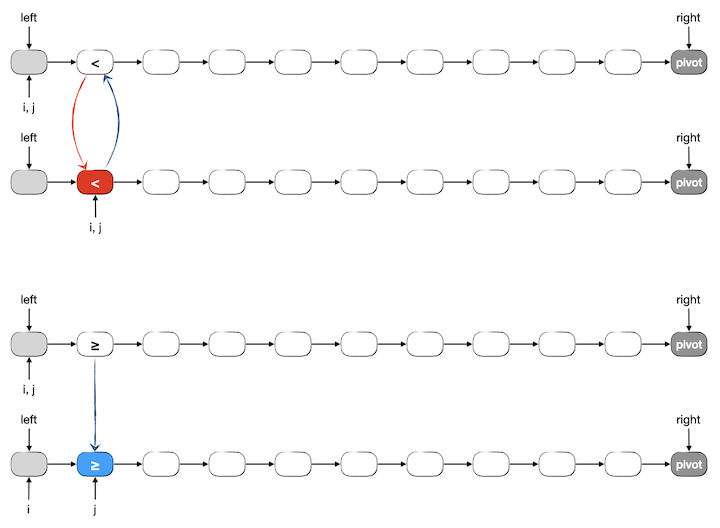
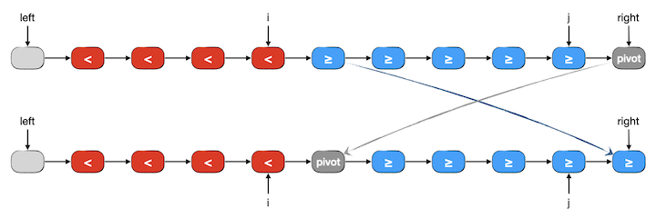

链表的应用
++++++++++

由于链表特殊的存储结构，在某些应用场景会比使用顺序表更为方便高效，有些场景甚至会不得不使用链表。尤其是某些比较古老的编程语言，比如C语言，它们没有 ``vector`` 之类的可变长度顺序表可以使用，如果需要用到长度总是在变化的序列时，往往就只能使用链表来实现了。

本节我们看几个基于链表的简单应用，感受一下链式存储结构给某些算法场景带来的影响。本节的例题在编程时不使用上一节学习的那种完善的链表结构，而是按照算法编程的特点，根据题目的要求以 :emphasis:`够用就行` 的原则因地制宜予以简化。

单链表上的插入排序
^^^^^^^^^^^^^^^^^^

前面我们学过了插入排序，已经知道了插入排序的时间复杂度为 :math:`O(n^2)`\ 。哪怕是经过优化的二分插入排序，虽然插入点查找的过程能达到 :math:`O(\log n)`\ ，但是随后在顺序表中的插入仍然是一个 :math:`O(n)` 时间的操作，所以总体的时间复杂度还是二阶的，尽管实际应用上在元素数量不多时能够接近 :math:`O(n\log n)`\ 。

那么如果是在链表上进行插入排序，情况会不会不同呢？当然了，插入元素这一步操作现在从 :math:`O(n)` 直降为 :math:`O(1)` 了，关键看查找插入点的过程。如果仍然采用顺序查找，那么还是 :math:`O(n)` 时间，和使用顺序表的时候一模一样。综合起来看，查找过程的时间复杂度没有变化，插入过程大幅降低为常数时间。所以总体时间复杂度虽然还是 :math:`O(n^2)`\ ，但是常系数会变得很小，实际运行速度会比顺序表上的插入排序快很多。

那么如果把查找过程也改成二分查找会不会更好呢？答案是只会变得更坏，不会变得更好。为什么？这是因为链表这种结构不适合二分查找。我们知道，二分查找需要根据首尾两端直接找到中点位置，而链表天生不适合按下标值访问元素。根据首尾元素的指针无法计算出中间元素的指针，只能设法计算出下标值，然后一步一步地从首元素（或尾元素）爬过去，对于一段长度为 :math:`n` 的链表，访问它的中间点都需要沿着链爬行 :math:`n\over2` 步。而二分插入排序需要进行二分边界查找，二分边界查找一定要找到首尾相遇为止，这样查找结束的时候，一共走的步数一定是恰好 :math:`n` 步。如果采用顺序查找，每次都恰好查找 :math:`n` 步属于最差情况，通常没那么不走运，平均情况是 :math:`n\over2` 步。所以请记住下面这个结论：

.. important::

   链表不适合二分查找，其时间复杂度以 :math:`n` 为上界，即 :math:`O(n)`\ ，不优于顺序查找。

   链表不应该用于二分边界查找，其时间复杂度恰为上界 :math:`n`\ ，即 :math:`\Theta(n)`\ 。

   若要进行二分查找，应使用顺序表。

接下来我们编写一个在单链表上一边读入数据一边进行插入排序的程序。本节的所有例题我们都采用单链表进行实现，这是因为双链表今后可以使用STL的 ``list`` 容器，一般不需要自己编程实现，所以我们尽量多练习单链表的编程。

由于采用的是单链表，所以查找顺序必须是从前向后。为了保持算法的排序稳定性，要查找的应该是最后一个小于等于待插入元素的元素，找到后插入为它的后继。这里就有一个问题，怎么才能确定是不是\ :emphasis:`最后一个`\ ？必须看过它后面那个元素的值才能知道，对吧。所以要比对的是后继元素，是第一个比待插入元素值大的后继，而不是当前元素！这是单链表插入排序和顺序表情形最大的不同之处。

因为不是严格的数据结构练习，所以我们使用简化版的单链表结构，我们可以看到以下一些简化：

1. 因为这个程序只用到一个存放 ``int`` 型整数的单链表，所以我们不再使用模板来定义通用型的元素节点了，直接写死元素值为 ``int`` 型即可。
2. 无论怎样简化，单链表做好还是有一个头部哑节点，可以让程序的编写简单很多。由于哑节点的元素值本身并没有什么用，所以我们把它废物利用起来，用来存放元素个数 :math:`n`\ 。
3. 我们不管什么数据封装原则和惯例了，直接在主程序里访问节点的成员变量。
4. 这个程序里每一个节点的元素值都是输入进来的，所以没必要增加一个可以初始化元素值的构造函数，元素节点结构只需要一个默认构造器，用来把后继指针设置为空即可。事实上就算是这个构造器也并不是必须的，我们完全可以不提供构造器，然后在主程序里每次生成一个新节点之后把后继指针设置为空（这就是C语言唯一的方式），但是C++时代把这种千篇一律的事情写在构造器里是一个更好的习惯。
5. 整个程序只用到一份单链表，因此也就不单独写一个表示链表的结构了，在主程序中直接定义一个头部哑节点就可以了，至于要用到的单链表的各种功能，要么在主程序中直接写代码，要么定义为单独的函数，把头部哑节点以传指针的方式作为参数传递给函数（这也是以前C语言时代唯一的提供功能的方式）。
6. 事实上要完成边读入数据边排序的功能，我们只需要用到插入元素的功能，这很简单，我们直接写在主程序里。另外我们单独写两个辅助的功能函数，\ ``print()`` 函数用来输出链表中的元素、\ ``clear()`` 函数用来清空链表中的所有元素节点，释放内存。

.. important::

   我们上一节说过，链表中的节点都是动态 ``new`` 出来的，在链表不再使用的时候要及时 ``delete``\ 。理论上，程序退出运行会自动清空所有动态内存，所以对于本例这种在 ``main()`` 中创建链表并用到程序结束的简单情况，可以不需要在结束程序之前清动态内存。但这是一个好习惯，无论如何，只要有过 ``new`` 就一定要遵守谁借谁还、有借有还的原则。

   另外，如果头部哑节点也是 ``new`` 得到的，那么光情况链表元素是不够的，万万不要忘记头部哑节点也要 ``delete``\ 。

下面就是完整的程序和一个练习题：

.. literalinclude:: ../../codes/319_ins_sort_ll.cpp
   :language: c++
   :emphasize-lines: 37, 38, 40-44

.. admonition:: 练习

   上面是一个随着输入数据同时进行插入排序的示例程序，对于输入数据量不多的情况是很实用的。

   请参照上面的程序算法，编写一个对已经存放了若干数据项（\ ``int`` 型整数）的单链表进行插入排序的函数，即单链表版的插入排序。并使用 :download:`随机整数序列生成器<../../codes/tools/randints.cpp>` 生成随机数据进行测试，记录下排序使用的时间，和数组版的插入排序、二分插入排序进行比较，观察三者在实际运行速度上的区别，分析存在速度差异的原因并总结自己的结论。

单链表上的快速排序
^^^^^^^^^^^^^^^^^^

归并和快排理论上来说都是可以在单链表上实现的 :math:`O(n\log n)` 排序算法，但是事实上归并排序是很不合适的一个选择。这是因为归并排序每一步都需要按照元素下标找到一个序列的中点，而直接飞往某个下标值这种操作恰好触及了链表的功能盲区。

快速排序就很适合在链表上实现了，哪怕是单链表也没有太大问题，这里只是涉及一个分区方法的选择问题。以前我们说过，常见的分区方法有两类，一类是设置一前一后两个哨兵，让它们分别从后向前和从前向后地扫描整个待分区序列；另一类是我们详细介绍并推荐使用的《算法导论》一书介绍的方法。简单地想一想就明白应该选哪一类了，单链表根本没法从后向前扫描啊。所以前一类的方法根本没法用在单链表上，只能使用第二类方法，这也是我们强烈推荐掌握这种方法的原因之一。

回顾一下这种分区方法，一定会发现在单链表上实现它是有多么简单，几乎都不需要进行任何改变就可以实现，只是有这么几个点需要留意：

1. 在数组上进行分区，我们用左闭右开的下标值区间来表示要分区的范围，现在我们将改用节点指针，而且由于单链表之后向后看，不能回头向前看，所以我们现在不能再搞什么左闭右开，而是应该改为左开右闭，即含尾不含头。这里，单链表在首元素节点之前添加的那个头部哑节点又一次起到了神作用。同时，要进行快速排序的单链表需要保存一个指向尾元素节点的指针。
2. 当需要进行元素交换的时候，直接交换节点里的元素值成员变量，不要傻傻地去做节点交换。
3. 返回值也是指针，由于是单链表，需要返回的是中间元素节点的前驱节点指针，也就是左半区的尾节点指针，而不是中间节点本身的指针（否则就不知道左边半区的尾节点在哪里了）。

快速排序算法的每一轮，先完成一次分区，然后对分成的前后两个区再一次递归调用自己进行快排。如果对这个分区算法或者对快速排序算法已经感到很陌生了，那么烦请先回到 :doc:`../../ch02/sec05/254_quick_sort` 认真复习。

下面看一下单链表上分区过程的图解。假设有一个单链表如下图所示，用两个指针 ``left`` 和 ``right`` 按左开右闭的规则表示。\ ``left`` 指向首元素节点的前驱，比如头部哑节点；\ ``right`` 指向尾元素节点。现在要对它进行分区，按照以前学过的基于冒泡的分区方法，我们选择尾元素作为分区的枢纽值 ``pivot``\ ，用两个指针 ``i`` 和 ``j`` 分别指示小于段和大于等于段的尾部。在开始分区之前，\ ``i`` 和 ``j`` 均指向 ``left``\ ，表示两个段都还没有被分到元素。

现在先来看看一般的情形，假设分区已经进行到了一半，除 ``pivot`` 外所有节点依次分成了三段，我们用红色节点表示小于段，蓝色节点表示大于等于段，白色节点表示尚未分区的段。此时下一步要对尚未分区段中的第一个元素进行分区，这个元素按照我们的指针规则，应该由 ``j->next`` 所指示。有两种情况：

1、下一个要分区的元素值大于等于 ``pivot`` 值，应该分入蓝色的大于等于段中去。这种情况非常简单，我们将 ``j`` 改成 ``j->next`` 即可，这样这个元素就自然地进入了大于等于段的末尾，而红色的小于段不发生改变。如下图所示：

2、下一个要分区的元素值小于 ``pivot`` 值，应该分入红色的小于段。这种情况下只需将这个 ``j->next`` 节点的值和 ``i->next`` 节点的值进行交换，然后将 ``i`` 改成 ``i->next``\ ，将 ``j`` 改成 ``j->next``\ 。这样这个值就进入了红色的小于段的末端，而被交换过来的值原本是蓝色的大于等于段中的第一个元素值，现在只是被交换到了新尾部而已。如下图所示：

然后我们来看看上述这个一般情况下的算法步骤在分区刚开始第一步的时候是不是正确。此时 ``i`` 和 ``j`` 都等于 ``left``\ ，下一个要分区的元素 ``j->next`` 就是整个链表的首元素。仍然分为小于和大于等于两种情况进行分析，可以发现如果按照上述方法操作，结果仍然是正确的。当然了，如果首元素是小于 ``pivot`` 的，那么交换 ``i->next`` 和 ``j->next`` 这个操作其实是自己和自己交换，是无用功。但是我们也不在乎这一次多余的交换了，而且如果使用判断语句来跳过这一次交换实际上绝对是得不偿失的。

.. warning::

   在多次循环的循环体中加入条件判断来跳过一个只可能出现一次的轻量级的可做可不做操作反而会导致降低实际运行效率，因为每一次循环都会进行这个判断，而判断命中的次数最多一次。

下面是分区刚开始第一步时候两种情况的图示：

最后看一下分区过程全部结束时的情况。此时尚未分区的段已经为空，\ ``j`` 一定指向 ``pivot`` 元素节点，即 ``right`` 的前驱。\ ``i`` 的位置在哪里并不重要，它甚至有可能仍然指向 ``left``\ ，即小于区没有元素，所有元素都大于等于 ``pivot`` 时；也有可能它等于 ``j``\ ，即所有元素都小于 ``pivot``\ ，而大于等于段则为空。我们先不管这两种特殊情况，看看一般情况下最后一步怎么处理。其实处理的方式和以前学过的对数组进行分区的最后一步是一模一样的，即交换 ``pivot`` 和大于等于段的第一个元素，使得 ``pivot`` 恰好隔在左右两段中间。如下图所示：

请仔细想一想我们前面提到的两种特殊情况，即左右两段有一段为空的情况。不难发现上述这个交换操作仍是正确的，无非有可能又做了一次自己和自己的无用功交换而已。

最后，我们要返回指针 ``i`` 作为分区结果。为什么不是像数组的时候那样返回 ``pivot`` 元素最终的位置，即 ``i->next`` 呢？因为我们用的是只朝一个方向看的单链表，从 ``i->next`` 无法得到 ``i``\ ，也就无从知道小于段在哪里结束。

下面是实现这个分区过程的函数代码，请认真阅读代码，进行测试，彻底理解：

.. literalinclude:: ../../codes/319_qsort_ll.cpp
   :language: c++
   :lines: 3-8, 12, 54-71

利用上面这个函数实现单链表快速排序的程序留作练习。编写这个程序的时候有几个点需要注意：

1. 每一轮分区之后，左半区终点和右半区起点分别是分区函数返回指针和它的后继指针。 
2. 现在要怎么判断一个待分区的段长度为0或1？也就是怎样判断递归终止条件？
3. 注意单链表在程序结束前要释放掉动态分配的内存，这是一个好习惯。

下面我们给出一个程序框架，其中提供了两个工具函数 ``clear()`` 和 ``print()`` 分别用来释放内存和输出单链表。这两个工具函数的代码请看懂并牢记。\ ``main()`` 函数已经实现了简化版的单链表构造、数据输入和排序测试，分区函数已经在上面给出。

.. literalinclude:: ../../codes/319_qsort_ll.cpp
   :language: c++
   :lines: 1-53

.. admonition:: 练习

   1、编写完整上面给出的程序框架，也就是完成分区函数 ``partition()`` 和排序函数 ``qsort()`` 的函数定义代码编写。

   2、使用随机整数序列生成工具对程序进行多次测试。

   3、思考与尝试：如果要进行 ``pivot`` 随机化优化，存在什么困难或麻烦？会不会得不偿失？有没有更好的优化方法？尝试 ``pivot`` 随机化，如果有什么更好的优化方法也一起进行尝试。

