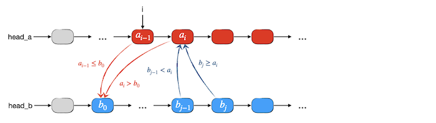
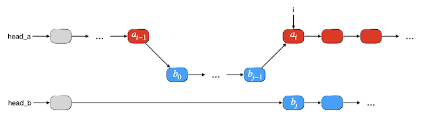
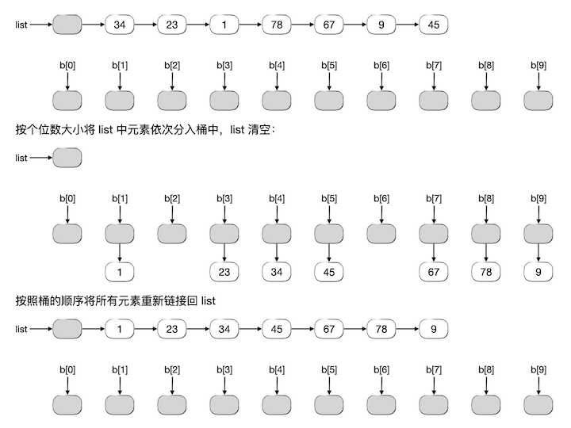
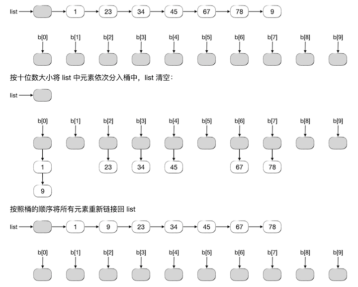

链表的应用（续）
++++++++++++++++

链表的优势在于快速地插入和删除元素，它不光能在链上任意一个环节处以常数时间插入或删除单个元素节点，而且能以同样的常数时间插入或删除整段元素，因此非常适合多个链表之间的分段合并、拼接等操作。

两个有序单链表的归并
^^^^^^^^^^^^^^^^^^^^

前一节说过，链表天生不适合归并排序。但是链表非常适合两个有序表的归并操作，虽然时间复杂度仍然为 :math:`O(n)`\ ，但是实际运行的速度要比顺序表归并快许多。而且和顺序表归并不同，链表可以直接将一个表归并入另一个表，也就是可以实现原地归并，不需要另外开辟一张临时表。这都得益于链表方便的成段拼接能力。

下面仍然以单链表为例，介绍如何实现两个有序单链表的归并。设有两个有序整数序列 :math:`A,B` 保存在两个单链表中，现在要将 :math:`B` 中的所有元素归并入 :math:`A`\ ，并且我们要求在归并时若遇到值相等的元素，\ :math:`B` 中的元素一律归并在 :math:`A` 中所有等值元素的后面。

我们先考虑对于表 :math:`B` 的第一个元素 :math:`b_0`\ ，显然它要归并入表 :math:`A` 中所有小于等于它的元素之后，第一个大于它的元素之前。因此我们第一步要在表 :math:`A` 中寻找第一个大于 :math:`b_0` 的元素 :math:`a_i`\ ，从而就确定了归并后元素 :math:`b_0` 的前驱 :math:`a_{i-1}`\ 。

链表归并时要充分利用其可以整段插入的优势，而不是像顺序表归并时那样一个元素一个元素地搬。现在既然已经知道了 :math:`b_0` 的插入点为 :math:`a_{i-1}` 的后继，那么实际上它后面的所有小于 :math:`a_i` 的节点都应该插入在 :math:`a_i` 之前。因此接下来我们从 :math:`b_0` 出发沿着表 :math:`B` 向后寻找所有小于 :math:`a_0` 的节点，直到第一个大于等于 :math:`a_i` 的元素 :math:`b_j`\ 。那么整个 :math:`b_0` 到 :math:`b_{j-1}` 这一段就是这一次归并要整体搬入表 :math:`A` 中 :math:`a_{i-1}` 和 :math:`a_i` 之间的一段。如下图所示：

上图所展示的是一般的情况，这里还有两种特殊情况需要考虑：

1. 如果 :math:`A` 的长度为0或者在寻找 :math:`a_i` 的过程中一直找到 :math:`A` 表末尾都没有找到大于 :math:`b_0` 的元素，那么实际上整个表 :math:`B` 就应该完整地挂接到表 :math:`A` 的最后，这时候就不需要去寻找 :math:`b_j` 了。
2. 如果 :math:`B` 的长度为0或者在寻找 :math:`b_j` 的过程中一直找到 :math:`B` 表末尾都没有找到大于等于 :math:`a_i` 的元素，那么整个表 :math:`B` 都应该完整地插入到 :math:`a_{i-1}` 之后。

上述两种特殊情况在编程时的处理和一般情况是完全一致的，所以下面我们不单独给出它们的示意图。归并之后的情形如下图所示：

在完成一段归并之后，表 :math:`B` 的首元素实际上已经变成了 :math:`b_j`\ ，而它的插入位置一定是在 :math:`a_i` 之后。所以我们下一次要寻找从 :math:`b_j` 开始的某些元素归并入表 :math:`A` 的位置时，应该从 :math:`a_i` 的后继开始查找。我们只要在开始下一段归并之前，把表 :math:`A` 的查找位置调整为从 :math:`a_i` 的后继开始，就可以使得每一段归并的处理方法变得完全一致。

因此我们在表 :math:`A` 中应该保留一个查找起点指针 ``i``\ ，初始时让它指向表 :math:`A` 的头部哑节点 ``head_a``\ ，每一次查找到 :math:`a_i \gt b_0` 的时候，\ ``i`` 应该指向 :math:`a_{i-1}`\ 。每一次完成一段归并之后如果 :math:`b_j` 的后继不是空那么就应该将 ``i`` 改为指向它，事实上它就是 :math:`a_i`\ ，也就是下一段归并的查找起点。而查找 :math:`b_j \ge a_i` 的查找起点都是从表 :math:`B` 的头部哑节点 ``head_b`` 开始。

某一次归并时如果发生前面所述的两种特殊情况之一的，实际上整个归并过程就已经全部完成了，此时表 :math:`B` 一定已经空了，所以整个过程的结束条件是 ``head_b->next == NULL``\ 。下面是两个有序整数单链表归并的程序代码：

.. literalinclude:: ../../codes/31A_merge_ll.cpp
   :language: c++
   :emphasize-lines: 67-84

.. admonition:: 练习

   编写一个生成随机测试数据的程序。输入两个整数 :math:`m \ge 0,n \ge 0`\ 。输出最多三行：第一行两个整数 :math:`m,n`，中间用一个空格隔开；第二行为 :math:`m` 个10000以内的随机自然数，用一个空格隔开，按升序排列，如果 :math:`m=0` 就跳过此行；第三行为 :math:`n` 个10000以内的随机自然数，用一个空格隔开，按升序排列，如果 :math:`n=0` 就跳过此行。

   用这个工具程序生成测试数据，测试上面的有序单链表归并程序。特别注意观察如果有表为空的情况程序运行是否正确。

单链表实现基数排序
^^^^^^^^^^^^^^^^^^

学习非比较型的桶排序和基数排序算法时我们曾经说过，这两个算法往往会使用链表来构造桶而不是顺序表。关于这两个排序算法的详细介绍请复习 :doc:`../../ch02/sec05/255_non_cmp_sorts`\ 。现在我们以基数排序为例来看看为什么用链表会比用顺序表更好。

简单回顾一下，基数排序最常见的应用是对非负整数序列进行排序。我们采用10个桶分别代表从0到9的10个数码，第一步依次从序列中取出元素，按照其个位数将元素分到对应的桶里去，然后将10个桶按照从0号到9号的顺序把桶中元素依次倒出来拼接成一个新的序列，这个序列里所有元素已经按照个位数从小到大的顺序排列好了。第二步按照元素的十位数大小来重复上述操作，得到的新序列中就已经按照先十位数再个位数的顺序排列了。这样的依次分桶再重新拼接的过程一直重复下去直到某一位上所有元素该位都为0，这时候所有元素都会被分到0号桶中而且都已经按照元素值的大小有序了，把0号桶的元素依次取出来就得到了已经排好序的序列。

以前我们曾经编写过用数组（也就是顺序表）来实现的基数排序算法程序，让我们分析一下它的工作量。假设序列有 :math:`n` 个非负整数，最大的数一共有 :math:`k` 位。那么算法总共要进行 :math:`k` 轮，每一轮包括一次分桶和一次倒桶拼接，工作量均为 :math:`n`\ 。所以总的工作量为 :math:`W(n)=2kn`\ ，时间复杂度 :math:`T(n)=O(kn)`\ 。在空间方面，需要额外用到的存储空间为构成10个桶的10张顺序表，空间复杂度为 :math:`O(n)`\ 。

现在来看看改用链表能带来怎样的变化。假设采用单链表来保存序列，每一个桶也都使用单链表来实现，那么借助于链表的存储灵活性，我们可以带来以下改进：

1. 分桶操作：从序列的首元素开始，每一个元素根据指定位上的数码得到所应分到的桶的编号，然后可以直接将该元素节点从原序列中分离出去，插入到对应桶链表的尾部。
2. 倒桶拼接：现在不需要将每一个桶中的元素按顺序复制到原序列中去，我们只需要从0号桶开始，依次把所有非空桶的链表首尾相接起来形成一个新的链表并接回原序列链表的尾部即可（经过分桶操作之后原序列链表已经清空）。

例如对两位整数的序列 [34, 23, 1, 78, 67, 9, 45] 进行基数排序，第一轮按照每一个元素的个位数进行分桶，分完之后重新链接回原链表 ``list``\ ，过程如下图所示：

然后对得到的新的 ``list`` 序列按照元素的十位数大小再进行上面的操作，如下图所示：

对于两位整数的序列，进行这样的两轮操作排序就已经结束了。如果事先并不能知道最大的位数 :math:`k` 是多少，那么一般就会再多进行一轮，即按 :math:`k+1` 位上的数值大小再进行一轮操作。由于所有元素的第 :math:`k+1` 位上都是0，所以一定会全部分到0号桶里去，并且顺序不变。所以和以前介绍过的方法一样，我们可以通过判断是不是所有元素都在0号桶里来进行排序是否完成的判断。一旦发现某一轮操作下来所有元素都被分进了0号桶，那么说明排序已经结束，把0号桶的单链表移回到 ``list`` 即可。

可以看出，使用了单链表来作为数据存储结构后，整个排序的循环操作次数仍为 :math:`k` 轮，每一轮的分桶步骤仍然需要 :math:`n` 次常数时间的链表元素移动，拼接步骤则最多10次常熟时间的单链表拼接。因此算法总的工作量为 :math:`W(n)=k(n+10)`\ ，时间复杂度 :math:`O(kn)`\ 。空间方面，没有用到多余的存储空间，因此空间复杂度为常数级 :math:`O(1)`\ 。

改用链表结构后，虽然从时间复杂度的上限函数来看都还是 :math:`O(kn)`\ ，但从实际工作量上来看就很容易看出现在系数要小很多，实际运行速度会快于使用数组，元素数量 :math:`n` 越大，速度差距就越大。

