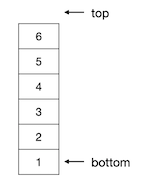

栈：基本概念和实现
++++++++++++++++++

英语单词 stack 原本的意思是堆垛。想象这样一个仓库里的货物堆垛，它用来堆放一个一个的长方体标准货箱。当有新的货物要入库时，仓库工人用铲车将箱子堆放到堆垛的那个位置最方便？当然是最顶上了，一个一个箱子的依次向上堆就可以了。当货物要出库时，工人师傅又开着铲车进来取箱子，这时候取那个位置的箱子最方便呢？当然还是取最顶上的箱子了，一个一个箱子地依次向下取。这就是仓库里货物堆垛的规则。在这样的规则下，越先入库的货物就越被摆放在堆垛的下部，而越后入库的货物就会被越先取走出库。

栈的概念及基本操作
^^^^^^^^^^^^^^^^^^

超级重要的数据结构\ :strong:`栈`\ 的英文名称就叫做 stack，又叫做\ :strong:`后进先出表`\ （LIFO），意思是 Last In First Out。它就是模仿仓库里的货箱堆垛来实现元素存取的一种特殊的线性表，是我们对它的元素存取方式进行了这样的限制：只允许在它的表尾添加元素，不能在任何其他位置添加；只允许读取表尾的元素，不允许读取任何其他位置的元素。通过这样的限制就实现了先加入栈的元素总是会被后读取，后添加进栈的元素会被先读取到，也就是所谓的先进后出规则。

栈作为一种特殊的线性表，有一些特殊的名称。栈的首元素所在元素称为\ :strong:`栈底`\ （bottom），尾元素称为\ :strong:`栈顶元素`\ ，但通常会称其后一个位置为\ :strong:`栈顶`\ （top）。空栈没有栈顶元素，栈顶位置等于栈底位置。无论是用顺序表实现的栈还是用链表实现的栈，一般我们都用下面这样的方式来绘制栈的抽象的示意图：

.. hint::

   有些教材可能直接把栈顶元素所在的位置称为栈顶，这只是习惯上的不同，实质上没有区别。但是这样做会导致空栈时没有栈顶位置，所以大多数教材都使用栈顶元素的后一个位置作为栈顶。但栈顶元素一定是指栈的尾元素。

栈必须至少实现两个操作：\ :strong:`压栈`\ （push）和\ :strong:`弹栈`\ （pop）。

所谓压栈，就是指向栈顶添加一个薪元素，这也是栈唯一允许的添加元素操作。压栈操作其实就是把新元素放到栈顶位置，成为新的栈顶元素，然后更新栈顶为新栈顶元素的后一个位置。

而弹栈，顾名思义，就是压栈的反向操作，即获取并删除栈顶元素。弹栈操作把当前的栈顶元素作为返回值返回给调用者，并从栈中删除这个元素，当然也要相应地更新栈顶。

压栈和弹栈操作的示意图如下：

实际应用中有时候会不方便使用同时返回元素的弹栈操作。比如在C++语言中，受到语言本身的限制，如果栈是用动态内存分配来实现动态长度的，而元素是大规模的自定义结构类型，那么在弹栈的时候一定会销毁栈顶元素，而销毁了栈顶元素就无法以引用方式返回元素，只能以传值的方式返回一份原栈顶元素值的复制品，这样做是效率低下的。还有一种情况是程序本身需要使用栈顶元素，但是又不想把它从栈中弹掉。所以在使用C++语言编程时我们常把通常的弹栈操作分成两部分：一个是不返回栈顶元素的弹栈操作，单纯地弹掉栈顶元素而不返回它；另一个是被称为\ :strong:`偷窥`\ （peek）的操作，单纯地返回栈顶元素（往往是返回引用）而不弹掉它。

.. hint::

   STL的 ``stack`` 容器就是这样的设计，它的 ``pop()`` 成员函数返回类型为 ``void``\ ，不返回任何东西。要访问栈顶元素但不弹掉时使用 ``top()`` 成员函数，它会返回栈顶元素的引用。STL的设计者一定是觉得偷窥这个词不好听。

