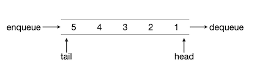
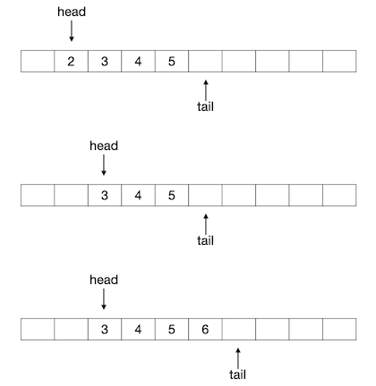
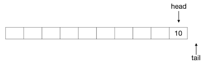
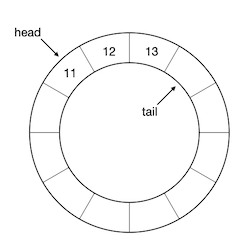
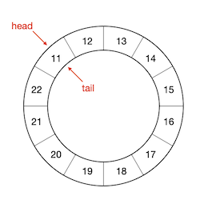

队列：基本概念
++++++++++++++

:strong:`队列`\ （queue）也是一种访问受限的顺序表。和栈一样，队列也是计算机软件中极其重要、应用极其广泛的一种数据结构。

栈可以看作是一种一端开口的顺序表，即除了栈顶这一端是对访问开放的，其他位置的元素都是封闭的，无论是增加、删除还是读取元素，都只能在栈顶这唯一的一个开放端进行。队列同样只能在特定的开放位置进行元素访问，不同的是它分别在首尾两端半开口，即元素只能在其中一端添加，只能在另一端删除和读取，其他位置则都是全封闭禁止任何访问的。通常我们把添加元素的一端叫做队尾（tail），把删除和读取元素的一端叫做队头（head），把元素添加入队尾的操作称作入队（enqueue），把元素从队头删除的操作称作出队（dequeue）。通常队列只允许读取队头元素，也不允许对其进行修改，有时候也会把读取队头元素的操作合并到出队操作中，即出队时同时把这个元素作为返回值返回出来。

.. attention::

   上述是队列的标准定义和规则，但是C++语言STL库提供的队列类容器在此基础上有一些不太一样的设计。

前面我们说过，栈模拟了仓库货物堆垛，那么从队列的规则可以明显看出，队列是模拟了排队而得到的数据结构。

和栈一样，队列也可以根据存储结构的不同实现为\ :strong:`顺序队列`\ 和\ :strong:`链式队列`\ 两种类型。对于栈来说，顺序栈或者链栈除了存储结构不同以外就没有什么别的不同了，但是队列不一样，顺序队列和链式队列有不小的区别。

顺序队列
^^^^^^^^

最简单的顺序队列就是利用一个数组和两个分别表示队头与队尾位置的下标值来构建的。元素总是从左向右的单向增删，队头在左，队尾在右。队头和队尾采用惯例的左闭右开规则，即队头下标指向当前队头元素，队尾则指向当前队尾元素的后一个位置。

初始时，队头和队尾都在数组的最左边，即0号位置处，入下图所示：

.. image:: ../../images/323_queue_2.png

向这个队列中添加一个元素1，则变成下图所示的样子：

.. image:: ../../images/323_queue_3.png

可以看出，队列中元素的数量，即队列长度等于队尾下标减去队头下标的差，如果队尾下标等于队头下标，则表示队列为空。入队的操作，无非是很简单的两步：将元素放入当前队尾所指的位置，然后队尾下标加1。

接下来我们连续入队2、3、4、5四个元素，队列变成下图所示的样子：

.. image:: ../../images/323_queue_4.png

出队的操作同样很简单，分为两步：删除队头下标所指的元素，队头下标加1。实际上顺序队列在编程的时候甚至不需要去做删除元素的操作，只要简单地将队头下标加1就可以认为可以将当前的队头元素删除出队了。例如接下来我们连续进行两次出队，再入队一个新元素6，整个过程的图示如下：

顺序队列的编程实现确实非常简单，我们不打算详细讨论，直接将其作为练习。

.. admonition:: 练习

   使用下面的结构实现一个最简单的顺序队列，元素类型为 ``int``\ ，请填写完整TODO注释处缺失的代码片段并进行测试。请注意入队、出队和读队头操作要判断是否可行，若不可行请用 ``throw`` 命令抛出异常。

   .. code-block:: c++

      struct Queue {
              int _val[1000];   // 底层数组，最大容纳1000个int型元素
              int _head;        // 队头指针
              int _tail;        // 队尾指针

              Queue() { _head = 0; _tail = 0; }     // 构造函数
              void enqueue(int val)
              {
                      // TODO 元素val入队，注意可入队条件判断
              }
              int dequeue()
              {
                      // TODO 队头元素出队，并返回出队元素的值
              }
              int peek()
              {
                      // TODO 读取当前队头元素值但不出队
              }
              int size()
              {
                      // TODO 返回当前队列长度
              }
              bool empty()
              {
                      // TODO 判断当前队列是否为空
              }
      };

随着不断地入队出队操作，最后当队尾下标等于数组的长度，即指向了数组最后一个元素的后面一个位置时，这个顺序队列就消耗空了，如下图所示：

所以，顺序队列存在一个极大的问题，就是空间浪费问题。上图所示的队列，已经不能再入队任何新元素了，但是实际上数组中前9个元素位置都是空的。随着不断地单方向出队，前面的数组元素位置就不断被消耗，无法重复使用。

为了解决这个问题，顺序队列往往采用一种叫做\ :strong:`环形队列`\ 的变种，而不是上面这样的简单的顺序队列。

环形队列
^^^^^^^^

环形队列是顺序队列的一个变种，为了解决顺序队列随着出队操作的进行不断浪费底层数组（或者其他底层顺序表结构）中元素空间的弊端，环形队列将顺序表假想成一个首尾相接的圆环形结构。这和我们前面学过的数组环形访问问题是一脉相承的，可以回顾一下这一节：:doc:`../../ch02/sec06/267_luogu_problems_2`\ 。

和顺序队列一样，初始的空环形队列，队头和队尾下标都为0；元素入队时，放入队尾下标所指的位置并将队尾下标加1并对数组长度取模；元素出队时，简单地将队头下标加1并对数组长度取模即可，如果需要返回出队的元素值则返回之。下图依次展示了一个底层数组长度为12的环形队列的初始状态、元素1入队后的状态、元素2、3、4依次入队并出队一次之后的状态：

.. image:: ../../images/323_queue_7.png

假设一直按照此规则陆续地入队连续自然数，时不时出队一些元素以保持队列长度为3，经过一段时间之后队头队尾可能就会跨越底层数组的头尾界限，并确保今后还可以入队新的元素，不至于浪费掉已出队元素所占用的空间，例如下图所示的情况：

到目前为止，一切看起来都很顺利，除了每次头尾下标值加1之后要取一次模以外，其他和顺序队列并无任何区别。同样的，如果队头队尾两个坐标值相等就说明队列为空。队列的长度则需要略作修改，因为现在有可能出现上图这样的队头坐标值大于队尾坐标值的情况，所以 ``队列长度=队尾-队头`` 这个公式有可能计算出负数，这时的计算公式为 ``队列长度=数组长度+队尾-队头``\ ，使用判断语句或者三元运算可以轻松实现上面的计算规则。当然也可以用这个公式：\ ``队列长度=(数组长度+队尾-队头) mod 数组长度``\ （请想明白这个公式是怎么来的）。

但是这样就没有任何问题了吗？当然不是，还有一个严重的bug存在。请先暂停五分钟，思考一下，能发现这个bug吗？

我们前面说过，如果队头和队尾位置相同了，那么说明队列为空。可是如果我们连续入队，塞满了整个底层数组的时候呢？也就是说队列的长度等于底层数组的长度时，如下图所示：

这时候同样时队头下标等于队尾下标！这样就无法判断队列是空还是满了！

要解决这个问题，我们只能牺牲一个元素空间，即将队列的最大长度限制为底层数组长度减一。这样的话，我们用做示例的这个底层数组长度为12的环形队列，其队列的最大长度就是11，满队列的情况如下：

.. image:: ../../images/323_queue_10.png

请问现在要怎样判断队列是否已经满了？

.. admonition:: 练习

   将上一个顺序队列的练习改成环形队列，仍然使用上一个练习中给出的结构定义来补充实现并测试。

小结顺序队列和循环队列，假如某一算法程序在运行过程中总共可能入队的元素数量为 :math:`M` 个，但在算法程序运行的任一时刻，队列中的元素数量不会超过 :math:`m` 个，显然有 :math:`m\le M` 成立。若使用顺序队列时，底层数组的长度必须不小于前后总共可能入队的元素数量 :math:`M`\ 。这个值往往会很大，当 :math:`M` 很大且远远大于 :math:`m` 时，使用顺序队列就会非常地不合理。而这种情况却是实际算法程序中普遍存在的，所以一般我们都会选择使用环形队列。

链式队列
^^^^^^^^

顺序队列，包括环形队列，虽然都有简单和高速这两个大优势，但都有最大容量受限的问题，它们的最大容量总是受限于底层数组的实际长度，而顺序队列的最大容量还会随着不断地出队操作而不断减少。所以当队列长度较长且不容易预计与控制的时候，我们宁愿编程稍微复杂一点，采用单链表来实现链式存储结构的队列，叫做\ :strong:`链式队列`\ 。

在实现链式队列时，我们需要一个空节点来表示队尾，这个节点不存放元素。初始的时候，队头和队尾的指针全部指向这个队尾空节点，入下图所示，图中用灰色节点表示队尾空节点：

.. image:: ../../images/323_linked_queue_1.png

元素入队时，我们将元素值复制到队尾空节点中，使其变成一个正常的元素节点，并将其的后继指向一个新创建的空节点，同时队尾指针指向这个新的空节点。下图是入队一个元素1之后的情形：

.. image:: ../../images/323_linked_queue_2.png

继续入队，依次入队两个元素2和3：

.. image:: ../../images/323_linked_queue_3.png

元素出队的时候，将队头指针指向它的后继，并销毁原队头元素节点。如果有必要的话，可以在出队的时候返回被出队的原队头元素的值。如下图所示：

.. image:: ../../images/323_linked_queue_4.png

.. warning::

   使用C++语言，在这里很难做到以引用的方式返回元素，只能返回其值，所以如果元素类型是很大的结构变量，那么最好是像STL容器那样，把出队和访问分开为两个不同的函数。

容易看出，链式队列很容易判断其是否为空，如果头尾两个指针指向同一个元素节点，那么就是空队列。但是无法根据头尾指针来计算队中的元素数量，所以另外需要一个变量来跟踪队列长度。

链式队列的C++实现相比顺序队列和环形队列要复杂一些，我们下一节详细介绍。
