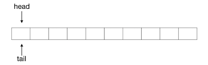
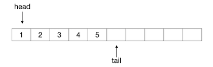

队列：基本概念
++++++++++++++

:strong:`队列`\ （queue）也是一种访问受限的顺序表。和栈一样，队列也是计算机软件中极其重要、应用极其广泛的一种数据结构。

栈，可以看作是一种一端开口的顺序表，即除了栈顶这一端是对访问开放的，其他位置的元素都是封闭的，无论是增加、删除还是读取元素，都只能在栈顶这唯一的一个开放端进行。队列同样是只能在特定的开放位置进行元素访问，但是和栈不同的是，队列分别在首尾两端半开口，即元素只能在其中一端添加，只能在另一端删除，其他位置则都是全封闭禁止任何访问的。通常我们把添加元素的一端叫做队尾（tail），把删除元素的一端叫做队头或队首（head），把元素添加入队尾的操作称作入队（enqueue），把元素从队头删除的操作称作出队（dequeue）。通常队列只允许读取队头元素，也不允许对其进行修改，有时候也会把读取队头元素的操作合并到出队操作中，即出队时同时把这个元素作为返回值返回出来。

.. attention::

   上述是数据结构这一课程对队列的常见定义和规则，但是C++语言STL库提供的队列类容器在此基础上有一些不太一样的设计。

前面我们说过，栈模拟了仓库货物堆垛，那么从队列的规则可以明显看出，队列是模拟了排队而得到的数据结构。

.. image:: ../../images/323_queue_1.png

和栈一样，队列也可以根据存储结构的不同实现为\ :strong:`顺序队列`\ 和\ :strong:`链式队列`\ 两种类型。对于栈来说，顺序栈或者链栈除了存储结构不同以外就没有什么别的不同了，但是队列不一样，顺序队列和链式队列有不小的区别。

顺序队列
^^^^^^^^

最简单的顺序队列就是利用一个数组和两个分别表示队头与队尾位置的下标值来构建的。元素总是从左向右的单向增删，队头在左，队尾在右。队头和队尾采用惯例的左闭右开规则，即队头下标指向当前队头元素，队尾则指向当前队尾元素的后一个位置。

初始时，队头和队尾都在数组的最左边，即0号位置处，入下图所示：

向这个队列中添加一个元素1，则变成下图所示的样子：

.. image:: ../../images/323_queue_3.png

可以看出，队列中元素的数量，即队列长度等于队尾下标减去队头下标的差，如果队尾下标等于队头下标，则表示队列为空。入队的操作，无非是很简单的两步：将元素放入当前队尾所指的位置，然后队尾下标加1。

接下来我们连续入队2、3、4、5四个元素，队列变成下图所示的样子：

出队的操作同样很简单，分为两步：删除队头下标所指的元素，队头下标加1。实际上顺序队列在编程的时候甚至不需要去做删除元素的操作，只要简单地将队头下标加1就可以认为可以将当前的队头元素删除出队了。例如接下来我们连续进行两次出队，再入队一个新元素6，整个过程的图示如下：

.. image:: ../../images/323_queue_5.png

随着不断地入队出队操作，最后当队尾下标等于数组的长度，即指向了数组最后一个元素的后面一个位置时，这个顺序队列就消耗空了，如下图所示：

.. image:: ../../images/323_queue_6.png

所以，顺序队列存在一个极大的问题，就是空间浪费问题。上图所示的队列，已经不能再入队任何新元素了，但是实际上数组中前9个元素位置都是空的。随着不断地单方向出队，前面的数组元素位置就不断被消耗，无法重复使用。

为了解决这个问题，顺序队列往往采用一种叫做\ :strong:`环形队列`\ 的变种，而不是上面这样的简单的顺序队列。

环形队列
^^^^^^^^

链式队列
^^^^^^^^

