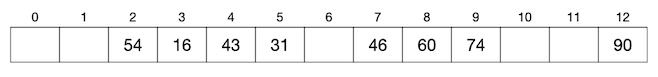
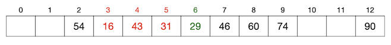
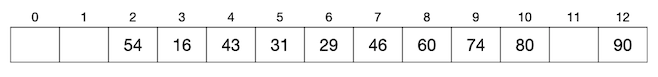
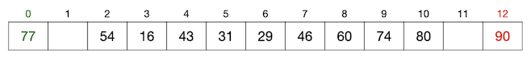

冲突处理与实用的哈希表
++++++++++++++++++++++

要实现一个能解决哈希冲突，并能尽可能充分地利用起底层数组空间的哈希表并不是一件容易的事情，有许多相互纠缠项目矛盾的因素需要权衡。

最重要的是要有一个合适的方法来处理冲突，当要新增进表中的数据项和表中某个已有数据项发生哈希冲突的时候，我们要有方法让这个新数据项仍然能被填进表中，并且在今后仍然能在表中被找到，这就是所谓的冲突处理技术。利用冲突处理技术，我们可以让哈希表的装填因子增大，可以尽量多地存放数据。但是随着装填因子的不断增大，冲突率也一定会随之增大，会发生越来越多的冲突。而此时表中实际上存在哈希冲突的数据项也就会越来越多，一定会耗费更多的时间以处理冲突，从而导致运行效率的下降。

经过不断地实践探索，现在已经有许多实用的冲突处理技术，其中最为简单和常用的有两种：\ :strong:`冲突探测法`\ 和\ :strong:`链式哈希表`\ 。

冲突探测法
^^^^^^^^^^^^

:strong:`冲突探测法`\ 又叫\ :strong:`开放地址法`\ ，它有很多种不同的探测方法，我们只介绍其中最简单的\ :strong:`线性探测法`\ 。线性探测是所有冲突探测方法的基础，虽然简单，但是很实用，其他复杂的地址探测方法都只是对它的优化改进而已。考虑到算法问题很少需要自己动手实现一个几近完美的哈希表，所以现阶段我们只学习线性探测法就够了。

所有冲突探测法的处理思路都是当冲突发生时，我们按照某种确定的探测方法在底层数组中再探测一个可用位置以放置新数据项。而线性探测法是简单地向后逐个寻找空位，找到第一个可用的空位置即可，如果找到底层数组的最后一个位置还是没有空位，就再从头开始向后找。显然，只要填充因子还没有到100%，就一定能找到一个空位置。

为一个数据项探测位置的次数称为该数据项的\ :strong:`探测次数`\ ，如果新数据项填入表中时没有发生哈希冲突，那么它的探测次数为一，即通过哈希函数的一次计算就得到了位置。如果发生哈希冲突，那么前后总共探测了几个位置（含计算哈希函数那一次）它的探测次数就是几。

例如，我们的哈希函数为除13取模：:math:`Hash(k)=k % 13`\ ，其中 :math:`k` 为键值，是正整数。底层数组的长度为13。现在依次向表中填入键值为16,74,60,43,54,90,46,31,29,88,77的11个数据项，从16开始到31为止都没有发生哈希冲突，数据项都以其键值除以13得到的余数为下标存放在表中，如下图：

到目前为止填入表中的8个数据项的探测次数都是1。接下来要填入键值为29的一个新数据项，计算得到哈希值为3，和现有的键值为16的数据项发生哈希冲突。按照线性探测法，我们从这个位置(3)开始逐个向后寻找第一个空位，发现位置(4)和(5)都已经填入了数据项，位置(6)是第一个找到的空位，探测结束，把键为29的新数据项填入其中。这个过程总共探测了从(3)到(6)的四个位置，所以探测次数为4。结果如下图：

可以看出，今后如果要在表中按键值29查找或删除数据项，同样要从哈希值所指示的位置(3)开始向后探测，前后总共探测4次抵达位置(6)就能访问到这个数据项。

接着我们再插入键值为80的数据项，哈希值为10，没有冲突，一次探测完成插入，如下图所示：

最后插入键值为77的数据项，哈希值为12，和已有的键值为90的数据项发生冲突。向后探测已经抵达哈希表底层数组的末尾，按照线性探测规则绕回头部探测，发现位置(0)为空。所以经过2次探测，我们找到了可以存放的空位，如下图所示：

最终11个元素全部插入进总长度为13的哈希表中，空间几乎用满。而其中有两个数据项是发生了哈希冲突的，分别用4次探测和2次探测找到了新位置，今后在访问它们的时候也同样会经历完全一样的4次探测和2次探测。

由此可见，线性冲突法解决哈希冲突可用于较好地实现一个实用的哈希表。但是也应该看到，随着装填因子的增大，发生冲突时的探测次数也会上升。如果装填因子达到100%，很可能出现探测次数接近于哈希表长度的情况。冲突处理的结果是导致那些发生冲突的数据项的增删查效率下降，数据访问的平均时间复杂度不再严格是哈希表承诺的 :math:`O(1)`\ ，极端情况可能会接近甚至达到 :math:`O(n)`\ 。

因此实现这样的哈希表时，必须对装填因子设置上限。上限设为多少是很难从理论上给出预计的，不断实践测试的结果表明，通常0.7到0.8之间是一个比较合适的区间，超过0.8就会比较明显地引起性能下降。

链式哈希表
^^^^^^^^^^^^

