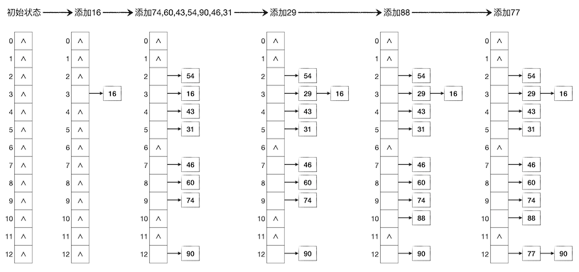
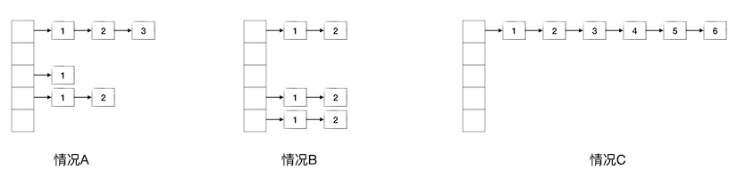
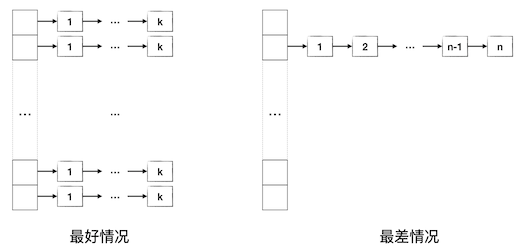

冲突处理：链式哈希表
++++++++++++++++++++

有了冲突探测技术就够了吗？采用冲突探测技术实现的哈希表存在什么缺点吗？当然有，这种哈希表最大的问题是，底层数组很难实现动态大小。如果事先无法预知数据量，也就无法预先确定底层数组的大小。而一旦填充因子达到上限之后还有新数据项要添加进来，那么要么牺牲效率，要么设法扩张底层数组。但是扩张底层数组的长度有几个难点：一是扩多少很难定，二是找一个大质数很费时间，三是最大的问题，所有表中已有的数据项都需要重新哈希，全体搬家。所以扩张底层数组说说看容易做做看难，尤其是表本身已经很大的时候再做扩张可能会非常费时。如果干脆牺牲效率，让填充因子进一步扩大，那也最多只能到全部填满，如果数据项的数量超过了底层数组的长度还是免不了要扩张底层数组本身。

所以对于那些数据量很大而且事先无法预计的场景，采用冲突探测法就显得不太合适了。这时候我们一般会使用另一种处理哈希冲突的方法，构建\ :strong:`链式哈希表`\ 。

链式哈希表
^^^^^^^^^^^^

链式哈希表，顾名思义，就是指采用链表结构来存放数据项的哈希表。使用链式存储结构之后，每一个底层数组的元素其实都是一个单链表的头节点，初始时候都是空指针。当一个数据项的哈希值计算完成，确定了它应该存放在底层数组的哪一个位置之后，我们并不是把这个数据项直接存放在数组的这个元素里，而是把它插入到数组元素所指向的那个单链表里。通过这样的方法，所有具有相同哈希值的数据项就在该哈希值所指定的底层数组元素后面形成了一个理论上长度无限的单链表，从而让哈希表可以存放理论上无穷多的数据项。

仍然采用上一节的例子，用长度为13的底层数组构建哈希表，依次存入键值为16,74,60,43,54,90,46,31,29,88,77的11个数据项。这次我们采用链式哈希表，其过程如下图所示：

**添加数据项**

在链式哈希表中添加数据项非常简单，根据键值计算出哈希值，确定在底层数组中对应的位置，然后在该位置的单链表头部插入该数据项即可。这里需要注意的是插入数据项是在单链表的头部完成的，也就是说哈希值相同的数据项，后添加进来的在前，先添加进来的在后。这是为了编程的便利性，如果要按照添加顺序来保持链表中数据项的节点顺序，那么我们就需要额外为每一个单链表维护一个尾节点指针。这就会增加编程的复杂度，但是哈希表本身就不保持数据项的添加顺序，也不保证任何别的元素顺序，所以在链表中保持添加顺序没有什么意义。

可以看出，不管有没有发生哈希冲突，链式哈希表的添加数据项操作都是 :math:`O(1)` 的时间复杂度，忠实地满足哈希表的设计要求。

**查找与删除**

在链式哈希表中根据键值查找一个数据项的操作也很简单，先根据键值计算出哈希值，确定底层数组中该数据项应该存在的那个单链表，然后在这个单链表里沿着链顺序搜索下去直到找到或找不到为止即可。删除数据项无非是先查找该数据项，如果找到了，执行单链表的节点删除操作即可。

计算哈希值只需要一次常数时间的操作，随后在单链表中的搜索是一个线性搜索过程，根据线性表的知识我们知道，设该链表的长度为 :math:`k`\ ，则搜索的平均时间复杂度为 :math:`O(k)`\ 。如果要删除这个数据项，链表的节点删除也是常数时间的。所以对于一个有 :math:`k` 个冲突项的键值，查找和删除操作的时间复杂度都是 :math:`O(k)`\ 。

但是这个结论是不够的，每一个哈希值的冲突数随时都在变化，而且是不确定的，我们希望知道在一张底层数组长度为 :math:`p`\ 、数据项数量为 :math:`n` 的哈希表中执行查找和删除操作的时间复杂度。事实上这个时间复杂度是很难精确估计的，但是我们可以从一些例子出发尝试了解它的工作量取值范围。由于计算哈希值和删除链表节点都是常数时间操作，所以我们可以不考虑它们所耗费的工作量，而是以在链表中查找的步数作为基本工作量来估算时间复杂度。

下面先看三种具体的情况，设在一个底层数组长度为5的链式哈希表中存放了6个元素，有A、B、C三种情况如下图所示，其中数据项节点中的数字表示要查找到该数据项所需要的链表搜索步数：

情况A是比较普通的情况，这种情况下的平均查找步数为：

.. math::

   W_A=\frac{(1+2+3)+(1)+(1+2)}{6}=\frac{10}{6}\approx1.667

情况B是一种比较特殊的情况，6个数据项平均地分布在3个链表中，每个链表2个数据项，此时的平均查找步数为：

.. math::

   W_B=\frac{(1+2)+(1+2)+(1+2)}{6}=\frac{9}{6}=1.5

情况C是另一种特殊情况，6个数据项哈希值全部相同，都集中在一个链表里，此时的平均查找步数为：

.. math::

   W_C=\frac{1+2+3+4+5+6}{6}=\frac{21}{6}=3.5

现在我们大致可以看出一些端倪。虽然很难计算出像情况A这种普遍现象下的平均工作量的精确期望值，但是从情况B和情况C可以归纳出平均工作量的上下限，即最好情况和最差情况，如下图所示：

显然情况B代表了比较好的状况，我们可以确信，数据项在各条链表中分布越均匀，平均查找工作量就越低。如果完全均匀地分布在 :math:`q` 条链表中，每条链表恰好 `k` 项，那么平均工作量为：

.. math::

   \frac{q(1+2+\cdots+k)}{qk}=\frac{{1\over2}qk(k+1)}{qk}=\frac{k+1}{2}

数据项的总数量为 :math:`n=qk`\ ，所以当 :math:`q` 达到最大值 :math:`q=p` 时，:math:`k` 会达到最小值 :math:`k={n\over p}`\ ，此时的平均查找工作量也达到最小。这就是最佳情况：:emphasis:`数据项的数量恰为底层数组长度的倍数且所有数据项完全均匀地分布在所有哈希值上`\ 。这种最好情况下的查找时间复杂度为 :math:`O({n\over p})`\ 。

.. admonition:: 思考

   实际情况下，不能指望数据项的数量 :math:`n` 总是底层数组长度 :math:`p` 的倍数。通常的情况可以设 :math:`n=kp+r`\ ，其中 :math:`0\le r \lt p`\ ，即 :math:`r` 是余数。这时的最好情况是什么？平均查找工作量会在什么范围内？时间复杂度有没有变化呢？更进一步，能不能推导出工作量的表达式呢？

最差情况当然就是类似情况C的样子，\ :emphasis:`所有数据项集中在一个哈希值上`\ 。此时哈希表事实上已经退化成了一个单链表，或者说退化成了线性表。以前已经讲述过，此时查找的平均工作量为：

.. math::

   \frac{1+2+\cdots+n}{n}=\frac{n+1}{2}

所以最差情况的查找时间复杂度为 :math:`O(n)`\ 。

**链式哈希表小结**

