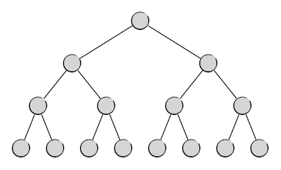
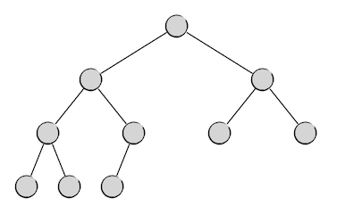
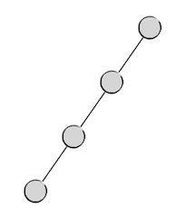

二叉树(I) 基础知识
+++++++++++++++++++

二叉树的概念
^^^^^^^^^^^^

在这一部分的引论节中我们已经了解了树和森林的概况和相关的一些概念，也已经了解到了所有的树和森林类数据结构中最为重要的一种，即\ :strong:`二叉树`\ （binary tree），它是指所有节点都最多只有两个子节点的树。一个节点的两个子节点习惯上分别称之为\ :strong:`左子节点`\ （left child）和\ :strong:`右子节点`\ （right child）。如果将一个节点的左子节点视为根节点，从它开始的所有后代节点共同构成的子树称为这个节点的\ :strong:`左子树`\ （left subtree），以其右子节点为根的部分就称为它的\ :strong:`右子树`\ （right subtree）。

二叉树每一层上的节点数量是有规律可循的。按照树结构的定义，根所在的层为第0层，在这一层上只能有一个根节点，所以第0层有且仅有一个节点。因为一个二叉树节点最多只有2个子节点，所以每一层的节点数最多是上一层节点数的2倍。设第 :math:`i` 层上的最大节点数量为 :math:`N_i`\ ，则下一层上 :math:`N_{i+1}=2N_i`\ ，其中 :math:`i=0,1,2,\cdots`\ ，初值 :math:`N_0=1`\ 。很容易看出，这是一个等比数列，公比为2，首项为1。因此，二叉树单层最大节点数为：

.. math::

   N_i=2^i, (i=0,1,2,\cdots)

由此，使用等比数列求和的方法就很容易得到一棵高度为 :math:`h` 的二叉树的最大可能节点数量 :math:`N(h)` 了。

.. math::

   N(h) = N_0 + N_1 + N_2 + \cdots + N_{h-1} = 2^0 + 2^1 + 2^2 + \cdots + 2^{h-1} = 2^h - 1

根据上面的描述，我们很容易想象出一棵完美的二叉树应该有的样子，就像下面这样：

这当然是最完美的一种二叉树了，在这样的二叉树中，每一层都恰好排满了节点，我们把这样的二叉树叫做\ :strong:`满二叉树`\ 。

满二叉树第 :math:`i` 层上的节点数量一定恰好等于二叉树这一层的最大可能节点数 :math:`2^i`\ ，而一棵高度为 :math:`h` 的满二叉树的总节点数也一定恰好是相同高度的二叉树的最大可能节点数 :math:`2^h-1`\ 。例如上图中这棵高度为4的满二叉树，它的节点数就是1+2+4+8=15=2\ :superscript:`4`\ -1个。

显而易见，如果节点数恰好为 :math:`2^h-1` 这种形式的数值，那么组织成满二叉树，高度为 :math:`h`\ ，这是最低可能的高度了。所有基于二叉树操作的算法，树高越低，效率越高，因此满二叉树确实是最完美的。

但是实际应用中不可能保证节点数总是恰为 :math:`2^h-1` 个的。因此我们一般就退而求其次，希望在任意的节点总数 :math:`n` 下，二叉树最好能组织成下面这种样子：

也就是说，除了最低的那一层以外，其他各层都是满二叉树的形式，而最低那一层上的节点，从左到右连续地排列，直到排完。这样的二叉树是接近完美的，我们称之为\ :strong:`完全二叉树`\ 。于是，现在我们可以认为满二叉树是完全二叉树的一种特例。

完全二叉树是实际应用中所能追求的最接近完美的二叉树了，它也有很多优秀的性质：

1. 若一棵完全二叉树的高度为 :math:`h \ge 1`\ ，那么它的总节点数 :math:`n(h)` 满足 :math:`2^{h-1} \le n(h) \le 2^h-1`\ 。
2. 若节点总数为 :math:`n \ge 1`\ ，那么完全二叉树的高度为 :math:`h(n)=\left\lceil \log (n+1) \right\rceil`\ 。

.. admonition:: 练习

   用数学方法证明上面的三个性质。

现在我们可以得到这样的结论：\ :emphasis:`二叉树中最为完美的组织形式为完全二叉树，为了确保数据访问效率最高，使用二叉树的算法要尽力将二叉树维持为完全二叉树或极其接近完全二叉树`\ 。

但是俗话说，世上不如意事十有八九，如果不人为地在程序中对树的形状进行监控和修整，自然生长的二叉树通常会长成各种奇怪的形状，比如：

.. image:: ../../images/341_bitree_3.png

这就算是比较好的了，还有最差的情况，从树根开始总是向着一个方向延伸，于是变成这样：

这种最差情况下，树的高度等于树中的节点数，数据访问的效率最低，实际上这是退化成了线性表。不光是二叉树，任何形式的树在应用中都要注意，绝对不能让它退化成线性表。

.. important::

   如果保持好树的形态，使其尽可能地接近或成为完全二叉树，是所有基于二叉树的算法所需要关注的问题。要实现这一目标并不简单，比如后面要讲的二叉检索树，就需要通过不断地检查和旋转来保持身材，使之成为一棵平衡二叉检索树，否则就很容易退化，失去了二叉检索树的价值。但是检查和旋转的所谓平衡二叉树算法是比较复杂的，更加复杂的还有红黑树的平衡算法。这些技术在初学阶段可以不必掌握，但是要有所了解。

当然了，千万不要忘记只有一个树根的树也是一棵二叉树，它既是最优秀的满二叉树，又是退化成线性表的最差劲状态。

从上面这种退化状态也可以看出一个结论，一棵高度为 :math:`h` 的二叉树至少有 :math:`h` 个节点。所以我们可以得出通常意义下二叉树的高度和节点数之间的关系：

1. 高度为 :math:`h` 的二叉树，其节点数 :math:`n(h)` 的取值范围为：:math:`h \le n(h) \le 2^h-1`\ 。
2. 节点数为 :math:`n` 的二叉树，其高度 :math:`h(n)` 的取值范围为：:math:`\left\lceil \log(n+1) \right\rceil \le h(n) \le n`\ 。
3. 给定节点数，完全二叉树的高度达到最低，退化二叉树高度达到最高。
4. 给定高度，满二叉树的节点数达到最大，退化二叉树的节点数达到最小。

从上面的介绍我们可以看出，二叉树实际上隐含了一种递归的形式，即子树也是一棵二叉树。另外，无论从理论上还是从实践上来讲，我们都应该允许任何一种数据结构中的数据量为零，比如一张空链表，二叉树当然也不例外，当然允许有所谓的空树存在。哪怕连根节点都不存在，也应该视为一棵二叉树，即一棵节点数为0的空二叉树。于是我们就可以有下面这样的二叉树的递归定义：

.. admonition:: 二叉树的递归定义

   一棵二叉树：
   1. 要么没有节点，是一棵空二叉树；
   2. 要么由一个根节点和它的左右两棵子树构成，且左右两棵子树都是二叉树。

二叉树的链式结构实现
^^^^^^^^^^^^^^^^^^^^

很遗憾，C++的STL库中没有现成的树类型的容器，所以当然也没有二叉树这种应用极为广泛的数据结构。如果遇到要使用二叉树的算法，我们只能自己编程实现一个。

二叉树最常见的实现方式为链式结构。根据二叉树的递归定义，我们只需要这样一种节点结构就可以实现二叉树了：可以存放一个数据项，有两个指向左右子树的指针，指针类型就是节点结构本身。比如下面这个简单的结构其实就已经定义了一个模板元素数据类型的二叉树节点。

.. literalinclude:: ../../codes/341_bitree_1.cpp
   :language: c++
   :lines: 1, 3-12

这里这个简单的 ``Node`` 结构我们将在后文的示例程序中一直继续使用。它的编写方式有几个需要注意的地方：

1. 我们将模板类型的数据项用封装惯例封装了起来，可以用 ``T &value()`` 成员函数来访问数据项的引用，这样就可以实现对任何类型的数据项的高速读写访问。
2. 但是我们并没有封装左右子节点指针的成员变量 ``left`` 和 ``right``\ ，意味着程序中可以直接访问这两个成员变量，这是因为封装指针类型的变量比较复杂，如果不想使用指针的指针这种反人类的形式，那么就要将子节点的读和写分成两个不同的成员函数，就像Java中的数据域访问器一样，这是被C/C++程序员所不齿的一种做法。考虑到算法编程的特殊性，我们就不坚持数据封装了，灵活一点，直接访问成员变量就可以了。
3. 这个结构只是定义了一个二叉树的节点，并不是一棵二叉树。虽然根据二叉树的递归定义，一个节点就是一棵二叉树，只需要定义这样一个节点结构类型就足够了，但是使用的时候总觉得有点不太精准。因此一般我们在正式使用之前更习惯给它取一个听上去像二叉树的别名。另外，由于采用的是链式结构，会更多地用到节点的指针类型而非节点类型本身，所以我们通常干脆给它的指针类型定义一个别名，例如：

.. code-block:: c++

   typedef Node<int> *BiTree;

.. warning::

   模板类型在定义别名的时候要指定具体数据类型，不能给没有具体化的模板再取别名

这样定义之后，自定义类型 ``BiTree`` 其实就是指向数据项为 ``int`` 型的二叉树节点的指针类型 ``Node<int> *``\ 。例如下面是一个简单的示例程序，请仔细阅读，学会怎样生成节点、添加子节点、读取和修改节点中数据项的值等最基本的操作：

.. literalinclude:: ../../codes/341_bitree_1.cpp
   :language: c++

.. tip::

   在实际使用中，为了方便访问，往往会把父子关系做成双向链的结构，即每一个节点都再增加一个指向父节点的成员变量，以便从子节点回溯到父节点去。根节点的父节点指针规定为 ``NULL``\ 。但是这样的双链结构会增加节点增删时的工作量，添加子节点的时候要同时维护好子节点的父节点指针才行。后面我们会很快看到这种双链结构的二叉树。

二叉树的顺序结构实现
^^^^^^^^^^^^^^^^^^^^

除了上面这种最常见的链式结构以外，二叉树其实也可以基于顺序表，比如最简单的数组来实现。基于顺序结构实现的二叉树，在代码形式上能够更加简洁，在节点的查找与读写上也可以利用按下标直接访问的优势提高速度。

假如我们将一棵二叉树中的所有节点按照层次从上到下、同层从左到右的顺序依次从0开始编号。根节点规定为0号节点，那么根节点的左右两个子节点就分别为1号节点和2号节点。再下一层，从左到右依次是1号节点的左右子节点和2号节点的左右子节点，它们的编号依次为3、4、5、6号。例如下面这样一棵满二叉树：

.. code-block:: none

               0
              / \
             /   \
            /     \
           /       \
          /         \
         /           \
        1             2
       / \           / \
      /   \         /   \
     3     4       5     6
    / \   / \     / \   / \
   7   8 9  10   11 12 13 14

我们可以发现，每一个位置上的节点编号和它的父节点编号是有确定的关系的。
