二叉树(II) 层序访问与宽度优先搜索
+++++++++++++++++++++++++++++++++++

前面学习了二叉树的基本知识和链式、顺序两种存储结构的实现方法。但是我们发现，光这些完全不足以有效地使用二叉树结构，甚至无法有效地创建出一棵二叉树。

造成这一问题的原因是树结构的特殊性。对于一棵二叉树中的某一个节点，不能像线性表元素一样有一个确定的毫无歧义的序号来标定它所在的位置。要让计算机程序知道二叉树中某一个节点的位置，需要一个从根节点出发的路径。因此，如果我们只有一系列的数据项是不足以创建出所需要的二叉树的，还需要每一个数据项的路径，或者确定每一个数据项路径的规则才行。

在实际应用中，二叉树的节点路径规则可以是多种多样的，不同的规则能生成出不同的二叉树。经典的二叉树节点规则有二叉检索树规则、红黑树规则等。这一节我们将介绍一种最简单的层序访问规则，按从上到下的顺序从根节点所在的0层依次访问直到最底层，在同一层中按照从左到右的顺序依次访问所有节点，遇到空节点直接跳过。这个规则可以归纳为\ :strong:`从上到下、从左到右`\ 。

如果我们要在二叉树中搜索某个满足特定条件的节点，我们可以按照层序规则逐个节点地扫描搜索，这就是著名的\ :strong:`宽度优先搜索`\ （BPS）策略。当然了，层序访问或宽度优先搜索都不局限于二叉树，事实上任何结构的树都可以按层序规则来访问节点，而宽度优先搜索甚至能用于网状结构（例如图）的搜索。

对一个数据结构中的所有元素按照一定规则完整地进行一次访问，不重复、不遗漏，在数据结构和算法领域称为对这种数据结构的一次\ :strong:`遍历`\ （traversal）。对一棵树（当然包括二叉树）中的所有节点完整地按层序访问一遍就称为一次\ :strong:`层序遍历`\ （layer-order traversal）。层序规则的实现一般要依赖于使用一个队列。

.. attention::

   接下来的所有示例程序中我们一律采用链式结构来实现二叉树，毕竟这是最为自然最为常见的一种实现形式。顺序结构一般仅用于完全二叉树，最常见的是用来构造堆结构，我们将在介绍堆的时候再使用。

层序创建完全二叉树
^^^^^^^^^^^^^^^^^^

仅给定一个数据项序列但没有规定节点定位规则的时候，我们可以按照层序的规则来创建出一棵完全二叉树。在没有对节点定位规则做多余假设的情况下，默认采用层序来构造完全二叉树是最合理的设想了，因为完全二叉树是层数最少，空间利用最合理的情况。

设给定了一个长度为 :math:`n` 的序列 :math:`a[0..n-1]`\ ，显然 :math:`a[0]` 是要作为根节点的。:math:`a[1]` 和 :math:`a[2]` 分别是根节点的左右两个子节点，它们位于树的第2层。随后第3层上的节点为 :math:`a[3]` 到 :math:`a[6]` 一共4个，依次分别是 :math:`a[1]` 的左右子节点和 :math:`a[2]` 的左右子节点。依此类推直到最后一层的最后一个节点 :math:`a[n-1]`\ 。

如果我们没有一种有效的辅助数据结构，仅是靠序列编号本身来推算数据项应该在哪一个节点上，那么创建过程会非常复杂。比如我们可以计算出来 :math:`a[10]` 的所在节点位置应该是第4层左起第4个位置，是其父节点的右儿子。那么接下来就要找到它的父节点，通过计算可以知道是第3层的第2个节点。但是为了定位过去，我们还得再向上找父节点的父节点，即第2层的第1个节点。然后再向上定位到根节点。这是一个不断向上回溯，直到根节点，然后再按照回溯路径一路访问下来的过程，太麻烦了，我们需要一种更好的办法。更好的办法就是用一个队列来作为辅助数据结构，下面我们就来看看怎样做到。假设我们的序列为 {1, 2, 3, 4, 5, 6}，一共6个整数。

第一步先读入第1个数据项1，它一定是根节点。于是我们先创建出一个根节点，放入数据项1，然后将其入队。结果如下图所示，左边为节点队列，右边为生成过程中的二叉树形象：

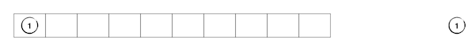

.. important::

   在实际实现树的链式结构的时候，我们一般都使用指向节点的指针变量而不是直接用节点变量，队列里存放的其实也是指针而不是实际的节点。而且节点都是使用动态内存分配出来的，不是直接定义出节点的变量来。这样就可以更加灵活地引用这些节点，无论作为队列里的元素还是实际的树节点，其实都只是一个指针而已。只有用 ``delete`` 语句销毁内存才会使得真正的节点消失，单纯地删除队列元素甚至销毁整个队列都不会导致节点丢失。

接下来我们就要不断地读入后面的数据项，生成节点并将其接在树上正确的位置了。这个过程在程序里肯定是通过一个读数循环来实现的，在讲解时我们一个一个数据项地展示。第二个读入的数据项为2，先生成好节点。然后我们检查队列的队头元素，发现队头指向的节点还没有左儿子，所以新节点就挂在它的左子上，并且让这个新节点入队。我们用白色表示没有子节点的节点，灰色表示只有一个左儿子的节点，于是队列和生成中的二叉树如下图所示：

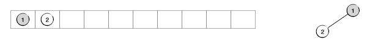

继续，读入第三个数据项3并生成节点。这是检查队头发现队头所指的节点已经有左儿子了，所以将新节点挂在它的右节点上并且入队。现在这个队头所指的节点已经两个子节点满了，我们用蓝色表示这样的节点。这个节点无法再接受新的子节点了，所以我们应该让它出队了。这一波操作完成后的样子如下图：

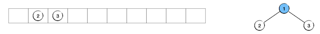

继续读入第四个数据项4，生成新节点，检查队头所指的节点发现该节点没有左儿子，于是新节点挂在队头节点的左子上并入队：

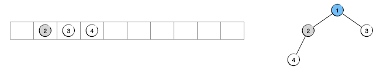

读入第五个数据项5，生成新节点，检查队头后挂在队头节点的右子上，队头出队，新节点入队：

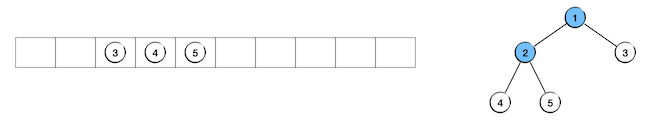

读入第六个数据项6，生成新节点，检查队头后挂在队头节点的左子上，结果如下：

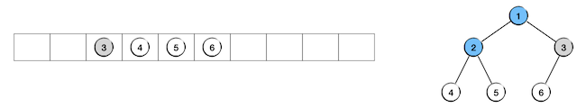

到此为止所有数据项都已经读入完毕，我们要创建的完全二叉树已经全部构造完毕。由于队列里存放的元素只是指向节点的指针，所以此时我们可以放心地让整个队列消失，不会对生成好的二叉树产生任何影响。只要我们还记得树根节点的指针就可以了，通过这个根指针就能找到整棵树。

下面我们看一下这个过程的实现代码。先定义树节点结构，为了方便起见我们不再使用数据封装的惯例，也不再使用模板技术，而是像在传统的C语言中所做的那样，直接定义好节点结构 ``Node``\ ，外部程序直接访问结构的成员变量，并且我们将指向节点的指针定义为一个单独的自定义数据类型 ``BiTree``\ ，今后在程序中我们全部使用这个指针类型来表示二叉树。然后我们实现一个 ``create()`` 函数来创建一棵完全二叉树，数据项依次从标准输入设备读入进来，按照层序规则逐步构建，完成后返回根节点（的指针）。代码如下：

.. literalinclude:: ../../codes/342_bitree_bps.cpp
   :language: c++
   :lines: 1-16, 44-70

二叉树的层序遍历
^^^^^^^^^^^^^^^^

光是创建好一棵完全二叉树并没有什么用，数据结构是要用来使用的，使用的方式就是访问其中的数据项。对于任何树结构来说，要直接定义某个节点是比较麻烦的，一般我们在应用树结构的时候最常用的方式就是遍历和搜索。事实上搜索只是一个满足特定条件就中止的遍历而已，所以在树结构的学习时掌握遍历树的算法是最为重要的。

层序遍历是适用于所有树结构的，不光是完全二叉树，任何树都是分层的，都是可以进行层序遍历的。按照层序进行节点搜索的过程又叫做宽度优先搜索，是回溯算法中极为重要的一种。所以在这里先学习二叉树的层序遍历是非常重要的。

实现层序遍历仍然需要用到一个队列作为辅助。下面还是先看具体的例子，就以前面生成好的二叉树为例。初始的时候我们有一棵节点数为6的二叉树，并初始化一个节点指针队列，将要遍历的二叉树的根节点入队，如下图：

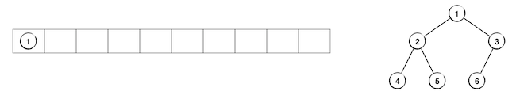

接下来我们要循环地做下面这样的工作：访问队头节点，然后把它的左右两个子节点（如果有的话）依次入队，没有的子节点就直接跳过即可，最后队头节点出队。我们在示例图中把已经访问过的节点用黄色表示。

第1步：队头是根节点1，访问它，然后把它的左儿子2和右儿子3依次入队，最后队头出队：

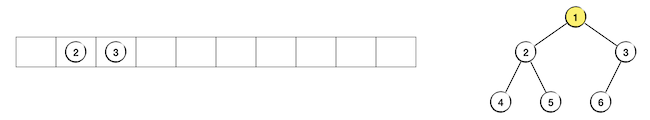

第2步：访问队头节点2，节点4、5依次入队，节点2出队：

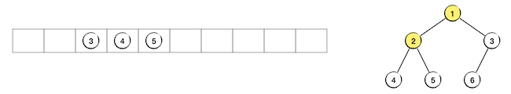

第3步：访问队头节点3，节点6入队，节点3没有右儿子，最后节点3出队：

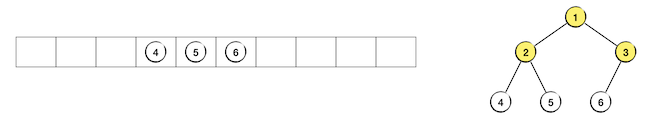

然后按照相同的规则依次访问队头节点4、5、6，它们都没有子节点，因此访问过程中都没有新节点入队。直到节点6访问完毕从队列中出队，此时队列为空，整个层序遍历过程也就结束了：

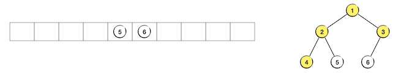
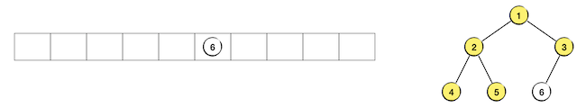
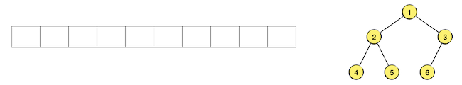

.. hint::

   所谓节点的访问，就是指读取该节点中的数据项，读取之后当然是要用来完成一些操作，比如和某个特定值进行比较等。在一些特殊的场景下也可能包含修改数据项的值，但大多数具有特殊用途特定规则的二叉树是不允许修改数据项值的，比如二叉检索树，因为往往数据项的值会影响节点所在的位置。

最简单的节点访问，当然就是输出该节点中的数据项了。比如下面这个函数用层序遍历完成树中所有节点数据的操作，这里访问节点就是单纯地输出数据项的值：

.. literalinclude:: ../../codes/342_bitree_bps.cpp
   :language: c++
   :lines: 17, 71-91

二叉树的层序销毁
^^^^^^^^^^^^^^^^^^^^

