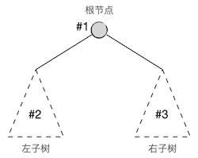
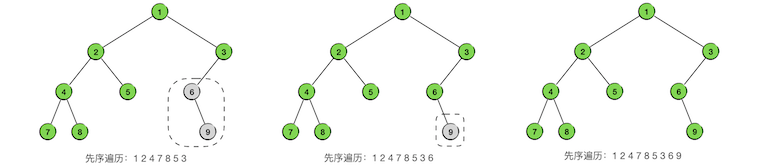

二叉树(III) 先序遍历与深度优先搜索
+++++++++++++++++++++++++++++++++++++

二叉树还有三种重要的遍历方法，是学习二叉树时最为重要的基础知识，分别是\ :strong:`先序遍历`\ （也叫\ :strong:`前序遍历`\ ）、\ :strong:`中序遍历`\ 和\ :strong:`后序遍历`\ 。这一节先看先序遍历。

先序遍历的递归实现
^^^^^^^^^^^^^^^^^^^^^^

我们知道，树结构是一种可以递归定义的数据结构，二叉树当然也是。任何一棵二叉树都可以被定义为一个根节点和它的左右两棵子树，而两棵子树也都是二叉树，这就是二叉树的递归定义。其中根节点和两棵子树都可以为空，如果根节点为空那么它的左右子树也就必然为空，这时候这棵二叉树就叫做一棵\ :strong:`空树`\ 。

.. important::

   根据二叉树的递归定义，在实现一棵二叉树的时候，实际上树就是子树，而树也可以用根节点来表示。在程序里一个节点变量（通常是指向节点的指针）同时可以有三种含义：首先它当然是指示了一个节点，其次它可以代表了以该节点为根的一棵二叉树，而二叉树和二叉子树其实都是二叉树。

二叉树的先序遍历（Pre-ordered traversal）是指以这样一种顺序来进行遍历：\ :emphasis:`先访问根节点，然后遍历其左子树，然后遍历其右子树，对左右子树的遍历采用相同的规则`\ ，如下图所示：

可以看出，这显然是一个递归过程，可以用下面的算法来描述：

.. admonition:: 二叉树先序遍历算法

   :math:`\text{PreOrderedTraversal}(tree, visit):`

   :math:`\ \ \ \ \ \ \ \ \text{IF}\ \ \ \ tree == \text{NULL}\ \ \ \ \text{THEN}\ \ \ \ \text{RETURN}`

   :math:`\ \ \ \ \ \ \ \ visit(tree)`

   :math:`\ \ \ \ \ \ \ \ \text{PreOrderedTraversal}(tree.left, visit)`
                                                    
   :math:`\ \ \ \ \ \ \ \ \text{PreOrderedTraversal}(tree.right, visit)`

其中算法参数 :math:`tree` 是要遍历的二叉树的根节点，:math:`tree.left` 和 :math:`tree.right` 分别是它的左右子节点，:math:`visit` 是访问节点中数据项的方法。

根据前面介绍的\ ``树=子树=根节点``\ 的原则，左右子节点也用来表示左右子树，左右子树同时也是二叉树，所以上述算法只用两次递归调用就可以完成先序遍历，最前面的判断语句是递归终止条件，即遇到空树就直接返回。

下面看一个具体例子，我们要对下面这样一棵二叉树进行先序遍历：

.. image:: ../../images/343_pre_ord_example.png

总的原则就是按照先根、后左子树、后右子树的顺序进行递归的遍历，我们用灰色表示还没有被访问到的节点，用绿色表示已经被访问过的节点，用虚线框表示下一步要遍历的子树。整个过程一共9步，完整地访问所有9个节点各一次，如下图所示：

.. image:: ../../images/343_pre_ord_r_1.png

对其中某些片段进行分析。观察树中以节点4为根的子树，它的左子树为节点7，右子树为节点8。第3步进入这棵树，先访问根节点4，随后在第4步访问了节点7之后，其左子树已经全部遍历完了，于是下一步就进入它的右子树，即节点8。第5步节点8也访问完之后，这棵以节点4为根的子树就遍历完了，于是第6步就进入它的父节点2的右子树，即节点5。

再观察第7步，此时进入了以节点6为根的子树，第8步先访问其根节点6，但是它没有左子树，所以下一步直接进入它的右子树，即节点9。第9步访问完右子树的根节点9，发现它没有子树，所以整个以6为根的子树部分遍历就结束了。这时候应该回到节点6的父节点3的右子树，但是节点3没有右子树，所以节点3开始的子树部分也遍历完了。进一步回到节点3的父节点1，这是整棵树的根节点，而且节点3是节点1的右子树，这就说明整棵树的先序遍历全部结束了。最终得到的先序遍历序列为：124785369。
