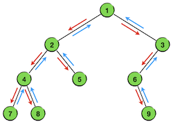
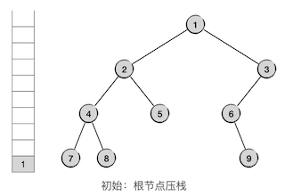
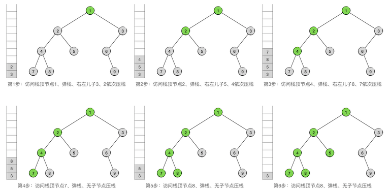
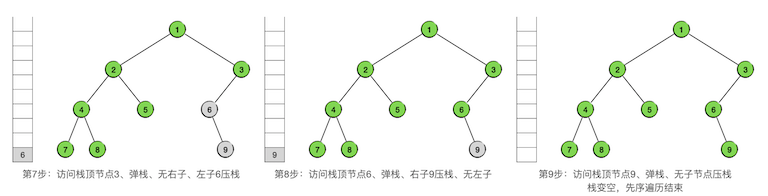

二叉树(III) 先序遍历与深度优先搜索
+++++++++++++++++++++++++++++++++++++

二叉树的三种遍历，是二叉树最为重要的基础知识，分别是\ :strong:`先序遍历`\ （也叫\ :strong:`前序遍历`\ ）、\ :strong:`中序遍历`\ 和\ :strong:`后序遍历`\ ，必须熟练掌握。

先序遍历的递归实现
^^^^^^^^^^^^^^^^^^^^^^

树是一种可以递归定义的数据结构，二叉树当然也是。一棵二叉树可以被定义为一个根节点及其左右两棵子树，这两棵子树也都是二叉树，这就是二叉树的递归定义。其中根节点和两棵子树都可以为空，如果根节点为空那么称之为一棵\ :strong:`空树`\ 。

.. important::

   根据二叉树的递归定义，在编程时实际上树、子树、节点三者是等价的。用一个节点就可以代表以该节点为根的一棵二叉树，而树和子树则完全是相同的东西。

二叉树的先序遍历（Pre-ordered traversal）是指以这样一种顺序来进行遍历：\ :emphasis:`先访问根节点，然后遍历其左子树，然后遍历其右子树，对左右子树的遍历采用相同的规则`\ ，如下图所示：

.. image:: ../../images/343_pre_ord_concept.png

可以看出，这显然是一个递归过程，可以用下面的算法来描述：

.. admonition:: 二叉树先序遍历算法

   :math:`\text{PreOrderedTraversal}(tree, visit):`

   :math:`\ \ \ \ \ \ \ \ \text{IF}\ \ \ \ tree = \text{NULL}\ \ \ \ \text{THEN}\ \ \ \ \text{RETURN}`

   :math:`\ \ \ \ \ \ \ \ visit(tree)`

   :math:`\ \ \ \ \ \ \ \ \text{PreOrderedTraversal}(tree.left, visit)`
                                                    
   :math:`\ \ \ \ \ \ \ \ \text{PreOrderedTraversal}(tree.right, visit)`

其中算法参数 :math:`tree` 是要遍历的二叉树的根节点，:math:`tree.left` 和 :math:`tree.right` 分别是它的左右子节点，:math:`visit` 是访问节点中数据项的方法。

根据前面介绍的\ ``树=子树=根节点``\ 的原则，左右子节点也用来表示左右子树，左右子树同时也是二叉树，所以上述算法只用两次递归调用就可以完成先序遍历，最前面的判断语句是递归终止条件，即遇到空树就直接返回。

下面看一个具体例子，我们要对下面这样一棵二叉树进行先序遍历：

.. image:: ../../images/343_pre_ord_example.png

总的原则就是按照先根、后左子树、后右子树的顺序进行递归的遍历，我们用灰色表示还没有被访问到的节点，用绿色表示已经被访问过的节点，用虚线框表示下一步要遍历的子树。整个过程一共9步，完整地访问所有9个节点各一次，如下图所示：

.. image:: ../../images/343_pre_ord_r_1.png

.. image:: ../../images/343_pre_ord_r_2.png

对其中某些片段进行分析。观察树中以节点4为根的子树，它的左子树为节点7，右子树为节点8。第3步进入这棵树，先访问根节点4，随后在第4步访问了节点7之后，其左子树已经全部遍历完了，于是下一步就进入它的右子树，即节点8。第5步节点8也访问完之后，这棵以节点4为根的子树就遍历完了，于是第6步就进入它的父节点2的右子树，即节点5。

再观察第7步，此时进入了以节点6为根的子树，第8步先访问其根节点6，但是它没有左子树，所以下一步直接进入它的右子树，即节点9。第9步访问完右子树的根节点9，发现它没有子树，所以整个以6为根的子树部分遍历就结束了。这时候应该回到节点6的父节点3的右子树，但是节点3没有右子树，所以节点3为根的子树部分也遍历完了。进一步回到节点3的父节点1，这是整棵树的根节点，而且节点3是节点1的右子树，这就说明整棵树的先序遍历全部结束了。最终得到的先序遍历序列为：\ ``124785369``\ 。

.. admonition:: 先序遍历序列的特点

   先序遍历得到的节点访问序列的特点是：\ :emphasis:`序列的第一个元素对应了整棵树的根节点，但是无法分辨后面的其他元素属于那棵子树。`

   例如先序序列 ``123``\ ，我们可以确定根节点一定是 ``1``\ ，但是后面的 ``23`` 就无法确定所在位置了，事实上下面几种二叉树的先序序列都是 ``123``\ ：

   .. code-block:: none

        1            1        1       1        1
       / \          /        /         \        \
      2   3        2        2           2        2
                  /          \         /          \
                 3            3       3            3

   \ :emphasis:`仅凭一个先序序列，无法还原出二叉树。`

要实现这样一个先序遍历算法的程序可以说是再简单不过了，我们继续沿用数据项为整数的示例，下面是树节点的结构类型定义：

.. literalinclude:: ../../codes/343_bitree_trav.cpp
   :language: c++
   :lines: 7-15

可以用下面的代码来构造出示例中的二叉树，当然也可以用类似的方法来自己构造一些不同形状的二叉树用于测试：

.. literalinclude:: ../../codes/343_bitree_trav.cpp
   :language: c++
   :lines: 30-39

利用函数递归调用来实现真的非常非常简单（假设节点访问只是输出其中的数据）：

.. literalinclude:: ../../codes/343_bitree_trav.cpp
   :language: c++
   :lines: 1, 4-6, 110-117

深度优先搜索
^^^^^^^^^^^^

上一节我们看到过二叉树的层序遍历是和宽度优先搜索相对应的，现在我们将看到先序遍历是和深度优先搜索相对应的。如果要在一棵二叉树中搜索一个特定的节点，按照先序遍历的顺序逐个节点去查找的过程就叫做\ :strong:`深度优先搜索`\ （DPS）。宽度优先搜索是先探索所有同层节点，逐层向下推进直到最底层。深度优先搜索则是优先向下探索，沿一个方向一路走到叶子，然后再回上一层，换另一个方向继续向下探索。向下探索的过程叫做下探，往回换方向的过程叫做回溯。和BPS一样，DPS也不仅仅是针对二叉树的，它能适用于任何形状的树，甚至是图结构。

.. hint::

   五大算法中的回溯算法和分支限界算法就是基于BPS和DPS两种搜索来构造的，所以BPS和DPS是极其重要的基础算法，在后面讲解回溯算法时会进行详细介绍。

为什么说二叉树的DPS就是依先序遍历的顺序进行的搜索，可以看一下上面这个例子的遍历过程。我们用箭头标出了整个遍历的节点游历顺序，其中红色箭头对应了下探过程，蓝色箭头对应回溯过程。

可以看出，遍历的过程果然就是沿着DPS的搜索方式完成的。首先从根节点开始一路沿着左支下探，直到最左端的节点，然后一层一层的回溯，每回溯一层就尝试去访问它的右支。一旦回溯进入右支，仍然按照同样的规则，先沿着左支一路下探到最左下位置的节点，然后层层回溯。注意，沿左路下探抵达的最左端的节点并不一定是叶子节点，而是指没有左子树的那个节点，如本例中的节点6。

所以理论上我们可以用上面的先序遍历算法来改造成二叉树的DPS算法，只要在访问节点的方法 :math:`visit` 中进行条件判断，一旦发现了符合条件的搜索结果，立即终止遍历过程即可。但是在实际编程的时候却是存在一些问题的，事实上要彻底终止一个递归过程可能会比较麻烦，有可能需要设置额外的标识变量（flag）来表明一次函数返回是正常的递归返回还是要终止整个递归过程。

另外，递归进行先序遍历本身也有一点小小的不足。我们知道利用函数的递归调用来实现递归过程时空间和时间都会有比较多的消耗，如果二叉树的结构比较庞大，深度很深的话，递归过程可能会耗尽内存，造成栈溢出错误（Stack Overflow），这是一个和段错误一样经典的运行时错误。

.. admonition:: 题外话

   全世界最著名的计算机知识问答网站就叫做StackOverflow，可见这个错误在软件开发领域有多么的“深入人心”。

尽管很少会有一棵真实存在的二叉树大到能导致Stack Overflow的程度，但如果是在DPS算法中就不一定了，DPS算法要搜索的树往往不是真实存在的树，而是随着搜索不断生长的虚拟树。如果用递归的方法来进行DPS，发生栈溢出还是很有可能的。况且运行速度也会受影响。

因此，我们还是希望能有一种不采用递归调用来实现的DPS算法，在二叉树来说就是非递归方式的先序遍历算法。

先序遍历非递归实现
^^^^^^^^^^^^^^^^^^^^

不使用函数递归调用的先序遍历（或DPS）算法，要用到一个栈来作为辅助。

.. hint::

   在算法领域有这样一条规律：递推性质的过程在实现的时候常要用到队列，递归的过程则往往利用栈。

先序遍历所使用的栈，和层序遍历使用的队列作用是一样的，就是用来存放接下来要遍历的子树的根。每一次从栈中取出栈顶上的节点，它就是接下来要遍历的子树的根节点。依照先序遍历的规则，根节点先访问，所以弹栈后自然是先访问这个节点，然后依次将其右子节点和左子节点压栈，它们就是接下来要遍历的子树的树根。

.. warning::

   由于先序遍历的顺序是“根、左、右”，即根节点访问之后先访问左子树，而栈是后入先出的，所以在压栈的时候要将顺序反过来，先压右儿子再压左儿子。

下面先看示例，刚才这棵二叉树，现在我们用非递归调用的方法来对它进行先序遍历，第一步先将整棵树的根节点压栈，如下图：

接下来就不断重复前面所述的步骤，从栈顶节点开始，边访问边压栈，直到栈弹空为止，先序遍历就完成了。

下面是二叉树先序遍历的非递归调用版算法，也是所有DPS算法的基本模式：

.. admonition:: 非递归二叉树先序遍历算法

   :math:`\text{PreOrderTravWOR}(tree, visit):`

   :math:`\ \ \ \ \ \ \ \ s \leftarrow \text{AN EMPTY STACK}`

   :math:`\ \ \ \ \ \ \ \ \text{IF}\ \ \ \ tree = \text{NULL}\ \ \ \ \text{THEN}\ \ \ \ \text{RETURN}`

   :math:`\ \ \ \ \ \ \ \ s.push(tree)`

   :math:`\ \ \ \ \ \ \ \ \text{WHILE}\ \ \ \ s\ \ \ \ \text{IS NOT EMPTY}:`

   :math:`\ \ \ \ \ \ \ \ \ \ \ \ \ \ \ \ n \leftarrow s.top()`

   :math:`\ \ \ \ \ \ \ \ \ \ \ \ \ \ \ \ s.pop()`

   :math:`\ \ \ \ \ \ \ \ \ \ \ \ \ \ \ \ visit(n)`

   :math:`\ \ \ \ \ \ \ \ \ \ \ \ \ \ \ \ \text{IF}\ \ \ \ n.left\neq\text{NULL}\ \ \ \ \text{THEN}\ \ \ \ s.push(n.left)`

   :math:`\ \ \ \ \ \ \ \ \ \ \ \ \ \ \ \ \text{IF}\ \ \ \ n.right\neq\text{NULL}\ \ \ \ \text{THEN}\ \ \ \ s.push(n.right)`

要实现上面这段代码事实上也是极简单的，基本上只是把算法伪代码一一对应地翻译成C++语言而已，如下面这个函数：

.. literalinclude:: ../../codes/343_bitree_trav.cpp
   :language: c++
   :lines: 1, 3-6, 119-146

.. admonition:: 练习

   1、读懂本节给出的所有代码，将它们整合进一个程序里，然后自己编写 ``main()`` 函数，完成测试用二叉树的创建和两种先序遍历算法函数的测试。

   2、上一节已经说过，需要有一个用于销毁整棵二叉树的工具函数，并且在上一节我们用层序的方法来完成了这样一个函数 ``destroy()``\ 。那么请问：能不能用先序遍历的顺序来销毁呢？如果能的话，是使用递归调用的方式呢还是非递归调用？请尝试正确地写出一个先序遍历顺序的 ``destroy()`` 函数并进行测试。

