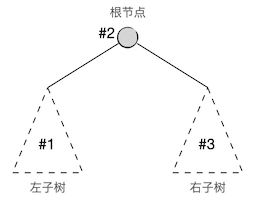
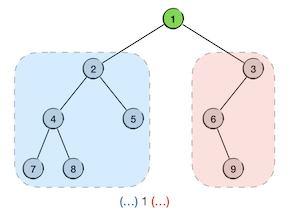
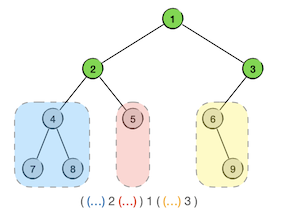
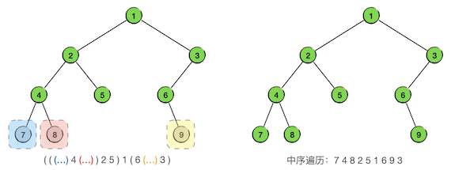

二叉树(IV) 中序遍历
+++++++++++++++++++

二叉树的四种遍历方法，如果要挑一种对于二叉树来说最为重要的，那就一定是中序遍历（In-ordered traversal）了，这一节介绍二叉树的中序遍历。

.. hint::

   层序、先序和后序三种遍历并非是专用于二叉树的，任何一般的树结构都可以适用。通常在对一般的树进行遍历时，把先序和后序称为先根遍历和后根遍历。但中序遍历是专用于二叉树的遍历方法。因为对于一般的树结构而言，无法确定“中”在哪里。

   请记住：凡是提到中序遍历，就一定是针对二叉树的。

中序遍历的概念及递归实现
^^^^^^^^^^^^^^^^^^^^^^^^

中序遍历，就是指对一棵二叉树按照先左子树、然后根节点、最后右子树的“左中右”的顺序进行遍历，即根在中间。同样的，用递归的方式来定义这个过程，无非是要求对左右子树的遍历也采用的是中序遍历，而递归终止条件就是根节点为空。

和先序遍历一样，二叉树中序遍历的递归算法非常简单：

.. admonition:: 二叉树中序遍历算法

   :math:`\text{InOrderedTraversal}(tree, visit):`

   :math:`\ \ \ \ \ \ \ \ \text{IF}\ \ \ \ tree = \text{NULL}\ \ \ \ \text{THEN}\ \ \ \ \text{RETURN}`

   :math:`\ \ \ \ \ \ \ \ \text{InOrderedTraversal}(tree.left, visit)`
                                                    
   :math:`\ \ \ \ \ \ \ \ visit(tree)`

   :math:`\ \ \ \ \ \ \ \ \text{InOrderedTraversal}(tree.right, visit)`

下面还是用上一节那个示例二叉树来看一看中序遍历的递归过程。在下面的示意图中，我们用绿色表示当前要遍历的子树的根节点，用不同颜色的虚框来表示下一层的子树。每次我们进行到一个根节点，就先把它写下来，在它的前后加上两个内容还不确定的括号，前面的括号里将来是左子树的中序序列，后面的括号里则是右子树的中序序列。逐步填满每个括号里的内容之后，中序序列就得到了。

当我们第一步获取到整棵树的根节点时，我们可以写出第一步的结果：\ ``(...) 1 (...)``\ ，虽然很简陋，但是迈出了第一步：

接下来要先后遍历的是左右两棵子树，其中左子树根节点为2，有左右两棵子树，所以它的中序序列先写为 ``(...) 2 (...)``\ ，右子树根节点为3，有左子树没有右子树，所以它的序列姑且先写为 ``(...) 3``\ 。把它们分别填入中序序列内对应的括号里面，得到一个更加准确一点的结果：\ ``((...) 2 (...)) 1 ((...) 3)``\ ：

下一步按照同样的方法进一步去填充括号里的内容。现在三个括号对应的三棵子树中，其中根节点为5的子树已经是叶子节点，所以它的中序序列已经可以确定了，就是 ``5``\ ，其他两棵子树分别可以写作 ``(...) 4 (...)`` 和 ``6 (...)``\ 。将它们填入对应的括号，得到 ``(((...) 4 (...)) 2 5) 1 ((6 (...)) 3)``\ 。

再下一步的三棵子树都已是叶子节点了，把它们分别填入对应的括号再去除括号就得到了最终的中序序列 ``7 4 8 2 5 1 6 9 3``\ 。

同样的，我们发现用递归调用的方法来实现递归版的中序遍历是极其简单的。

.. admonition:: 练习

   仍然使用上一节示例程序所用的结构定义，完成递归调用方式的二叉树中序遍历函数：

   .. code-block:: c++

      void in_ord_trav(BiTree tree);

   访问节点的方式仍然仅为输出节点数据即可。

   编写 ``main()`` 函数，构造一些不同形状的二叉树来进行测试。

从手工模拟中序遍历获得中序序列的过程可以看出中序序列的一个重要特点：

.. important::

   给定一棵二叉树的中序序列，如果知道它的根节点是哪一个，那么就可以确定它的左右子树的中序序列。

回忆上一节所说的先序遍历序列的特点，如果给定一棵二叉树的先序序列，那么我们就可以确定它的根节点是哪一个，但是无法确分它的左右两棵子树的先序序列。我们可以发现，先序序列和中序序列具有天生的互补性，二者配合起来，就可以确定根节点和左右子树的序列了。再根据这两种遍历的递归特征，子树的中序和先序序列一旦都确定了，那么就可以进一步知道子树的根节点是哪一个并且区分子树的左右子树遍历序列。如此不断细化下去，直到所有叶子节点全部确定出来就可以还原出二叉树了。

.. important::

   给出一棵未知二叉树的先序序列和中序序列，就可以还原出这棵二叉树的真正形态来。

根据遍历序列还原二叉树，是极其重要的技能，也是竞赛和考试的常考题型，一定要多多练习，熟练掌握其方法。

.. admonition:: 练习

   根据先序序列 ``1 2 4 7 8 5 3 6 9`` 和中序序列 ``7 4 8 2 5 1 6 9 3`` 还原出二叉树，看看是不是得到了和示例相同的形态。

   自己编至少三个不同形态的二叉树，手算它们的先序序列和中序序列，使用程序进行核对。然后连续根据两个序列还原二叉树形态，看看能否还原出原本的二叉树。

中序遍历的非递归实现
^^^^^^^^^^^^^^^^^^^^

