二叉树(IV) 中序遍历
+++++++++++++++++++

这一节介绍二叉树的中序遍历。

.. hint::

   层序、先序和后序三种遍历并非是专用于二叉树的，一般的树结构都可以适用。通常在对一般的树进行遍历时，把先序和后序称为先根遍历和后根遍历。但中序遍历是专用于二叉树的遍历方法，因为只有二叉树才能确定哪里是“中”。

   请记住：凡是提到中序遍历，就一定是指对二叉树的遍历。

中序遍历的概念及递归实现
^^^^^^^^^^^^^^^^^^^^^^^^

中序遍历，就是指对一棵二叉树按照先左子树、然后根节点、最后右子树的“左中右”的顺序进行遍历，即根在中间访问，左右子树的遍历当然也同样要是中序遍历。可以递归地定义这个过程，递归终止条件就是根节点为空。

.. image:: ../../images/344_in_ord_concept.png

和先序遍历一样，二叉树中序遍历的递归算法非常简单：

.. admonition:: 二叉树中序遍历算法

   :math:`\text{InOrderedTraversal}(tree, visit):`

   :math:`\ \ \ \ \ \ \ \ \text{IF}\ \ \ \ tree = \text{NULL}\ \ \ \ \text{THEN}\ \ \ \ \text{RETURN}`

   :math:`\ \ \ \ \ \ \ \ \text{InOrderedTraversal}(tree.left, visit)`
                                                    
   :math:`\ \ \ \ \ \ \ \ visit(tree)`

   :math:`\ \ \ \ \ \ \ \ \text{InOrderedTraversal}(tree.right, visit)`

下面还是用上一节那个示例二叉树来看一看中序遍历的递归过程。在下面的示意图中，我们用绿色表示当前要遍历的二叉树的根节点，用不同颜色的虚框来表示下一层的子树。每次我们进行到一个根节点，就先把它写下来，在它的前后加上两个内容还不确定的括号，前面的括号里将来是左子树的中序序列，后面的括号里则是右子树的中序序列。逐步填满每个括号里的内容之后，中序序列就得到了。

当我们第一步获取到整棵树的根节点时，我们可以写出第一步的结果：\ ``(...) 1 (...)``\ ，虽然很简陋，但是迈出了第一步：

接下来要先后遍历的是左右两棵子树，其中左子树根节点为2，有左右两棵子树，所以它的中序序列先写为 ``(...) 2 (...)``\ ，右子树根节点为3，有左子树没有右子树，所以它的序列姑且先写为 ``(...) 3``\ 。把它们分别填入中序序列内对应的括号里面，得到一个更加准确一点的结果：\ ``((...) 2 (...)) 1 ((...) 3)``\ ：

下一步按照同样的方法进一步去填充括号里的内容。现在三个括号对应的三棵子树中，其中根节点为5的子树已经是叶子节点，所以它的中序序列已经可以确定了，就是 ``5``\ ，其他两棵子树分别可以写作 ``(...) 4 (...)`` 和 ``6 (...)``\ 。将它们填入对应的括号，得到 ``(((...) 4 (...)) 2 5) 1 ((6 (...)) 3)``\ 。

再下一步的三棵子树都已是叶子节点了，把它们分别填入对应的括号再去除括号就得到了最终的中序序列 ``7 4 8 2 5 1 6 9 3``\ 。

用递归调用的方法来实现中序遍历显然是极其简单的。

.. admonition:: 练习

   仍然使用上一节示例程序所用的结构定义，完成递归调用方式的二叉树中序遍历函数：

   .. code-block:: c++

      void in_ord_trav(BiTree tree);

   访问节点的方式仍然仅为输出节点数据即可。

   编写 ``main()`` 函数，构造一些不同形状的二叉树来进行测试。

中序遍历序列有一个非常重要的特点如下。

.. important::

   给定一棵二叉树的中序序列，如果知道它的根节点是哪一个，那么就可以确定它的左右子树的中序序列。

回忆上一节所说的先序遍历序列的特点，根据先序序列可以确定根节点，但是无法区分出左右子树。由此可以看出先序序列和中序序列具有天生的互补性，根据先序序列确定根节点，在中序序列中根据根节点区分出左右子树的节点范围，这样我们就同时得到了左右两棵子树的中序和先序两种遍历序列。根据递归特征，整个过程可以如此不断深挖下去，直到所有叶子节点全部确定出来就可以还原出二叉树了。

.. important::

   给出一棵未知二叉树的先序序列和中序序列，就可以还原出这棵二叉树的真正形态来。

根据遍历序列还原二叉树，是极其重要的技能，也是竞赛和考试的常考题型，一定要多多练习，熟练掌握其方法。

.. admonition:: 练习

   根据先序序列 ``1 2 4 7 8 5 3 6 9`` 和中序序列 ``7 4 8 2 5 1 6 9 3`` 还原出二叉树，看看是不是得到了和示例相同的形态。

   自己编至少三个不同形态的二叉树，手算它们的先序序列和中序序列，使用程序进行核对，然后用于练习二叉树的还原。

中序遍历的非递归实现
^^^^^^^^^^^^^^^^^^^^

中序遍历的非递归算法比先序遍历的要略难理解一些，但实际上也并不是太难，同样也需要用一个栈来进行辅助。

我们需要用一个辅助的节点变量来表示接下来要遍历的二叉树（或子树）的树根，显然初始时这个辅助变量应该指向整棵二叉树的根节点。另外我们需要用一个栈来存放因为遍历规则而积累下来暂不访问的树根节点，初始时栈为空。所以算法的初始状态如下图所示，图中用蓝色表示“接下来要遍历的二叉树的树根”：

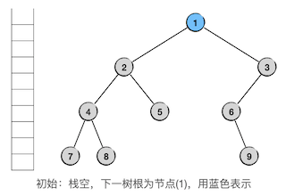

下面是算法的主循环，根据接下来要遍历的树的情况进行不同的处理。循环条件是栈非空或者接下来要遍历的树非空。如果栈空了而且接下来要遍历的树也是空的，那么说明没有什么东西可以继续访问了，循环于是终止，整个中序遍历也随之结束。

根据中序遍历的规则，只要接下来要遍历的树不为空，那么就应该先去遍历它的左子树，遍历完左子树再访问树根节点，然后才是右子树。所以在循环中，如果接下来要遍历的树不为空，我们就把这个树根节点压栈暂存下来，留到它的左子树遍历完了再弹出来处理它。同时应该把接下来要遍历的树设置为它的左子树。处理完这两步就可以进入下一轮循环了。

示例的第一轮循环执行的就是这样的规则，如下图：

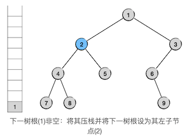

接下来连续两轮循环也是同样的处理：

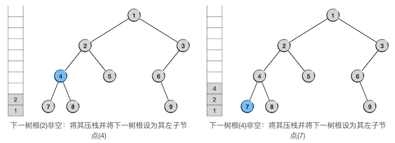

现在，接下来要遍历的树其实本身已经是一个叶子节点，即它的根节点7。但是我们并不对它进行特殊处理，而是仍然将其视为一棵正常的二叉树。节点7并不是空树，只不过它的左子树为空，我们还是将它压栈并将接下来要遍历的二叉树设为它的左子树。在图中我们用浅蓝色的虚线节点表示它是一棵空树。

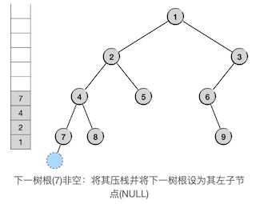

再下一轮循环时情况就有所不同了，因为接下来要遍历的二叉树是一棵空树了。一旦出现接下来要遍历的是空树，无非是两种情况：这棵空树是左子树，或者这棵空树是右子树。

这里我们首先遇到的是前一种情况，现在这棵空树是其父节点的左子树。根据中序遍历的规则，这种情况下应该回溯到它的父节点去，访问它的父节点，然后去遍历它的父节点的右子树。按照前面的算法步骤，遇到这种情况时，这棵空左子树的父节点现在一定就是栈顶元素所指向的节点，因为我们是在按照一路向左下的方向将沿途所有节点压栈的。所以这一轮循环里我们要做的事情是：访问栈顶元素所指向的节点，将接下来要遍历的树设为栈顶节点的右子树，然后将栈顶元素从栈中弹掉。如下图所示，我们用绿色表示已经访问的节点：

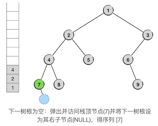

因为节点7同样也没有右子树，所以处理完这一轮循环之后，接下来要遍历的树仍然是一棵空树。

于是我们遇到了接下来要遍历的树是空树时的第二种情况，这棵空树是一棵右子树。按照中序遍历的规则，右子树为空，那么以其父节点为根的子树就已经遍历完毕了，下一步应该回溯到其父节点的父节点去，姑且称之为爷爷节点吧。但是回到爷爷节点同样也有两种情况，要么父节点是爷爷节点的左子树，要么父节点是爷爷节点的右子树。前一种情况我们称之为从左支返回，后一种称之为从右支返回。显然我们现在遇到的是从左支返回的情况。

按照算法的压栈弹栈规则，当从左支返回的时候父节点肯定已经弹掉了，当前栈顶元素一定是爷爷节点。从图中可以看出，当前的栈顶元素确实就是节点4，因此我们要做的事情和前一步是一样的，仍然是访问栈顶元素，将接下来要遍历的树设为栈顶元素的右子树，然后弹掉栈顶。

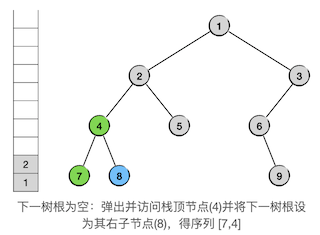

接下来要遍历的是非空的子树8，按照前面说过的算法，我们会将其压栈，进入其左子树（空），然后弹栈访问节点8，进入其右子树（空）：

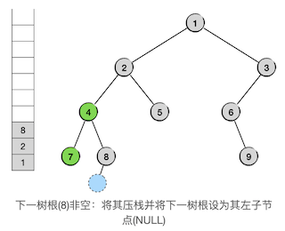

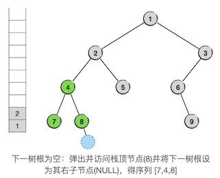

现在又遇到了返回的情况，而且是要一路返回到太爷爷节点2，爷爷节点4是太爷爷节点2的左支，因此是从左支返回。我们可以发现，只要是从左支返回，无论返回的路径有多长，返回到的那个祖先节点总归是当前的栈顶元素。所以我们要做的操作仍然是不变的，还是访问栈顶，将接下来要遍历的子树设为栈顶的右子树，然后弹掉栈顶，如下图：

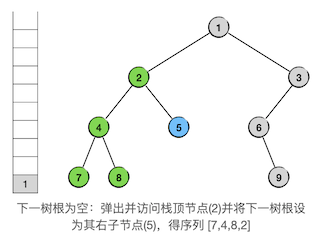

接下来就是继续按照这样的规则一步一步地循环下去，很快我们就将进入整棵二叉树的右子树。

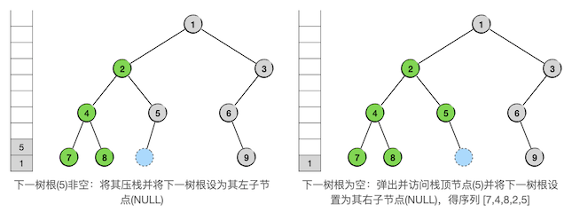

下一轮循环，是从爷爷节点2向太爷爷节点1（也就是整棵二叉树的根节点）的左支返回，按照规则，访问并弹出节点1，接下来要遍历的子树就进入了整棵二叉树的右子树，其根节点为3。随后一切还是照常进行，步骤如下：

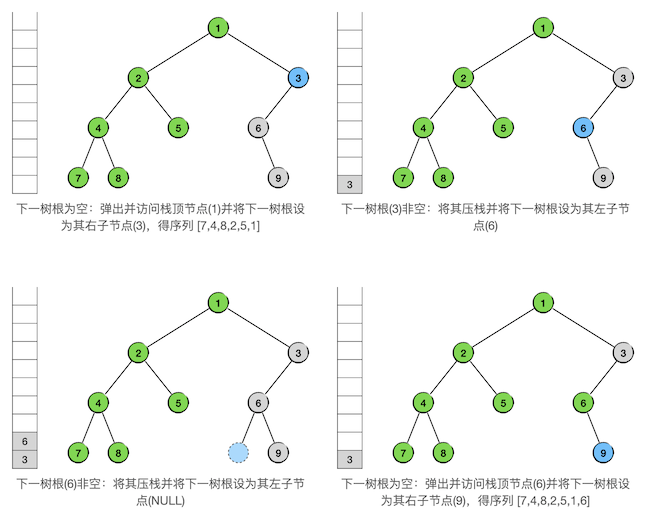

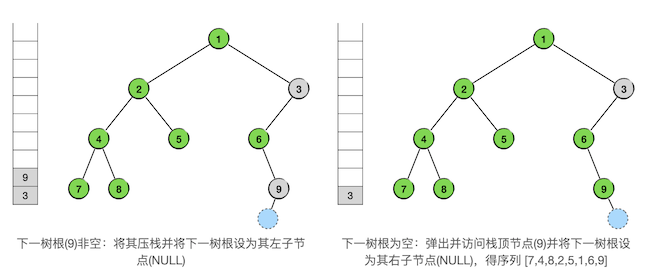

下一轮循环是从爷爷节点6向太爷爷节点3的左支返回，这样的操作已经很熟练了：

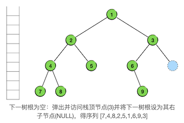

再下一轮循环，是从右支的返回，我们可以发现，这时候实际上所有节点都已经访问过了，遍历已经结束了。此时栈已经空了，接下来要遍历的树也是空树，下一轮循环已经不满足循环条件，循环结束。这样，中序遍历就结束了。事实上，中序遍历的最后一个节点一定是整棵树最右边的节点，它访问完之后，一定会满足循环结束条件。最终的结果如下图：

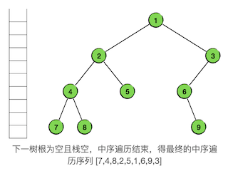

最终得到的遍历序列为 ``7 4 8 2 5 1 6 9 3``\ ，和递归算法得到的结果一致。从上面的示例我们可以归纳出中序遍历的非递归算法如下：

.. admonition:: 非递归二叉树中序遍历算法

   :math:`\text{InOrderTravWOR}(tree, visit):`

   :math:`\ \ \ \ \ \ \ \ n \leftarrow tree`

   :math:`\ \ \ \ \ \ \ \ s \leftarrow \text{AN EMPTY STACK}`

   :math:`\ \ \ \ \ \ \ \ \text{WHILE}\ \ \ \ s\ \ \ \ \text{IS NOT EMPTY}\ \ \ \ \text{OR}\ \ \ \ n \neq \text{NULL}:`

   :math:`\ \ \ \ \ \ \ \ \ \ \ \ \ \ \ \ \text{IF}\ \ \ \ n \neq \text{NULL}\ \ \ \ \text{THEN}:`
                          
   :math:`\ \ \ \ \ \ \ \ \ \ \ \ \ \ \ \ \ \ \ \ \ \ \ \ s.push(n)`
                          
   :math:`\ \ \ \ \ \ \ \ \ \ \ \ \ \ \ \ \ \ \ \ \ \ \ \ n\leftarrow n.left`
                          
   :math:`\ \ \ \ \ \ \ \ \ \ \ \ \ \ \ \ \text{ELSE}:`
                          
   :math:`\ \ \ \ \ \ \ \ \ \ \ \ \ \ \ \ \ \ \ \ \ \ \ \ n \leftarrow s.top()`
                          
   :math:`\ \ \ \ \ \ \ \ \ \ \ \ \ \ \ \ \ \ \ \ \ \ \ \ s.pop()`
                          
   :math:`\ \ \ \ \ \ \ \ \ \ \ \ \ \ \ \ \ \ \ \ \ \ \ \ visit(n)`
                          
   :math:`\ \ \ \ \ \ \ \ \ \ \ \ \ \ \ \ \ \ \ \ \ \ \ \ n \leftarrow n.right`

根据算法伪代码来编写实际的C++程序，上面这样的算法伪码还是很简单的，值得作为一个练习来完成。

.. admonition:: 练习

   继续使用示例程序所用的结构定义，完成非递归的二叉树中序遍历函数：

   .. code-block:: c++

      void in_ord_trav_wor(BiTree tree);

   访问节点的方式仍然仅为输出节点数据即可。

   编写 ``main()`` 函数，构造一些不同形状的二叉树来进行测试。

