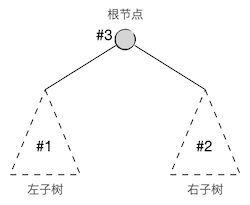
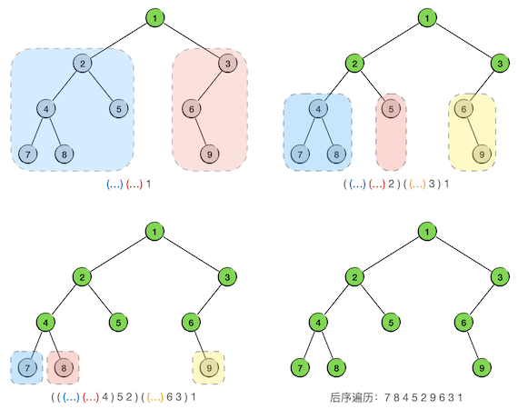
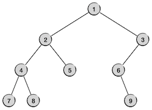

二叉树(V) 后序遍历和遍历算法分析
++++++++++++++++++++++++++++++++++

这一节学习后序遍历及其两种实现，然后分析一下二叉树遍历算法的时间复杂度。

后序遍历的概念及其递归实现
^^^^^^^^^^^^^^^^^^^^^^^^^^

后序遍历，显然就是按照“左右中”的顺序，先遍历左子树，再遍历右子树，最后访问根节点的遍历方法，子树的遍历当然也是用后序遍历的规则，构成一个递归过程。

所以后序遍历的递归算法只不过是将先序或者中序遍历递归算法中访问根节点的那一句放放到最后面而已：

.. admonition:: 二叉树后序遍历算法

   :math:`\text{PostOrderedTraversal}(tree, visit):`

   :math:`\ \ \ \ \ \ \ \ \text{IF}\ \ \ \ tree = \text{NULL}\ \ \ \ \text{THEN}\ \ \ \ \text{RETURN}`

   :math:`\ \ \ \ \ \ \ \ \text{PostOrderedTraversal}(tree.left, visit)`

   :math:`\ \ \ \ \ \ \ \ \text{PostOrderedTraversal}(tree.right, visit)`

   :math:`\ \ \ \ \ \ \ \ visit(tree)`

看起来一切都是那么简单得顺理成章，让我们仍然用前节的那棵示例二叉树来模拟一下后序遍历的过程。和中序遍历相比，现在只需要改变一下表示子树遍历序列的括号位置就可以了。例如第一轮的时候得到的待定后序序列就是 ``(...) (...) 1``\ ，前一个括号里将来放左子树的后序序列，后一个括号里将来放右子树的后序序列。整个过程如下图所示：

最终得到的后序遍历序列为 ``7 8 4 5 2 9 6 3 1``\ 。

.. admonition:: 练习

   仍然使用上一节示例程序所用的结构定义，完成递归调用方式的二叉树后序遍历函数：

   .. code-block:: c++

      void post_ord_trav(BiTree tree);

   访问节点的方式仍然仅为输出节点数据即可。

   编写 ``main()`` 函数，构造一些不同形状的二叉树来进行测试。

后序遍历序列的特点和先序遍历一样，根据一个给定的后序序列，我们可以马上知道根节点是什么，但是无法区分出左右两棵子树的后序序列。因此，若一个后序序列和一个中序序列搭配起来，也可以还原出原二叉树的形态。

但是后序序列加上先序序列的组合是无法还原二叉树的，因为仍然没有办法区分子树。例如下面这两棵非常简单的二叉树，它们本身并不相同，但是有完全相同的先序序列和后序序列：

.. code-block:: none

      1                 1
     /                   \
    2                     2

这两棵二叉树的先序遍历序列都是 ``1 2``\ ，后序遍历序列都是 ``2 1``\ 。

.. admonition:: 练习

   给定先序遍历序列 ``1 2 3`` 和后序遍历序列 ``3 2 1``\ ，试着找出所有可能的二叉树。

后序遍历的非递归实现
^^^^^^^^^^^^^^^^^^^^

后序遍历的非递归实现和中序遍历非常相似，只有很小的一点改动。

先来回顾一下中序遍历的非递归算法。算法中最核心的部分是一个栈，它用来依次存放从某个节点（最初是根节点）开始一路向左向下探索过程中途径的各个子树根节点。当出现回溯的时候，如果是从左支回溯到父节点，按照算法压栈的顺序，父节点一定在栈顶，所以依照“左中右”的顺序访问栈顶节点并弹栈，然后将其右儿子作为接下来要遍历的子树树根即可。如果发生从右支的回溯，根据中序遍历规则，父节点肯定已经从栈中弹掉了，如果父节点是爷爷节点的右儿子，即上一层也是从右支回溯，那么爷爷节点也一定已经从栈中弹掉了，依此类推，一路向上回溯总归会归结于两种情况：要么抵达了一次从左支的回溯，处理这一回溯即可，要么一路右回溯直到整棵树的根节点，整个中序遍历过程结束。

综上所述，中序遍历的规则决定了非递归算法时只要遇到回溯，无论是从左还是从右的，都可以一样地进行处理，因为右回溯总会自动归结到左回溯的情况去（或者遍历结束）。后序遍历的非递归算法基本上也是这样一种思路，栈的用法是一样的，只是现在遇到了一个小小的问题：后序遍历在发生回溯的时候，不同的回溯方向处理方法不一样。从左支回溯的时候，要先进入父节点的右子树而不能访问父节点；从右支回溯的时候才访问父节点。这就需要我们能够知道回溯是来自于左支的还是右支的。

为此我们需要一个辅助变量：上一次刚访问掉的节点。梳理一下可以发现，从右支回溯的情况有两种，一种是右子树为空树，另一种是上一次访问的右儿子节点。因此从右支回溯的判断依据就是：栈顶的节点没有右儿子或者上一次访问的节点就是栈顶节点的右儿子。

所以后序遍历非递归算法中处理回溯时要判断回溯的方向，如果是从左支返回的（栈顶节点有右子树而且上一次访问的不是它的右儿子）就把接下来要遍历的子树设置为栈顶节点的右子树。反之，如果栈顶节点没有右子树或者上一次访问的节点是它的右儿子，那么说明这是一次从右支的返回，则访问栈顶节点并弹栈，同时千万记得要更新上一次访问的节点，并将接下来要遍历的子树设置为空。

根据这个思路，我们可以通过修改中序遍历非递归算法来得到后序遍历的非递归算法，要修改的地方就是发生回溯的分支，即当接下来要遍历的子树为空的时候。在回溯的分支中我们要进一步判断是从左支还是从右支的回溯，根据回溯方向的不同采取不同的处理即可。

.. admonition:: 非递归二叉树后序遍历算法

   :math:`\text{PostOrderTravWOR}(tree, visit):`

   :math:`\ \ \ \ \ \ \ \ n \leftarrow tree`

   :math:`\ \ \ \ \ \ \ \ last \leftarrow \text{NULL}`

   :math:`\ \ \ \ \ \ \ \ s \leftarrow \text{AN EMPTY STACK}`

   :math:`\ \ \ \ \ \ \ \ \text{WHILE}\ \ \ \ s\ \ \ \ \text{IS NOT EMPTY}\ \ \ \ \text{OR}\ \ \ \ n \neq \text{NULL}:`

   :math:`\ \ \ \ \ \ \ \ \ \ \ \ \ \ \ \ \text{IF}\ \ \ \ n \neq \text{NULL}\ \ \ \ \text{THEN}:`
                          
   :math:`\ \ \ \ \ \ \ \ \ \ \ \ \ \ \ \ \ \ \ \ \ \ \ \ s.push(n)`
                          
   :math:`\ \ \ \ \ \ \ \ \ \ \ \ \ \ \ \ \ \ \ \ \ \ \ \ n\leftarrow n.left`
                          
   :math:`\ \ \ \ \ \ \ \ \ \ \ \ \ \ \ \ \text{ELSE}:`

   :math:`\ \ \ \ \ \ \ \ \ \ \ \ \ \ \ \ \ \ \ \ \ \ \ \ n \leftarrow s.top()`

   :math:`\ \ \ \ \ \ \ \ \ \ \ \ \ \ \ \ \ \ \ \ \ \ \ \ \text{IF}\ \ \ \ n.right \neq \text{NULL}\ \ \ \ \text{AND}\ \ \ \ n.right \neq last\ \ \ \ \text{THEN}:`

   :math:`\ \ \ \ \ \ \ \ \ \ \ \ \ \ \ \ \ \ \ \ \ \ \ \ \ \ \ \ \ \ \ \ n \leftarrow n.right`
                          
   :math:`\ \ \ \ \ \ \ \ \ \ \ \ \ \ \ \ \ \ \ \ \ \ \ \ \text{ELSE}:`
                          
   :math:`\ \ \ \ \ \ \ \ \ \ \ \ \ \ \ \ \ \ \ \ \ \ \ \ \ \ \ \ \ \ \ \ s.pop()`
                          
   :math:`\ \ \ \ \ \ \ \ \ \ \ \ \ \ \ \ \ \ \ \ \ \ \ \ \ \ \ \ \ \ \ \ visit(n)`
                          
   :math:`\ \ \ \ \ \ \ \ \ \ \ \ \ \ \ \ \ \ \ \ \ \ \ \ \ \ \ \ \ \ \ \ last \leftarrow n`

   :math:`\ \ \ \ \ \ \ \ \ \ \ \ \ \ \ \ \ \ \ \ \ \ \ \ \ \ \ \ \ \ \ \ n \leftarrow \text{NULL}`

要弄明白这个算法最好的办法还是用一些简单的二叉树来自己手动模拟运行一下，例如用前面两节使用过的那个示例二叉树。

.. admonition:: 练习

   模仿上一节讲述中序遍历时的方法，手动模拟运行上面的后序遍历非递归算法，对示例二叉树完成后序遍历。注意后序遍历的时候要多用一个辅助变量来跟踪上一次刚访问过的节点。

然后完成编程练习。

.. admonition:: 练习

   编写并测试二叉树后序遍历的非递归算法函数，要求和上一节编写中序遍历函数一样。

   .. code-block:: c++

      void post_ord_trav_wor(BiTree tree);

这里有一个完整的三种二叉树遍历程序，可以在上述练习全部完成之后下载下来进行对照：:download:`二叉树遍历 </codes/343_bitree_trav.cpp>`\ 。这个程序里面有非常详细的注释，如果对非递归遍历算法的理解还有所疑惑的，可以再参考一下这些注释。

二叉树遍历算法小结
^^^^^^^^^^^^^^^^^^

现在二叉树的层序遍历和先中后三序遍历都已经讲解完毕，这四种遍历算法都是非常重要的，在算法编程中有着极其丰富和重要的应用，必须完全掌握。那么这些遍历算法的时间复杂度是多少呢？我们用对节点的一次访问作为基本运算来进行分析。

层序遍历的时间复杂度很容易分析，因为它就是单线条的从根节点开始逐层向下，每一层上从左到右地逐个节点进行访问，很显然对于节点数为 :math:`n` 的一棵二叉树（事实上可以是任意的树而并不一定是二叉树）进行一次层序遍历的时间复杂度为 :math:`O(n)`\ 。

先中后三序遍历的时间复杂度分析就会略为复杂一点。但是从三者的递归算法来看，三种遍历的时间复杂度是一样的，因为它们只不过是递归调用的顺序有所不同而已，其他完全一样。

假设一棵二叉树的节点总数为 :math:`n`\ ，其根节点的左子树有 :math:`n_1` 个节点，右子树有 :math:`n_2` 个节点，那么三序遍历的总工作量可以表示为：

.. math::

   W(n)=W(n_1)+W(n_2)+1

接下来，设左子树的左子树有 :math:`n_{11}` 个节点，左子树的右子树有 :math:`n_{12}` 个节点，右子树的左子树有 :math:`n_{21}` 个节点，右子树的右子树有 :math:`n_{22}` 个节点，那么上面这个工作量的表达式可以进一步细化为：

.. math::

   W(n)=[W(n_{11})+W(n_{12})+1]+[W(n_{21})+W(n_{22})+1]+1=W(n_{11})+W(n_{12})+W(n_{21})+W(n_{22})+3

一直这样分解下去，例如左子树的左子树的左子树的节点数可以表示为 :math:`n_{111}`\ ，而右子树的左子树的右子树的节点数可以表示为 :math:`n_{212}`\ 。一直到所有的分支都抵达空子树为止，很显然可以想象得到，最终的工作量就是所有的节点数：:math:`W(n)=n`\ 。

所以二叉树先中后三种序的遍历算法时间复杂度也是 :math:`O(n)`\ ，其中 :math:`n` 是节点总数。

既然遍历的时间复杂度都是 :math:`O(n)`\ ，假如任意一个数据项存放在二叉树中每一个节点位置的概率都是均等的，也就是说都是 :math:`1\over n`\ ，那么按照任何一种遍历顺序在二叉树中查找数据项的平均时间复杂度也一定是 :math:`O(n)`\ 。这在讲解顺序表中查找元素的时间复杂度分析时已经演算过了，道理是一样的，因为二叉树遍历的结果就是一个顺序序列。

那么问题来了，既然时间复杂度和顺序表是一样的，存储上也没有任何优势，实现起来还复杂了不少，那么二叉树存在的意义是什么呢？只是为了好看吗？当然不是。上面我们所说的结论有一个前提，即\ :emphasis:`任意一个数据项存放在二叉树中每一个节点位置的概率都是均等的`\ 。但是我们可以给二叉树的节点位置定一些特定的规则，让不同的数据项根据规则存放在特定的节点上，从而打破这个前提假设，让二叉树的查找效率不再是 :math:`O(n)`\ 。规则都是人定的，我们可以根据问题的需要，利用二叉树的分叉结构来定义出一些特殊的二叉树，达到大大提高节点增删查改的效率的目的。一个最为经典的例子就是下一节要讲述的\ :strong:`二叉检索树`\ ，它是二叉树最最经典的用途。
