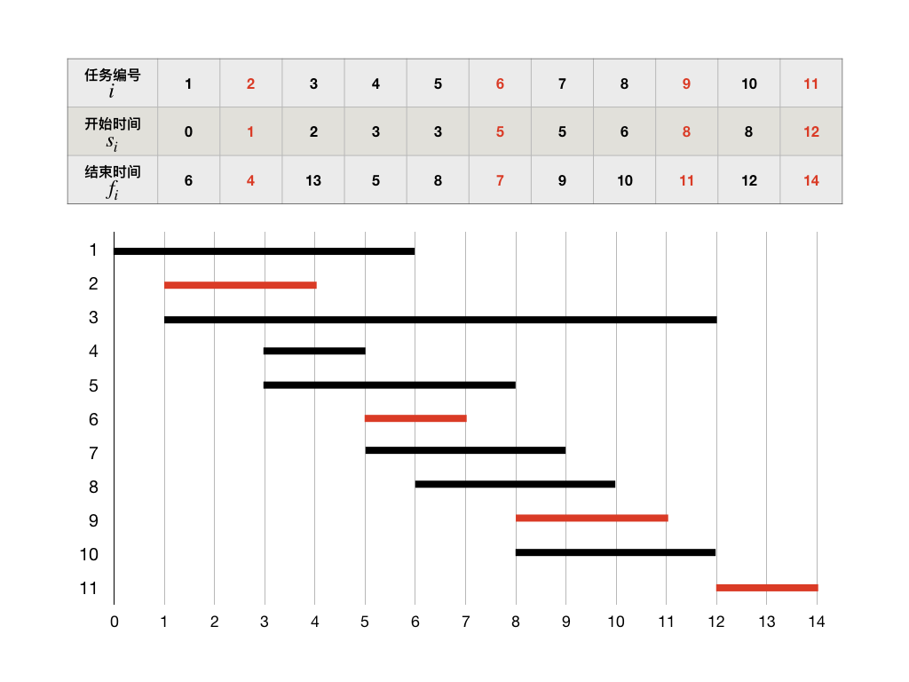

贪心法(II) 复杂任务调度
+++++++++++++++++++++++++++++++

作为介绍贪心法的第一个最简单的例子，我们讲过了单机任务调度问题。这里我们将进一步看两个更加复杂一点的任务调度问题，:strong:`区间调度问题`\ 和\ :strong:`双机调度问题`。我们可以看到，区间调度也适用贪心法求解，但是双机调度（乃至多机调度）则无法用贪心法求得最优解。

区间调度问题
^^^^^^^^^^^^

:strong:`区间调度问题`，有时候也会以\ :strong:`活动安排问题`、:strong:`教室安排问题`\ 等形式出现，其实它们都是同一个问题。

区间调度问题也是在一台机器上调度 :math:`n` 个任务，机器同样不能同时运行多个任务。和通常的单机调度不同，区间调度问题的输入数据是一系列的时间区间 :math:`[s_i,f_i),(i=1,2,\dots,n)`，:math:`s_i` 表示每个任务的开始时间，:math:`f_i` 表示结束时间，故而这个问题被称为区间调度问题。时间区间左闭右开意味着机器可以在运行完前一个任务之后立即启动下一个任务，中间无需停顿。这些区间相互之间是会有所重叠的。

显然，只要有两个任务的时间区间有重叠，这两个任务就只能选择调度其中一个，放弃另一个。所以区间调度的调度结果是选择出来的一部分任务，它们之间没有任何时间上的重叠。调度的目标是尽可能多的完成任务，最优解是一个包含任务数量最多的调度序列。

例如我们有11个任务以供调度，任务的开始时间、结束时间已知。为了能更直观地观察这些任务之间的关系，我们还可以画成甘特图，如下：

仔细想一想，如果我们想要让更多的任务得到运行，那么我们就必须要让每一个任务运行完成后剩余的时间足够多。这就意味着每次调度的时候，我们都需要尽量先调度那些结束时间早的任务。这就是区间调度问题的贪心策略，具体实现的过程只有两步：

1. 对所有待调度的任务按各自的结束时间进行排序。
2. 循环调度任务：第一个应该被调度的任务一定是排完序后的第一个任务，以后每一次调度，假设上一次被调度的任务序号为 :math:`i`，那么下一个就是它后面的第一个开始时间晚于或等于 :math:`f_i` 的任务，如此循环下去直到找不到下一个可调度任务为止，调度就完毕了。

按照这个策略，请手动排一排上面示例中的11项任务并完成调度，看看结果是不是图中标红的4项，也就是调度 :math:`\{2,6,9,11\}`，再尝试一下还能不能找出更完成更多任务数的调度来？

.. hint::

   如果结束时间可以用整数表示，如示例中那样，那么可以使用两个数组 ``s[n]`` 和 ``f[n]`` 分别存放开始时间和结束时间，然后对它们进行整体的外排序来完成这样的区间调度算法编程。但是这样做其实并不简单，也不见得很经济。如果结束时间的取值范围很大，那么外排序可能会消耗大量的空间，比如开计数桶数组。使用外排序还会导致程序中出现大量形如 ``f[ord[i]]`` 这样的数组下标套数组元素的表达式，很容易导致编程时的笔误和混乱。外排序没有库函数可以调用，需要自己编写排序函数，容易引入更多的错误点。更重要的是，万一结束时间不是用整数来表示的，外排序就很难实现。

   所以我们还是建议采用和上一节“部分背包问题”中所用的方法。把任务编号、开始时间、结束时间三项结合起来构造一个结构体，对这个结构体编写一个基于结束时间的比较大小函数，然后直接调用库函数 ``sort()`` 来完成内排序。

   要知道，algorithm库的 ``sort()`` 函数运行效率是极高的，高于标准快速排序。实际编程时强烈推荐调用它来完成排序，而不是自己手写。

双机调度问题
^^^^^^^^^^^^

我们前面已经讲过单机调度问题，知道了单机调度问题可以用贪心法求得最优解。但是如果有两台机器可以同时运行，或者一台机器可以同时运行两个任务，那么问题就变成了更为复杂的\ :strong:`双机调度问题`。如果机器数量更多，或者一台机器可同时运行任务的通道数更多，那么就进一步升级为\ :strong:`多机调度问题`。双机调度只是多机调度的一个特例，机器数量从2到更多的增加只是量变，但从单机到双机的变化却属于质的改变。我们很快就可以看到，一旦机器数量从一增加到二，问题就变得无法用贪心法求最优解了。

双机调度问题的一般性描述是：给出 :math:`n` 项任务 :math:`\{1,2,\dots,n\}`，其中任务 :math:`i` 的运行时长为整数 :math:`t_i,(i=1,2,\dots,n)`。将所有任务分成两部分 :math:`\{i_1,i_2,\dots,i_p\}` 和 :math:`\{j_1,j_2,\dots,j_q\}`，其中 :math:`p+q=n`，各自调度到两台相同的机器同时开始按调度的顺序运行。从0时刻开始计时，以较晚结束运行的机器的停机时间为最终的完成时间。求一个最优的调度，使得最终完成时间最短。

例如，任务数量为 :math:`n=6`，各自的运行时长为 :math:`t_1=3,t_2=10,t_3=6,t_4=2,t_5=1,t_6=7`。

对于这样一个比较简单的任务集，我们可以人为地进行调度尝试，并不太难就可以发现一个最优解：两台机器上调度的任务分别为 :math:`\{3,5,6\}` 和 :math:`\{1,2,4\}`。前一台机器的总运行时长为 :math:`T_1=6+1+7=14`，后一台为 :math:`T_2=3+10+2=15`，最终的完成时间为二者中较大的那个，即 :math:`15`。这个解已经是最优解了，因为所有任务的运行总时长可以算得，为 :math:`T=29`，对它进行最均匀的二分，就是 :math:`29=14+15`，其他任何分法都不会比它更好了。

另外，通过对这套示例数据进行观察，还可以发现另外一个最优解 :math:`\{1,2,5\}` 和 :math:`\{3,4,6\}`，它也能把总时间 :math:`T=29` 分割成最为均衡的 :math:`T_1=14` 和 :math:`T_2=15` 两个部分。可见双机调度问题的最优解并不是唯一确定的。

总结上面的过程，不难归纳出一个获取双机调度最优解的方法，一共分三步：

1. 计算出所有任务的总耗时 :math:`T = t_1+t_2+\cdots+t_n`，并计算出两台机器上的最佳运行时间分配，即均匀地二分总时间：:math:`T_1=\lfloor T \rfloor`，:math:`T_2=T-T_1`。这样，如果总时间 :math:`T` 是偶数，那么有 :math:`T_1=T_2=T/2`；如果是奇数，那么 :math:`T_2=T_1+1`。
2. 完成第一台机器上以 :math:`T_1` 为目标的任务调度。即挑选合适的一部分任务，使它们的运行时间之和最大限度地接近但不超过 :math:`T_1`，当然最好是恰好等于 :math:`T_1`。
3. 把剩余的任务调度给第二台机器。

按照上面的三步法，我们就可以确保获得一个双机调度问题的最优解了。

可是事情并没有想象的那样简单，问题出在第2步，怎样才能做到让调度给第一台机器的任务满足“运行时间之和最大限度地接近但不超过，最好是恰等于 :math:`T_1`”。这样一个目标任务可以通过贪心法获得吗？想想似乎找不出这样的贪心策略。事实上也确实没有，因为仔细看一看这个要求，其实它是要完成一个“0-1背包问题”！你看出来了吗？这里背包的最大承重量为 :math:`T_1`，所有任务就是要放入背包的物品，只不过每一项物品的重量和价值相等，都是 :math:`t_i`。

所以，双机调度问题是一个穿着任务调度马甲的0-1背包问题。我们已经知道，它是一个NP难题，它没有贪心解法。这个问题只能留待日后等我们学会了背包问题的动态规划解法之后才能解决了。

.. admonition:: 补充

   事实上，用贪心算法还是可以求出双机调度，乃至多机调度的近似解的。这个近似解的优秀程度和任务运行时长的分布均匀程度有关。如果所有任务的运行时长 :math:`t_i` 在一定的范围内均匀分布，而且任务数量很多的时候，那么这个近似解可能会相当接近甚至就是最优解。方法很简单，S形轮流分配任务，具体如下：

   1. 假设要在 :math:`m` 台机器上调度总共 :math:`n` 项任务，:math:`n\gt\gt m`。
   2. 首先将所有任务按运行时长由小到大排序。
   3. 按照短任务的优先的贪心策略，按机器号 :math:`1,2,\dots,m` 的顺序先调度完第 :math:`1` 轮 :math:`m` 项任务，每台机器一项。
   4. 然后把机器顺序颠倒过来，按 :math:`m,m-1,\dots,1` 的顺序调度第 :math:`2` 轮 :math:`m` 项任务，每台机器一项。
   5. 重复上述过程，每一轮任务调度完后颠倒调度时机器的顺序，直到所有任务分配完毕。

   例如我们的示例中，按此方法调度的结果为 :math:`\{5,3,6\}` 和 :math:`\{4,1,2\}`，恰好是一个最优解。

   实践证明，这种简单的近似算法往往非常有效。虽然它并不能保证获得最优解，但它给出的解经常很接近甚至就是最优解。算法编程虽然不能用这种方法，但这种考虑问题的思路值得学习掌握。

