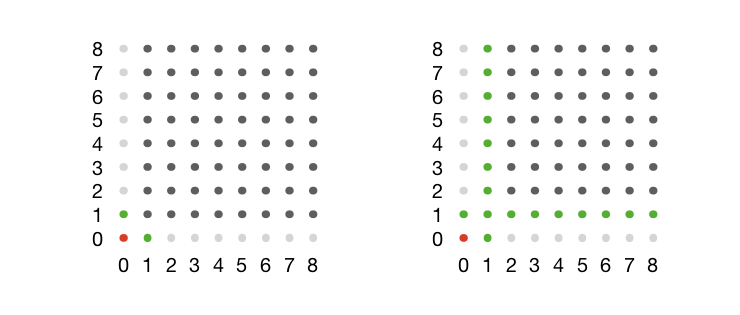
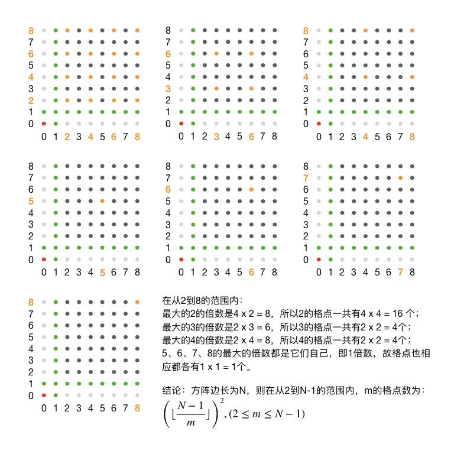

.. index:: 【仪仗队】, 〖洛谷P2158〗, 〖SDOI2008〗

互质对：仪仗队（洛谷P2158，SDOI2008）
=====================================

**题目描述**

作为体育委员，C君负责这次运动会仪仗队的训练。仪仗队是由学生组成的 :math:`N\times N` 的方阵，为了保证队伍在行进中整齐划一，C君会跟在仪仗队的左后方，根据其视线所及的学生人数来判断队伍是否整齐(如下图)。

.. image:: ../images/701_p2158_pro.png

现在，C君希望你告诉他队伍整齐时能看到的学生人数。

**输入格式**

共一个数 :math:`N`

**输出格式**

共一个数，即C君应看到的学生人数。

**输入输出样例**

输入：

.. code-block:: none

   4

输出：

.. code-block:: none

   9

**说明/提示**

【数据规模和约定】

对于 :math:`100%` 的数据，:math:`1 \le N \le 40000`

**题意分析**

对示例图中建立坐标系，以C君所在位置为坐标原点 :math:`(0,0)`，其余每位学生所在位置的横纵坐标值都用自然数 :math:`0,1,\dots,n-1` 依次表示，即所谓的格点位置。除C君以外，一共有 :math:`N^2-1` 位同学。

第一步一定要先分析有没有需要特判的数据。题目给出的数据范围说明 :math:`N` 有可能为1，这种情况下方阵只有C君一个人，所以可以特判掉，直接输出0，结束。

正常情况下，:math:`N\gt1`。先排除一些特殊的视线。从原点出发的水平线和垂直线是最特殊的，显然在这两条直线上，C君只能看到两位同学 :math:`(1,0)` 和 :math:`(0,1)`，其他的都可以排除掉。这样就知道了C君应看到的人数至少有2人。要考虑的方阵缩小为从 :math:`(1,1)` 到 :math:`(n-1,n-1)` 的范围。

然后是左起第二列和倒数第二行，不难发现，这两条直线上的所有学生，C君都是看得见的，他们不会被任何人遮挡。所以C君应看到的人数右增加了 :math:`2(n-1)-1=2n-3` 人，加上前面的2人就有了 :math:`2n-1` 个确定一定以及肯定可以看到的人了。要考虑的方阵进一步缩小为从 :math:`(2,2)` 到 :math:`(n-1,n-1)` 的范围，共有 :math:`(n-2)^2` 个人。

下面的示意图用一个 :math:`N=9` 的方阵展示了到目前为止的状态。红色的点为C君，绿色的点为已经确定可以看到的学生，浅灰色的点是已经确定不会被看到的学生，深灰色的点表示还需要进一步分析的部分。

下面我们来分析一下剩余的学生怎样判断其是否可被C君看见。

从C君所在位置看去，在同一条视线上的学生只能看到第一个。视线是一条直线，从原点出发的直线可以用方程 :math:`y=kx` 来表示，这里 :math:`x` 和 :math:`y` 都必须是整数。如果 :math:`x` 和 :math:`y` 有大于1的公因数 :math:`q`，即 :math:`x=qx^\prime,y=qy^\prime`，那么 :math:`y=kx\implies y^\prime=kx^\prime`，意味着位置 :math:`(x^\prime,y^\prime)` 上的学生一定和 :math:`(x,y)` 上的学生共线并且位置离C君更近，所以 :math:`(x,y)` 上的学生一定会被挡。

.. admonition:: 结论

   位置 :math:`(x,y)` 上的学生会被C君看到的条件是 :math:`x` 和 :math:`y` 互质。

事实上，左起第二列和倒数第二行上的所有学生之所以都不会被遮挡，都能被C君看到的原因也就是因为它们的位置坐标里至少有一个为1，而1和任何正整数互质。

现在问题变为求出 :math:`(2\le x \le N-1,2\le y \le N-1)` 范围内所有整数对 :math:`(x,y)` 中互质对的个数。如果你已经学过了欧拉 :math:`\varphi` 函数那么你肯定会想到用它来解决问题，但是直接用简单的欧拉函数求解速度会比较慢，估计会TLE（我没有试过），最好用欧拉线性筛或者埃筛来打欧拉函数表，时间复杂度可以达到接近 :math:`O(n)` （其实我也没有试过，这只是理论上的结论）。

不过可能许多人还不会欧拉函数，或许学过但是不熟练。而且如果是在考场上，要正确无误地编出欧拉函数题解还是有困难的。所以这里我们不打算介绍使用欧拉函数的方法（本质原因还是因为我并没有试过），而是用一种比较容易理解也比较容易编程的动态规划方法，这种方法同样能达到接近 :math:`O(n)` 的时间复杂度，效率非常之高。

既然决定不用欧拉函数，那么正面求解互质对数量就不太可能了，我们采用迂回策略。我们可以求出不互质的数对数量，然后从总量 :math:`(N-2)^2` 中减去它不就是互质对的数量了吗？这就很类似于数学里的反证法，有时候是一种非常行之有效的方法。

在整数区间 :math:`[2,N-1]` 中的所有整数，他们可能有的大于1的因数 :math:`m` 当然也只能是在这个范围里，:math:`m\in\{2,3,\dots,N-1\}`。所以我们可以枚举所有可能的因数 :math:`m`，计算含有公因数 :math:`m` 的不互质数对的数量（注意：可不是最大公因数哦，是指单纯的公因数）。比如具有公因数2的不互质数对就有 :math:`(2,2)`、:math:`(2,4)`、:math:`(4,2)`、:math:`(4,4)`、:math:`(2,6)`......它们的共同点就是两个坐标值都是2的倍数。因此我们可以用 :math:`(pm,qm)` 来表示具有公因数 :math:`m` 的不互质数对，其中 :math:`(p,q\in\Bbb{Z}^+,pm \lt N, qm \lt N)`。当这些数对用来表示格点坐标时，我们也称它们为 :math:`m` 的格点。

.. admonition:: 结论

   在整数区间 :math:`[2,N-1]` 范围内，对于任意整数 :math:`2\le m\le N-1`，它的格点数量为 :math:`\left(\lfloor\frac{N-1}{m}\rfloor\right)^2`。

这是因为我们要求格点的坐标值 :math:`m,2m,\dots,pm` 也都必须要在这个范围内，即要满足 :math:`pm\le N-1\implies p=\lfloor\frac{N-1}{m}\rfloor`。

下面继续用前面那个例子来看一看在 :math:`N=9` 时的格点分布情况，橙色的点表示从2到8的格点，一共7张图：

（待续）